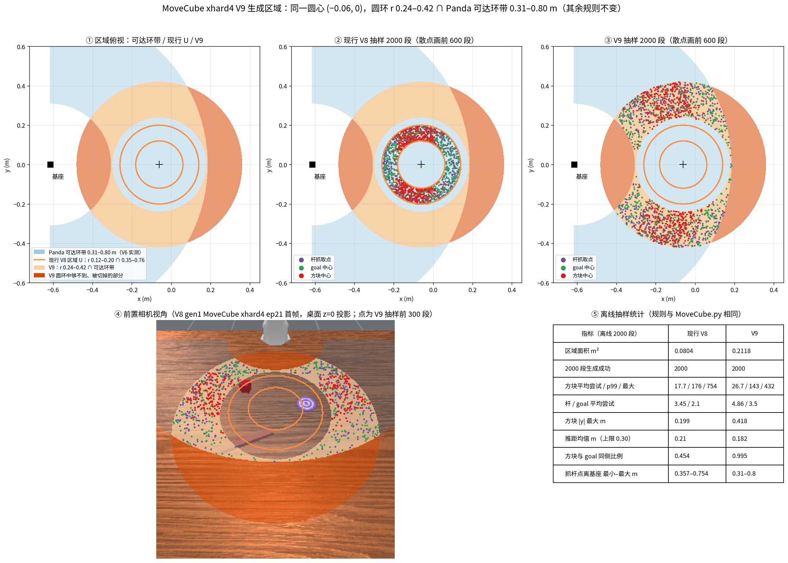

# 1002 newtask v9：MoveCube xhard4 生成区域扩大与 800 局交付方案

> **权威性**：本文件是 V9 的方案，只规划不实施。以下各项须单独获批后才执行：改 `MoveCube.py` 区域常量、改格表常量、子代理派发、抽签与生成、P3 预算（第二部分 §2.4.3）。获批后按依赖顺序连续执行，运行中按 §2.4.5 的预定动作处置；只有出现表外任务、超出预算或范围实质变化时，才停下来补充授权。
>
> **代码锚点**：V8 交付态 `34f30756`（12.317，分支 `newtaskRelease-taskV8`）。V8 交付规格 `src/robomme_hard/env_metadata/test-hard/xhard{1..5}/specs.jsonl`，与 `artifacts/newtask-v8/specs-root/` 逐字节相同。V8 产物在 `artifacts/newtask-v8/gen1/shard{1..4}/`：1070 局交付、44 局失败，h5 共 1114 个，均保留在磁盘上。官方环境源码 `1fadc0ec`（`src/robomme/`）不改。
>
> **分支**：V9 实施分支 `newtaskRelease-taskV9`，从 `newtaskRelease-taskV8` 的 HEAD（即本计划提交 12.318，其父为 V8 交付态 `34f30756`）新建，只做新增。`newtaskRelease-taskV8` 保留，名称与提交指针都不动。工作副本 `/data/hongzefu/robomme_benchmark_MotionJEPANewTask`。
>
> **commit 编号**：12.318 首版（本文件、区域图及其出图脚本）。实施从 12.319 接续。
>
> **已定**：用户原话逐字见第二部分 §2.8。
> 1. 只改 MoveCube xhard4 的生成区域，其余 15 个任务的环境与配置都不动，xhard0 不动。
> 2. 区域按 09-27 会话（Claude `b24d1d18…`）的最终版：同一圆心 (−0.06, 0)，圆环 r 0.24–0.42，与 Panda 可达环带 0.31–0.80 m 取交集。方块中心、goal 中心、杆抓取点三者共用这个区域。
> 3. 局数改为每任务 50 局，在该任务 V8 交付的 xhard1～5 档里平分，没有交付的档不要；16 任务共 800 局，不算 xhard0。
> 4. 区域图放进本计划（第一部分 §2）。
> 5. 子代理全部在本计划里定下来（第二部分 §2.12）。
>
> **待拍板**：无。本文件按「其他都不要动」推定了两项，见总览第 4、7 条。用户要改时只需改这两条，其余结构不变。

# 第一部分（给人看）

## 1. 总览

**一句话方案。** MoveCube xhard4 的区域从圆环 0.12–0.20 扩到 0.24–0.42，再与可达环带取交集。这个任务的 50 局全部按新区域重新抽签、生成。InsertPeg 在 V8 交付的 20 局之上补 30 局。其余 14 个任务不重新生成，直接从 V8 交付局里按候选号升序取前 N 局；这些局逐字节就是 V8 的局，所以环境、h5、视频都和 V8 一样。最后交付 43 格、800 局，xhard0 的 16 格 192 局沿用 V8。

**已定口径**（依据在括号里注明）：

1. **区域**：`config_xhard4["region"]` 的 `r_in` 0.12 → **0.24**，`r_out` 0.20 → **0.42**，`base_dist` [0.35, 0.76] → **[0.31, 0.80]**。圆心 (−0.06, 0)、`push_len_max` 0.30、`peg_gap` 0.04、`goal_peg_gap` 0.02、杆 yaw ±π、三个拒绝预算 128／256／4096 都不变。依据：§2，以及用户原话「你按照这个同一绘画的最终版来做」。
2. **局数**：每任务 50 局，在 V8 交付档里平分，见 §3 表 2。依据：用户原话「每一个task都是五十个然后根据XHard12345有的就评分没有的就不要」。
3. **档位与格**：档集合和 V8 一样，是 xhard1～5 的 43 格；不交付的档仍不抽签、不生成。步数上限 `TIER_MAX_STEPS` 仍定死 1600，抽样时过滤执行步超过 1600 的候选。
4. **局的来源（推定）**：按「其他都不要动」推定。
   - MoveCube：50 局全部重新抽签、生成。区域变了，V8 的 32 条规格行回放时会被 `_assert_peg_in_region` 拒（新 r_in 0.24 > 旧 r_out 0.20），所以不能沿用。
   - InsertPeg：V8 交付的 20 局保留，另补 30 局。先用 V8 已冻结但没有试过的 11 个候选，再用 `append_candidates.py` 追加候选。
   - 其余 14 任务：从 V8 交付行里按候选号升序取前 N 局，N 见表 2，不 reset、不 rollout。
5. **xhard0**：16 任务 × 1 档 × 12 局 = 192，环境与规格都不动。用 `XHARD0_RESET_PARITY` 证明改 `MoveCube.py` 没有碰到 xhard0 分支。
6. **seed**：沿用 V8 的按档偏移 `seed_rule_for(tier, "v8")`，xhard4 是 22e6。这样 MoveCube 的 V9 局会和 V8 的 MoveCube 局 seed 相同、布局不同。两者靠 header 的 `sampling_config_sha256` 和数据集版本区分，风险见 §2.5 R-3。
7. **评估与站点（推定）**：
   - V9 不做新的两策略评估。
   - V9 站点沿用 V8 站点的布局。和 V8 逐字节相同的 720 局（14 任务 × 各自 N，加 InsertPeg 20）复用 V8 已有的评估结果。新生成的 80 局（MoveCube 50 + InsertPeg 30）评估板块原位置空。

## 2. MoveCube 生成区域：现状、V9 与离线实测



图 `docs/validation/newtask-v9/figures/movecube_v9_region.png` 由 `scripts/injection-dev/v9_movecube_region_fig.py` 出图。脚本纯 numpy，不 reset 环境，不计入 P3。拒绝规则逐条照抄 `MoveCube.py::_load_scene_xhard4_region` 与 `utils/object_generation.py::_region_rules_violation`。

**定义。** 区域 U 是三个物体共用的落点：方块中心、goal 中心、杆抓取点（杆尾 = 杆根 − 0.10·u）。条件是同时满足下面两条：
- 圆环 `r_in ≤ |p − (−0.06, 0)| ≤ r_out`；
- 离基座 `base_dist[0] ≤ |p − (−0.615, 0)| ≤ base_dist[1]`。

另有几条成对约束：
- 杆身线段离圆心不小于 `r_in`；
- 方块离杆身不小于 0.04，goal 离杆身不小于 0.02；
- 方块到 goal 距离在 0.10～0.30 之间；
- 三个推起点（后退 0.10，侧移 0 或 ±0.10）离基座也落在 `base_dist` 内。

**锚点与配置键。** `src/robomme_hard/robomme_env/MoveCube.py::MoveCube.config_xhard4["region"]`。这个值经 `_native_decision` 进入 `demo_layout.xhard4.region`、`execution_layout.xhard4.region`，两段各自声明、各自消费。

**可达范围的来源（已实测，不重测）**：
- V6 探针 A：末端可达，57288 次规划。所有 yaw 下可达距离都是离基座 0.31～0.80 m。
- V6 探针 B：抓杆，12276 次。抓取点离基座 0.27～0.80 m 全部成功；0.80～0.85 m 只有 48% 成功。

两份报告在 `docs/validation/newtask-v6/records/legacy/plan-probes/reach/{A,B,U}/report.md`。

**离线抽样（每版 2000 段，规则与代码一致）：**

| 指标 | 现行 V8 | V9 |
|---|---|---|
| 区域面积 | 0.080 m² | 0.212 m²（2.6 倍） |
| 2000 段生成成功 | 2000 | 2000（杆／goal／方块 0 次耗尽预算） |
| 方块平均尝试 / p99 / 最大（预算 4096） | 17.7 / 176 / 754 | 26.7 / 143 / 432 |
| 杆 / goal 平均尝试（预算 128 / 256） | 3.45 / 2.1 | 4.86 / 3.5 |
| 方块 \|y\| 最大 | 0.199 m | 0.418 m |
| 推距均值（上限 0.30） | 0.210 m | 0.182 m |
| 方块与 goal 同侧比例 | 0.454 | 0.995 |
| 抓杆点离基座 最小–最大 | 0.357–0.754 m | 0.31–0.80 m |

**图里能看到的现象：**
- **三个物体只落在左右两块。** 圆环前后两段被可达环带切掉了，近基座一侧剩下的也很窄。
- **方块和 goal 几乎总在同一侧（99.5%）。** 推距上限 0.30 不变，跨侧的组合会被拒绝重抽，所以推的方向基本是沿 x 前后推。
- **新区域在相机画面里。** 从前置相机看（图 ④），左右两块都在画面内。

⚠ **陷阱与代价：**
1. **贴着硬边界、没有余量。** V8 用 0.35–0.76，两头各留 4 cm；V9 按用户定的最终版直接取 0.31–0.80。抓杆点贴近 0.80 时，探针 B 的成功率只有 48%，MoveCube 的生成失败率会比 V8 高。V8 实测是 gen1 23 局里失败 3 局，即 13%。所以候选数按失败率 35% 留量（§2.4.3），超出就按 §2.4.5 处置，不放宽区域。
2. **离线抽样只证明能生成规格。** 它不证明能抓到、能推到。真实成败要等抽签和生成后，由 `did not succeed after the complete task_list` 一类的失败计数给出。
3. **旧 MoveCube 规格行不能回放。** 所以 xhard4 规格文件里 MoveCube 的行必须整任务重抽，不能只换数值。

## 3. 局数（表 2）

每任务 50 局，在 V8 交付档里平分。分不均时前面的档多 1 局，与 V8 的 17／17／16、27／27／26 同法。xhard0 每任务 12 局，沿用 V8。「来源」一列：「子集」指从 V8 交付行取前 N 局，「新」指重新生成。

| 任务 | xhard0 | xhard1 | xhard2 | xhard3 | xhard4 | xhard5 | V9 合计（不含 xhard0） | V8 合计（不含 xhard0） | 来源 |
|---|---|---|---|---|---|---|---|---|---|
| PickXtimes | 12 | 17 | 17 | 16 | — | — | 50 | 50 | 子集（= V8 全部） |
| SwingXtimes | 12 | 10 | 10 | 10 | 10 | 10 | 50 | 50 | 子集（= V8 全部） |
| StopCube | 12 | 10 | 10 | 10 | 10 | 10 | 50 | 50 | 子集（= V8 全部） |
| VideoUnmask | 12 | 13 | 13 | 12 | 12 | — | 50 | 80 | 子集 |
| ButtonUnmask | 12 | 13 | 13 | 12 | 12 | — | 50 | 80 | 子集 |
| BinFill | 12 | 25 | 25 | — | — | — | 50 | 80 | 子集 |
| VideoUnmaskSwap | 12 | 25 | 25 | — | — | — | 50 | 80 | 子集 |
| ButtonUnmaskSwap | 12 | 25 | 25 | — | — | — | 50 | 80 | 子集 |
| VideoPlaceButton | 12 | 25 | 25 | — | — | — | 50 | 80 | 子集 |
| VideoPlaceOrder | 12 | 25 | 25 | — | — | — | 50 | 80 | 子集 |
| PickHighlight | 12 | 25 | 25 | — | — | — | 50 | 80 | 子集 |
| VideoRepick | 12 | 25 | 25 | — | — | — | 50 | 80 | 子集 |
| RouteStick | 12 | 17 | 17 | 16 | — | — | 50 | 80 | 子集 |
| PatternLock | 12 | 17 | 17 | 16 | — | — | 50 | 80 | 子集 |
| MoveCube | 12 | — | — | — | 50 | — | 50 | 20 | 新（全部重抽） |
| InsertPeg | 12 | — | — | — | 50 | — | 50 | 20 | V8 20 局 + 新 30 局 |
| **合计** | 192 | 272 | 272 | 92 | 144 | 20 | **800** | 1070 | |

**乘式（P5）**：
- 新值局：1 任务 × (17 + 17 + 16) + 2 任务 × 5 档 × 10 + 2 任务 × (13 + 13 + 12 + 12) + 7 任务 × 2 档 × 25 + 2 任务 × (17 + 17 + 16) + 2 任务 × 1 档 × 50 = 50 + 100 + 100 + 350 + 100 + 100 = **800**。
- xhard0：16 任务 × 1 档 × 12 局 = 192。
- 共 992 局：新值格 43，xhard0 格 16。
- 按来源拆分：子集 14 任务共 700 局，加 InsertPeg 沿用的 20 局；新生成 MoveCube 1 任务 × 1 档 × 50 + InsertPeg 1 任务 × 1 档 × 30 = 80 局。

**子集怎么取。** 不能取 header 里 `select_rule` 的前 N 个。`select_rule` 是抽签时的初选，里面包含生成失败、后来被递补掉的候选。正确取法是：在该格交付行（`selected=True` 且 gen1 `ok`）里按候选号升序取前 N 个。然后改写这几个字段：
- `delivery_per_cell[task] = N`；
- `select_rule[task]` 改成这 N 个候选号；
- 被丢弃行的 `selected` 置 False；
- 重签 `identity_sha256` 与 `delivery_sha256`。

`per_env` 和规格行本身逐字节不动。

## 4. 要改哪些文件

| 文件 | 改什么 | 子代理 |
|---|---|---|
| `src/robomme_hard/robomme_env/MoveCube.py` | `config_xhard4["region"]` 三个数（r_in 0.24、r_out 0.42、base_dist [0.31, 0.80]）及上方注释的 V9 口径；其余不动 | S1-A |
| `tests/lightweight/test_xhard_movecube_region.py`、`test_v4_xhard_movecube.py` | 钉数值的断言改 V9 值；用新值重选「坏值」与「违规样例」，保证仍是坏值 | S1-A |
| `src/robomme_hard/README.md` | 圆环 U 的说明补 V9 半径 | S1-A |
| `src/robomme_hard/env_record_wrapper/hard_specs.py` | 新增 `V9_CELLS`（43 格，合计 800），`EXPECTED_CELLS` 切到 `V9_CELLS`；`V8_CELLS` 冻结保留给 V8 夹具；`_validate_specs_v8`／`load_specs_v8` 的格表参数化，默认用 `EXPECTED_CELLS` | S1-B |
| `src/robomme_hard/.../hard_builder.py` | 按 `EXPECTED_CELLS` 断言，不再写死 1070；`_override_cells` 跟随 | S1-B |
| `scripts/injection-dev/_freeze.py`、`_rollout.py` | 新增 `V9_CANDIDATES`（只含 MoveCube 80、InsertPeg 追加量）；`check_cells` 用 `EXPECTED_CELLS`；V9 分片表 `V9_SHARD_TASKS`（2 片：MoveCube、InsertPeg） | S1-B |
| `scripts/parity/hard_regression.py`、`hard_parity.py`、`scripts/injection-dev/export_eval_identities.py` | 判定行名加 V9；`expected_episodes` 改由格表推出；`SHAPES["v9"]`；identities 992 | S1-C |
| `scripts/injection-dev/v9_subset_specs.py`（新） | 从 V8 specs-root 与 gen1 产物派生 V9 子集规格并重签；用 hardlink 建 V9 产物树（不复制 618G） | S1-D |
| `scripts/injection-dev/site/v8_site_catalog.py` 等 | 局数口径由格表推出（1262 → 992）；V9 站点目录与 V8 评估结果的按身份复用 | S1-E |
| 测试（逐文件见第二部分 §2.1） | 1070／43／62／92／32／1262 一类写死的数改成从格表推出，或换成 V9 值 | 各块各管自己的 |

## 5. 验收

| 查什么 | 怎么查 | 过了说明什么 | 判定行 |
|---|---|---|---|
| 区域常量与规则 | MoveCube 定向测试 + 离线脚本复跑 | 三个数改对；违规样例仍被拒；2000 段 0 耗尽 | `V9_MOVECUBE_REGION=PASS r_in=0.24 r_out=0.42 base=0.31-0.80 offline_ok=2000/2000` |
| 官方源码与录像器没动 | `upstream_guard.py check --require-upstream`；`git diff --quiet HEAD -- src/robomme/env_record_wrapper/RecordWrapper.py` | `src/robomme` 与官方 `1fadc0ec` 逐字节相同 | `UPSTREAM_GUARD=PASS` |
| xhard0 没被改坏 | `hard_regression.py xhard0-reset-parity` | 新区域只走 xhard4 分支，xhard0 布局逐位同 | `XHARD0_RESET_PARITY=PASS shape=16x1x12 compared=192 det_diff=0` |
| 格表 | 定向测试 | 43 格合计 800、每任务 50 | `V9_CELLS=PASS cells=43 total=800 per_task=50` |
| 子集逐字节同 V8 | `v9_subset_specs.py verify` | 700 + 20 局的规格行 `spec_sha256`、h5 与 mp4 的 sha256 都与 V8 相同；每格取的都是交付行里候选号最小的 N 个 | `V9_SUBSET=PASS reused=720 spec_equal=720 h5_equal=720 video_equal=720` |
| 新局生成 | 生成后聚合 | MoveCube 1 任务 × 1 档 × 50 + InsertPeg 1 任务 × 1 档 × 30 = 80 局，执行步全部 ≤ 1600 | `V9_DELIVERY_SET=PASS tasks=16 cells=43 total=800 new=80 reused=720` 与 `V9_STEP_CAP=PASS cap=1600 over=0` |
| 新区域确实生效 | 从 80 局新规格读 `layout.<seg>.region` 与实际落点 | MoveCube 50 局两段的方块、goal、抓杆点都在新 U 内，至少一处落在旧 U 之外 | `V9_MOVECUBE_LAYOUT=PASS episodes=50 in_region=300 outside_old=<n>` |
| 规格可回放 | `hard_regression.py reset-replay` | 800 局每格抽 1 局回注，复现布局 | `V9_RESET_REPLAY=PASS shape=cells43 resets=43 replay=43 injected_mismatch=0 layout_drift=0` |
| 新局可复现 | 80 局二次生成，与 gen1 对拍 | 同规格、同代码两次生成一致 | `PARITY_H_H2=PASS tier=v9 compared=80 missing=0 identity_equal=80` |
| 站点 | 浏览器检查 | 59 格（43 + 16）都在；新 80 局评估板块置空、复用的 720 局评估与 V8 同 | `V9_SITE=PASS cells=59 missing=0 eval_reused=720 eval_empty=80` |
| 核心短测 | `timeout 280s uv run --no-sync python -m pytest tests/lightweight/ -m 'not gpu and not slow' -q` | 无 failed | 末行 `passed` |

**为什么子集能逐字节等于 V8**：子集局不 reset、不 rollout。规格行只改 header 和 `selected` 标记，h5 与 mp4 用 hardlink 指向 V8 的同一份 inode，sha256 自然相等。如果哪一局不等，就说明取错了行，或者 V8 产物被动过；这两种都不是数值误差。

## 6. 子代理分工与合并（简述）

改代码切成 5 块，全部是 worktree 隔离的写入型子代理，各管一组互不重叠的文件：

- **第一批（两块并行）**：S1-A 只管 MoveCube 区域的三个数及其测试；S1-B 管格表常量（`hard_specs.py`、`hard_builder.py`、`_freeze.py`、`_rollout.py`）及其测试。
- **第二批（三块并行）**：S1-B 合入后派出，因为都要 import `V9_CELLS`。S1-C 改对拍与回归脚本的局数口径；S1-D 写子集派生与产物树工具；S1-E 改站点目录的局数口径与评估复用。
- **主会话自做**：跑冒烟、抽签、生成、对拍、建站，以及出图、计划、留档。这些是跑任务不是改代码，主会话自己用 tmux + Monitor 串行跑。

**合并顺序**：A → B → C → D → E，合一个、审一个、push 一个。

**每次合并前**：
1. 核对改动文件没出可写集合；
2. 在该 worktree 里复跑定向测试；
3. 派一个只读审查子代理，对着钉死的两个 sha 审 diff，输出 `PRE_MERGE_REVIEW=PASS|FAIL`。

**每次合并后**：跑核心短测和 `UPSTREAM_GUARD`，输出 `POST_MERGE_REVIEW=PASS|FAIL`，PASS 才 push。

## 7. 实施步骤表

| 阶段 | 内容 | 判据 |
|---|---|---|
| 0 | 建分支 `newtaskRelease-taskV9`；派发前核对（主检出 clean、`worktree.baseRef=head`、`.claude/worktrees` 被忽略、`git worktree list` 存档） | 四项全过 |
| 1 | 派 S1-A、S1-B，审查后按 A → B 合并 | 两次 `POST_MERGE_REVIEW=PASS`；`V9_MOVECUBE_REGION=PASS`；`V9_CELLS=PASS` |
| 1b | 主会话跑 xhard0 环境层对拍 | `XHARD0_RESET_PARITY=PASS … compared=192 det_diff=0` |
| 2 | 派 S1-C、S1-D、S1-E，审查后按 C → D → E 合并 | 三次 `POST_MERGE_REVIEW=PASS` |
| 2b | 最小冒烟：MoveCube xhard4 1 任务 × 1 档 × 1 局；InsertPeg xhard4 1 任务 × 1 档 × 1 局 | 两局生成完成、执行步 ≤ 1600 |
| 3 | 抽签：MoveCube 整任务重抽 80 候选；InsertPeg 追加候选；生成 80 局新局（有失败就递补） | `V9_DELIVERY_SET`、`V9_STEP_CAP`、`V9_MOVECUBE_LAYOUT` |
| 3b | 子集派生 + 产物树 + 合并 xhard4 规格文件 + 换包（`env_metadata/test-hard/` 换为 V9 规格），一个提交完成 | `V9_SUBSET`、`V9_RESET_REPLAY`、`UPSTREAM_GUARD`、核心短测 |
| 4 | 80 局二次生成对拍；建 V9 站点并做浏览器检查；推送通知 | `PARITY_H_H2`、`V9_SITE` |
| 5 | 留档 `docs/validation/newtask-v9/`；释放本轮占位 job | `launch.md`、`result.md` 写完；按清单 `scancel` |

# 第二部分（技术细节，供 agent 追踪）

## 〇 前置声明与红线

- **R1**：`src/robomme/**` 任何改动、覆盖都不做（P2）。录像器 `RecordWrapper.py` 零 diff。
- **R2**：除 MoveCube xhard4 的 `region` 三个数之外，16 个环境的 `configs`、`native_blocks()`、采样代码一律不动。有回归测试 `test_v8_native_blocks_unchanged` 一类守着：MoveCube 只许 `xhard4.region` 子树变化。
- **R3**：V8 产物（`artifacts/newtask-v8/**`）只读。V9 产物树用 hardlink 引用 V8 文件，不复制、不改写，也不在 V8 目录下新建文件。删除 V9 产物时只删 V9 目录树里的链接，不跨运行 glob（正本第 14 条）。
- **R4**：`scripts/*.py` 顶层仍恰好四个入口（P1）。新脚本放 `scripts/injection-dev/`。
- **R5**：子集局不 reset、不 rollout。新局只限 MoveCube 50 与 InsertPeg 30，加上它们的递补；不扩大到其他任务。
- **R6**：判据 FAIL 时只记证据链与候选修法，不放宽区域、不改判定行，交用户裁决（正本第 22 条）。
- **R7**：阶段 3b「换包」在一个提交里完成：xhard4 规格文件、子集重签的 xhard1/2/3/5 规格文件、`EXPECTED_CELLS` 一致性。换包之前，包内规格一律是 V8。
- **R8**：打包期间（阶段 3 起跑到 3b 提交）冻结 HEAD，不 commit（正本第 12 条 (1)）。

## 2.1 逐文件改动清单

| 文件 | 锚点 | 现值 | V9 值 | 子代理 |
|---|---|---|---|---|
| `src/robomme_hard/robomme_env/MoveCube.py` | `MoveCube.config_xhard4["region"]` 的 `r_in`、`r_out`、`base_dist` | 0.12、0.20、[0.35, 0.76] | 0.24、0.42、[0.31, 0.80] | S1-A |
| 同上 | 该常量上方注释 | V6 圆环版说明 | 补 V9 口径与依据（本计划 §2、`reach/A,B` 实测） | S1-A |
| `tests/lightweight/test_xhard_movecube_region.py` | 模块常量 `R_IN, R_OUT, B_LO, B_HI`；`test_region_decision_and_validation`（坏值 `("r_in", 0.25)` 在新值下合法，改成 `("r_in", 0.50)` 一类真坏值）；`test_peg_budget_exhaustion_raises_real_scene_generation_error`（`r_in` 0.199 改成贴近新 `r_out` 的值，如 0.419）；`test_replay_rejects_peg_violation`（`goal_xy [0.20, 0]` 落在新圆环内，改成内孔点如 `[-0.06, 0.10]`）；`test_region_rules_numeric`、`test_spawn_region_params_default_none_and_reject` | V6 值 | V9 值；每个违规样例都要先用离线规则确认确实违规 | S1-A |
| `tests/lightweight/test_v4_xhard_movecube.py` | `test_configs_three_tiers_identical_and_xhard4_values` 整字典；`test_decision_visible_part_unchanged_and_guard`（把 r_in 调成 0.10／0.14 的那段，改成相对 V9 值的偏离） | V6 值 | V9 值 | S1-A |
| `src/robomme_hard/README.md` | 「圆环 U」一段 | 无数值 | 补 V9：r 0.24–0.42 ∩ 离基座 0.31–0.80 | S1-A |
| `src/robomme_hard/env_record_wrapper/hard_specs.py` | `_v8_cells`/`V8_CELLS`（冻结不动）；新增 `_v9_cells`/`V9_CELLS`（表 2，断言 43 格、800、每任务 50）；`EXPECTED_CELLS = V9_CELLS`；`XHARD4_ONLY` 断言改为对 `EXPECTED_CELLS`；`_validate_specs_v8` 对 `delivery_per_cell ≤ cells[(task, tier)]` 的格表改为参数（默认 `EXPECTED_CELLS`）；`load_specs_v8(root, expected_cells)` 契约沿用 | 43 格、1070 | 43 格、800 | S1-B |
| `src/robomme_hard/env_record_wrapper/hard_builder.py` | `_test_hard_entries`、`_override_cells` | 按 `EXPECTED_CELLS`（值为 V8） | 跟随，不写死 | S1-B |
| `scripts/injection-dev/_freeze.py` | `V8_DEFAULT_CANDIDATES`（冻结不动）；新增 `V9_CANDIDATES = {("MoveCube","xhard4"): 80}`；`v8_default_candidates` 在格局数 ≠ 格表时候选数 = 局数，V9 必须显式给 `--candidates-per-env`，在 `--dry-run` 输出里打印出来 | — | 新增 | S1-B |
| `scripts/injection-dev/_rollout.py` | `check_cells` 用 `EXPECTED_CELLS`；新增 `V9_SHARD_TASKS = {"shard1": ["MoveCube"], "shard2": ["InsertPeg"]}`，`--cells` 接受 `v9shard1`／`v9shard2`；V8 分片表保留 | 4 片 | 加 2 片 | S1-B |
| `tests/lightweight/test_v8_specs_schema.py` | `test_v8常量与表2一致`（保留，测 `V8_CELLS`）；新增 `test_v9常量与表2一致`；`test_档位常量已切到v8且v7冻结常量不动_R10` 改为「`EXPECTED_CELLS == V9_CELLS`、V8／V7 冻结常量不动」；`test_完整43格根往返` 用 V9 格表 | — | — | S1-B |
| `tests/lightweight/test_hard_builder_xhard0.py` | `V8_EPISODES` → 由格表推出（每任务 62 → 62／62／…，即 50 + 12）；`test_逐任务局数常量合计1262` → 992 | 1262 | 992 | S1-B |
| `tests/lightweight/test_xhard0_native.py` | `test_xhard0常量与档序` | 不变（核对即可） | — | S1-B |
| `tests/lightweight/test_v8_delivery_flow.py` | `test_候选表与四片与冒烟格表`（加 V9 两片）；`test_plan_v8逐任务CLI与dry_run`（加 V9 候选）；`test_四片生成合并聚合43格`（合计改由格表推出）；`test_export_eval_identities的1262口径` | 1070／1262 | 800／992 | S1-B（前三个）、S1-C（最后一个） |
| `scripts/parity/hard_regression.py` | `expected_episodes`、`cmd_reset_replay` 的格表判定、`cmd_delivery_set` 判定行名 `V8_*` → 按格表版本输出 `V9_*`，`_CELLS_HELP` | 1070 | 格表推出 | S1-C |
| `scripts/parity/hard_parity.py` | `SHAPES` 加 `"v9": "cells43:272+272+92+144+20"`；`cmd_compare` 支持 `--tier v9` 与只比新 80 局的身份清单 `--identities` | — | 新增 | S1-C |
| `scripts/injection-dev/export_eval_identities.py` | `EXPECTED_TOTAL` 由格表推出（992），文件名 `eval-identities-992.jsonl` | 1262 | 992 | S1-C |
| `tests/lightweight/test_v8_regression_cmds.py` | `test_格表解析与形状`、`test_eval_smoke每任务局数按格表推出`、`test_表1与测试侧取值表一致` | — | 加 V9 形状 | S1-C |
| `scripts/injection-dev/v9_subset_specs.py`（新） | 子命令 `derive`：读 V8 specs-root 与 `gen1/delivery.local.json`，按表 2 对 14 个子集任务（加 InsertPeg 的 20 局）取交付行中候选号最小的 N 个，改写 `delivery_per_cell`／`select_rule`／`selected`，重签 `identity_sha256`、`delivery_sha256`（照 `_rollout` 分片 split 的重签写法），写 V9 specs-root。子命令 `link`：按身份建 `artifacts/newtask-v9/delivery/episodes/<tier>/<Task>_episode_<c>/` 的 hardlink 树。子命令 `verify`：输出 `V9_SUBSET=…`。不 import 任何 `tests/` | — | 新增 | S1-D |
| `tests/lightweight/test_v9_subset_specs.py`（新） | 合成夹具：V8 风格 2 档 3 任务，含递补（初选失败、递补候选交付），断言取的是交付行最小 N 个而不是 `select_rule[:N]`、重签后 `load_specs_v8(root, cells)` 能过、改任一行即 FAIL | — | 新增 | S1-D |
| `scripts/README.md` | 列入 `v9_subset_specs.py`、`v9_movecube_region_fig.py` | — | 补一行 | S1-D |
| `scripts/injection-dev/site/v8_site_catalog.py` | 核 1262 → 由格表推出（992）；新增 `--eval-reuse <V8 site-eval 目录>`：按身份（task, tier, seed, 规格 `spec_sha256`）复用评估结果，身份或 `spec_sha256` 不同即置空 | 1262 | 992 | S1-E |
| `scripts/injection-dev/site/v8_oracle_browser_check.py` | 期望 59 格不变；新增对「复用 720／置空 80」的计数输出 `V9_SITE=…` | — | — | S1-E |
| `scripts/injection-dev/v8_continue_after_gen.py` | 帮助文字与默认局数改由格表推出；建站目标目录参数化 | — | — | S1-E |
| `tests/lightweight/test_v8_site_catalog.py` | `test_完整合成目录_1262*`、`test_main_写出目录_且1262校验` 改为由格表推出；新增 `test_v9评估复用按身份与spec_sha` | 1262 | 992 | S1-E |
| `docs/validation/newtask-v9/figures/movecube_v9_region.png`、`scripts/injection-dev/v9_movecube_region_fig.py` | 本计划配图与出图脚本 | — | 已在 12.318 提交 | 主会话 |

不改：其余 15 个环境、`difficulty.py`、`sampling_config.py`、`TIER_MAX_STEPS`、`V8_SEED_OFFSETS`、`scripts/parity/official/`、eval-official 的 `v8_manifest.py`／`v8_report.py`（V9 不做评估）。

## 2.2 交付形态

1. **规格文件**：`hard-specs/4` 不变，五个档文件都要重写。
   - xhard1／2／3／5 只做子集重签，规格行逐字节不动。
   - xhard4 里：MoveCube 整任务换成新抽的 80 候选行；InsertPeg 是 V8 的 40 行加上追加的候选行；SwingXtimes、StopCube、VideoUnmask、ButtonUnmask 做子集重签。
   - header 的 `sampling_config` 取当前源码重建的值，MoveCube 一项随之变化，`sampling_config_sha256` 重算。合并步逐任务比对分片与冻结根的 `sampling_config` 必须相同。
2. **seed**：沿用 `seed_rule_for(tier, "v8")`，`_validate_specs_v8` 不改。
   - MoveCube 候选号从 0 起，seed 与 V8 的 MoveCube 同号不同布局（R-3）。
   - InsertPeg 追加候选接在 V8 的 40 之后（候选号 40 起），seed 不与 V8 重叠。
3. **候选表**：

   | 格 | 交付 | 候选 | 依据 |
   |---|---|---|---|
   | MoveCube xhard4 | 50 | 80 | 按失败率 35% 留量：V8 实测 13%，新区域贴边，留到 V8 的约 2.7 倍；80 × 0.65 = 52 ≥ 50 |
   | InsertPeg xhard4 | 50（新 30） | V8 未试的 11 个（候选号 29～39）+ 追加 35 = 46 | V8 实测失败 9／29 = 31%；46 × 0.69 ≈ 32 ≥ 30 |

4. **选取次序**：
   - MoveCube 用 `stratified_select` 保留三种运动方式的分层，按 17／17／16 分。
   - InsertPeg 新局按候选号升序递补。
   - 子集任务按交付行候选号升序。
5. **产物树**：`artifacts/newtask-v9/`。
   - `delivery/` 是 800 局的统一视图：hardlink 指向 V8 `gen1/shard*` 的 720 局，以及 V9 `gen/` 下新生成的 80 局。
   - `specs-root/` 是 V9 五档规格。
   - `site/` 是站点。
   - 新生成产物按 `gl-run-products-back-to-data` 口径落 `/data`，NFS 不留大文件。
6. **xhard0**：规格、视频、评估结果都沿用 V8。站点里的 xhard0 视频沿用 `artifacts/newtask-v7/site-media/xhard0-gen`。

## 2.3 闸门总表

| 判定行 | 产出者（文件::函数） | 阶段 |
|---|---|---|
| `UPSTREAM_GUARD=PASS` | `scripts/parity/upstream_guard.py check --require-upstream` | 1、2、3b |
| 录像器零 diff（退出码 0） | `git diff --quiet HEAD -- src/robomme/env_record_wrapper/RecordWrapper.py` | 每阶段 |
| 四入口 | `ls -1 scripts/*.py` 恰好四个 | 每阶段 |
| 核心短测末行 `passed`、无 failed | `timeout 280s uv run --no-sync python -m pytest tests/lightweight/ -m 'not gpu and not slow' -q` | 每次合并后 |
| `V9_MOVECUBE_REGION=PASS r_in=0.24 r_out=0.42 base=0.31-0.80 offline_ok=2000/2000` | S1-A 定向测试 + `v9_movecube_region_fig.py` 的统计（主会话据输出写判定行） | 1 |
| `V9_CELLS=PASS cells=43 total=800 per_task=50` | `test_v9常量与表2一致` | 1 |
| `XHARD0_RESET_PARITY=PASS shape=16x1x12 compared=192 det_diff=0` | `hard_regression.py::cmd_xhard0_reset_parity`（不改） | 1b、3b |
| `V9_DELIVERY_SET=PASS tasks=16 cells=43 total=800 new=80 reused=720` | `hard_regression.py::cmd_delivery_set` | 3 |
| `V9_STEP_CAP=PASS max=<实测> cap=1600 over=0 filtered=<n>` | `hard_regression.py::cmd_step_headroom` | 3 |
| `V9_MOVECUBE_LAYOUT=PASS episodes=50 in_region=300 outside_old=<n>` | `hard_regression.py` 新子命令 `movecube-layout`（S1-C）：读 50 局两段方块、goal、抓杆点，共 50 × 2 段 × 3 物体 = 300 点 | 3 |
| `V9_SUBSET=PASS reused=720 spec_equal=720 h5_equal=720 video_equal=720` | `v9_subset_specs.py verify` | 3b |
| `V9_RESET_REPLAY=PASS shape=cells43 resets=43 replay=43 injected_mismatch=0 layout_drift=0` | `hard_regression.py::cmd_reset_replay` | 3b |
| `PARITY_H_H2=PASS tier=v9 compared=80 missing=0 extra=0 identity_equal=80` | `hard_parity.py::cmd_compare --identities <新 80>` | 4 |
| `V9_SITE=PASS cells=59 missing=0 eval_reused=720 eval_empty=80` | `site/v8_oracle_browser_check.py` | 4 |
| `PRE_MERGE_REVIEW=PASS …`／`POST_MERGE_REVIEW=PASS …` | 计划执行模式，每次合并 | 1、2 |

## 2.4 runbook

### 2.4.1 复现本计划配图（只读，不 reset）

```bash
uv run --no-sync python scripts/injection-dev/v9_movecube_region_fig.py docs/validation/newtask-v9/figures/movecube_v9_region.png
```

stdout 打印两版的 JSON 统计。底图读 `artifacts/newtask-v8/gen1/shard1/episodes/xhard4/MoveCube_episode_21/hdf5_files/MoveCube_ep21_seed23402100.h5` 首帧与前置相机内外参。

### 2.4.2 正式运行手册（获批后）

1. **算力**：aspen 优先（`ssh sled-aspen`，2 × A6000，GPU 空闲时）。aspen 不可用时，GL 提交 2 个 48 h 占位 job（`--account=chaijy2 --partition=spgpu --gres=gpu:1 --cpus-per-task=4 --mem=48G --time=48:00:00 --wrap='sleep infinity'`，作业名 `v9gen-hold-1／2`），JobID 记入清单 `/nfs/turbo/coe-chaijy-unreplicated/hongzefu/gl-hold-logs/hold-jobs-v9gen-<日期>.txt`。工作负载一律 `srun --jobid=<hold> --overlap --exact --ntasks=1 --gpu_cmode=shared`。登录前先 `ssh -O check greatlakes`；master 不存活时，先问用户用哪种 Okta 验证方式。
2. **冒烟（2b）**：`generate_h5.py` 用冒烟格表，1 任务 × 1 档 × 1 局 × 2 任务，单 worker。
3. **抽签（3）**：

   ```bash
   uv run --no-sync python scripts/injection-dev/freeze_specs.py --tier xhard4 --seed-profile v8 --cells v9shard1 \
     --candidates-per-env MoveCube=80 --task-max-reset-attempts MoveCube@xhard4=<⌈80 ÷ 实测接受率 × 1.5⌉> --dry-run
   ```

   去掉 `--dry-run` 正式跑。InsertPeg 用 `append_candidates.py --task InsertPeg --tier xhard4 --count 35`，它会核对源码重建的 sampling 与冻结值相等。
4. **生成（3）**：每个分片先 `generate_h5.py --mode split --cells v9shard1|v9shard2`，再 `--mode continue --workers 4 --gpu 0`。tmux 会话 `v9-gen-1`、`v9-gen-2`，会话名记入 `launch.md`。每片日志挂一个 Monitor，过滤 `全部完成|EXIT_CODE=|Traceback|NO RECORD|reset 拒绝|svulkan2|EXCLUSIVE|RRT|SceneGenerationError`。之后 `--mode merge`，再 `sync` 回本机。
5. **子集与换包（3b）**：

   ```bash
   uv run --no-sync python scripts/injection-dev/v9_subset_specs.py derive --v8-root artifacts/newtask-v8/specs-root --v8-gen artifacts/newtask-v8/gen1 --out artifacts/newtask-v9/specs-root
   uv run --no-sync python scripts/injection-dev/v9_subset_specs.py link --out artifacts/newtask-v9/delivery
   uv run --no-sync python scripts/injection-dev/v9_subset_specs.py verify
   ```

   把 `specs-root` 拷入 `src/robomme_hard/env_metadata/test-hard/`，与 `EXPECTED_CELLS` 在同一提交（R7）。
6. **对拍与建站（4）**：先跑 `hard_parity.py` 二次生成 80 局，再跑 `v8_continue_after_gen.py --site-dir artifacts/newtask-v9/site --eval-reuse artifacts/newtask-v8/site-eval`，最后做浏览器检查。站点链接给完整域名，如 `http://sled-vail.eecs.umich.edu:<端口>/`，端口起跑前先探。

### 2.4.3 P3 一次性预算表（阶段 1 开跑前一次批完）

reset 与 rollout 分列，各自与 P3 阈值比较。成功、失败、递补、冒烟、重跑都计入。子集 720 局 0 reset、0 rollout。

| 项目 | 阶段 | reset | rollout | worker | 上限与停止条件 | 预计耗时 |
|---|---|---|---|---|---|---|
| xhard0 环境层对拍 | 1b | 16 任务 × 1 档 × 12 局 × 2 侧 × 2 次 = 768 | 0 | 2 进程 | 任一 `det_diff` > 0 即停，阻断阶段 2 | 约 30 分钟 |
| 同上（换包后重跑） | 3b | 768 | 0 | 2 进程 | 同上 | 约 30 分钟 |
| 最小冒烟 | 2b | ≤ 2 任务 × 1 档 × 1 局 × 3 = 6 | 2 任务 × 1 档 × 1 局 = 2 | 1 | 任一失败即停，不进阶段 3 | 约 15 分钟 |
| 抽签 MoveCube | 3 | ≤ ⌈80 ÷ 0.97 × 1.5⌉ = 124（V8 抽签接受率 32／32，按 0.97 保守算） | 0 | 1 席 × 4 | 到上限仍凑不够 80 即停该格并报告 | 约 20 分钟 |
| 抽签 InsertPeg 追加 | 3 | ≤ ⌈35 ÷ 0.97 × 1.5⌉ = 55 | 0 | 1 席 × 4 | 同上 | 约 15 分钟 |
| 生成新局 | 3 | ≤ 80 + 46 = 126（每次 rollout 含 1 次 reset） | 首轮 MoveCube 1 任务 × 1 档 × 50 + InsertPeg 1 任务 × 1 档 × 30 = 80；递补后合计 ≤ 80 + 46 = 126（每个候选至多试一次） | 2 席 × 4 | 某格候选耗尽即该格 FAIL，按 §2.4.5 处置 | 约 1.5～2 小时 |
| 回注回放 | 3b | 43 格 × 1 = 43 | 0 | 1 | 任一不符即停 | 约 15 分钟 |
| 二次生成 | 4 | 80 | 新局 80，只回放、不递补 | 2 席 × 4 | 失败如实记录；基础设施重试每身份 ≤ 1 次 | 约 1 小时 |
| **合计** | | 上限 768 × 2 + 6 + 124 + 55 + 126 + 43 + 80 = **1,970** | 上限 2 + 126 + 80 = **208** | | 基础设施重试另列 ≤ 206（每身份 ≤ 1 次，账本跨重启保留） | 约 5～6 小时 |

已有产物复用：子集 720 局的规格、h5、视频、评估结果，以及 xhard0 的全部产物，0 次 reset、0 次渲染。超出本表任一行的上限时，暂停受影响部分，合并为一次补充授权。

### 2.4.4 自动建站与通知链（P4）

沿用 V8 的 `v8_continue_after_gen.py` + 独立 `v8_watchdog.py`。启动前用「完成」「守卫失败」「报告缺字段」三种合成夹具走通。只有当前会话存活时才保证能自动接续；会话结束后只承诺后台进程独立存活，不承诺自动唤醒。

### 2.4.5 运行中预定动作

| 情形 | 预定动作 |
|---|---|
| MoveCube 候选耗尽、交付不足 50 | 该格 FAIL。不放宽区域，不自行追加候选。报告失败局的抓杆点离基座距离、推距、失败原因分布，交用户裁决（是否把 `base_dist` 收回 0.35–0.76，或补抽） |
| InsertPeg 候选耗尽 | 同上，不放宽 |
| 新局执行步 > 1600 | 按构造过滤并递补，计入递补预算 |
| H2 新局正常失败 | 如实记录，不重试，不影响 gen1 交付（沿用 V8 预定 (a)） |
| 基础设施故障 | 每身份重试 ≤ 1 次，记原因与次数 |
| `V9_SUBSET` 不等 | 停止 3b，不提交。核对取行规则与 V8 产物是否被改动 |

## 2.5 风险登记

- **R-1 贴边失败率**：抓杆点会落到离基座 0.80 m。探针 B 显示 0.80～0.85 m 只有 48% 成功，所以 MoveCube 生成失败率预计高于 V8 的 13%。候选已按 35% 留量，仍不够就按 §2.4.5 交用户。
- **R-2 推方向单一**：方块和 goal 有 99.5% 在同一侧，推的方向基本沿 x。V8 圆环里同侧比例是 45%，两侧推都有。这改变了 MoveCube xhard4 的行为分布，是区域选择的直接结果，不在本方案里修。
- **R-3 seed 同号不同布局**：V9 MoveCube 的 `MoveCube_ep<k>_seed<s>` 与 V8 同名。所以站点、评估复用必须按 `spec_sha256` 区分，不能只看 (task, tier, seed)。S1-E 的复用键已含 `spec_sha256`。
- **R-4 hardlink 依赖 V8 产物在同一文件系统**：`artifacts/` 在 `/data` 本机盘，同盘可以建 hardlink。V8 产物以后若被清理，hardlink 仍保住数据，但两边的 inode 删除责任要写进 `result.md`。
- **R-5 xhard4 规格文件混合**：同一文件里有子集行、V8 InsertPeg 行、新 MoveCube／InsertPeg 行。合并步逐任务核对 `sampling_config`，`V9_RESET_REPLAY` 每格各抽 1 局回放。

## 2.6 盲区诚实清单

1. 离线 2000 段只证明「能生成规格」，不证明「能抓到、能推到」。新区域下真实演示的成功率在阶段 3 之前未知。
2. `V9_RESET_REPLAY` 每格只抽 1 局回放，不是全量回放。
3. 子集取前 N 局：V8 交付行里候选号的分布与难度无关，但没做过「前 N 局与全体」的统计对比。
4. 相机投影按桌面 z = 0，没算物体高度。
5. 评估复用只覆盖与 V8 逐字节相同的 720 局。新 80 局没有策略评估，V9 整体的策略成功率无法与 V8 直接比较。

## 2.7 留档与 commit 纪律

- 12.318 提交本计划、配图与出图脚本。
- 实施期间的提交：
  - 子代理提交按 `sub/<编号>: ` 前缀；
  - 合并提交 subject 用 `12.3xx <中文描述>`，body 按正本第 11 条六项详写；
  - 每次合并后立即 push。
- 正式生成按正本第 13 条在 `docs/validation/newtask-v9/` 写 `launch.md`（起跑时）和 `result.md`（验收后），附本轮 tmux 会话清单与占位 JobID 清单。
- 生成结束、commit 完成后，按清单逐个 `scancel` 自己的 JobID。

## 2.8 口径来源：用户原话（逐字，按时间，2026-10-02）

1. 「给出生成V9的方案其他都不要动但是movecube需要你先画出现在生成的范围和Gripper能够到的范围Gripper能够到的范围已经检查过了。然后我要调整它生成的范围三个物体的范围都要调整」
2. 「你能找到这张图的对话吗?我要按照这张图的对话的这个生成Codex和Claude的对话都找一下」（图：09-27 Claude 会话 `b24d1d18-5952-45fa-ad91-234d7a3e8b1e` 的 `movecube_reach_camera.png`）
3. 「你按照这个同一绘画的最终版来做」（最终版：同一圆心 (−0.06, 0)，圆环 r 0.24–0.42，与可达环带取交集）
4. 「还是一样给我生成图片然后让我确定了之后再写入方案。」
5. 「把这个图片放在这个计划中然后其他的task都不变但是现在的episode不对现在的epsode应该是800个epsode就是每一个task十六个task各五十个总共800个不算Xhard0」
6. 「这一点在V9也要改。」
7. 「意思就是说每一个task都是五十个然后根据XHard12345有的就评分没有的就不要」
8. 「参考之前的做法你要把所有的的subagent都要定下来。」

09-27 会话里的原话（区域最终版的来源）：「还是画圆环 橙色圆环 但是扩大半径！」「扩达圆环和现在的圆环 用同一个圆心 只要扩大两个的半径！」「原来的圆环不画了 交集画出更牵的颜色 再继续扩大一些 往两边撑」。

## 2.12 子代理分配表（正本 `AGENTS.md` 第 2 条；执行机制按 `CLAUDE.md`「计划执行模式」）

**通用口径**：
- 每个写入型子代理 `isolation: "worktree"` + `model: "opus"`。`BASE` 在每块派发时取当时 `newtaskRelease-taskV9` 的 HEAD。commit 前缀 `sub/<编号>: `，每条 git 命令单独一次 Bash，不得再派子代理，不得起超过 5 分钟的任务。
- worktree 内验收的环境取法：先跑 `UV_PROJECT_ENVIRONMENT=/data/hongzefu/robomme_benchmark_MotionJEPANewTask/.venv PYTHONPATH=<worktree>/src uv run --no-sync python -c "import robomme_hard; print(robomme_hard.__file__)"`，确认打印的路径以 `<worktree>/src/` 开头，再跑 CPU 定向测试。
- 禁止写主检出的任何路径。
- `uv.lock`、`pyproject.toml`、子模块 gitlink、`src/robomme/**`、`artifacts/**`、`src/robomme_hard/env_metadata/test-hard/**`（换包归主会话）任何块都不得碰。
- 审查子代理：每块一个，只读，`model: "opus"`，不加 `isolation`。钉死 `REVIEW_BASE`／`REVIEW_TIP`，输出 `PRE_MERGE_REVIEW=PASS|FAIL base=<sha> tip=<sha> files=<n> commits=<n> findings=<n>`。FAIL 时用 `SendMessage` 交回原子代理续改；两轮仍 FAIL 交用户。

| 编号 | 阶段 | 目标 | 可写文件集合 | 禁触 | 接口契约 / 依赖 | 合并顺序 | worktree 内验收 | 资源 | 判定行 |
|---|---|---|---|---|---|---|---|---|---|
| S1-A | 1 | MoveCube xhard4 区域改 V9 | `src/robomme_hard/robomme_env/MoveCube.py`（只许 `config_xhard4["region"]` 三个数与其注释）；`tests/lightweight/test_xhard_movecube_region.py`；`tests/lightweight/test_v4_xhard_movecube.py`；`src/robomme_hard/README.md` | 其余 15 个环境、`utils/object_generation.py`、`hard_specs.py`、`scripts/**` | 区域键名与结构不变（`center/r_in/r_out/base_dist/push_len_max/peg_gap/goal_peg_gap/*_max_trials`）；`_xhard4_region` 校验不改；与 S1-B 并行 | 1 | `pytest tests/lightweight/test_xhard_movecube_region.py tests/lightweight/test_v4_xhard_movecube.py tests/lightweight/test_v5_xhard_movecube.py -q` 无 failed；`git diff BASE -- src/robomme_hard/robomme_env/MoveCube.py` 只含 region 三值与注释 | CPU | `S1A_TESTS=PASS failed=0`、`S1A_SCOPE=PASS hunks_outside_region=0` |
| S1-B | 1 | 格表切 V9（800） | `src/robomme_hard/env_record_wrapper/hard_specs.py`；`src/robomme_hard/env_record_wrapper/hard_builder.py`；`scripts/injection-dev/_freeze.py`；`scripts/injection-dev/_rollout.py`；`tests/lightweight/test_v8_specs_schema.py`；`tests/lightweight/test_hard_builder_xhard0.py`；`tests/lightweight/test_xhard0_native.py`；`tests/lightweight/test_v8_delivery_flow.py`（除 `test_export_eval_identities的1262口径`） | `robomme_env/**`、`hard_regression.py`、`hard_parity.py`、`export_eval_identities.py`、`site/**` | 导出 `V9_CELLS`、`EXPECTED_CELLS = V9_CELLS`、`V9_CANDIDATES`、`V9_SHARD_TASKS`；`load_specs_v8(root, expected_cells)` 签名不变；`V8_CELLS`、`V8_DEFAULT_CANDIDATES`、`V8_SHARD_TASKS` 冻结不动；与 S1-A 并行 | 2 | 上列测试 + `test_v7_*` 冻结测试定向 pytest 无 failed | CPU | `S1B_TESTS=PASS failed=0`、`V9_CELLS=PASS cells=43 total=800 per_task=50` |
| S1-C | 2 | 对拍与回归口径切 V9 | `scripts/parity/hard_regression.py`（含新子命令 `movecube-layout`）；`scripts/parity/hard_parity.py`；`scripts/injection-dev/export_eval_identities.py`；`tests/lightweight/test_v8_regression_cmds.py`；`tests/lightweight/test_v8_delivery_flow.py` 中仅 `test_export_eval_identities的1262口径`；`tests/lightweight/test_v9_movecube_layout.py`（新） | `src/**`、`_freeze.py`、`_rollout.py`、`site/**`、`v9_subset_specs.py` | 只 import S1-B 的 `EXPECTED_CELLS`／`V9_CELLS`；判定行格式按 §2.3；`movecube-layout` 读规格 `layout.<seg>.region` 与落点，规则复用 `MoveCube._in_region_u`，不重写；派发于 S1-B 合入之后 | 3 | 上列测试定向 pytest；合成规格夹具上 `movecube-layout` 输出 PASS、篡改一点输出 FAIL | CPU | `S1C_TESTS=PASS failed=0` |
| S1-D | 2 | 子集派生与产物树工具 | `scripts/injection-dev/v9_subset_specs.py`（新）；`tests/lightweight/test_v9_subset_specs.py`（新）；`scripts/README.md` | `src/**`、`hard_specs.py`、`_rollout.py`（只 import 其重签函数，不改）、`artifacts/**`（worktree 内只用合成夹具） | 输入 V8 specs-root + `delivery.local.json`；输出 V9 specs-root，能被 `load_specs_v8(root, V9_CELLS)` 加载；取行规则「交付行候选号升序前 N」；`link` 只建 hardlink、目标存在且内容不同即响亮失败、不覆盖；派发于 S1-B 合入之后 | 4 | `test_v9_subset_specs.py` 无 failed；`v9_subset_specs.py --help` 正常 | CPU | `S1D_TESTS=PASS failed=0` |
| S1-E | 2 | 站点局数口径与评估复用 | `scripts/injection-dev/site/v8_site_catalog.py`；`scripts/injection-dev/site/v8_oracle_browser_check.py`；`scripts/injection-dev/v8_continue_after_gen.py`；`tests/lightweight/test_v8_site_catalog.py` | `src/**`、`scripts/parity/**`、`site_server.py`、`v8_site.py` 的页面布局 | 局数由 `EXPECTED_CELLS` 推出；`--eval-reuse` 的复用键为 (task, tier, seed, `spec_sha256`)；站点布局与 V8 完全一致；派发于 S1-B 合入之后 | 5 | `test_v8_site_catalog.py` 无 failed | CPU | `S1E_TESTS=PASS failed=0` |
| 主会话自做 | 0、1b、2b、3、3b、4、5 | 建分支、出图与计划、冒烟、抽签、生成、子集派生实跑、换包提交、对拍、建站、留档、释放占位 job | 本计划、`docs/validation/newtask-v9/**`、`src/robomme_hard/env_metadata/test-hard/**`（换包，R7）、`v9_movecube_region_fig.py` | — | 换包必须在 S1-A～E 全部合入之后；GPU 任务串行由主会话 tmux 起 | — | — | GL／aspen 2 席 | §2.3 的 V9 全部闸门 |

**共享文件归属裁决**：
- `tests/lightweight/test_v8_delivery_flow.py`：`test_export_eval_identities的1262口径` 归 S1-C，其余测试归 S1-B。两块串行（S1-C 在 S1-B 之后派发），同一时间只有一个写者。
- `hard_specs.py` 只归 S1-B。
- `scripts/README.md` 只归 S1-D。
- `src/robomme_hard/README.md` 只归 S1-A。
- 换包目录 `env_metadata/test-hard/` 只归主会话。
