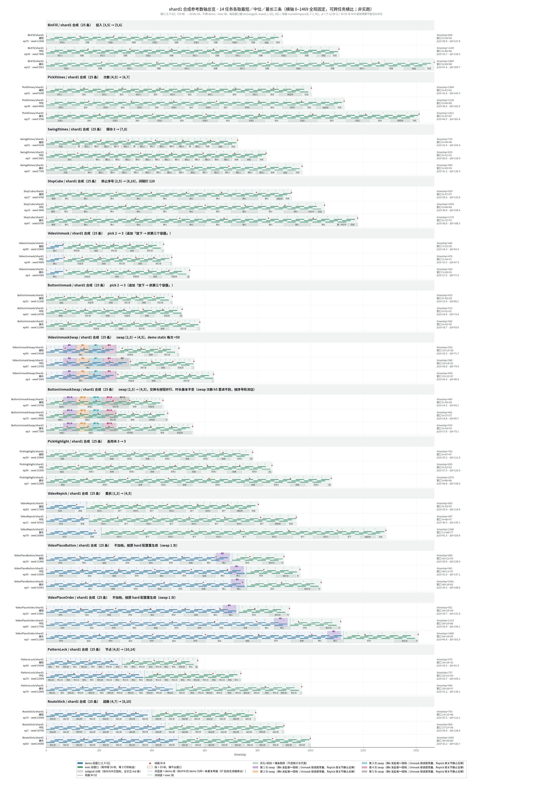
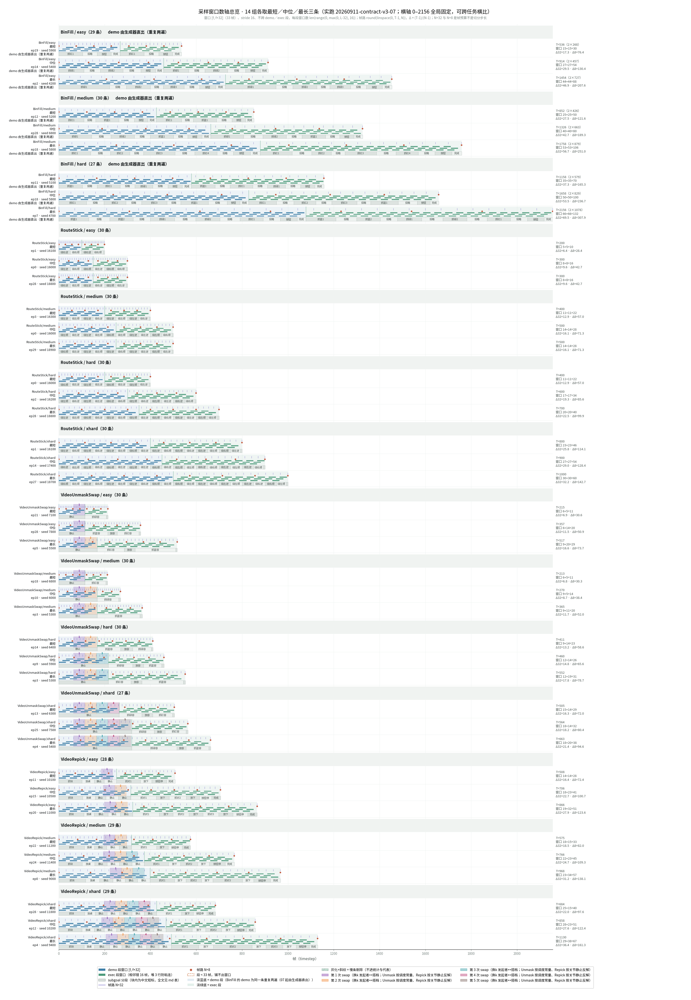

# 1006-xhard12-env-plan.md — 在原 16 任务 hard 母样本上派生 xhard 档：子类继承 + 独立包 + 生成器一个开关

> **权威与授权**：只规划不实施。开工须用户明确、无歧义地说「开工」（`AGENTS.md` 第 2 条）；计划获批、取值获批都不是开工令。本版 2026-10-06（2.32，2.34 按用户决定纳入 Unmask 两任务 pick 3 与 Place 两任务「2 块 + 回原位 + swap 3」）把前两版「接口方案」（2.30.x）与「上次训练参照与逐任务高层方案」（2.31）合成一份完整计划；上次训练怎么做的、官方 hard 档统计、16 任务源码核查全部移到留档 [`1006-xhard12-prev-training-and-task-plan.md`](1006-xhard12-prev-training-and-task-plan.md)，本文只引用、不复述。2.32.1 按用户要求（2026-10-06「第一部分现在简略了……这两块都要展开来讲讲清楚了……列一个完整的16task的表」）把第一部分二、三节恢复为分步讲解、四节扩成 16 任务全表，第一部分篇幅因此超出正本第 2 条的 90～130 行参考值，属用户明示。2.35（2026-10-07）按用户「v2有一个swap的标注 也作为subgoal 你也要考虑这个问题 swap采不到也不行」「然后恢复v2的图片数轴」把每次 swap 计入 8 帧漏段判据，并把 `vis/` 改为 V2 数轴画法、在四节嵌图。2.36（2026-10-07）按用户「VideoPlaceButton、VideoPlaceOrder 是否不用改」「改计划 两个任务用 --xhard 按原 hard 配置重新生成」撤回口径 ⑩ 的 Place 两任务重型重写：官方 hard 档两任务 timestep 数中位 961 / 1115、窗中位 57 / 67、8 帧合计漏最少 1 / 2（留档 4.2 节、`vis/output/reference_summary.md` hard 列），已满足长度目标与 8 帧必漏，改为子类不改任何键和方法、只挂 `XHardMixin`，经 `--xhard` 用原 seed 重新生成；S5 子代理、`home_site.py`、`XHARD_PLACE` 一并取消。
> **代码锚点**：`deb938e0`（2.31）。工作副本 `/data/hongzefu/robomme_benchmark_newtask-v3-MotionJepa1006`，分支 `newtask-v3-MotionJepa1006`，提交编号 `2.<小版本>`。生成代码起点 `3a5951a8`（2.24），源码核查锚点 `13905997`（2.25）。
> **外部锚点**：ManiSkill `07be6fbc66350ddca200abfb0a11b692f078f7fd`（`pyproject.toml` git rev，不改）；`.venv` gymnasium 0.29.1、torch 2.9.1；上次训练 run `wan-full1600-filter2-b176x4-72ep-a`（留档一节）。
> **事实核查**：2026-10-06 三个只读子代理逐文件核实了 ManiSkill `spec` 挂载与 reset 生命周期、生成器锚点与导入路径、11 个任务的覆写锚点（留档 5.0–5.2 节）；本文第二部分的代码锚点以此为准。所有 timestep 数、窗口数仍是线性外推 [估算]，实跑后要重算。

# 第一部分（给人看）

## 一、要做什么与全部运行一览

**一句话**：不改原 16 个任务文件，在新包 `src/robomme_xhard/` 里给 14 个任务各写一个子类：10 个只换 `configs["hard"]` 里的一两个数或重写一个方法，另有 VideoUnmask / ButtonUnmask 追加第三次抓（用户 2026-10-06 追加）；VideoPlaceButton / VideoPlaceOrder 的官方 hard 已经够长、8 帧已必漏，子类**不改任何配置和方法**，只是让它们走同一个开关按原 hard 配置重新生成一遍（用户 2026-10-07 改定）；生成器加一个 `--xhard` 开关，用 train metadata 里 hard 记录的**原 seed** 把这些子类跑一遍，录像器照原任务名录制。目标是每条 episode 更长（timestep 数约 900、stride-16 窗口约 50–60），且 8 帧等距采样必然漏掉至少一类 subgoal。

```
 开工 ─┬─ 步骤 1  前置验证（6 项，全部只读或 ≤5 分钟 smoke）
       ├─ 步骤 2  主会话写新包骨架 S0：base.py（XHardMixin）、jobs.py、envs/__init__.py
       ├─ 步骤 3  4 个写入型子代理并行：S1 换字典组 6 任务 + Place 两任务原样子类 ｜ S2 重写方法组 6 任务 ｜ S3 生成器开关 ｜ S4 轻量测试
       ├─ 步骤 4  逐个合并 S1 → S2 → S3 → S4，每个两次审查、push 一次；task_goal.py 的一处 3 抓文本由主会话在用户逐个批准后改
       ├─ 步骤 5  每任务 3 个 hard seed smoke（单 worker、单卡），出 XHARD_LENGTH 对账表
       ├─ 步骤 6  用户审阅取值与对账表 → 再说一次「开工」→ 全量 650 条（tmux xh-full，单卡 32 worker）
       └─ 步骤 7  数轴图 + docs/xhard-doc 留档 + commit + push
 数据链路：--xhard xhard1 → worker 内 import robomme_xhard（子类注册）→ jobs_from_metadata 读 train json 的 hard 记录
           → gym.make("BinFillXHard1", seed=4301, difficulty="hard") → 子类只换 configs["hard"] 的一两个数
           → XHardMixin 把 unwrapped.spec.id 改回 "BinFill" → RobommeRecordWrapper(env_id="BinFill") 照常录制
```

| 编号 | 类别 | 任务 | 条数（hard 母样本） | 改法 |
|---|---|---|---:|---|
| 1.1 | 计数 | BinFill | 25 | 换字典（`put_in_numbers`）+ `_load_scene` 后置校验 |
| 1.2 | 计数 | PickXtimes | 25 | 换字典（`number_min/max`） |
| 1.3 | 计数 | SwingXtimes | 25 | 换字典（`number_min/max`） |
| 1.4 | 计数 | StopCube | 25 | 重写 `_initialize_episode` + `step()` |
| 2.1 | 永久性 | VideoUnmask | 100 | `_load_scene` 调 super 后追加第三次抓（用户 2026-10-06 追加） |
| 2.2 | 永久性 | ButtonUnmask | 100 | 同 2.1（用户 2026-10-06 追加） |
| 2.3 | 永久性 | VideoUnmaskSwap | 100 | 换字典（`swap_min/max`）+ 重写 `_refresh_swap_schedule` |
| 2.4 | 永久性 | ButtonUnmaskSwap | 100 | 同 2.3 |
| 3.1 | 参考 | PickHighlight | 25 | 换字典（`pickup`） |
| 3.2 | 参考 | VideoRepick | 25 | `__init__` 后改写 `num_repeats` |
| 3.3 | 参考 | VideoPlaceButton | 25 | 原 hard 配置重生成：子类只挂 `XHardMixin`，不改任何键和方法（用户 2026-10-07 改定） |
| 3.4 | 参考 | VideoPlaceOrder | 25 | 同 3.3 |
| 4.1 | 模仿 | MoveCube | — | 不纳入：源码不读 difficulty，没有次数型的量 |
| 4.2 | 模仿 | InsertPeg | — | 不纳入：同 4.1 |
| 4.3 | 模仿 | PatternLock | 25 | 换字典（`length`） |
| 4.4 | 模仿 | RouteStick | 25 | 换字典（`length`） |
| **合计** | | **14 个任务** | **650** | |

**已定口径（用户原话，2026-10-06）**：①「沿用 Hard 的所有配置，只在一两个参数上改动，比如 pick 5 次变成 pick 7 次」；②「seed 先用现有的，直接拿 `src/robomme/env_metadata/train` 里已经生成过原版 hard 的那组 seed」「新 seed 的事以后再说」；③「新增部分用独立的 ENV 文件表示」「所有改动只限于生成器 `generate_dataset_newseed.py` 这一个文件和新增的那些文件」「把所有改的部分全部归档在一起，放在 `src` 里面」；④「不再把 BinFill 做成带 video 的任务」；⑤ 长度对齐 newtask-v2 xhard（timestep 数 ≈900、50–60 窗），token 落实为 stride-16 窗口数；⑥ 只硬性要求 8 帧有 subgoal 级遗漏，32 帧「尽量」；⑦ 只用现有 hard seed、本轮接受总量缺口（约为上次 stride-1 chunk 的四成）；⑧ 纳入「换字典 + 重写方法」共 11 个任务；⑨「积极调用一些子代理可以搞清楚一些事实」；⑩（2026-10-06 追加）「两个unmask任务都改为pick三次」「[VideoPlaceButton、VideoPlaceOrder] 改为swap3次 然后参考现在的V9的版本 都是改成放两个颜色的cube做完一整套动作然后回到原始放置位置 其他不动」。2026-10-06 子代理核实后的两处修正：`pyproject.toml` **不改**（editable `.pth` 已把整个 `src/` 加进 `sys.path`，见二节）；两个 Swap 任务 swap≥4 必须重写 `_refresh_swap_schedule`，已不是纯改参数，列入「重写一个方法」组。口径 ⑩ 的 V9 核查结论（2026-10-06 只读子代理）：V9 里四个任务的 swap 都是布尔、整局只在 demo 末尾互换一次，**没有 swap 3 次的现成实现**，要自己改 `step()` 的 swap 状态机；「两块 + 回原位」V9 有现成做法（`utils/xhard_home_site.py` 在初始位姿建隐藏落点，demo 末尾每块 `put the cube back to its original position`）；Unmask 的 3 抓在 V9 是整文件加分支，本仓库可用子类 `_load_scene` 追加两项复现，但语言目标文本在受保护的 `task_goal.py` 里只有 1 抓、2 抓两句，**必须在该文件加一句**，属 P1 逐个批准项。⑪（2026-10-07，撤回 ⑩ 的后半句）用户问「VideoPlaceButton、VideoPlaceOrder 是否不用改」，看过官方 hard 长度（两任务 timestep 数中位 961 / 1115 均已超过 V2 VideoRepick xhard 的 863，最短 900 / 921）后定「改计划 两个任务用 --xhard 按原 hard 配置重新生成」。⑩ 前半句（两个 Unmask pick 3）不变。

## 二、现在的脚本是怎么传参的，新参数接在哪里

### 先看现在的脚本是怎么跑的，用 BinFill 举例分五步走

下面从敲命令那一刻到硬盘上出现 HDF5 文件，顺着 `scripts/data-generation-newSeed/generate_dataset_newseed.py` 的代码走一遍。例子用 BinFill，因为 train 目录里 BinFill 的 metadata 能和 seed 公式对上号。每一步的函数名、字段名都已对照源码核实（2026-10-06）。

**第零步：你敲的命令**

```bash
uv run --no-sync python scripts/data-generation-newSeed/generate_dataset_newseed.py --output-dir artifacts/generated/demo --env BinFill --episodes 4 --difficulty 211 --workers 2 --gpus 0
```

意思是：BinFill 这个任务生成 4 条，难度按 2:1:1 的比例轮，开 2 个工人，用 0 号卡。脚本现有的全部参数与默认值：`--output-dir`（必填）、`--env`（all）、`--episodes`（100）、`--episode-start`（0）、`--workers`（20）、`--gpus`（"0"）、`--difficulty`（"211"）、`--layout`（train）、`--max-attempts`（100）、`--max-tasks-per-child`（8）、`--affinity`（none）、`--no-limit-threads`。

**第一步：`main` 读参数，交给 `generate_dataset_newseed`**

文件最底下的 `main` 调 `_args` 把命令行解析成一个对象，然后原样转给 `generate_dataset_newseed` 这个函数。`main` 自己什么都不干，就是个入口。文件顶部只 import 了 h5py、numpy 和同目录的 `seed_layout`、契约校验，**没有 import torch 或 mani_skill**——这一点后面接新参数时很关键。

**第二步：`generate_dataset_newseed` 做准备，造出 4 张卡片**

这个函数先做几件杂事：检查参数合法、建输出目录、把 `--env BinFill` 解析成任务列表 `["BinFill"]`、把 `--gpus 0` 解析成 `["0"]`、按 `--layout train` 拿到 seed 公式、把 `"211"` 展开成难度循环 `("easy", "easy", "medium", "hard")`，再做一道护栏：算出本次最大可能 seed，不能越过下一代布局（test）的 offset 500000。

然后是最重要的一段，造卡片。代码就是一个列表推导：

```python
jobs = [
    EpisodeJob(
        task=task,
        episode=episode,
        attempt=0,
        seed=layout.seed(task, episode, 0),
        difficulty=difficulty_for(episode, cycle),
        output_root=str(output),
        repo_root=str(REPO_ROOT),
    )
    for task in tasks
    for episode in range(episode_start, episode_start + episodes)
]
```

`EpisodeJob` 就是一张卡片，是 `@dataclass(frozen=True)`，七个字段。seed 怎么来的：train 布局的公式是 `env_code * 1000 + episode * 100 + attempt`，BinFill 的 env_code 是 4，所以 episode 0 的 seed 是 4000，episode 1 是 4100，episode 2 是 4200，episode 3 是 4300。difficulty 怎么来的：`episode % 4` 去难度循环里取，所以 episode 0、1 是 easy，2 是 medium，3 是 hard。**这就是为什么 train metadata 里 hard 记录全是 ep ≡ 3 (mod 4)。**

现在手里有 4 张卡片：

```text
BinFill ep0 seed4000 easy   attempt0
BinFill ep1 seed4100 easy   attempt0
BinFill ep2 seed4200 medium attempt0
BinFill ep3 seed4300 hard   attempt0
```

造完卡片，它把这次运行的所有参数写进输出目录的 `run_parameters.json`，然后把卡片交给 `_run_jobs`。

**第三步：`_run_jobs` 是调度员，开进程池、发卡片、处理失败**

`_run_jobs` 给每张 GPU 卡开一个进程池，池里有「workers 除以卡数」个工人进程。每个工人进程启动时跑一次 `_pool_init`，作用是先设 `CUDA_VISIBLE_DEVICES` 把自己绑死在那张卡上、把 CPU 线程压到 1，**然后才** `import torch`、`import robomme.robomme_env` 预热——绑卡必须在 import torch 之前，否则 CUDA 一初始化就认死了卡。

然后进入一个 while 循环：只要还有卡片没发或者有工人在干活，就一直转。循环里做两件事。一是只要有空闲工人，就从队列头取一张卡片，`pools[gpu].submit(_worker, job)` 扔给工人。二是等任何一个工人干完，拿回结果，写一行到 `episode_results.jsonl`，然后判断：

- 结果 `ok` 为真：记到成功列表，打印一行 `succeeded with seed 4000`。
- 结果失败且 `failure_class` 是 `task`（场景生成失败、planner 耗尽这类「这个 seed 不通」）：`job.bump(新seed)` 造一张新卡片塞回队列，新 seed 是 `layout.seed(task, episode, attempt + 1)`，也就是原 seed 加 1。所以 train metadata 里 BinFill episode 3 的 seed 是 4301 而不是 4300，就是因为 4300 失败过一次，4301 才成功。
- 结果失败且 `failure_class` 是 `code`（真 bug）：连续三次（`strikes ≥ 3`）就放弃，记进 exhausted。
- 整个进程池崩了（工人段错误，`BrokenProcessPool`）：重建池，把这个池名下正在跑的卡片**也 `bump` 一次**后 `appendleft` 退回队列头。

**第四步：`_worker` 是工人，一张卡片对应一次真实的仿真录制**

这是和环境打交道的地方，每个工人进程里跑。按顺序做八件事。

一，import。把 `repo_root/src` 加进 `sys.path`（不在才加），import gymnasium、torch、`robomme.robomme_env`（这一句让 16 个任务的 `@register_env` 执行，名字进注册表）、`RobommeRecordWrapper`、planner 类与几个异常类。

二，拼 kwargs 并造环境：

```python
kwargs = {
    "obs_mode": "rgb+depth+segmentation",
    "control_mode": "pd_joint_pos",
    "render_mode": "rgb_array",
    "reward_mode": "dense",
    "seed": job.seed,             # 4300
    "difficulty": job.difficulty, # "hard"
}
# episode 0–2 另加 robomme_failure_recovery=True / mode="z"，3–5 为 "xy"，≥6 不加
base_env = gym.make(job.task, **kwargs)   # 即 gym.make("BinFill", seed=4300, difficulty="hard")
```

`gym.make("BinFill")` 去注册表里找名字叫 BinFill 的 class，实例化成一个环境对象。环境自己的 `__init__` 里会根据 `difficulty="hard"` 去 `configs["hard"]` 读参数，根据 seed 摆场景（ManiSkill 的 `BaseEnv.__init__` 末尾会自己 reset 一次，把 `_load_scene` 和 `_initialize_episode` 都跑一遍）。实例化完、**在套任何 wrapper 之前**，gymnasium 还会做一件事：`env.unwrapped.spec = EnvSpec(id="BinFill", ...)`，给实例挂一张「身份牌」。

三，套录像器：

```python
record_env = RobommeRecordWrapper(base_env, dataset=输出目录, env_id="BinFill", episode=3, seed=4300, save_video=True)
```

录像器包在环境外面，以后每走一步它都把 RGB、动作、状态记下来。它根据 `env_id`、`episode`、`seed` 决定文件名 `BinFill_ep3_seed4300.h5`。

四，reset。`record_env.reset()`，场景真正摆出来，机器人归位。这一次 reset 只重跑 `_initialize_episode`（任务清单、随机次数之类），不重跑 `_load_scene`（默认 `reconfiguration_freq=0`）。

五，选 planner。BinFill 不是 stick 任务，用 arm planner。PatternLock 和 RouteStick 用 stick planner，判断依据是 `job.task in STICK_TASKS`，`STICK_TASKS = frozenset(("PatternLock", "RouteStick"))`。

六，执行任务。`_execute_tasks(record_env, planner, torch, job)`。环境里有一个 `task_list`，是环境自己按难度生成的子任务清单，比如 hard 档可能是「拿红块、放进桶、拿蓝块、放进桶、按按钮」。`_execute_tasks` 逐条取出来，调每条的 `solve(record_env, planner)` 让 planner 规划并执行，每做完一条调 `evaluate` 看是否失败或已成功。全部做完还不成功就抛异常。

七，close。`record_env.close()`，这一步才真正把 HDF5 写到硬盘、把视频编码出来。

八，返回结果。成功就返回 `ok: True` 加 h5 路径和 timestep 数；失败就删掉空壳 h5，返回 `ok: False` 加 `failure_class`（`task` 或 `code`）和 traceback。这个返回值就是第三步里调度员拿到的「结果」。

**第五步：收尾**

4 张卡片都成功后，`generate_dataset_newseed` 按任务把成功记录写成 `record_dataset_BinFill_metadata.json`，格式和 `src/robomme/env_metadata/train` 里的一模一样（`env_id`、`record_count`、`records[{task, episode, seed, difficulty}]`）。再写一份 `run_summary.json` 记成功数、耗时、峰值内存。硬盘上最终是：

```text
artifacts/generated/demo/
  run_parameters.json
  episode_results.jsonl               每次 attempt 一行，含失败的
  hdf5_files/BinFill_ep0_seed4000.h5  ...  BinFill_ep3_seed4301.h5
  videos/...
  record_dataset_BinFill_metadata.json
  run_summary.json
```

### 新参数只加一个 `--xhard`

拟议加两个命令行参数。`--xhard` 可以不传，或者传 `xhard1`、`xhard2`。不传时脚本和现在完全一样，走原路径。传了就进入派生档分支。`--source-split` 默认 `train`，只在传了 `--xhard` 时生效，指定从 `src/robomme/env_metadata/<split>/` 读母样本。

传了 `--xhard` 之后，就不允许再传 `--difficulty`（比例）、`--layout`、`--episodes`、`--episode-start`、`--max-attempts` 这几项，传了就报错。原因是这几项都是公式 seed 那套的东西，派生档的 seed 来自 json，两套混用会说不清楚。

`EpisodeJob` 这张卡片加一栏 `xhard`，默认是空，原路径不受影响（放在字段最后，`bump` 用的 `dataclasses.replace` 不受影响）。

### 传了 `--xhard` 之后五步各自怎么变

**第一步** `main` 和 `_args`，多解析 `--xhard` 和 `--source-split`，做上面说的互斥校验。注意**不能**在文件顶部 `import robomme_xhard`——新包一 import 就会把 16 个父类连带 mani_skill、torch 全拉起来，而绑卡是在工人进程的 `_pool_init` 里做的，主进程顶层 import torch 会让 spawn 出来的每个工人在绑卡之前就带着 CUDA 状态。所以 `import robomme_xhard` 放在第三、四步的工人进程里。

**第二步** 造卡片变化最大，但生成器自己不写这段逻辑，而是调用新包里的 `robomme_xhard.jobs.jobs_from_metadata(tasks, split, xhard, output_root, repo_root, EpisodeJob)`（主进程只 `from robomme_xhard.jobs import ...`，`jobs.py` 只读 json、不碰 mani_skill）。这个函数打开 `src/robomme/env_metadata/train/record_dataset_BinFill_metadata.json`，文件里每条记录长这样：`{"task": "BinFill", "episode": 3, "seed": 4301, "difficulty": "hard"}`。只挑 difficulty 是 hard 的记录，每条造一张卡片，task、episode、seed 原样抄过来，attempt 固定 0，difficulty 固定写 hard，xhard 写成 `xhard1`。以 BinFill 为例，卡片就是 `BinFill ep3 seed4301 hard xhard1`、`BinFill ep7 seed4701 hard xhard1`……共 25 张（4 个 Unmask 系任务各 100 张）。原来那个「seed 不能越过下一代布局 offset」的护栏在这个分支跳过，因为它只对公式 seed 有意义。

**第三步** 调度员有两个小判断：带 xhard 的卡片 `task` 失败了不 `bump`，直接记成失败；进程池崩了退回队列时也退回原卡片、不 `bump`。新档的意义就是「同一个 seed 的更难版本」，换了 seed 就不是同一个场景了，所以 attempt 固定为 0。`_pool_init` 在 `import robomme.robomme_env` 之后加一句 `import robomme_xhard`，让预热时子类也注册好。

**第四步** 工人只改两处。第一件事 import 里同样在 `import robomme.robomme_env` 之后加 `import robomme_xhard`（不加这句，`gym.make("BinFillXHard1")` 会找不到名字；因为是生成器自己 import，原来的 `robomme_env/__init__.py` 就不用动了）。第二件事 `gym.make(job.task, **kwargs)` 改成 `gym.make(robomme_xhard.make_name(job), **kwargs)`。`make_name` 的规则是：卡片的 xhard 为空就原样返回 `job.task`，否则返回 `f"{job.task}XHard1"` 这样的新名字。kwargs 一个不改，seed 还是 4301，difficulty 还是 hard。注册表会找到新包里的子类，用同一个 seed 把它造出来。第三件事套录像器时 `env_id=job.task` 不用改，因为 `job.task` 本来就是原名 `"BinFill"`。第五件事选 planner 还是按 `job.task in STICK_TASKS`，同样是原名。reset、执行任务、close、返回结果全走原路。

**第五步** 收尾不变，照常写 metadata 和 summary，只是 `parameters` 里多记 xhard、source_split、源 json 路径和母样本条数。

把整条链串起来就是：

```text
--xhard xhard1
  → 主进程 from robomme_xhard.jobs import jobs_from_metadata, make_name（不碰 torch）
  → jobs_from_metadata 读 train json 的 hard 记录，每条一张卡片（原 seed、原 episode、difficulty=hard、attempt=0）
  → 调度员发卡片给工人，失败不换 seed
  → 工人：绑卡 → import torch → import robomme.robomme_env → import robomme_xhard（子类注册）
  → gym.make(make_name(job)) 即 gym.make("BinFillXHard1", seed=4301, difficulty="hard")
  → 注册表找到子类，子类只换了 configs["hard"] 里的一两个数，其余全是父类代码
  → gymnasium 挂身份牌 unwrapped.spec = EnvSpec(id="BinFillXHard1") → 子类的 spec setter 把 id 换回 "BinFill"
  → RobommeRecordWrapper(env_id="BinFill") 照常录制、写 HDF5
```

### 输出放哪、身份怎么分

输出目录由 `--output-dir` 指定，派生档必须用一个独立目录（`artifacts/xhard/<档名>-<日期>/`），不和原 hard 混放。因为 env_id 传的是原名，HDF5 文件名还是 `BinFill_ep3_seed4301.h5`，和原 hard 的同名，靠目录区分。生成器现有的 `_write_metadata` 照常在输出目录写一份 `record_dataset_<task>_metadata.json`，`parameters` 里多记 xhard、source_split、源 json 路径和母样本条数，方便追溯。HDF5 里的 `setup/difficulty` 仍然是 hard，派生身份只在目录和生成器摘要里体现。

## 三、ENV 怎么继承、到底改哪几个文件

### 为什么子类就够了

16 个任务文件逐个查过（留档 5.1 节）。除了 StopCube、InsertPeg、MoveCube 三个，其它 13 个都在类顶部写了 `config_easy`、`config_medium`、`config_hard` 三个类属性，再拼成 `configs = {'hard': config_hard, 'easy': config_easy, 'medium': config_medium}`，代码里统一用 `self.configs[self.difficulty][...]` 去读。具体来说：PickHighlight 读 `pickup`，而且是先把 6 个方块 `randperm` 随机排好序，再切片取前 n 个；PickXtimes 和 SwingXtimes 在 `__init__` 里用一个局部 generator 读 `number_min`、`number_max` 抽次数；PatternLock 和 RouteStick 读 `length` 范围；两个 Swap 任务读 `swap_min`、`swap_max`、`pick_min`、`pick_max`；BinFill 读整段 config 决定每色库存和目标；VideoUnmask、ButtonUnmask、VideoPlaceButton、VideoPlaceOrder 读 `pick`、`targets`、`swap` 这些固定分支。StopCube 没有 `configs`，它的「第几次经过时停」写死在 `_initialize_episode` 里的 `randint(2, 6)`。InsertPeg 和 MoveCube 没有 `configs`，源码完全不读 difficulty。

既然「几次」只是字典里的一个数，那要改它就不用碰读它的那些代码，只要换一本字典。`configs` 是类属性，Python 子类重新定义同名属性就能整体替换，父类的 `_load_scene`、`_initialize_episode`、`step`、`evaluate` 全部原样继承。`normalize_robomme_difficulty` 只认 easy/medium/hard 三个名字，所以新档仍然传 `difficulty="hard"`，不造新难度名。

### 子类文件长什么样

子类文件放在新包 `src/robomme_xhard/envs/` 下，每个任务一个文件。以 `pick_highlight.py` 为例：

```python
# 拟议代码，尚未实施。只覆盖 hard 档的一个键，其余全部继承父类。
from mani_skill.utils.registration import register_env
from robomme.robomme_env.PickHighlight import PickHighlight
from ..base import XHardMixin


@register_env("PickHighlightXHard1")
class PickHighlightXHard1(XHardMixin, PickHighlight):
    robomme_base_id = "PickHighlight"
    configs = {**PickHighlight.configs, "hard": {**PickHighlight.config_hard, "pickup": 5}}
```

这几行逐句解释。`{**PickHighlight.config_hard, "pickup": 5}` 是把原来 hard 的全部键复制一份，只把 pickup 换成 5（`config_hard` 是父类的类属性，已核实存在）。`{**PickHighlight.configs, "hard": ...}` 是把三档字典复制一份，只换 hard 那一项，easy 和 medium 原样保留（RouteStick 的 `_load_scene` 用 `configs.get(difficulty, config_easy)` 回退，所以三档都得在）。这就是「沿用 Hard 全部配置、只改一两个参数」的字面实现。`@register_env("PickHighlightXHard1")` 给子类登记一个新名字，生成器就靠这个名字找到它；16 个父类的 `@register_env` 都是不带额外参数的单参数形式，子类照样。`robomme_base_id = "PickHighlight"` 是告诉 `XHardMixin`「我本质上是 PickHighlight」，`XHardMixin` 是什么下面马上讲。

运行时你传 `difficulty="hard"`，父类 `__init__` 里的 `normalize_robomme_difficulty` 原样解析出 `self.difficulty = "hard"`，之后所有 `self.configs["hard"]` 读到的都是子类的新数。原来的 PickHighlight 文件没有被动一个字。

没有 `configs`、或者次数写死在方法里的任务，子类要重写那一个方法，其余照旧继承。改法也写在同一个新文件里，仍然不碰原文件：StopCube 重写 `_initialize_episode`（把 `randint(2, 6)` 换成新范围、把 `move_interval` 钉住）和 `step()`（把写死的 `range(5)` 改成 `range(self.stop_time)`）；VideoRepick 重写 `__init__`，调完 `super().__init__()` 后用一个独立 generator 把 `self.num_repeats` 改成新范围的值（随后生成器 reset 时 `_initialize_episode` 重建任务清单会读到新值）；VideoPlaceOrder 重写 `_load_scene`，复制父类函数体只改 `num_targets_to_pick` 那一行；两个 Swap 任务除了换字典，还要重写 `_refresh_swap_schedule`——父类这个函数只写了 swap 次数为 1、2、3 的三个分支、没有 else，swap 到 4 或 5 时 `swap_schedule` 根本不会被创建、`step()` 直接 AttributeError，所以子类要补第 4、5 次交换的时间段和配对规则。

### 子类创建完成后，把自己的身份牌改回原任务名

先说清楚一件事：注册表里的名字不改。`@register_env("PickHighlightXHard1")` 把子类登记成这个新名字，`gym.make` 就是靠它找到子类的，这个名字一直在注册表里。要改的是 `gym.make` 挂在实例上的那张「身份牌」。

`gym.make` 的顺序是三步（已对照 `.venv` 里 gymnasium 0.29.1 的 `envs/registration.py::make` 与 ManiSkill `utils/registration.py::make` 核实）：先按 `"PickHighlightXHard1"` 查到子类；再实例化，这时 `__init__` 跑完、场景参数都读好了；最后执行 `env.unwrapped.spec = EnvSpec(id="PickHighlightXHard1", ...)` 把一张身份牌挂到实例上——这一步在套 `PassiveEnvChecker`、`OrderEnforcing`、`MSTimeLimit` 这些 wrapper **之前**，之后不再赋值。ManiSkill 自己的 `make` 只做 `cls(**kwargs)`，不碰 `spec`。

为什么要改这张牌：录像器 `RecordWrapper.py` 有三处、`DemonstrationWrapper.py` 有六处、`MultiStepDemonstrationWrapper.py` 有两处、`EndeffectorDemonstrationWrapper.py` 有一处，共 10 处读 `self.unwrapped.spec.id`（全部经 `unwrapped`，没有一处读外层 wrapper 自己的 `spec`），用来判断是不是 PatternLock 或 RouteStick、取语言目标、取 VQA 选项、判断是不是无夹爪环境。`robomme_env/utils/task_goal.py::get_language_goal` 内部是 `if env == "BinFill": ... elif env == "PickHighlight": ...` 按字符串分支，`vqa_options.py::get_vqa_options` 用 `OPTION_BUILDERS.get(env_id, 默认)` 查表，名字对不上时**两个函数都静默返回空列表、不报错**——语言目标和 VQA 选项会悄悄变空。如果逐个去改，要动四个 wrapper 文件十几处，和「全部归档在一起」的要求背道而驰，也违反 P1。

所以让子类自己把牌改回原名。Python 允许在子类里把 `spec` 定义成带 setter 的 property，这样第三步挂牌那一刻会被拦截，我们把 id 换成原名再存起来：

```python
# 拟议代码，尚未实施。放在 src/robomme_xhard/base.py。
import dataclasses


class XHardMixin:
    robomme_base_id: str | None = None

    @property
    def spec(self):
        return self.__dict__.get("_xhard_spec")

    @spec.setter
    def spec(self, value):
        if value is not None and self.robomme_base_id:
            value = dataclasses.replace(value, id=self.robomme_base_id)
        self.__dict__["_xhard_spec"] = value
```

效果是：`gym.make("PickHighlightXHard1")` 造出来的环境，任何人读 `env.unwrapped.spec.id` 得到的都是 `"PickHighlight"`，牌上其它字段（entry_point、max_episode_steps 等）原样保留（gymnasium 的 `EnvSpec` 是 dataclass，`dataclasses.replace` 可用，浅拷贝）。录像器的 stick 判断、语言目标、VQA 查表、无夹爪判断全部按原任务走，四个 wrapper 文件一个字不改。原 16 个任务没有混入这个 Mixin，行为完全不受影响。三个已核实的细节：`gymnasium.Env` 只声明了类属性 `spec = None`，子类 property 会遮蔽它；ManiSkill `BaseEnv` 自己从不写 `spec`、只在 `print_sim_details` 里读，没有冲突；property **必须带 setter**，只有 getter 的话 `gym.make` 那一步赋值会抛 AttributeError。`BaseEnv.__init__` 期间 `spec` 还是 None，getter 默认返回 None 兼容这一段。

实施时仍要先做一个最小 smoke（步骤 1 第 ① 项）：`gym.make` 一个子类，断言 `unwrapped.spec.id` 等于原名、外层 wrapper 的 `spec.id` 也等于原名、`spec.entry_point` 没变。

### 随机流的提示

PickHighlight 是先把全部方块随机排序再切片，改 pickup 不动随机流，母布局完全相同，新档是严格的前缀。用 `randint(min, max)` 抽次数的任务，实测 `torch.randint` 不论区间多大只消耗一份随机量，同宽区间平移后抽到的数严格平移，母布局逐项不变。会变的只有 BinFill（目标数进了分配循环，之后的方块坐标、颜色顺序全部偏移）和 PatternLock/RouteStick 的路径部分（网格、障碍、颜色不变，路径随 length 变）。要不要求「母布局逐项相等」是每个任务各自的决定，写在四节的表里，不作为统一验收。

### 到底改哪几个文件

把上面的东西合起来，要动的只有**两样**。

第一样，新包 `src/robomme_xhard/`，全部是新增文件，和 `src/robomme/` 并排（Python 包名不能带连字符，所以用下划线）。包里四件东西：`base.py` 放 `XHardMixin`；`envs/` 放每个任务的子类文件，`envs/__init__.py` 把它们 import 一遍，这样 `import robomme_xhard` 一句就能让全部 `@register_env` 执行完；`jobs.py` 放两个函数，`jobs_from_metadata` 读 train 的 hard 记录造卡片，`make_name` 按卡片的 xhard 拼出 `gym.make` 要用的名字；`README.md` 中文说明这个包是干什么的、怎么加一个新任务的子类、怎么跑。

第二样，生成器 `scripts/data-generation-newSeed/generate_dataset_newseed.py`，四处一两行的小改：`_args` 加 `--xhard`、`--source-split` 和互斥校验；排任务单那段传了 xhard 就 `jobs = jobs_from_metadata(...)`，否则走原来的列表推导，`EpisodeJob` 加一栏 `xhard: str | None = None`；`_pool_init` 与 `_worker` 里 `import robomme.robomme_env` 之后加 `import robomme_xhard`，`_worker` 里 `gym.make(job.task, **kwargs)` 改成 `gym.make(robomme_xhard.make_name(job), **kwargs)`；`_run_jobs` 重试与池崩两段各加一个判断，xhard 不为空时不 `bump`。

前版计划还列了第三样 `pyproject.toml`（`[tool.hatch.build.targets.wheel] packages` 加一项），**现在确认不用改**：本仓库 editable 安装落下的 `.venv/lib/python3.11/site-packages/_editable_impl_robomme.pth` 内容就是 `src` 目录的绝对路径一行，整个 `src/` 都在 `sys.path` 里，不是只映射 `robomme` 一个包；生成器的 `_worker`/`_pool_init` 和 `tests/conftest.py` 也都把 `src` 插进 `sys.path`。所以并排新包不登记就能 import，`packages` 那一行只影响 wheel 打包（本仓库不打 wheel，写进盲区）。这样就真的只剩「新增文件 + 生成器」两样，和用户原话完全一致。

除这两样之外全都不改：原 16 个任务文件、`robomme_env/__init__.py`（注册由生成器 import 新包触发）、`RecordWrapper.py` 和另外三个 wrapper（靠 `XHardMixin` 报原名）、`robomme_env/utils/difficulty.py`、`task_goal.py`、`subgoal_language.py`、`vqa_options.py`、`seed_layout.py`、`env_metadata/train` 下的 json（只读）、planner、`_execute_tasks`、HDF5 结构、`pyproject.toml`、`uv.lock`。

另外新增轻量测试 `tests/lightweight/test_robomme_xhard.py`（CPU，不 `gym.make`）验证：不传 `--xhard` 时卡片内容和 `make_name` 返回的名字与现在一致；传了之后卡片确实来自 train 的 hard 记录、seed 原样没变、条数对；互斥参数会报错；每个子类的 `configs` 除了目标键之外和父类完全相等；`import robomme_xhard` 后注册表里有 11 个新名字。`XHardMixin` 让 `unwrapped.spec.id` 返回原名的断言需要真实 `gym.make`，单独放 `test_robomme_xhard_spec.py` 标 `gpu, slow`，由合并后主会话在主检出跑。

## 四、16 个任务逐一怎么改、哪些不改

### 配置对比：每个任务 xhard1 相对官方 hard 把哪个量提高到多少

写法与 benchmark 仓库 `scripts/README.md`「五档配置对比」一致：列「官方 hard → xhard1」，`[a,b]` 为整数均匀区间；只写任务层面的量，不写实现。本轮只定 xhard1 一档，xhard2 先留名字不定数。按 [robomme.github.io](https://robomme.github.io/) 的四类（计数 Counting、永久性 Permanence、参考 Reference、模仿 Imitation）与类内顺序列全部 16 个，编号即官网 Task 编号（`AGENTS.md` P6）。

| 编号 | 类别 | 环境 | 梯度维度 | 官方 hard | xhard1 | 难度怎么提升（任务层面） |
|---|---|---|---|---|---|---|
| 1.1 | 计数 | BinFill | 投入 bin 的总块数（库存 [10,12] 不变） | [3,5] | [5,6] | 要从同一堆方块里按颜色多投 1～3 块；每色各自计数、总次数更多 |
| 1.2 | 计数 | PickXtimes | 抓放次数 | [4,5] | [6,7] | 同一块 cube 多抓放 2 次再按钮；要数的次数更多、更晚才能按钮 |
| 1.3 | 计数 | SwingXtimes | 左右摆动轮数 | 3 | [7,8] | 握着 cube 左右摆 7～8 轮才放下按钮；重复动作更多 |
| 1.4 | 计数 | StopCube | 停止序号 / 方块往返间隔 | [2,5] / 60、80、120 随机 | [8,10] / 钉 120 | 方块往返 8～10 趟才按钮，每趟固定 120 步；要盯着数到更后面的一趟，等待段更长 |
| 2.1 | 永久性 | VideoUnmask | 抓容器次数（容器数 15 不变） | 2 | 3 | 看完演示后要连抓三个藏着 cube 的容器（抓 → 放下 → 抓 → 放下 → 抓）；要记住三个位置而不是两个。V9 xhard2 起同为 pick 3（另加干扰容器，本轮不加） |
| 2.2 | 永久性 | ButtonUnmask | 抓容器次数（容器数 15 不变） | 2 | 3 | 按钮揭示后连抓三个容器（抓 → 放下 → 抓 → 放下 → 抓）；同 VideoUnmask，V9 xhard2 起 pick 3 |
| 2.3 | 永久性 | VideoUnmaskSwap | 演示段容器交换次数 / pick | [2,3] / 2 | [4,5] / 2 | 演示里容器被交换 4～5 次才让抓；要跟踪更长的交换序列才知道 cube 在哪 |
| 2.4 | 永久性 | ButtonUnmaskSwap | 按钮后容器交换次数 / pick | [2,3] / 2 | [4,5] / 2 | 按两次按钮期间容器交换 4～5 次；同 VideoUnmaskSwap，但交换与按钮同时进行，交换结束是否晚于按钮完成待验 |
| 3.1 | 参考 | PickHighlight | 要抓的高亮块数（总块 6 不变） | 3 | 5 | 6 块里高亮 5 块，要记住并逐个抓起 5 块；不取 6 是因为全高亮就不用记了 |
| 3.2 | 参考 | VideoRepick | 执行段重复抓放次数（15 块 cluster 不变） | [1,3] | [4,5] | 看完演示后要把同一块正确的 cube 反复抓放 4～5 次；重复动作更多、更晚才按钮 |
| 3.3 | 参考 | VideoPlaceButton | 不加档（原 hard 配置重生成） | 1 块 / 2 次放台（按钮前后各 1）/ swap 1 | **同官方 hard** | 不提升。官方 hard 已 timestep 数 900/961/1041、窗 53/57/62、8 帧合计漏均值 1.92（最少 1）；只走 `--xhard` 用原 seed 重生成一遍，与其它 12 个任务同一来源与同一输出目录（用户 2026-10-07） |
| 3.4 | 参考 | VideoPlaceOrder | 不加档（原 hard 配置重生成） | 1 块 / [2,4] 次访问 / swap 1 | **同官方 hard** | 不提升。官方 hard 已 timestep 数 921/1115/1408、窗 54/67/85、8 帧合计漏均值 2（最少 2）；做法同 3.3 |
| 4.1 | 模仿 | MoveCube | 不加档 | 官方 hard | **不改** | 三种推 / 勾 / 抓放方式随机三选一，没有次数型的量 |
| 4.2 | 模仿 | InsertPeg | 不加档 | 官方 hard | **不改** | 任务固定「演示抓插 → 执行抓插」，源码不读难度，没有量可调 |
| 4.3 | 模仿 | PatternLock | 图案节点数（5×5 网格） | [4,8] | [10,14] | 演示画一条 10～14 个节点的路径，执行时要原样画出来；路径更长、更难记 |
| 4.4 | 模仿 | RouteStick | 路线段数（执行段 = 50·L 步） | [4,7] | [8,10] | 演示绕障碍走 8～10 段，执行时原样走一遍；和 newtask-v2 的 xhard 相同 |

**纳入 14 个**（1.1～3.4、4.3、4.4），**不纳入 2 个**（4.1 MoveCube、4.2 InsertPeg：源码不读难度、没有次数型的量，加难度等于新写任务）。2.1、2.2、3.3、3.4 四个是用户 2026-10-06 追加纳入的；其中 3.3、3.4 原定「2 块 + 回原位 + swap 3」的重写已于 2026-10-07 撤回，改为按原 hard 配置重生成（12 个任务提升难度 + 2 个任务原样重生成）。

### 与上一代 V2 交付集的逐任务长度对比

口径：V3 是合成参考中位值（`vis/output/reference_summary.md`，按官方 hard 的 subgoal 段复制粘贴，非实跑），只有 3.3、3.4 两任务不加档，取官方 hard 实测中位；V2 取上次训练实际交付的那份（BinFill 含复制两遍的假 demo，policy 侧就是这么数窗口的），来源见留档 2.1 节。「8 帧漏段」V3 数执行段（不含演示段与尾段）加每次 swap 事件（50 timestep 算一段，2026-10-07 用户定「每次 swap 算一段」），均值；V2 只有留档里的「漏段占比」（含演示段），按段数折成约数，带「约」的都是换算值。V2 没有的任务，参照 V2 里机制最接近的一档。

| 编号 | V3 任务 | 对比的 V2 参照 | timestep：V2 → V3 | **timestep 倍数** | Δ8 倍数 | 窗：V2 → V3 | 窗倍数 | 8 帧漏段：V2 → V3 | 漏段倍数 | 备注 |
|---|---|---|---|---|---|---|---|---|---|---|
| 1.1 | BinFill | V2 同任务 hard（含假 demo ×2） | 1630 → 1109 | **0.68** | 0.68 | 98 → 68 | 0.69 | 约 11 → 5 | 0.45 |  |
| 1.1 | BinFill | V2 同任务 hard 纯执行段（去掉假 demo） | 815 → 1109 | **1.36** | 1.36 | 49 → 68 | 1.39 | 约 5 → 5 | 1.00 |  |
| 1.2 | PickXtimes | V2 BinFill hard（用户指定） | 1630 → 1128 | **0.69** | 0.69 | 98 → 69 | 0.70 | 约 11 → 7 | 0.64 |  |
| 1.3 | SwingXtimes | V2 BinFill hard（用户指定） | 1630 → 833 | **0.51** | 0.51 | 98 → 51 | 0.52 | 约 11 → 11.4 | 1.04 | 每段只有 40 timestep，所以短了漏段反而不少 |
| 1.4 | StopCube | V2 RouteStick xhard（用户指定） | 900 → 1054 | **1.17** | 1.17 | 54 → 64 | 1.19 | 约 11 → 5.3 | 0.48 | 每段 100 timestep、段少，所以长了漏段反而少 |
| 2.1 | VideoUnmask | V2 VideoUnmaskSwap xhard（V2 无同任务） | 558 → 476 | **0.85** | 0.84 | 32 → 27 | 0.84 | 0.7 → 0.1 | 0.14 | 8 帧基本不漏（24/25 条 0 漏） |
| 2.2 | ButtonUnmask | V2 VideoUnmaskSwap xhard（V2 无同任务） | 558 → 515 | **0.92** | 0.91 | 32 → 31 | 0.97 | 0.7 → 0.9 | 1.29 |  |
| 2.3 | VideoUnmaskSwap | V2 同任务 xhard | 558 → 560 | **1.00** | 0.99 | 32 → 32 | 1.00 | 0.7 → 2.2（执行 0.7 + swap 1.5） | 3.14 | 计入 swap 后每条最少漏 1 |
| 2.4 | ButtonUnmaskSwap | V2 VideoUnmaskSwap xhard（V2 无同任务） | 558 → 461 | **0.83** | 0.81 | 32 → 27 | 0.84 | 0.7 → 0.8（执行 0.1 + swap 0.7） | 1.14 | swap=4 的条可能 0 漏（7/25） |
| 3.1 | PickHighlight | V2 VideoRepick xhard（用户指定） | 863 → 855 | **0.99** | 0.99 | 51 → 52 | 1.02 | 约 6 → 3.4 | 0.57 |  |
| 3.1 | PickHighlight | V2 BinFill hard（用户指定） | 1630 → 855 | **0.52** | 0.52 | 98 → 52 | 0.53 | 约 11 → 3.4 | 0.31 |  |
| 3.2 | VideoRepick | V2 同任务 xhard | 863 → 947 | **1.10** | 1.10 | 51 → 57 | 1.12 | 约 6 → 4.9 | 0.82 |  |
| 3.3 | VideoPlaceButton | V2 VideoRepick xhard（用户指定） | 863 → 961 | **1.11** | 1.11 | 51 → 57 | 1.12 | 约 6 → 1.9（执行 1 + swap 0.9） | 0.32 | V3 为官方 hard 原样实测；最短一条 900 也长于 863 |
| 3.4 | VideoPlaceOrder | V2 VideoRepick xhard（用户指定） | 863 → 1115 | **1.29** | 1.29 | 51 → 67 | 1.31 | 约 6 → 2（执行 1 + swap 1） | 0.33 | V3 为官方 hard 原样实测；最短一条 921 |
| 4.1 | MoveCube | 不纳入（不加档） | — | — | — | — | — | — | — | 源码不读难度，没有次数型的量 |
| 4.2 | InsertPeg | 不纳入（不加档） | — | — | — | — | — | — | — | 源码不读难度，没有量可调 |
| 4.3 | PatternLock | V2 RouteStick xhard（用户指定） | 900 → 737 | **0.82** | 0.82 | 54 → 43 | 0.80 | 约 11 → 8 | 0.73 |  |
| 4.4 | RouteStick | V2 同任务 xhard | 900 → 900 | **1.00** | 1.00 | 54 → 54 | 1.00 | 约 11 → 6 | 0.55 |  |

按 [robomme.github.io](https://robomme.github.io/) 的四类与类内顺序列全部 16 个，编号即官网 Task 编号（`AGENTS.md` P6）。timestep 倍数（倍数 = V3 ÷ V2 参照）：1.1 BinFill 0.68（对 V2 含假 demo）/ 1.36（对 V2 纯执行段）、1.2 PickXtimes 0.69、1.3 SwingXtimes 0.51、1.4 StopCube 1.17；2.1 VideoUnmask 0.85、2.2 ButtonUnmask 0.92、2.3 VideoUnmaskSwap 1.00、2.4 ButtonUnmaskSwap 0.83；3.1 PickHighlight 0.99（对 VideoRepick）/ 0.52（对 BinFill）、3.2 VideoRepick 1.10、3.3 VideoPlaceButton 1.11、3.4 VideoPlaceOrder 1.29；4.1 MoveCube、4.2 InsertPeg 不纳入；4.3 PatternLock 0.82、4.4 RouteStick 1.00。

漏段倍数与 timestep 倍数不同步：漏几段取决于段长，StopCube（timestep 倍数 1.17、漏段 0.48）、VideoPlaceButton（1.11、0.32）、VideoPlaceOrder（1.29、0.33）段长所以漏段倍数低；SwingXtimes（timestep 倍数 0.51、漏段 1.04）段短所以漏段倍数不低。

要把 timestep 倍数低于 1 的拉上来，各自的旋钮是：BinFill 投 8～9 块、PatternLock 节点 [12,16]、容器类任务没有不改结构的旋钮；是否调整由用户定。

### 数轴图（V2 画法）

2026-10-07 用户「然后恢复v2的图片数轴」，选定「vis 改用 V2 画法并嵌入计划」。画法逐字搬自 origin/newtask-v2 的 `scripts/injection-before-2d/plot_sampling_windows.py`（`70bc2ce0`，搬运件 `vis/v2_plot.py`）。每行从下到上依次是：subgoal 分段（中文短标）、33 帧 stride-16 窗口（demo 蓝、exec 绿，三行堆叠）、8 帧红点、32 帧紫线。每次 swap 画一条半透明竖带（第 1～5 次紫、橙、青、玫红、棕）。右栏写 timestep 数、窗口 d+e=n、Δ32、Δ8（图上沿用 V2 画法标作 `T`）。swap 在 h5 里没有标签，整段都是 `static`，时刻按调度推出：VideoUnmaskSwap / ButtonUnmaskSwap 第 k 次为 `[64+50(k−1), 64+50k]`；两个 Place 任务从最后一个 demo static 段起点起，每 50 timestep 一次。

xhard1 合成参考总览：14 任务各取最短、中位、最长三条，全局横轴，非实跑。3.3、3.4 两任务不加档，图中新版与原版相同（2026-10-07 已按新口径重画）。交互网页见 `vis/build_site.py`（按对比的 V2 参照分组，原版 / 新版 / V2 三种轨迹，默认中位、可切最短 / 最长），本机以 tmux `xh-vis-web` 托管在 http://sled-aspen.eecs.umich.edu:8090/ 。



V2 实测总览（origin/newtask-v2 `c0e7f046` 入库，07 实跑 14 组，含 swap 竖带）：



逐任务图：每任务按合成 timestep 数取最短、中位、最长三条，每条上行官方 hard、下行 xhard1 合成。

| 类别 | 任务与图 |
|---|---|
| 1 计数（Counting） | 1.1 [BinFill](vis/output/BinFill.png) · 1.2 [PickXtimes](vis/output/PickXtimes.png) · 1.3 [SwingXtimes](vis/output/SwingXtimes.png) · 1.4 [StopCube](vis/output/StopCube.png) |
| 2 永久性（Permanence） | 2.1 [VideoUnmask](vis/output/VideoUnmask.png) · 2.2 [ButtonUnmask](vis/output/ButtonUnmask.png) · 2.3 [VideoUnmaskSwap](vis/output/VideoUnmaskSwap.png) · 2.4 [ButtonUnmaskSwap](vis/output/ButtonUnmaskSwap.png) |
| 3 参考（Reference） | 3.1 [PickHighlight](vis/output/PickHighlight.png) · 3.2 [VideoRepick](vis/output/VideoRepick.png) · 3.3 [VideoPlaceButton](vis/output/VideoPlaceButton.png) · 3.4 [VideoPlaceOrder](vis/output/VideoPlaceOrder.png) |
| 4 模仿（Imitation） | 4.3 [PatternLock](vis/output/PatternLock.png) · 4.4 [RouteStick](vis/output/RouteStick.png)（4.1 MoveCube、4.2 InsertPeg 不纳入，无图） |

swap 计入后，有 swap 的四个任务在合成参考上的结果（`vis/output/reference_summary.md`「有 swap 的四个任务」）：

| 任务 | swap 次数 hard → xhard1 | 合计漏最少 hard → xhard1 | 0 漏条数 hard → xhard1 |
|---|---|---|---|
| VideoUnmaskSwap | 2–3 → 4–5 | 0 → 1 | 11/25 → 0/25 |
| ButtonUnmaskSwap | 2–3 → 4–5（估） | 0 → 0 | 21/25 → 7/25（全是 swap=4 的条） |
| VideoPlaceButton | 1 → 1（不改） | 1 → 1 | 0/25 → 0/25 |
| VideoPlaceOrder | 1 → 1（不改） | 2 → 2 | 0/25 → 0/25 |

总量：14 任务 650 条，约 44.8 万 timestep，stride-1 chunk 约 42.7 万（V2 的约 54%），stride-16 窗约 2.65 万（V2 的约 38%）；比撤回前少约 3.3 万 timestep、约 2,100 窗，全部来自 Place 两任务改回官方 hard 长度（按 `vis/output/reference_*.json` 逐条把两任务的合成值换成 hard 值，按同一比例折算原总量）。合成参考的图与逐条数据在根目录 [`vis/`](vis/README.md)；每个任务在代码里怎么改（换哪个字典键、重写哪个方法）见第二部分一节与八节；长度原则（8 帧必漏为硬性、timestep 数约 900 与 50～60 窗为目标、不为 32 帧拉长）与估算公式见第二部分八节。

## 五、验收

| 查什么 | 怎么查 | 过了说明什么 | 判定行 |
|---|---|---|---|
| 身份牌改回原名 | `gym.make("PickHighlightXHard1", ...)` 后断言 `unwrapped.spec.id == "PickHighlight"`、外层 `spec.id` 同、`spec.entry_point` 不变（需渲染栈，主检出跑） | 四个 wrapper 的 stick/语言/VQA/无夹爪分支全按原任务走 | `XHARD_SPEC=PASS tasks=14 id_mismatch=0 entry_point_changed=0` |
| 子类只改目标键 | 对 11 个子类比 `configs` 与父类：easy/medium 逐键相等，hard 只有第二部分一节表所列的键不同 | 「沿用 Hard 全部配置只改一两个参数」字面成立 | `XHARD_CONFIGS=PASS tasks=14 unexpected_diff=0` |
| 卡片来自 train hard 记录 | `jobs_from_metadata` 结果条数 = 各任务 hard 条数（25/100），seed 与 json 逐条相等，attempt 全 0，difficulty 全 hard | 口径 ② 成立 | `XHARD_JOBS=PASS source=train tasks=14 jobs=650 seed_unchanged=650` |
| 原路径逐字节不变 | 不传 `--xhard` 时：`_args` 解析结果、造出的 jobs、`make_name(job)` 与 `BASE` 版本逐项相等；互斥参数组合报错 | 开关关闭态零行为变化 | `XHARD_BASELINE_EQ=PASS jobs_diff=0 names_diff=0 mutex_errors=5` |
| 受保护目录零 diff | `git diff --quiet <BASE> HEAD -- src/robomme/ pyproject.toml` | P1、R5 守住 | `PROTECTED=PASS` |
| 每任务 3 seed smoke | 每任务取 train hard 前 3 条，`--workers 1 --gpus 0`，记成功数、timestep 数、窗口数、Δ8、最短执行段 | 子类能跑通、长度与估算对账 | `XHARD_SMOKE=PASS task=<t> seeds=3 ok=<k>`；`XHARD_LENGTH=INFO task=<t> timesteps=<min/med/max> windows=<..> delta8=<..> shortest_seg=<..> skip8=<n>` |
| 8 帧必漏 | smoke 的 `skip8` 每条 ≥1。`skip8` = 8 帧帧路没有采样点落入的执行段数 + 没有采样点落入的 swap 事件数（每次 swap 50 timestep 算一段，2026-10-07 用户定）。VideoUnmask / ButtonUnmask 没有 swap，按合成参考预计做不到，只记 INFO；ButtonUnmaskSwap 在 swap=4 时可能 0 漏，实测为 0 时如实记 | 口径 ⑥ 成立 | `XHARD_SKIP8=PASS task=<t> episodes=3 min_skip8=<n≥1> exec=<n> swap=<n>`（VideoUnmask、ButtonUnmask 记 `XHARD_SKIP8=INFO`） |
| 核心短测 | `timeout 280s uv run --no-sync python -m pytest tests/lightweight/ -m 'not gpu and not slow' -q` | 没有碰坏既有链路 | passed |
| 全量 | 650 条跑完，`run_summary.json` 的 `success_count`，每任务 metadata 条数 | 交付规模 | `XHARD_FULL=INFO requested=650 success=<n> exhausted=<n>` |
| 3 抓语言目标 | Unmask 两任务 smoke 的 HDF5 里 `task_goal` 文本含三个颜色 | `task_goal.py` 的 3 抓句生效 | `XHARD_UNMASK_GOAL=PASS tasks=2 three_colors=1` |
| Place 两任务原样重生成 | Place 两任务 smoke 的每条 timestep 数、`simple_subgoal` 段序列，与 `/data/hongzefu/data_0226/` 官方 h5 同 episode 逐条比对（只读） | 原样子类与原 env 行为一致；不一致只说明官方集与本仓库代码版本或渲染有差，不改判据 | `XHARD_PLACE_ORIG=INFO tasks=2 episodes=6 timesteps_equal=<k> segs_equal=<k>` |

## 六、步骤

| 阶段 | 内容 | 判据 |
|---|---|---|
| 0 | 用户说「开工」 | — |
| 1 | 前置验证（原七项，⑥ 已取消，余六项）：① `spec` 拦截最小 smoke（临时子类，不落盘）；② PatternLock `length` [10,14] 在 5×5 的接受率（只读复现拒绝采样 1000 个 seed）；③ ButtonUnmaskSwap swap=5 时交换结束步（314）与两次按钮完成步的先后；④ BinFill 目标 6 个时生成成功率（临时 `_load_scene` 统计 25 个 hard seed）；⑤ VideoRepick super 后改写 `num_repeats` 后 reset 重建 task_list 读到新值；⑥ 取消（Place 两任务不再重写 `step()`，2026-10-07）；⑦ 用户逐个批准 `task_goal.py` 的 3 抓文本一处 | 六项各出一行结论写进第二部分八节；①⑤⑦ 为 PASS 才进步骤 2 |
| 2 | 主会话 S0：`src/robomme_xhard/{__init__,base,jobs}.py`、`envs/__init__.py` 骨架 + `README.md`，commit `2.33` | `XHARD_BASELINE_EQ=PASS`（此时 `make_name` 对无 xhard 卡片恒等） |
| 3 | 同一消息派 S1、S2、S3、S4（`isolation: "worktree"` + `model: "opus"`） | 各自验收命令 passed（第二部分二节） |
| 4 | 合并顺序 S1 → S2 → S3 → S4：合并前审查 → `--no-ff` 合并 → 合并后审查 → push；`task_goal.py` 一处由主会话按批准单独 commit | `PRE_MERGE_REVIEW=PASS`、`POST_MERGE_REVIEW=PASS`、`PROTECTED=PASS`（允许清单内的 `task_goal.py` 例外） |
| 5 | 主检出跑 `XHARD_SPEC`（14 子类）与每任务 3 seed smoke，出对账表 | `XHARD_SPEC=PASS`、`XHARD_SMOKE`、`XHARD_LENGTH`、`XHARD_SKIP8`、`XHARD_UNMASK_GOAL`、`XHARD_PLACE_ORIG` |
| 6 | 把对账表交用户审阅取值（可改第一部分四节的数、决定两个 Swap 任务去留）；用户再说「开工」后全量 650 条 | `XHARD_FULL=INFO` |
| 7 | 数轴图（每任务最短/中位/最长各一条，与原 hard 并排）、`docs/xhard-doc/<档案名>/` 留档、commit、push | `result.md` 落盘 |

## 七、子代理分工与合并（简述）

主会话先写新包骨架 S0（`XHardMixin`、`jobs_from_metadata`、`make_name`、空的 `envs/__init__.py`），提交后同一时刻派四个写入型子代理，各在自己的 worktree 里写、文件互不重叠：S1 写 6 个换字典任务的子类文件和 2 个 Place 任务的原样子类文件（只挂 `XHardMixin`，不改任何键和方法），S2 写 6 个重写一个方法任务的子类文件（两个 Swap、两个 Unmask、StopCube、VideoRepick），S3 改生成器的四处与 `EpisodeJob`，S4 写轻量测试。`task_goal.py` 的 3 抓文本一处是受保护目录改动，由主会话在用户逐个批准后自己改、单独 commit。合回顺序 S1 → S2 → S3 → S4：每合一个先查越界与 worktree 内验收、派一个只读 sonnet 审查，`--no-ff` 合入后跑核心短测与 `PROTECTED`，再 push 下一个。`envs/__init__.py` 的 14 行 import 由主会话在 S1、S2 合完后补齐（共享文件归主会话）。需要 `gym.make` 的验收全部留到合并后主检出串行跑。

逐文件代码、子代理分配表、闸门命令、runbook、风险与盲区、留档纪律、逐任务源码依据与估算公式见第二部分。

# 第二部分（技术细节，供 agent 追踪）

## 〇、红线

- **R1** `src/robomme/` 零 diff（P1）：`git diff --quiet <BASE> HEAD -- src/robomme/` 必须为真；四个 wrapper、`robomme_env/__init__.py`、`utils/`、planner、`seed_layout.py`、`env_metadata/train/*.json`（只读）一字不动。**唯一允许的例外**是用户逐个批准后由主会话改 `src/robomme/robomme_env/utils/task_goal.py` 的 VideoUnmask / ButtonUnmask 分支加 3 抓文本；批准前不动，批准后单独 commit 并在 `PROTECTED` 判定里列为允许清单。
- **R2** 开关关闭态逐字节不变：不传 `--xhard` 时生成器的解析结果、jobs、`gym.make` 名字、metadata 输出与 `BASE` 版本相同（`XHARD_BASELINE_EQ`）。
- **R3** seed 不换、attempt 固定 0：xhard 卡片失败不 `bump`，池损坏退回原卡片；不写任何「失败换 seed」的兜底。
- **R4** 不传、不移植 `--binfill-demo`（P4）。
- **R5** 不改 `pyproject.toml`、`uv.lock`（editable `.pth` 指向整个 `src/`，新包天然可 import；wheel 不含新包写进盲区）。
- **R6** worktree 内子代理只跑 ≤5 分钟 CPU 测试，不 `gym.make`、不起生成；GPU 验收归合并后主会话。
- **R7** 全量生成前须用户审阅步骤 5 对账表并再次说「开工」；smoke 每任务 3 条不扩（P5）。
- **R8** 子类只许改第二部分一节表列出的键 / 方法；其它键、其它方法、其它任务一律不碰，顺手修不算获准（P1 逐个批准）。Place 两任务的子类除 `robomme_base_id` 外不得有任何类属性或方法（`configs` 也不重写，直接继承父类）。
- **R10** 两个 Unmask 任务不加 V9 的干扰容器（`unmask_distractor_sampler.py` 等不搬），只追加第三次抓；两个 Place 任务不搬 V9 的任何 xhard 改动（`xhard_home_site`、2 块、额外放台），原样重生成。
- **R9** 输出目录独立：派生档一律写 `artifacts/xhard/<档名>-<日期>/`，不与原 hard 混放（HDF5 文件名与原 hard 同名 `BinFill_ep3_seed4301.h5`，靠目录区分；`setup/difficulty` 仍是 hard）。

## 一、逐文件改动清单

**新包 `src/robomme_xhard/`（全部新增，与 `src/robomme/` 并排；包名用下划线）**

`__init__.py`：
```python
"""xhard 新档：原 16 任务 hard 母样本的派生子类，与生成器开关。import 本包即完成全部 @register_env。"""
from . import envs  # noqa: F401  触发子类注册
from .jobs import jobs_from_metadata, make_name  # noqa: F401
```

`base.py`（S0，主会话）：
```python
import dataclasses

class XHardMixin:
    """放在父类之前多继承。gym.make 在套 wrapper 之前执行 env.unwrapped.spec = EnvSpec(...)，
    这里用 property setter 拦截，把 id 换回原任务名，其余字段原样保留。
    必须带 setter：没有 setter 时 gym.make 的赋值会抛 AttributeError。"""
    robomme_base_id: str | None = None

    @property
    def spec(self):
        return self.__dict__.get("_xhard_spec")

    @spec.setter
    def spec(self, value):
        if value is not None and self.robomme_base_id:
            value = dataclasses.replace(value, id=self.robomme_base_id)
        self.__dict__["_xhard_spec"] = value
```
已核实依据：gymnasium `envs/registration.py::make` 的 `env.unwrapped.spec = EnvSpec(...)` 在 `PassiveEnvChecker`/`OrderEnforcing`/`MSTimeLimit` 之前；`gymnasium.core.Env` 类属性 `spec = None` 被 property 遮蔽；`BaseEnv` 不写 `spec`；`BaseEnv.__init__` 期间 `spec` 为 None（getter 默认 None 兼容）。`dataclasses.replace` 是浅拷贝，`kwargs`/`additional_wrappers` 与原对象共享引用，不改它们。

`jobs.py`（S0，主会话）：
```python
XHARD_TIERS = ("xhard1", "xhard2")

def make_name(job) -> str:
    """卡片无 xhard → 原名；有 → f"{task}XHard{n}"（xhard1 → BinFillXHard1）。"""
    tier = getattr(job, "xhard", None)
    if not tier:
        return job.task
    return f"{job.task}XHard{tier[len('xhard'):]}"

def jobs_from_metadata(tasks, split, xhard, output_root, repo_root, job_cls):
    """读 src/robomme/env_metadata/<split>/record_dataset_<Task>_metadata.json 的 records，
    只取 difficulty == "hard"，每条一张卡片：task/episode/seed 原样，attempt=0，difficulty="hard"，xhard=<tier>。
    返回 (jobs, {task: 条数, 源路径})。tier 不在 XHARD_TIERS、split 目录不存在、某 task 没有 json → 抛 ValueError。"""
```
（`job_cls` 由生成器传入 `EpisodeJob`，避免新包反向 import 生成器脚本。）

`envs/__init__.py`（S0 建空文件；S1、S2 合完后由主会话补 14 行 `from . import <task>  # noqa: F401`）。

`envs/<task>.py`（S1 八个、S2 六个，每文件只含该任务的 `XHard1`（与预留 `XHard2`）子类；本轮只定 `XHard1` 的数，`XHard2` 先不写）：

| 文件 | 子类代码要点（锚点已核实） |
|---|---|
| `bin_fill.py` | `{**BinFill.config_hard,"put_in_numbers":[5,6]}`；另重写 `_load_scene(self, options)`：`super()._load_scene(options)` 后核对每个有目标颜色的实际方块数 ≥ 目标数，不足即 `raise SceneGenerationError(...)`（父类把生成失败吞成 debug 日志，否则 `_initialize_episode` 的 `cube_collection[i]` IndexError；`SceneGenerationError` 由生成器归为 `task` 失败、xhard 不换 seed）。`SceneGenerationError` 的 import 路径以 `_worker` 现用的为准 |
| `pick_xtimes.py` | `@register_env("PickXtimesXHard1") class PickXtimesXHard1(XHardMixin, PickXtimes): robomme_base_id="PickXtimes"; configs={**PickXtimes.configs,"hard":{**PickXtimes.config_hard,"number_min":6,"number_max":7}}`。`__init__` 用局部 generator 读 `configs[difficulty]['number_min/max']`，自动生效 |
| `swing_xtimes.py` | 同上，`"number_min":7,"number_max":8`；`max_swings = num_repeats*2` 在 `_initialize_episode` 自动派生 |
| `stop_cube.py` | 重写 `_initialize_episode(self, env_idx, options)`：照父类顺序用新建 generator（`manual_seed(self.seed)`）抽 `interval`（抽后覆盖 30）→ `move_interval` 的 `randint(0,3)`（抽后**覆盖为 120**）→ `stop_time = randint(8, 11)`（原 `randint(2,6)` 的位置，消耗量相同）→ `rotation_angle`，其余照抄父类；重写 `step()`：`for segment in range(5)` 改为 `range(self.stop_time)`。`evaluate` 的 `move_interval*stop_time` 超时自动随之变 |
| `video_unmask.py` / `button_unmask.py`（S2） | `configs` 不改（`bin` 15、`pick` 2 保持，3 抓不走 `pick` 键，避免父类 `>1` 分支语义混淆）；重写 `_load_scene(self, options)`：`super()._load_scene(options)` 后，若 `len(self.spawned_bins) >= 3 and len(self.color_names) >= 3` 则在 `self.task_list` 的尾段之前追加两项——`put down the container`（`is_bin_putdown(self, obj=self.bin_1)` + `solve_putdown_whenhold`）与 `pick up the container that hides the {color_names[2]} cube`（`is_bin_pickup(self, obj=self.bin_2)` + `solve_pickup_bin(..., obj=self.bin_2)`，`segment` 指向 `bin_2`，`failure_func` 照父类第二抓的写法），然后重算 `self.recovery_pickup_indices, self.recovery_pickup_tasks = task4recovery(self.task_list)`；不足 3 个容器抛 `SceneGenerationError`；设 `self.xhard_pick_count = 3` 供语言目标读取。写法对照 V9 `VideoUnmask::_append_xhard_pick_tasks`（只参考，不搬干扰容器部分）。**配套**：`task_goal.py` 的两个分支在 `pick > 1` 的 2 抓句之上加一个「`getattr(env.unwrapped, "xhard_pick_count", 0) >= 3`」分支，句型照 V9 `_unmask_multi_pick_clause`（`…then pick up the container hiding the {c0} cube, next pick up another container hiding the {c1} cube, finally pick up another container hiding the {c2} cube`，ButtonUnmask 前缀 `first press the button, then …`）——这是受保护目录的一处改动，主会话按 R1 例外处理 |
| `video_unmask_swap.py` / `button_unmask_swap.py` | `{**父.config_hard,"swap_min":4,"swap_max":5}`；重写 `_refresh_swap_schedule(self)`：k=1..3 照父类（64+50(k−1) 到 64+50k），k=4、5 新增：`swap_pair4_idx1`/`swap_pair5_idx1` 若不存在则按 `swap_indices[(k-1) % len(swap_indices)]` 取、`idx2=None`，区间 64+150 到 64+200、64+200 到 64+250；`step()` 用 `len(self.swap_schedule)` 与 `getattr(self, f'swap_pair{i+1}_idx2')` 泛化遍历，不必重写；VideoUnmaskSwap 的 static 演示 `static_steps = swap_schedule[-1][3]` 自动变长（264/314）。origin/newtask-v2 已实现过 swap 4–5，写之前 `git log origin/newtask-v2 -- src/robomme/robomme_env/VideoUnmaskSwap.py` 参考其 diff（只参考、不照搬进 `src/robomme/`） |
| `pick_highlight.py` | `{**PickHighlight.config_hard,"pickup":5}`；`step` 已 `min(pickup, len(target_cubes))` |
| `video_repick.py` | 重写 `__init__(self, *args, seed=None, **kwargs)`：`super().__init__(*args, seed=seed, **kwargs)` 后 `self.num_repeats = int(torch.randint(4, 6, (1,), generator=torch.Generator().manual_seed(seed)).item())`——用独立 generator，不动 `self.generator` 的随机流；构造期间那次 `_initialize_episode` 用旧值，生成器随后 `record_env.reset()` 重跑 `_initialize_episode` 读到新值（已核实默认 `reconfiguration_freq=0`、reset 不重跑 `_load_scene`，hard 分支 `_load_scene` 不依赖 `num_repeats`）；前置验证 ⑤ 实证 |
| `video_place_button.py` / `video_place_order.py`（S1） | 原样子类：`@register_env("VideoPlaceButtonXHard1") class VideoPlaceButtonXHard1(XHardMixin, VideoPlaceButton): robomme_base_id = "VideoPlaceButton"`，类体只有这一行，`configs` 不重写（直接继承父类，三档逐键相等）、不重写任何方法；VideoPlaceOrder 同形。用途只是让两任务走 `--xhard` 的同一条卡片与输出链路（train hard 原 seed、attempt 0、写进 `artifacts/xhard/<档名>/`）。父类 `current_task_specialflag(s)` 命名不一致是官方 hard 自带行为，原样保留、不在子类里修（R8） |
| `pattern_lock.py` | `{**PatternLock.config_hard,"length":[10,14]}`；拒绝采样 1000 次不中静默兜底，接受率由前置验证 ② 定，若过低改 [9,13] |
| `route_stick.py` | `{**RouteStick.config_hard,"length":[8,10]}`；`configs` 整体保留三档（`_load_scene` 用 `configs.get(..., config_easy)`） |

`README.md`（S0）：中文说明包的用途、`XHardMixin` 原理、怎么加一个任务的子类（三步：建文件、写 `configs`/方法、在 `envs/__init__.py` 加一行）、怎么跑（见四节 runbook）、本轮取值表（第一部分四节）。

**生成器 `scripts/data-generation-newSeed/generate_dataset_newseed.py`（S3）**，四处：
1. `EpisodeJob` 加字段 `xhard: str | None = None`（放最后，默认 None，`bump`/`replace` 不受影响）。
2. `_args`：`--xhard` `choices=("xhard1","xhard2")` 默认 None；`--source-split` 默认 `"train"`；解析后若 `args.xhard` 非空且用户显式给了 `--difficulty --layout --episodes --episode-start --max-attempts` 任一（用 `parser.get_default` 比对或 `argparse.SUPPRESS` 哨兵判「是否显式传入」），`parser.error("--xhard 与 --difficulty/--layout/--episodes/--episode-start/--max-attempts 互斥")`。
3. `generate_dataset_newseed`：`if args.xhard: jobs, source_info = robomme_xhard.jobs_from_metadata(tasks, args.source_split, args.xhard, str(output), str(REPO_ROOT), EpisodeJob)`，跳过 seed 护栏；否则原列表推导。`parameters` 增 `xhard`、`source_split`、`source_json`、`source_hard_counts`。此处的 `import robomme_xhard` 在函数内、`sys.path` 已含 `src` 之后（主进程不绑卡，但 `jobs.py` 只读 json、不 import mani_skill，`robomme_xhard/__init__.py` 会 import `envs` → 父类 → mani_skill/torch；为避免主进程提前初始化 CUDA，主进程改为 `from robomme_xhard.jobs import jobs_from_metadata`，不走包 `__init__`）。
4. `_run_jobs`：失败分支 `elif job.xhard is None and job.attempt + 1 < max_attempts: pending.append(job.bump(...))`，xhard 卡片直接 `exhausted.append(result)`；池损坏分支 `pending.appendleft(job if job.xhard else job.bump(...))`。`_pool_init` 与 `_worker`：`import robomme.robomme_env` 之后加 `import robomme_xhard  # noqa: F401`；`_worker` 的 `gym.make(job.task, **kwargs)` 改 `gym.make(robomme_xhard.make_name(job), **kwargs)`。

**测试 `tests/lightweight/test_robomme_xhard.py`（S4，CPU，不 `gym.make`，不标 gpu）**：
- `test_configs_only_target_keys_differ`：对 14 个子类，`configs["easy"]`/`["medium"]` 与父类相等；`configs["hard"]` 与 `config_hard` 的差集键 == 第二部分一节表所列键（Unmask 两任务与 Place 两任务差集为空；Place 两子类另断言 `vars(子类)` 只含 `robomme_base_id` 与模块级元信息、不含任何方法）。
- `test_make_name`：无 xhard 返回原名；`xhard1` → `<Task>XHard1`。
- `test_jobs_from_metadata_train_hard`：对 14 任务条数 == {25,100}，seed 与 json 一致，attempt 全 0，difficulty 全 hard，排序稳定。
- `test_mutex_args`：5 组互斥参数各 `SystemExit`。
- `test_baseline_jobs_unchanged`：不传 `--xhard` 时 `_args` 与 jobs 与写死的期望（BinFill 4 条示例：seed 4000/4100/4200/4300、难度 e/e/m/h）一致。
- `test_register_names`：`import robomme_xhard` 后 `gym.registry` 含 14 个 `*XHard1`（只查注册表，不实例化）。
- `test_unmask_three_colors_goal`：对 `task_goal.py` 新分支用假 env（`xhard_pick_count=3`、三色）断言文本含三个颜色且 2 抓文本逐字不变（批准改 `task_goal.py` 后才启用）。
- 另有 `tests/lightweight/test_robomme_xhard_spec.py`（标 `gpu, slow`，主检出跑）：对 14 个子类 `gym.make(名, obs_mode=..., difficulty="hard", seed=<train 首条 hard seed>)`，断言 `unwrapped.spec.id` 原名、外层 `spec.id` 原名、`entry_point` 不变、`isinstance(env.unwrapped, 父类)`。

## 二、子代理分配表

`BASE` = S0 提交后的 HEAD。环境取法（R6）：`UV_PROJECT_ENVIRONMENT=/data/hongzefu/robomme_benchmark_newtask-v3-MotionJepa1006/.venv PYTHONPATH=<worktree>/src uv run --no-sync python -m pytest <定向> -q`，先 `python -c "import robomme,robomme_xhard;print(robomme.__file__, robomme_xhard.__file__)"` 确认都在 `<worktree>/src/`。

| 子任务 | 目标 | 可写文件集合 | 禁触路径 | 接口契约与依赖 | 合并顺序 | 验收命令与判定行（worktree 内） | 资源 | 共享文件归属 |
|---|---|---|---|---|---|---|---|---|
| S0 | 新包骨架 | `src/robomme_xhard/{__init__,base,jobs}.py`、`envs/__init__.py`（空）、`README.md` | R1、R5 | `XHardMixin.robomme_base_id`；`make_name(job)`；`jobs_from_metadata(tasks, split, xhard, output_root, repo_root, job_cls)` | 派发前 | 主会话自做：`uv run --no-sync python -c "from robomme_xhard.jobs import make_name, jobs_from_metadata"` | CPU | 主会话 |
| S1 | 换字典组 6 子类 + Place 两任务原样子类 | `src/robomme_xhard/envs/{bin_fill,pick_xtimes,swing_xtimes,pick_highlight,pattern_lock,route_stick,video_place_button,video_place_order}.py` | `src/robomme/**`、`envs/__init__.py`、其它 envs 文件 | 继承 `XHardMixin` + 父类；`robomme_base_id`；只改第二部分一节表所列的键；BinFill 后置校验抛 `SceneGenerationError`；Place 两子类类体只有 `robomme_base_id` | 1 | `python -m pytest tests/lightweight/test_robomme_xhard.py -k "configs or register" -q`（S4 合入前用 S1 自带的最小断言脚本 `python -c` 逐类比 configs） | CPU | 无 |
| S2 | 重写方法组 6 子类 | `src/robomme_xhard/envs/{stop_cube,video_unmask,button_unmask,video_unmask_swap,button_unmask_swap,video_repick}.py` | 同上 | 同上；重写方法只许表一所列；复制父类函数体时逐字相同、只改指定行；Unmask 两子类设 `xhard_pick_count=3`、不碰 `task_goal.py` | 2 | 同上 `-k configs`；另附 `git diff` 可读的「父类原文 vs 子类改行」对照写进交回 | CPU | 无 |
| S3 | 生成器开关 | `scripts/data-generation-newSeed/generate_dataset_newseed.py` | `src/**`、`seed_layout.py`、`pyproject.toml` | `EpisodeJob.xhard`；`--xhard`/`--source-split` 与互斥；两处不 bump；worker 内 import；`make_name` | 3 | `python -m pytest tests/lightweight/test_seed_layout.py -q` + `python scripts/data-generation-newSeed/generate_dataset_newseed.py --help`（含 `--xhard`）+ 自带 `python -c` 断言不传 `--xhard` 时 jobs 与 BASE 相等 | CPU | 无 |
| S4 | 轻量测试 | `tests/lightweight/test_robomme_xhard.py`、`tests/lightweight/test_robomme_xhard_spec.py` | `src/**`、`scripts/**` | 按一节用例清单；spec 测试标 `gpu, slow` | 4 | `python -m pytest tests/lightweight/test_robomme_xhard.py -q` passed（基于合入 S1、S2、S3 后的分支） | CPU | 无 |
| 主会话 | `envs/__init__.py` 14 行 import；`task_goal.py` 3 抓文本一处（用户逐个批准后）；合并、审查、push；步骤 5 的 GPU 验收 | `src/robomme_xhard/envs/__init__.py`、`src/robomme/robomme_env/utils/task_goal.py`（批准后） | — | S1、S2 合入后补 | S2 之后 | `XHARD_SPEC`、`XHARD_SMOKE`、`XHARD_LENGTH`、`XHARD_SKIP8`、`XHARD_UNMASK_GOAL`、`XHARD_PLACE_ORIG` | GPU 0 | 主会话 |
| 运行型 R1 | 全量 650 条 | 无 | 一切代码 | 命令原文照四节 runbook 第 4 条；起跑判据 `succeeded with seed` 首行出现且 `tmux has-session -t '=xh-full'` 为真 | 步骤 6 用户再说「开工」后 | 交回 tmux 名、日志路径、起跑时间、首批判定行、`tmux ls` 原文 | GPU 0，32 worker，约 120 GB RSS | 账目归主会话 |

派发前核对：`~/.claude/settings.json` 的 `worktree.baseRef` 为 `"head"`（当前文件没有这一项，派发前先补）；`git status --short --ignore-submodules=dirty -- . ':!docs/subagent-stats'` 为空；`git check-ignore -q .claude/worktrees/probe`；`git worktree list` 存档。

## 三、闸门总表

| 闸门 | 命令 | 判定行 |
|---|---|---|
| 核心短测（每次合并后） | `timeout 280s uv run --no-sync python -m pytest tests/lightweight/ -m 'not gpu and not slow' -q` | passed |
| 受保护目录 | `git diff --quiet <BASE> HEAD -- src/robomme/ pyproject.toml uv.lock && echo PROTECTED=PASS` | `PROTECTED=PASS` |
| 关闭态不变 | `uv run --no-sync python -m pytest tests/lightweight/test_robomme_xhard.py -k baseline -q`；另对 `BASE` worktree 与 HEAD 各跑一次 `--help` 与 jobs dump 比对 | `XHARD_BASELINE_EQ=PASS jobs_diff=0 names_diff=0 mutex_errors=5` |
| 子类 configs | `... -k configs -q` | `XHARD_CONFIGS=PASS tasks=14 unexpected_diff=0` |
| 卡片 | `... -k jobs -q` | `XHARD_JOBS=PASS source=train tasks=14 jobs=650 seed_unchanged=650` |
| 身份牌（主检出） | `uv run --no-sync python -m pytest tests/lightweight/test_robomme_xhard_spec.py -q` | `XHARD_SPEC=PASS tasks=14 id_mismatch=0 entry_point_changed=0` |
| smoke（主检出，每任务） | 四节第 3 条命令 + 统计脚本 | `XHARD_SMOKE=PASS task=<t> seeds=3 ok=<k>`；`XHARD_LENGTH=INFO ...`；`XHARD_SKIP8=PASS task=<t> episodes=3 min_skip8=<n>`（容器类任务 INFO） |
| 3 抓语言目标 | smoke 产物 HDF5 的 `task_goal` 文本 | `XHARD_UNMASK_GOAL=PASS tasks=2 three_colors=1` |
| Place 两任务原样重生成 | smoke 产物每条 timestep 数与 `simple_subgoal` 段序列对 `/data/hongzefu/data_0226/record_dataset_<Task>.h5` 同 episode（只读打开） | `XHARD_PLACE_ORIG=INFO tasks=2 episodes=6 timesteps_equal=<k> segs_equal=<k>` |
| 受保护目录 | `git diff --name-only <BASE> HEAD -- src/robomme/` 只含批准清单内的 `task_goal.py` | `PROTECTED=PASS allowed=task_goal.py` |
| 全量 | `run_summary.json` | `XHARD_FULL=INFO requested=650 success=<n> exhausted=<n>` |

## 四、runbook（主会话）

1. **前置验证**（步骤 1，六项，只读或 ≤5 分钟）：①⑤ 用临时脚本在 scratchpad 里定义一个最小子类（不落仓库）`gym.make` 一次（GPU 0，单进程），打印 `unwrapped.spec.id`、`spec.entry_point`、改写后 reset 的 `task_list` 长度；② `uv run --no-sync python -c` 复现 PatternLock 拒绝采样（只 import `find_path_0_to_8`，1000 个 seed，统计 [10,14] 命中率与平均尝试次数）；③ 读 ButtonUnmaskSwap 源码算 S=5 的交换结束步 314 与 `solve_button` 两次的步数（留档 4.3：按钮段均值约 104×2）；④ 临时脚本对 25 个 BinFill hard seed 跑子类 `_load_scene`（需渲染栈，GPU 0，单进程，不录像），统计每色实际数 ≥ 目标数的比例；⑥ 取消（2026-10-07 Place 两任务改为原样重生成）。五项结论各一行写进八节（⑦ 为用户批准，不在此跑）。
2. **S0 → 派发 → 合并**：按二节；每次合并 `git merge --no-ff <TIP sha> -F <scratchpad 消息文件>`，subject 按 `2.<n>` 递增，body 按第 11 条六项。
3. **smoke**（步骤 5，每任务一条命令、串行、GPU 0）：
   ```bash
   uv run --no-sync python scripts/data-generation-newSeed/generate_dataset_newseed.py \
     --xhard xhard1 --env <Task> --workers 1 --gpus 0 --max-tasks-per-child 0 \
     --output-dir artifacts/xhard/smoke-$(TZ=America/New_York date +%m%d)/<Task>
   ```
   `jobs_from_metadata` 支持 `XHARD_SMOKE_LIMIT=3` 环境变量只取前 3 条（S0 实现，默认不限；写进 `parameters`）。统计用 `scripts/patternlock-routestick-params/extract_move_durations.py::extract_episode` 同口径的临时脚本算 timestep 数、stride-16 窗、Δ8、最短执行段、skip8，输出 `XHARD_LENGTH`/`XHARD_SKIP8` 行。skip8 = 执行段漏 + swap 事件漏，8 帧帧路用 `vis/v2_plot.py::frame_path`。swap 时刻：VideoUnmaskSwap / ButtonUnmaskSwap 用 `[64+50(k−1), 64+50k]`，k 取到 `swap_times`（从 HDF5 `setup` 或运行日志读，读不到则按像素差找最后一次交换落定帧反推）；VideoPlaceButton / VideoPlaceOrder 按 V2 `window_timeline.py::static_start_from_deltas` 的关节静止法求闩锁步 S，第 k 次为 `[S+50(k−1), S+50k]`，再用像素差交叉校验。脚本落 `docs/xhard-doc/<档案名>/records/`。
4. **全量**（步骤 6，用户再说「开工」后；按第 13 条先打 `2.<n>Beta` 锚点、`git status --short` 为空）：
   ```bash
   tmux new-session -d -s xh-full \
     "set -o pipefail; PYTHONUNBUFFERED=1 uv run --no-sync python scripts/data-generation-newSeed/generate_dataset_newseed.py \
        --xhard xhard1 --env BinFill,PickXtimes,SwingXtimes,StopCube,VideoUnmask,ButtonUnmask,VideoUnmaskSwap,ButtonUnmaskSwap,PickHighlight,VideoRepick,VideoPlaceButton,VideoPlaceOrder,PatternLock,RouteStick \
        --workers 32 --gpus 0 --output-dir artifacts/xhard/full-$(TZ=America/New_York date +%m%d) \
        2>&1 | tee artifacts/xhard/logs/xh-full.log; echo \"EXIT_CODE=\$?\" >> artifacts/xhard/logs/xh-full.log"
   ```
   单卡 32 worker 是 `scripts/data-generation-newSeed/CLAUDE.md` 实测安全上限（双卡无收益）；预计 650 条 × 约 740 timestep 均值，按 56 ep/min 的 hard 口径折算约 15–25 分钟，xhard 更长、更易失败，预留 1 小时。先 `nvidia-smi` 选空闲卡。
5. **监听**：`tail -n +1 -F artifacts/xhard/logs/xh-full.log | stdbuf -oL tr '\r' '\n' | grep --line-buffered -E "succeeded with seed|failed|进程池已损坏|ERROR:|Traceback|BrokenProcessPool|svulkan2|out of memory|EXIT_CODE="`；一份日志一个 Monitor。
6. **收尾**：`run_summary.json`、每任务 metadata 条数、`XHARD_FULL` 行；数轴图按留档 4.1 节切段口径，用 `vis/v2_plot.py` 的 V2 画法出实测图，每次 swap 画竖带，与 `vis/output/` 的合成参考并排；`docs/xhard-doc/<档案名>/{launch.md,result.md,records/}`；commit、push；smoke 产物按第 6 条清理（只删核实属于本轮的 `artifacts/xhard/smoke-*`，先 `ls -ld`）。

## 五、风险登记

| 项 | 说明 | 处置 |
|---|---|---|
| PatternLock 接受率 | `length` [10,14] 在 5×5 网格靠拒绝采样，1000 次不中静默用最后一条，长度可能落在区间外 | 前置验证 ②；过低改 [9,13]；smoke 的 `XHARD_LENGTH` 核实实际 L |
| ButtonUnmaskSwap 时序 | swap=5 时交换到第 314 步才结束，两次按钮约 221 步，抓容器时交换可能未完 | 前置验证 ③；失败率高则在子类加「等到交换结束」的 hold（那就不再是只改参数，需用户批准）或剔除 |
| BinFill 生成失败静默 | 目标 6 个时固定区域更挤，父类吞掉生成失败 → IndexError | 子类后置校验抛 `SceneGenerationError`，按 R3 记失败不换 seed；前置验证 ④ 给出成功率 |
| StopCube `range(5)` | 不改 `step()` 时 k>5 方块停在终点必失败 | `step()` 一并重写（表一） |
| 随机流偏移 | BinFill 共用 generator，改目标数后方块坐标全变；PatternLock/RouteStick 路径变 | 写进对拍预期，不要求母布局逐项相等；其余任务实测 randint 消耗量与区间无关（留档 5.0） |
| 成功率低于 hard | 不换 seed，原 hard 靠重试才成功的条目（BinFill 11、VideoPlaceOrder 12 等）更易失败 | 失败即缺条，`XHARD_FULL` 如实记；补齐留下一轮新 seed |
| 两个 Swap 任务短 | 最多约 560 timestep、31 窗，达不到 50–60 | 结构限制，写明；它们与两个 Unmask 任务共 400/650 条。swap 计入漏段后，VideoUnmaskSwap 的 8 帧必漏在合成参考上成立（每条最少 1）；ButtonUnmaskSwap 只在 swap=5 时成立，swap=4 时 7/25 条 0 漏，是否把 xhard1 钉成 5 由用户定 |
| 名字对不上静默出空目标 | `get_language_goal`/`get_vqa_options` 未知名字返回 `[]` 不报错 | `XHARD_SPEC` 断言 `spec.id`；smoke 核对 HDF5 的 `simple_subgoal` 非空 |
| `Wrapper.spec` 缓存 | gymnasium `Wrapper.spec` deepcopy 并缓存，拦截前访问会固化旧 id | 仓库内无提前访问（已核实）；`XHARD_SPEC` 同时断言外层 `spec.id` |
| 主进程提前拉起 CUDA | 主进程 `import robomme_xhard` 会经 `envs` import mani_skill/torch | 主进程只 `from robomme_xhard.jobs import ...`；worker 内才 import 整包 |
| Place 两任务重生成与官方集不一致 | 官方集 `/data/hongzefu/data_0226/` 未核 revision、可能出自不同代码版本；同 seed 重跑的 timestep 数或段序列可能有差；父类 `current_task_specialflag(s)` 命名不一致原样继承 | `XHARD_PLACE_ORIG` 只记 INFO、不设阈值；差异如实写进留档，不在子类里修父类 |
| Unmask 3 抓语言目标 | 文本在受保护的 `task_goal.py`，不改则 3 抓落到 2 抓句 | 用户逐个批准后主会话改一处；不批准则 Unmask 两任务不纳入 |
| 容器类任务 8 帧不漏 | swap 计入后，合成参考里 VideoUnmask（24/25 条 0 漏）、ButtonUnmask（10/25）、ButtonUnmaskSwap（7/25，全是 swap=4）仍有 0 漏条 | 两个 Unmask 记 `XHARD_SKIP8=INFO`；ButtonUnmaskSwap 实测为 0 时如实记，不改判据 |
| swap 时刻无标签 | h5 里 swap 整段是 `static`，swap 漏段要按调度推时刻；Place 两任务 `step()` 闩锁 swap 的步比段边界晚，合成参考用段边界近似 | smoke 统计按 runbook 第 3 条：VideoUnmaskSwap / ButtonUnmaskSwap 用调度常量；Place 两任务用 V2 `window_timeline.py` 的关节静止法加像素差反解起点，偏差 >1 timestep 记 WARN |
| 本计划判定行 | 全部待实施 | — |

## 六、盲区诚实清单

1. 所有 timestep 数、窗口数、Δ8 为线性外推（公式八节），`move_to_pose_with_screw` 实际步数未实测。
2. `/data/hongzefu/data_0226/` 未与 HF revision 核 sha256（留档 6.1）。
3. wheel 不含 `robomme_xhard`（R5 不改 `packages`）；只影响非 editable 安装，本仓库不用。
4. `XHARD_SMOKE_LIMIT` 环境变量是本轮新增的测试便利，不是正式接口；全量不设。
5. VideoRepick 改写 `num_repeats` 依赖「reset 重跑 `_initialize_episode`」，已核实源码，前置验证 ⑤ 再实证一次。
6. `make_vec` 路径未验证（本仓库不走）。
7. `XHard2` 档只预留名字，不写数。
9. Place 两任务的长度引自官方 hard 实测（留档 4.2 节），本仓库代码按同 seed 重生成是否逐条等长未验，由 `XHARD_PLACE_ORIG` 记录。
10. Unmask 两任务 pick 3 的长度参考 V9 xhard2（带 4 个干扰容器）实测均值 475 / 526 timestep，本轮不加干扰，预计略短。
8. 实测数轴图用 `vis/v2_plot.py`，不改 `scripts/patternlock-routestick-params/`。
11. swap 漏段的时刻是按调度推出来的，不是 h5 标签；Place 两任务的闩锁步靠关节静止法反解，V2 在 VideoRepick 上实测与像素法差 ≤1 timestep，Place 任务尚未实测。

## 七、留档与 commit 纪律

- S1–S4 各经 `--no-ff` 合并占一个 `2.<n>`；`task_goal.py` 的一处改动单独一个 commit，body 写用户批准原话；子代理提交前缀 `sub/S<k>: `；S0、`envs/__init__.py`、留档由主会话按第 11 条六项 body 提交，含第一部分一节的用户原话。
- 全量生成按第 13 条：起跑前 `2.<n>Beta` 锚点，`docs/xhard-doc/xhard1-<日期>/launch.md`（起跑即写：HEAD、命令原文、tmux 会话名、日志路径、`XHARD_*` 前置判定行）、`result.md`（跑完写：每任务条数、`XHARD_FULL`、`XHARD_LENGTH` 对账表、数轴图、结论边界）、`records/`（清洗后日志 `tr '\r' '\n' | grep -vE '%\|'`、统计 JSON、临时脚本逐字副本）；不归档 h5/mp4。
- 留档根 `docs/` 新建；`docs/ledger/` 只读不动。

## 八、逐任务源码依据与估算公式

长度原则（原第一部分四节「目标」，2.34.1 移入）：① 硬性：8 帧等距采样必须漏掉至少一段，可以是执行段，也可以是一次 swap。每次 swap 50 timestep 算一段（2026-10-07 用户「swap采不到也不行」，定「每次 swap 算一段」）。对没有 swap 的任务，等价于 Δ8 = (timestep 数−1)/7 大于该任务执行段里最短一类子任务的平均段长；② 目标：对齐 newtask-v2 的 xhard 档，timestep 数约 900、stride-16 窗约 50～60；③ 不为 32 帧单独拉长。实际落点：9 个主体任务 740～1130 timestep / 43～69 窗；4 个容器类任务 460～560 / 27～32（计入 swap 后 VideoUnmaskSwap 必漏，ButtonUnmaskSwap 仅 swap=5 时必漏，两个 Unmask 不一定漏）；2 个 Place 任务按原 hard 配置重生成，官方 hard 实测 961 / 1115 timestep、57 / 67 窗、8 帧合计漏最少 1 / 2（2026-10-07 用户改定，原「2 块 + 回原位 + swap 3」合成 1618 / 1773 timestep 的方案撤回）。合成参考与外推值对账见 `vis/output/reference_summary.md`。

估算：xhard 的 timestep 数 ≈ hard 的 timestep 数中位 + Δ次数 × 该次数对应子任务段长之和（留档 4.3 均值）；窗口 ≈ demo 窗 + exec 窗，各按 `len(range(0, max(0, L-32), 16))`；Δ8 = (timestep 数−1)/7。配置原文、随机流、语言上限、metadata 条数见留档 5.1 节，此处只列每任务的实施数与依据。

1. **BinFill**：`put_in_numbers` [5,6]。每多 1 个目标约 +179 timestep（108.5+70.6）；hard 均值 4 → 5.5，timestep 数 ≈ 868 + 1.5×179 ≈ 1137；窗 ≈ 69。`spawn_cubes` [10,12] ≥ 6 不必改；每色目标 ≤10 自然满足。`dynamic` 模式移走窗口随每色方块数变长。
2. **PickXtimes**：6/7。每次 +154 timestep（84.2+69.6）；4.5 → 6.5，timestep 数 ≈ 1120；窗 ≈ 68。同宽平移，抽到的 N 恒为原值 +2。
3. **SwingXtimes**：7/8。每次 +78 timestep（37.5+40.6）；3 → 7.5，timestep 数 ≈ 839；窗 ≈ 50。单值变双值不多消耗随机数。
4. **StopCube**：`move_interval` 钉 120、`stop_time` [8,10]。timestep 数 ≈ 120×(k−0.5) + 28 ≈ 928/1048/1168；窗 ≈ 56/63/71；static 段 100 timestep，Δ8 ≥ 132 必漏。不钉 mi 时 mi=60 的 timestep 数 450–570，Δ8 64–81 < 100，不满足。
5. **VideoUnmask / ButtonUnmask**：pick 3。每多一抓 +152 timestep（放下 49 + 抓容器 103）；timestep 数 ≈ 329 + 152 ≈ 481（合成 476）、373 + 152 ≈ 525（合成 515）；窗 ≈ 27 / 31。Δ8 约 68～73，大于「放下」段 49 但小于「抓容器」段 103，8 帧是否漏段取决于采样点落位（合成最少 0）。V9 xhard2（另加 4 个干扰容器）实测均值 475 / 526。
6. **VideoUnmaskSwap / ButtonUnmaskSwap**：[4,5]。VideoUnmaskSwap demo = 6·ceil((64+50S)/6) = 264/318，exec ≈ 263，timestep 数 ≈ 527–581，窗 ≈ 15–18 + 14 ≈ 31。ButtonUnmaskSwap 交换结束 264/314 步，两次按钮约 221 步。第 4、5 对的 `idx1` 规则：`swap_indices[(k-1) % 3]`（即第 4 对复用第 1 对的第一个容器、第 5 对复用第 2 对的），`idx2` 运行时取最近，与父类 1–3 对的机制一致。
7. **PickHighlight**：5。每个 +154 timestep（98.7+55.4）；timestep 数 ≈ 847；窗 ≈ 51。不取 6：6/6 全高亮让「记住哪些被高亮」失去意义。
8. **VideoRepick**：[4,5]。每次 +157 timestep（98.7+58.3）；2 → 4.5，timestep 数 ≈ 935；窗 ≈ 9（demo 162）+ 47 ≈ 56。改写用独立 generator，不动 `self.generator`，15 块与目标逐项不变。
9. **VideoPlaceButton**：原 hard 配置不变（`color 3 / swap True / targets 4 / additional_place False`，留档 5.1 节）。官方 hard 实测 timestep 数 900/961/1041、Δ8 中位 137、窗 53/57/62；执行段 2 段每条漏 1，swap 1 次漏均值 0.92，合计最少 1，8 帧必漏成立。
10. **VideoPlaceOrder**：原 hard 配置不变（`num_targets_to_pick` 抽 [2,4]，留档 5.1 节）。官方 hard 实测 timestep 数 921/1115/1408、Δ8 中位 159、窗 54/67/85；执行段漏 1、swap 漏 1，每条合计 2，8 帧必漏成立。官方 hard 有 12 条靠 attempt>0 才成功，xhard 卡片沿用 metadata 里记录的最终 seed、attempt 0，失败不换 seed（R3）。
11. **PatternLock**：[10,14]。每个 move 约 37 timestep × 2（demo+exec）；timestep 数 ≈ 74×(L−1)：L=10 → 666，12 → 814，14 → 962；窗 ≈ 37–55。备选 [9,13] 或 [12,16]；不改 `grid`（母布局全变）。
12. **RouteStick**：[8,10]，与 newtask-v2 xhard 相同。timestep 数 = 100·S = 800–1000；窗 = 2×wins(50S) = 46/54/60。

前置验证的结论（实施时填写；⑥ 已取消）：① spec 拦截 — 待填；② PatternLock 接受率 — 待填；③ ButtonUnmaskSwap 时序 — 待填；④ BinFill 6 目标生成成功率 — 待填；⑤ VideoRepick reset 读新值 — 待填；⑥ 取消；⑦ `task_goal.py` 改动批准 — 待填。
