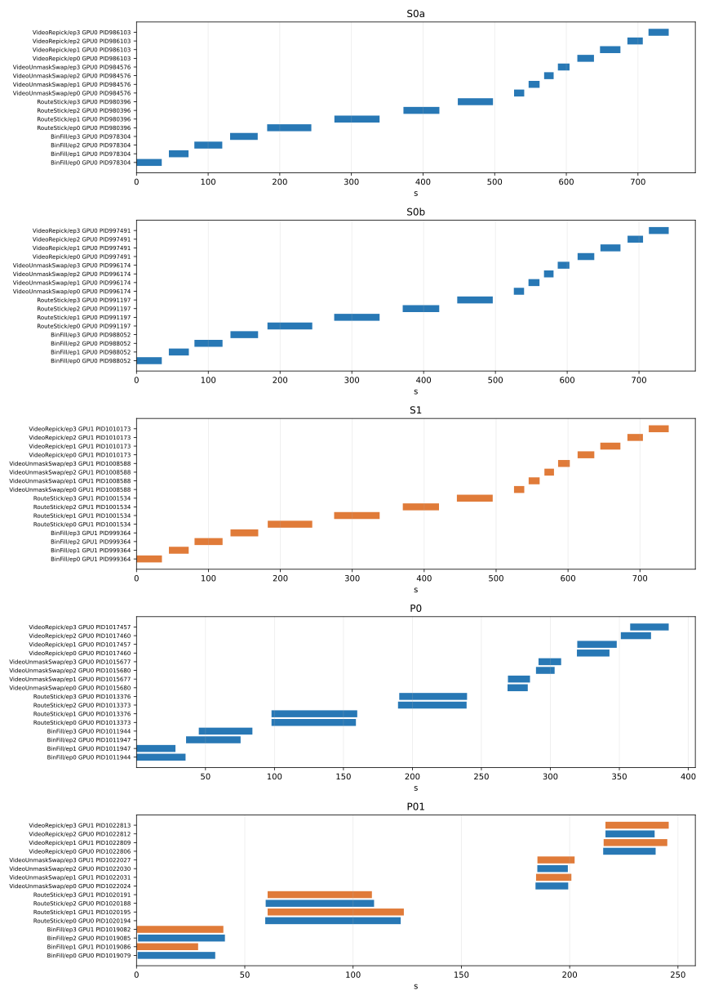

# schema 3 原值多 GPU、多 worker 校准实测

当前源码、依赖、硬件、schema 3 原值；不含 VideoRepick hard 或新值注入

本报告由 compare 从原始产物重新计算；时间图只表示 step 执行阶段重叠，不表示 CUDA 内核并发。

| 轮次 | 成功生成 | 完整有效产物 | 并发／串行窗口通过批次 | 批次总耗时（秒） |
|---|---:|---:|---:|---:|
| S0a | 15/16 | 15/16 | 4/4 | 758.01 |
| S0b | 15/16 | 15/16 | 4/4 | 756.44 |
| S1 | 15/16 | 15/16 | 4/4 | 754.58 |
| P0 | 15/16 | 15/16 | 4/4 | 401.13 |
| P01 | 15/16 | 15/16 | 4/4 | 262.59 |

串行参考合格：15/16。

| 模式 | 严格比较通过 | 校准结论 |
|---|---:|---|
| S1 | 15/16 | 未通过 |
| P0 | 15/16 | 未通过 |
| P01 | 15/16 | 未通过 |



## 逐条结果与首个分歧

详细记录见 [parallel_result.json](parallel_result.json)，输入见 [cases.json](cases.json)，环境和来源散列见 [context.json](context.json)。

- BinFill/hard/episode_3：五轮错误签名相同=True；重复失败不计为参考通过。
- S0a/BinFill：批次失败：退出码=1，超时=False
- S0a/BinFill/episode_3：生成未成功；DatasetGenerationError BinFill/episode_3: 环境报告失败
- S0b/BinFill：批次失败：退出码=1，超时=False
- S0b/BinFill/episode_3：生成未成功；DatasetGenerationError BinFill/episode_3: 环境报告失败
- S1/BinFill：批次失败：退出码=1，超时=False
- S1/BinFill/episode_3：生成未成功；DatasetGenerationError BinFill/episode_3: 环境报告失败
- P0/BinFill：批次失败：退出码=1，超时=False
- P0/BinFill/episode_3：生成未成功；DatasetGenerationError BinFill/episode_3: 环境报告失败
- P01/BinFill：批次失败：退出码=1，超时=False
- P01/BinFill/episode_3：生成未成功；DatasetGenerationError BinFill/episode_3: 环境报告失败
- S0a↔S0b/BinFill/hard/episode_3：一侧生成或证据不合格
- S1/BinFill/hard/episode_3：串行参考未建立
- P0/BinFill/hard/episode_3：串行参考未建立
- P01/BinFill/hard/episode_3：串行参考未建立

## 复现

以下 run 必须更换为未使用编号；长任务须用 detached tmux、pipefail、tee 和退出码留档。

```bash
command -v uv
uv run --no-sync python -m tests._shared.parallel_calibration run --run-id <新编号>
uv run --no-sync python -m tests._shared.parallel_calibration compare --run-id 20260909-schema3-parallel-v2
```

重产物与逐批命令、退出码和资源采样：`artifacts/parallel-calibration/20260909-schema3-parallel-v2/`。

资源值为每秒采样观察到的最大值；worker 的 peak_rss_mb 是进程生命周期高水位，不作为单局峰值。

只有本轮全部比较及并发判据通过才允许判通过；失败不换 seed、不补样本、不放宽容差。

## 资源采样

显存为整卡采样值，包含其他已有进程；RSS 为本批进程组总和。

| 轮次／任务 | 采样次数 | GPU 0 最大显存 MiB | GPU 1 最大显存 MiB | 最大进程组 RSS MiB | 采样错误数 |
|---|---:|---:|---:|---:|---:|
| S0a/BinFill | 168 | 1786.0 | 9.0 | 6297.8 | 0 |
| S0a/RouteStick | 316 | 1784.0 | 9.0 | 5568.7 | 0 |
| S0a/VideoUnmaskSwap | 81 | 1786.0 | 9.0 | 4413.6 | 0 |
| S0a/VideoRepick | 131 | 1852.0 | 9.0 | 6241.7 | 0 |
| S0b/BinFill | 167 | 2100.0 | 9.0 | 6327.7 | 0 |
| S0b/RouteStick | 314 | 2098.0 | 9.0 | 5570.0 | 0 |
| S0b/VideoUnmaskSwap | 81 | 1786.0 | 9.0 | 4408.8 | 0 |
| S0b/VideoRepick | 130 | 1786.0 | 9.0 | 6104.1 | 0 |
| S1/BinFill | 167 | 1033.0 | 764.0 | 6331.8 | 0 |
| S1/RouteStick | 314 | 1033.0 | 762.0 | 5718.7 | 0 |
| S1/VideoUnmaskSwap | 81 | 1033.0 | 764.0 | 4258.3 | 0 |
| S1/VideoRepick | 129 | 1033.0 | 764.0 | 6089.5 | 0 |
| P0/BinFill | 90 | 2555.0 | 9.0 | 11841.8 | 0 |
| P0/RouteStick | 157 | 2551.0 | 9.0 | 10902.5 | 0 |
| P0/VideoUnmaskSwap | 46 | 2555.0 | 9.0 | 7981.4 | 0 |
| P0/VideoRepick | 74 | 2555.0 | 9.0 | 10926.6 | 0 |
| P01/BinFill | 54 | 2587.0 | 1519.0 | 21420.4 | 0 |
| P01/RouteStick | 114 | 2583.0 | 1515.0 | 19570.0 | 0 |
| P01/VideoUnmaskSwap | 28 | 2587.0 | 1519.0 | 14766.1 | 0 |
| P01/VideoRepick | 43 | 2587.0 | 1519.0 | 20576.4 | 0 |
