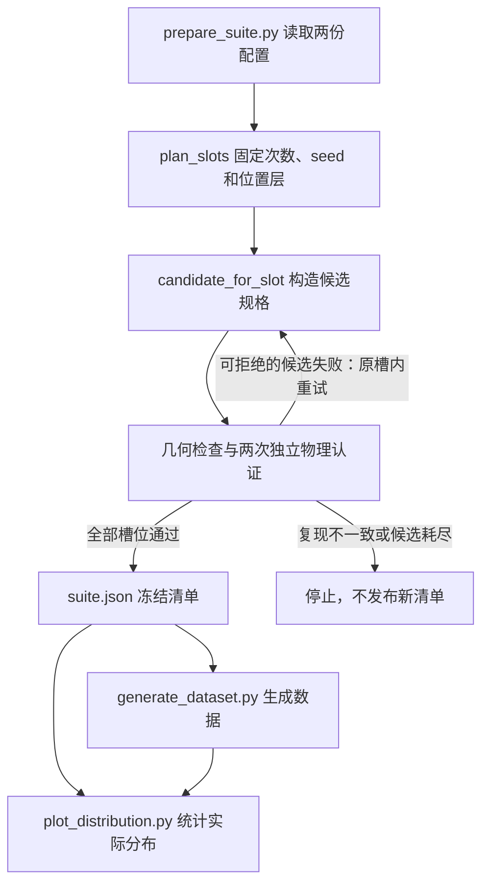

# ICL 生成环境的分布如何实现

四个 ICL 任务采用“先分配配额和位置层，再筛选候选，最后冻结清单”的流程。任务难度和次数在候选搜索前确定，位置在所属层内采样；通过几何检查与两次独立物理认证后，后续生成直接使用冻结规格。

本文说明当前实现和默认配置。下文的 96 条、坐标范围与候选预算均为配置值或代码推导，不是本次文档工作新运行的实验结果。四入口的完整使用说明见 [README.md](README.md)。

## 1. 整体流程与两份配置



新配置入口是 [prepare_suite.py](prepare_suite.py)。它调用 [compiler.py](../src/robomme_icl/suite/compiler.py) 的 `load_configs`、`plan_slots`、`candidate_for_slot`，再通过 [pipeline.py](../src/robomme_icl/io/pipeline.py) 的 `prepare_suite` 和 `_certify_slot_job` 完成认证。

| 配置 | 控制内容 | 当前默认值 |
| --- | --- | --- |
| [task_distribution.json](../src/robomme_icl/configs/task_distribution.json) | 任务顺序、每档条数、任务参数候选值、任务随机流及 episode seed 起点 | `compiler_seed=20260907`；`episode_seed_start=2000000000`；每档 8 条 |
| [position_distribution.json](../src/robomme_icl/configs/position_distribution.json) | 位置与角度范围、拓扑锚点、几何、运动时序和候选预算 | `compiler_seed=20260908`；`sampling="stratified"`；`max_candidates=1024`；`safety_clearance=0.005` m |

固定任务顺序为 `BinFill`、`RouteStick`、`VideoUnmaskSwap`、`VideoRepick`；难度顺序为 `easy`、`medium`、`hard`。默认每任务 `8+8+8=24` 条，四任务共 96 条。这里的配额单位是 episode；一条 episode 内可以包含多次抓取、交换或路径移动。

## 2. 任务分布：先确定每条环境要做什么

### 2.1 四任务的默认参数

下表的区间均表示配置列表中的整数取值，例如 `1–3` 表示 `[1, 2, 3]`。参数名与代码保持一致。

| 任务 | easy（8 条） | medium（8 条） | hard（8 条） |
| --- | --- | --- | --- |
| BinFill | `pick_count=1–3`；`spawn_count=4–6`；`target_color_count=1`；`scene_color_count=1`；`dynamic=false/true` | `pick_count=2–4`；`spawn_count=8–10`；`target_color_count=1–2`；`scene_color_count=2`；`dynamic=false/true` | `pick_count=3–5`；`spawn_count=10–12`；`target_color_count=2–3`；`scene_color_count=3`；`dynamic=false/true` |
| RouteStick | `walk_steps=2–3`；`allow_backtracking=false` | `walk_steps=4–5`；`allow_backtracking=false` | `walk_steps=4–7`；`allow_backtracking=true` |
| VideoUnmaskSwap | `container_count=3`；`pick_count=1–2`；`swap_count=1–2` | `container_count=4`；`pick_count=1`；`swap_count=1–2` | `container_count=4`；`pick_count=2`；`swap_count=2–3` |
| VideoRepick | `spawn_count=3`；`repeat_count=1–3`；`swap_count=1–2` | `spawn_count=3`；`repeat_count=1–3`；`swap_count=2–3` | `spawn_count=15`；`repeat_count=1–3`；`swap_count=0` |

BinFill 的 `pick_count` 是目标投入总数，`spawn_count` 包含目标和干扰方块；目标颜色数与全场颜色数分别控制，颜色来自红、绿、蓝。`candidate_for_slot` 为每种目标颜色先分配至少一个目标，再分配剩余目标数量，并保证每种声明的场景颜色至少出现一次。`dynamic=true` 时，同色方块首次在控制步 0 出现，此后按 `dynamic_reveal_interval_steps=50` 依次出现；`false` 时全部在步 0 出现。

RouteStick 的 `walk_steps` 是相邻目标间的移动段数，`path_indices` 长度为 `walk_steps+1`。起点从五个目标中选择，此后只走相邻目标。`allow_backtracking=false` 在有两个方向可选时禁止立即返回上一点；到边界仅有一个方向时仍会折返。每段绕行方向也写入 `directions`。

VideoUnmaskSwap 始终包含红、绿、蓝三个藏块：三容器时全占用，四容器时有一个空容器，目标容器始终从有藏块的容器中选择。VideoRepick 的 easy/medium 是三个同色方块，hard 是三色各五个；只选一个目标，`repeat_count` 统计评测阶段对该目标的完整重复抓放，演示另有一次抓放，编译后的 `pick_count=repeat_count`。Video 任务将锚点角色先确定性打乱，再按 `difficulty_rank % count` 轮转，避免固定零号位置一直充当目标或空容器；小样本不保证每种角色组合等量。

### 2.2 合法组合与配额平衡

`_legal_combinations` 按参数键排序后枚举笛卡尔积，再过滤不合法的联合组合。BinFill 要求：

```text
target_color_count <= pick_count <= spawn_count
scene_color_count >= target_color_count
spawn_count >= pick_count + scene_color_count - target_color_count
```

最后一条保证非目标场景颜色仍有方块可分配。VideoUnmaskSwap 要求 `pick_count < container_count`。`validate_configs` 另外检查参数类型、任务专属取值与几何限制；无合法组合时直接报错。

`_quota_rows` 对某任务、某难度的 `N` 个名额和 `K` 个合法组合，先执行 `base, remainder = divmod(N, K)`：每种组合分配 `base` 次，剩余名额从打乱的组合池中逐次选择，每个组合在余数阶段最多使用一次。选择代价为各维度 `(2 × 当前该值计数 + 1) × 该维度可选值数量` 之和，优先补足边际计数较少的值，最后再打乱整组行顺序。

BinFill 的 `dynamic` 具有额外优先级：先确定各布尔值的目标配额，再从尚未达到目标的组合中选择。默认每档 8 条且两种状态均开放，因此每档静态 4 条、动态 4 条；奇数配额的多出一条由确定性打乱决定。其余维度按上述代价平衡，不承诺精确等量。特别是 `N<K` 时必然有未覆盖组合，不能称为全组合覆盖或独立均匀抽样。

### 2.3 seed 与两套确定性随机流

`_Stream` 使用 SHA-256 计数器产生随机数，不依赖全局 RNG 或 worker 的完成顺序。任务配额流使用任务配置的 `compiler_seed`、任务、难度和 `"quota"`；位置层编号与层内采样流使用位置配置的 `compiler_seed`，因此可分别控制任务随机细节和位置随机细节。两者并非完全无关：任务参数改变物体数量或拓扑时，位置分组也随之改变。

`plan_slots` 为每个任务从 0 开始按难度累计 episode 编号，分配公式为：

```text
seed = episode_seed_start + task_number × per_task + episode
```

`task_number` 是上述固定四任务顺序中的 0–3；只选择部分任务不会重新编号。默认四任务的 seed 范围依次为 `2000000000–2000000023`、`2000000024–2000000047`、`2000000048–2000000071`、`2000000072–2000000095`。episode seed 是清单身份的一部分，并不能代替两份配置、编译器版本和最终 spec 来重建环境。

新配置模式传入 `--episodes-per-task N` 会覆盖三档默认配额：每档先取 `N // 3`，余数依次加给 easy、medium。例如 `N=1` 得到 `1/0/0`，`N=5` 得到 `2/2/1`。改变 `N` 也改变公式中的 `per_task` 和位置分层粒度，不能把重新编译少量名额当作从原 96 条中取子集。

## 3. 空间分布：固定分层，再在层内取点

### 3.1 分组、层编号和采样公式

`plan_slots` 使用 `(task_kind, difficulty, topology, object_count)` 分组；`object_count` 优先取 `spawn_count`，其次 `container_count`，RouteStick 为 0。它不是包含按钮、板或藏块的总 actor 数。每组有 `n=position_count` 条环境，对每个连续参数的支持区间 `[a,b]` 划分为 `n` 层。对每个参数，每层分配给组内一条环境；不同参数的层可采用不同排列或几何约束匹配。

`_sample` 的基础公式是：

```text
layer_low  = a + (b-a) × layer / n
layer_high = a + (b-a) × (layer+1) / n
value      = layer_low + (layer_high-layer_low) × u，0 <= u < 1
```

层编号取决于位置随机种子、分组、参数名和组内排名；层内随机数还包含 `slot_id` 与 `candidate_index`。每次候选重试保留原层编号，改变层内取值。`layout.strata` 为每个参数记录 `index`、`count`、`bounds`、`support`。例如一组有 4 条、角度范围为 `[-20,20]` 时，四个角度层是 `[-20,-10]`、`[-10,0]`、`[0,10]`、`[10,20]`，按确定性排列各分配一次；这只是公式示例，不是某任务默认分组恰好有四条的声明。

这个保证针对同组、同一参数的逐轴层覆盖。它不等于二维网格全部覆盖、所有物体互相独立，也不等于所有难度汇总后的坐标密度均匀。后续完整物体边界、避碰构造和物理筛选还会缩小实际可接受区域。

### 3.2 四任务的空间支持范围

以下坐标单位为米，角度为度，来自默认位置配置。

| 对象或布局 | x / y 支持范围或位置 | 朝向 |
| --- | --- | --- |
| 全局工作台约束 | x、y 均为 `[-0.6,0.6]`；并非各任务任意采样区域 | — |
| BinFill 按钮中心 | x `[-0.25,-0.15]`；y `[-0.2,0.2]` | 固定 0 |
| BinFill 孔板中心 | x `[-0.05,0.15]`；y `[-0.2,0.2]` | `[-20,20]` |
| BinFill 方块完整外框 | x `[-0.3,0.1]`；y `[-0.25,0.25]` | `[0,360]` |
| RouteStick 九点结构 | 旋转前第 `i` 点为 `[-0.1,(i-4)×0.07]`，`i=0…8` | 整体 `[-30,30]` |
| Video 三物体布局 | triangle 或 line；旋转后的每个锚点周围 x、y 各 `±0.07` 外框 | 布局整体 `[0,180]` |
| Video 四容器布局 | rectangle；旋转后的每个锚点周围 x、y 各 `±0.07` 外框 | 布局整体 `[0,180]` |
| Video 容器自身 | 在所属锚点外框内采样 | `[0,90]` |
| Video 方块自身 | 在所属锚点外框内采样 | `[0,360]` |
| VideoRepick 按钮中心 | x `[-0.25,-0.15]`；y `[-0.05,0.05]` | 固定 0 |
| VideoRepick hard 方块完整外框 | x `[-0.3,0.1]`；y `[-0.25,0.25]` | `[0,360]` |

BinFill 和 VideoRepick hard 的 `field` 方块半边长为 0.02，初始中心分层支持先内缩为 x `[-0.28,0.08]`、y `[-0.23,0.23]`，再结合实际旋转外形求可行中心范围。按钮和孔板的配置区间直接用于中心采样，与方块的“完整外框”口径不同。

RouteStick 的偶数位置是五个目标，奇数位置是四个障碍物，间距固定为 0.07。`candidate_for_slot` 对完整坐标调用 `_rotate(point, yaw)`，因此绕世界原点旋转，中心 `[-0.1,0]` 也会移动；并非绕固定中心旋转。其空间自由参数是整体朝向，路径和绕行侧别属于任务随机细节。

Video 的原始锚点为：

| 拓扑 | 按槽位顺序排列的原始锚点 |
| --- | --- |
| triangle | `[-0.05,-0.1]`、`[-0.05,0.1]`、`[0.1,0]` |
| line | `[0,-0.15]`、`[0,0.15]`、`[0,0]` |
| rectangle | `[-0.05,-0.1]`、`[-0.05,0.1]`、`[0.1,0.1]`、`[0.1,-0.1]` |

三物体按该难度的 `rank % 2` 交替使用 triangle、line；默认每档 8 条时各 4 条。四容器固定 rectangle。锚点绕世界原点旋转后，窗口仍是世界坐标系下轴对齐的正方形。物体自身朝向单独采样，不再叠加整体布局角。容器半边长 0.03，中心偏移先在 `[-0.04,0.04]` 分层；普通方块半边长 0.02，中心偏移先在 `[-0.05,0.05]` 分层。藏块随父容器定位，不另外分配独立位置层。

### 3.3 保持层配额的几何匹配与层内放置

`_allocate_field_layers` 在 field 分组至少有 4 条环境时，先根据按钮、孔板的可能占用区和安全间距匹配每个方块的 x/y 层。每个方块跨 episode 仍每轴各层一次，匹配只在计划阶段进行；每个 episode 的网格容量使用 `ceil(object_count / n²)`。少于 4 条时，`_sample` 使用各方块的确定性轴偏移安排网格。分配失败直接报错，不在认证过程中偷偷换层。

`_allocate_video_yaw_layers` 根据实际碰撞形状的旋转投影，将各物体的朝向层与已定的位置层进行匹配。先尝试整个朝向层都能容纳的配对，必要时放宽为层内至少存在可行朝向；找不到完整匹配即报错。该过程保持逐轴层配额，具体候选仍须通过几何检查。

`_sample_initial_support` 将物体旋转后的实际碰撞形状投影到 x/y 轴，对每轴计算：

```text
可采中心区间 = 原位置层（加锚点偏移） ∩ 能容纳完整旋转物体的中心区间
```

它在交集内重新均匀采样，不把已经抽到的越界点裁到边缘。交集没有正宽度时标记 `initial_support_rejection`，交给几何认证拒绝。`layout.strata.bounds` 记录原层边界，交集可能更窄；`actors[].initial_xy_bounds` 记录完整物体外框，两者不应混为一谈。

field 布局的 `_pack_field` 按物体顺序放置，每个方块最多尝试 32 个原层内的点，并可在原朝向层内调整角度，取首个满足净距的候选。仍无法放置时保留净距最大的尝试及 `layout.packing.unresolved`，由外层检查决定拒绝；不减少方块、不降低间距。顺序放置和拒绝筛选会引入物体间关联，所以最终接受的位置不能视作无约束的独立均匀分布。

## 4. 候选筛选、冻结清单与复现

### 4.1 候选会改变什么

同一 slot 的 `candidate_index` 默认从 0 到 1023，CLI 的 `--max-candidates` 只能进一步缩小配置预算。重试保持 task、difficulty、次数参数、seed、拓扑和位置层；由不含候选编号的任务流确定的目标、颜色和 RouteStick 路径也保持。层内位置、部分角度、放置结果以及交换对象序列可以改变。

交换流包含任务配置种子、`slot_id`、`candidate_index` 和 `"swap-candidate"`。rectangle 只选择边邻接槽对，line 只选择 `(0,2)` 或 `(2,1)`，triangle 可选择任意两槽；每次交换后更新槽位占有者，冻结的是实际 actor ID 序列。默认 `swap_steps=50`、`swap_start_step=20`、`swap_gap_steps=10`、`swap_lane_offset=0.07` m，交换时段和次数不会因位置失败而减少。

### 4.2 几何与物理认证

[collision.py](../src/robomme_icl/geometry/collision.py) 的 `validate_spec_geometry` 检查初始完整物体外框、桌边、物体间净距以及 BinFill 初始方块不得占据目标孔投影。默认安全净距为 0.005 m；配置不允许更小。位置外框本身不是障碍物，完整物体只需位于外框内，不在外框上另扣一次安全间距。

对完整交换路径，检查器使用实际 compound 几何、区间中点分离轴和连续运动速度上界；无法证明整段安全就二分，预算耗尽仍拒绝。该检查只覆盖清单中的物体几何，机械臂真实接触和任务是否完成还要由物理运行认证。默认控制频率 20 Hz、仿真频率 100 Hz；正式运行的超时和并发参数见 [README.md](README.md)。

`_certify_slot_job` 先过几何检查，再分别在两个新进程运行同一 spec。比较口径为 `dtype_shape_bytes_all_frames_including_rgb`，覆盖原始 RGB、状态、动作、事件和终止记录。第一次出现明确场景或任务不可行，可记录 `rejected.json` 后尝试同槽下一候选；第一次成功而第二次失败，或两次记录不一致，则作为复现错误停止，禁止换候选掩盖差异。基础设施重试由 `retry_same_spec` 保留同一 spec，其他阻断错误停止；候选耗尽时不发布不完整的新套件。

因此分布保证是“计划配额和逐轴位置层保持，层内接受满足约束的候选”。认证会筛掉不可行场景，不能把最终分布称为整个工作台均匀、联合空间均匀或所有合法场景等概率。

### 4.3 冻结什么，生成时读取什么

[spec.py](../src/robomme_icl/suite/spec.py) 的 `EpisodeSpec` 保存 `task_parameters`、`actors` 的位置与四元数、`swaps` 完整序列、`layout.strata`、`geometry`、`schedule` 和 `provenance`。来源包含两份配置的哈希、编译器版本、slot 和候选编号，规格另有 `spec_hash`。

[storage.py](../src/robomme_icl/suite/storage.py) 的 `save_suite` 仅在完整认证结果齐全时发布 `status="certified"` 的 `suite.json`，包含配置快照、全部规格、按 `spec_hash` 绑定的认证信息及 `suite_hash`。`load_suite` 重新校验哈希、身份与认证引用。认证记录另外保存源码、依赖锁、运行环境指纹、GPU 绑定和原始记录内容哈希。

新配置认证按排序后的物理 GPU 列表分配 `gpus[seed % len(gpus)]`，后续生成沿用绑定，worker 数只影响并发。不要用 `CUDA_VISIBLE_DEVICES` 重新编号。生成入口不重新抽 seed 或布局，而是消费认证清单；HDF5 的 `setup/episode_spec` 保存完整规格，回放使用它恢复环境。仅知道 seed 或只保存任务参数不足以替代冻结清单。

## 5. 如何修改与核对分布

### 5.1 新配置、子集和重新认证的区别

| 操作 | 对分布的影响 |
| --- | --- |
| `prepare_suite.py --task-config ... --position-config ...` | 按新配置重新计划次数、seed 和位置层，再搜索与认证候选；写入新批次 |
| 新配置模式的 `--tasks`、`--episodes-per-task` | 在编译前选择任务和分配每档名额；会形成新的位置分组与分层 |
| `generate_dataset.py --tasks ... --episodes-per-task N` | 按清单现有顺序为每任务取前 N 条，不额外排序、不重新平衡难度、不换 seed 或层；默认清单可能只取到 easy |
| `prepare_suite.py --source-suite ...` | 对原冻结 spec 重新认证，每条两次新运行还要与来源原始记录比较；保留原 seed、位置、次数、交换和 GPU，不搜索候选；选择子集也是取原清单前缀 |

选择生成子集时，入口保存 `selection/suite.json` 并用它绘图；保留原层定义，缺失层如实报告。`--source-suite` 不能与 `--task-config`、`--position-config` 或 `--max-candidates` 混用，输入与输出批次必须分开，不能更改 GPU 绑定。

### 5.2 修改配置与运行示例

所有命令从仓库根运行。先在仓库内准备两份配置副本，完整保留 schema 字段，仅修改所需配额、参数候选列表或位置范围；下面的 `configs/icl-custom/` 是用户准备副本的位置示例，并非仓库已提供的文件。

```bash
cd /data/hongzefu/robomme_benchmark_MotionJEPANewTask
command -v uv
uv run scripts/prepare_suite.py \
  --task-config configs/icl-custom/task_distribution.json \
  --position-config configs/icl-custom/position_distribution.json \
  --output-dir artifacts/generated/robomme-icl/custom-smoke \
  --tasks BinFill --episodes-per-task 1 --workers 1 --gpus 0
```

以上先做单任务、单 episode、单 worker smoke。通过后，完整批次使用另一个输出目录，去掉 `--tasks`、`--episodes-per-task`，按实机设备配置 `--gpus` 和并发。预计超过五分钟的命令按 [根目录规则](../AGENTS.md) 和 [README.md](README.md) 的“正式运行”使用登记的 detached tmux；不能在已有 smoke 输出目录里改配额继续运行。

完整认证的参数示例如下；执行时将此命令放入上述 tmux 运行模板，记录实际设备及输入配置：

```bash
uv run scripts/prepare_suite.py \
  --task-config configs/icl-custom/task_distribution.json \
  --position-config configs/icl-custom/position_distribution.json \
  --output-dir artifacts/generated/robomme-icl/custom-run \
  --gpus 0,1 --workers 32
```

`validate_configs` 严格检查字段和固定机制：当前只支持 `sampling="stratified"`；四任务顺序固定；VideoRepick easy/medium 必须三个方块、hard 必须十五个且零交换；三物体拓扑列表、部分 builder 几何和 50 步/0.07 m 交换轨道固定。配置不合法、位置层无法匹配或认证失败时直接处理报错，不会回退旧随机初始化。涉及正式依赖或默认源码配置的修改仍须遵守仓库开发规则。

已得到完整的新清单后，可运行：

```bash
uv run scripts/generate_dataset.py \
  --suite artifacts/generated/robomme-icl/custom-run/suite \
  --output-dir artifacts/generated/robomme-icl/custom-run \
  --workers 32 --video-workers 4

uv run scripts/plot_distribution.py \
  --suite artifacts/generated/robomme-icl/custom-run/suite \
  --output-dir artifacts/generated/robomme-icl/custom-run/distributions
```

`custom-run` 表示已在独立输出目录完成完整认证的批次；这两条命令不会自动从 `custom-smoke` 扩展出完整清单。生成阶段自动调用同一绘图实现，独立绘图不运行仿真。同来源完整图会校验复用，缺图可补；不同来源、哈希不符或身份不明的文件不会被直接覆盖。

### 5.3 分布图和统计应如何读

[_icl/plots.py](_icl/plots.py) 的 `_actual_distribution` 从冻结 `episodes` 统计实际数据，不重新采样。每任务输出一张组合图，展示难度内次数配额、单局布局和跨 episode 散点；`distribution_summary.json` 包含以下口径：

| 字段或来源 | 含义 |
| --- | --- |
| `configs.task`、`configs.position` | 允许取值、预期配额及空间支持范围，不代表全部值都已出现 |
| `episodes_total`、各任务/难度的 `episodes` | 当前输入清单实际包含的 episode 数 |
| `parameter_counts` | 实际参数值对应的 episode 计数 |
| `parameter_totals` | 次数参数的数值总和，例如总交换次数；不是 episode 数 |
| `target_color_totals`、`topology_counts` | 目标颜色数量汇总、实际布局条数 |
| `position_groups[].dimensions` | 每参数的 `support`、`strata_count`、`index_counts`、`covered_strata`、`coverage_fraction`、`missing_indices` |
| `suite_hash`、`episode_spec_hashes`、`plot_code_sha256` | 图和统计使用的清单、规格及绘图实现来源 |

`coverage_fraction=1` 只表示该位置参数的所有计划层均有记录，不证明每层内部或二维区域均匀。子集缺失层属于真实覆盖信息；参数值出现过也不表示联合组合全覆盖。编译器另有 `distribution_summary(slots)`，能枚举合法联合组合并包括零计数组合；它是计划槽位统计函数，不是当前绘图 JSON 的同名内容，四入口不会自动把这份组合表写入绘图报告。

核对时依次看配置支持范围、实际次数、拓扑计数和逐组位置层覆盖，再结合场景散点及几何/物理认证记录判断结果。这里描述的是生成时冻结的初始环境与任务过程参数分布；它不等同于整段运动轨迹中所有帧的物体占据分布。
