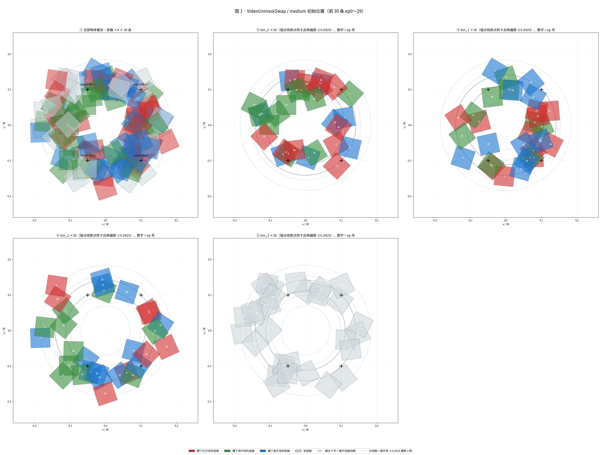
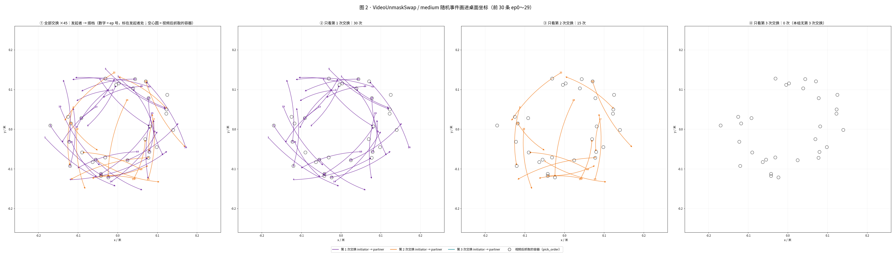
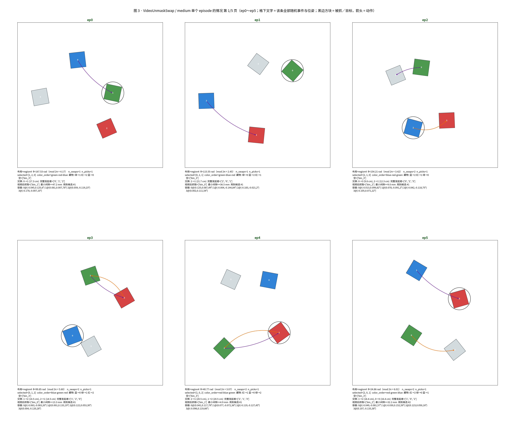
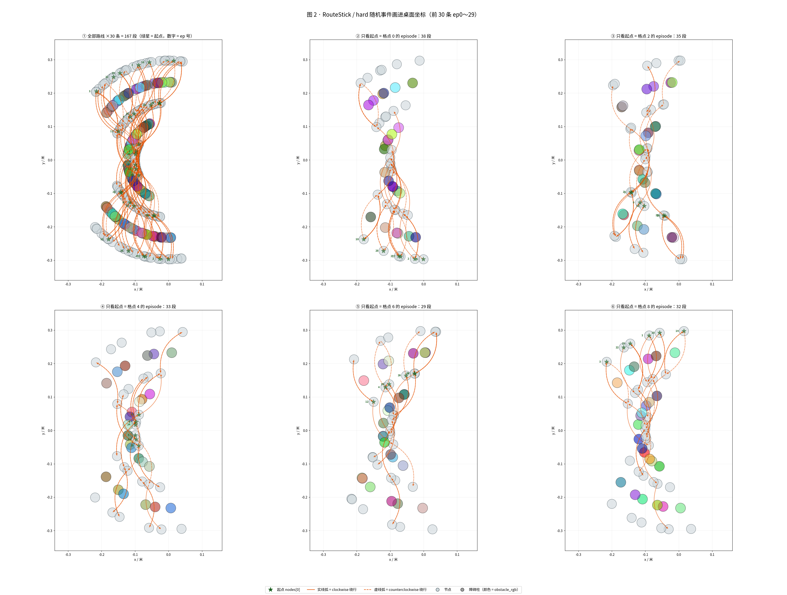

# 新值规格的跑前分布：怎么生成、每组随机了什么、结果落成什么样

> 数据：`artifacts/injection/20260911-contract-v3-06/specs/<任务>/<难度>.json`，14 组 × 100 条 = 1400 条冻结规格（2026-09-11 新增 RouteStick／VideoUnmaskSwap／VideoRepick 的 `xhard` 三组），生成 seed `20260909`，`VideoRepick hard` 排除。取值域与分配两列取自契约 `scripts/configs/newtask-v2/injection_contract_v3.json`（= v2 + 三个 xhard 组；v2 = BinFill 对齐 heldout：medium 6～8 块、hard 8～10 块、多目标色每色至少 1 块），改口径与用户决策见 [NEW_VALUE_CONTRACT_CHANGELOG.md](../NEW_VALUE_CONTRACT_CHANGELOG.md)；旧 11 组规格与 `20260911-contract-v2-05` 逐条相同（`OLD_GROUPS_EQUIVALENCE=PASS compared=1100 differences=0`），05 与 04 原样保留作对照。
> 判定（`check_result.json`）：`CONTRACT_DERIVED=PASS fields=200 mismatches=6 overrides=2 version=v3 problems=0`、`SPEC_SCOPE=PASS groups=14 specs=1400`、`COVERAGE_QUOTA=PASS batches=10 quota_gaps=0`、`STATIC_GEOMETRY=PASS checked=1400 rejected=0`（含新增的「第 k 段发起者 = swap_initiators[k mod 3]」校验）、`COLLISION_SWEEP=PASS specs=700 rejected=0 min_g_m=0.000141418`、`SPEC_REPRODUCIBLE=PASS compared=1400 differences=0`、`CHECK=PASS elapsed_s=655.5`。
> 本目录只有只读脚本，不改 `tests/_shared/*`、不改 `src/robomme`、不写原 `plots/`；图只做**跑前**，PNG 放本目录 `figures/`，已 gitignore 不入库，只保留链接（用户要求）。
> 05 的 ep0～29 已按契约 v2 实跑（双卡各 20 worker，档 `feasibility/P01x20/`）；这些真实轨迹上的**采样窗口数轴**（motion 窗口、subgoal 分段、两条帧路；BinFill 以同一条重复两遍模拟 demo）见 [SAMPLING_WINDOWS.md](SAMPLING_WINDOWS.md)。
>
> 三条命令（都只读规格 JSON）：
> - 出图：`uv run python scripts/injection-before-2d/plot_injection_before_2d.py --run-id 20260911-contract-v3-06`，只画实跑范围前 30 条（ep0～29），每组 7 张、共 98 张，产物放本目录 `figures/<任务>/<难度>/`（已 gitignore 不入库，文档链接指向本地文件，clone 后先跑一次出图），成功打 `PLOT2D_BEFORE=PASS groups=14 files=98 episodes=30`；xhard 视频组的事件图按最大 swap 次数画「①全部 + 第 1～5 次」六个面板；
> - 生成第二节的事件表：`uv run python scripts/injection-before-2d/event_tables.py --run-id 20260911-contract-v3-06 --write`（「取值域」「分配」两列取自清单记录的契约，本脚本只算「结果分布」列），成功打 `EVENT_TABLES=WRITTEN groups=14 rows=156`；
> - 核对文档链接、产物张数与事件表是否漂移：`uv run python scripts/injection-before-2d/check_doc_links.py`，成功打 `DOC_LINKS=PASS … files=77/77 … tables=PASS`。

## 一、分布是怎么生成的

### 1.0 取值域从哪来：约定 JSON 是派生依据

每个字段「能取哪些值」「用哪种办法铺满 100 条」写在一份版本化的约定 JSON 里——`scripts/configs/newtask-v2/injection_contract_v2.json`（本轮），生成器 `scripts/injection/specs.py::build_group` 从它读离散候选列表与连续区间端点，第二节表格的「取值域」「分配」两列也直接取它的 `domain_text`／`allocation_text`；几何常量（按钮盒尺寸、孔板边长、锚点坐标、避让间距 0.02、`region_half_size`）仍只在 `native_sampling.json`。契约里由几何或难度字典算出的数字都带派生表达式，`check` 的 `CONTRACT_DERIVED` 每次拿 `native_sampling.json` 回算；有意偏离原值的字段必须登记在契约的 `overrides`。v1（原值口径，04 运行）→ v2 只改 BinFill 三处：medium 方块 8～10 → 6～8、hard 10～12 → 8～10、多目标色时每个目标色至少 1 块（heldout 分支 `2fa5660`）；其余 9 组逐字相同（[NEW_VALUE_CONTRACT_CHANGELOG.md](../NEW_VALUE_CONTRACT_CHANGELOG.md)）。

### 1.1 一个字段一把专属骰子

每一个要随机的量（比如 BinFill/easy 的按钮 x 坐标）都有自己的一把骰子。骰子是这样造的：把 `20260909|BinFill|easy|button_x` 这串字做一次 SHA-256，取前 8 个字节当随机数种子（`scripts/injection/sampling.py::derive_rng`）。换任何一个字（换任务、换难度、换字段名）就是另一把骰子；同一串字在任何机器、任何并行度、任何字典遍历顺序下摇出来的数永远一样。所以 `plan` 跑两遍，1400 条规格逐条散列全同（`SPEC_REPRODUCIBLE=PASS compared=1400 differences=0`）；也因为换难度就是另一把骰子，06 新增 xhard 三组不会扰动旧 11 组（与 05 逐条相同）。

### 1.2 连续量（位置、角度）：10 个抽屉，每个抽屉 10 个小格

拿按钮 x 坐标举例，合法范围是 [-0.25, -0.15]，宽 0.1 米：

1. 先把这 0.1 米切成 **10 个抽屉**（代码里叫粗箱），每个宽 0.01 米；
2. 每个抽屉再切成 **10 个小格**（细层），每个宽 0.001 米；
3. 100 条规格分成 **10 批**，每批 10 条。**每批的 10 条各占一个不同的抽屉**，同一个抽屉在 10 批里各用一个不同的小格；
4. 于是 100 条正好把 10 × 10 = 100 个小格填满一遍；小格内的具体位置再随机抖一下。

结果是：任何一批（包括实跑只用的前 3 批 ep0～29）都均匀盖住整条区间，全部 100 条则每个抽屉恰好 10 条。这个「每个抽屉 10 条」就是 `COVERAGE_QUOTA` 对连续量验的东西（`scripts/injection/sampling.py::stratify`）。

**拿真实数据走一遍**（BinFill/easy 第 0 批，ep0～ep9 的 `button_x`）。规格 JSON 里每条都存了 `sampling_cells.button_x = [抽屉号, 小格号]`，例如 ep0 存的是 `[0, 9]`，意思是第 0 号抽屉、第 9 个小格，小格区间就是 -0.25 + 9 × 0.001 = [-0.2410, -0.2400)；这条规格实际的 `layout.button_xy[0]` 是 -0.24090228580683687，确实落在里面。谁都可以打开 JSON 自己核对：

| episode | 抽屉（粗箱） | 小格（细层） | 小格区间 | 实际值 |
|---|---|---|---|---|
| 0 | 0 | 9 | [-0.2410, -0.2400) | -0.240902 |
| 1 | 5 | 5 | [-0.1950, -0.1940) | -0.194565 |
| 2 | 4 | 2 | [-0.2080, -0.2070) | -0.207359 |
| 3 | 6 | 8 | [-0.1820, -0.1810) | -0.181941 |
| 4 | 7 | 3 | [-0.1770, -0.1760) | -0.176367 |
| 5 | 9 | 6 | [-0.1540, -0.1530) | -0.153285 |
| 6 | 2 | 5 | [-0.2250, -0.2240) | -0.224995 |
| 7 | 3 | 6 | [-0.2140, -0.2130) | -0.213953 |
| 8 | 8 | 8 | [-0.1620, -0.1610) | -0.161114 |
| 9 | 1 | 7 | [-0.2330, -0.2320) | -0.232723 |

读法：「抽屉」列是 0～9 的一个排列，一个不重不漏，这就是「每批 10 条各占一个抽屉」。每个变量（`button_x`、`button_y`、`board_yaw`……）各用自己的一套排列，所以 x 和 y 不会一起沿对角线走。

### 1.3 独立的离散量（几块、几次、哪种排列）：发牌

`spawn_total` 这种只能取 4/5/6 的量不是掷骰子，是**发牌**：先按人头把 100 张牌分成 34/33/33，再洗一洗按批发下去（`scripts/injection/sampling.py::quota_series`）。所以最后一定是 `4:34 5:33 6:33`，多一张少一张都不行；两类的量（`dynamic`、`layout_type`）就是 50/50，五类的（RouteStick 起点）就是各 20。全局计数差 ≤ 1，这是 `COVERAGE_QUOTA` 对离散量验的东西。

⚠ **「每一批 10 条也按同比例」只在两类（50/50）时严格成立**（出图时发现，代码未改、规格已冻结，如实记录）。三类 34/33/33 按 `floor(n·(t+1)/10) − floor(n·t/10)` 摊到 10 个批桶时，桶大小是 9, 9, 10, 11, 10, 9, 11, 10, 9, 12，串接成 100 条后批桶边界与 episode 的 `10t～10t+9` 错位。实测 BinFill/easy 的 `spawn_total` 每批 4/5/6 计数是 3/4/3、4/2/4、3/4/3、3/3/4、**5/3/2**、2/3/5、4/4/2、3/3/4、3/3/4、4/4/2。

| 类数 | 全局配额 | 10 个批桶的大小 | 每批是否严格按比例 |
|---|---|---|---|
| 2（`dynamic`、`layout_type`、两值的 `n_swaps`…） | 50/50 | 10 × 10 | 是，每批恰 5/5 |
| 3（`spawn_total`、`put_in_total`、`num_repeats`…） | 34/33/33 | 9, 9, 10, 11, 10, 9, 11, 10, 9, 12 | 否，只近似 |

对实跑范围 ep0～29 的实际影响（05 运行重算）：独立类别的 30 条计数差多数为 0，最大 3（BinFill/hard 的 `put_in_total`）；逐组数字：BinFill easy `put_in_total` 2；medium `initialize_color_order` 2、`spawn_total` 2；hard `initialize_color_order` 2、`spawn_total` 2、`put_in_total` 3；RouteStick hard `L` 1、三档 `direction` 各 1（按段计数，30 条的段数是奇数，天然差 1）；VideoUnmaskSwap easy `selected` 2、medium `selected`/`color_order` 各 2、hard `color_order` 2；VideoRepick easy `num_repeats`/`target` 各 2、medium `target` 2；其余全部为 0。BinFill medium／hard 的 `spawn_total` 换成 6～8／8～10 后每批计数与 04 完全相同——发牌序列只取决于类数（仍是 3 类），牌面换了、顺序没换。全局 100 条的计数差 ≤ 1 不受影响。修法（待批，不在本轮）：先保证每批桶恰 10 条，再在桶内配置各类别。

### 1.4 受几何或上一步限制的量：谁用得少先轮谁

路线的下一步、交换的对象、目标色池这类量，能取什么值取决于当前位置和场上情况，事先没法发牌。办法是：**每一步只在当前合法的候选里挑历史上用得最少的那个，平局随机**（`scripts/injection/sampling.py::balanced_choice`）。这类量只报实际频数，不承诺严格均匀。两个例子：

- RouteStick/hard 的 8 条有向边，550 段走下来是 `8→6:77 0→2:73 6→4:71 6→8:70 2→0:65 4→2:65 4→6:65 2→4:64`——两端节点只有一个邻居，走到头被迫掉头，所以 `0→2`、`8→6` 天然偏多。
- VideoUnmaskSwap/medium 的交换搭档不是随机的，是「交换开始时水平距离最近的那个」推出来的；四点布局里 `bin_3` 离谁都不是最近，150 次交换里 `bin_3→bin_0/1/2` 三种组合一次没出现。

还有一类是每条规格单独掷骰子的耦合量（`rng_ep`）：BinFill 每色投几块、每色生成几块、方块生成顺序，RouteStick 障碍柱颜色。它们同样只报实际频数。

### 1.5 几何／碰撞拒绝之后的重抽（不改配额、不放宽阈值、不减物体）

- BinFill 方块：第 0 块的首次尝试用本条的分层点（这一次计入连续量配额），其余块粗箱轮转散开；候选与按钮／孔板／已放方块（扩 0.02 间隙）相交即照原 `spawn_random_cube` 在**整个区域**重抽，最多 256 次。实测候选／几何拒绝（05）：easy 1136/637、medium 1745/1046、hard 2733/1834（04 按原值区间是 2600/1701、4423/3324，方块少了两块落位更容易）。所以方块的**实际位置**不承诺每箱 10，第二节里「采样输入」与「实际位置」分开报。
- 两个视频任务：初态 + 每段交换路径过真实碰撞盒的连续检查（接触即拒，容限 1e-6 m）；被拒后 θ 与每个偏移、朝向都在**同一粗箱**内重抽，粗箱不变所以配额判据不受影响。冻结时用到第几个候选的实际频数见第二节各组的 `collision.candidates_used` 行（VideoRepick/medium 最远用到第 33 个）。
- RouteStick 无几何拒绝（候选 0）。

## 二、14 组各随机了什么、结果落成什么样

每组两张表：**初始化**（场景开局是什么样：物体种类、数量、位姿、藏物关系）与**事件**（任务要做什么：投入／抓取／路线／交换的选择）。四列：**事件**（随机了什么）、**取值域**（能取哪些值）、**分配**（用第一节的哪种办法）、**结果分布**（这 100 条实际落成什么样）。「推出」表示由前面的随机量确定性算出、本身不再随机，但仍报实际频数。结果分布只有四种写法：

- 离散量 `4:34 5:33 6:33`：按合法取值域顺序列「值:条数」，没出现的写 0；
- 连续量 `10 箱各 10，实测 [下限, 上限]`：前半是采样输入落进 10 个抽屉的条数（不全 10 时逐箱列出），后半是实际值的极值；
- 耦合量 `a→b:45 …（共 150 次交换）；未覆盖 …`：实际频数降序，分母不是 100 条时注明单位，最后列合法域里一次没出现的组合；
- 推出量以 `推出：` 开头，其余同耦合量。

下面的表由 `event_tables.py` 自动生成并写入两条标记之间，手改会被 `check_doc_links.py` 判 `tables=FAIL`。

<!-- AUTO:EVENT_TABLES BEGIN -->
### BinFill / easy（100 条）

#### 初始化（场景开局是什么样：物体种类、数量、位姿、藏物关系）

| 事件 | 取值域 | 分配 | 结果分布 |
|---|---|---|---|
| `dynamic`（方块分批出现还是开局全在） | True / False | 配额 50/50 | True:50 False:50 |
| `colors_present`（场上有哪些颜色） | 红蓝绿里取 1 种 | 配额 | red:34 blue:33 green:33 |
| `spawn_total`（生成几块） | 4～6 | 配额 | 4:34 5:33 6:33 |
| `initialize_color_order`（颜色创建顺序） | 蓝红绿 6 种排列 | 配额 | blue-red-green:17 blue-green-red:17 red-blue-green:17 red-green-blue:17 green-blue-red:16 green-red-blue:16 |
| `spawn_count[颜色]`（每色生成几块） | 每色至少 max(目标,1)，余量随机摊 | `rng_ep` 逐条随机（耦合） | green=4:13 red=6:13 blue=4:11 blue=5:11 blue=6:11 green=5:11 red=5:11 red=4:10 green=6:9（共 100 个颜色项） |
| 方块生成顺序 | (颜色, 序号) 的随机排列 | `rng_ep.permutation` | 生成序首块的颜色 red:34 blue:33 green:33 |
| `button_xy`（按钮中心） | x∈[-0.25,-0.15] y∈[-0.2,0.2] | 分层 | x 10 箱各 10，实测 [-0.2492, -0.1510]；y 10 箱各 10，实测 [-0.1995, 0.1981] |
| `board.xy`、`board.yaw_deg`（孔板） | x∈[-0.05,0.15] y∈[-0.2,0.2]，yaw∈[-20°,20°] | 分层 | x 10 箱各 10，实测 [-0.0491, 0.1499]；y 10 箱各 10，实测 [-0.1967, 0.1968]；yaw 10 箱各 10，实测 [-19.97, 19.71] |
| `cubes[i].xy`、`yaw_rad`（每块方块） | x∈[-0.28,0.08] y∈[-0.23,0.23]，yaw 0～2π | 第 0 块首次尝试分层；其余块粗箱轮转；被拒整域重抽 | 采样输入 cube_x 10 箱各 10、cube_y 10 箱各 10、cube_yaw 10 箱各 10；实际位置 x 箱计数 55,36,36,42,58,50,55,52,58,57，实测 [-0.2799, 0.0795]；y 箱计数 68,53,46,48,40,41,47,39,47,70，实测 [-0.2300, 0.2298]；yaw 实测 [0.00, 6.26]（共 499 块） |

#### 事件（任务要做什么：投入／抓取／路线／交换的选择）

| 事件 | 取值域 | 分配 | 结果分布 |
|---|---|---|---|
| `put_in_color` 目标色种数 | 1 | 配额 | 1:100 |
| `target_pool`（要投入的颜色子集） | 场上颜色的子集 | 合法候选内平衡 | red:34 blue:33 green:33；未覆盖 无 |
| `put_in_total`（投入几块） | 1～3 | 配额 | 1:34 2:33 3:33 |
| `target_count[颜色]`（每色投几块） | 单色直接给总数；多目标色每色先各 1，余量逐个随机分（heldout 规则，不允许 0） | `rng_ep` 逐条随机（耦合） | green=2:14 red=1:13 red=3:13 blue=1:12 blue=2:11 blue=3:10 green=3:10 green=1:9 red=2:8（共 100 个颜色项） |
| `actions`（抓哪块） | 按颜色创建顺序遍历，每色取生成列表最前 `target_count` 块 | 推出 | 推出：被抓方块的色内序号 0:34 1:44 2:41 3:40 4:29 5:11（共 199 个动作） |

### BinFill / medium（100 条）

#### 初始化（场景开局是什么样：物体种类、数量、位姿、藏物关系）

| 事件 | 取值域 | 分配 | 结果分布 |
|---|---|---|---|
| `dynamic`（方块分批出现还是开局全在） | True / False | 配额 50/50 | True:50 False:50 |
| `colors_present`（场上有哪些颜色） | 红蓝绿里取 2 种 | 配额 | red+blue:34 red+green:33 blue+green:33 |
| `spawn_total`（生成几块） | 6～8 | 配额 | 6:34 7:33 8:33 |
| `initialize_color_order`（颜色创建顺序） | 蓝红绿 6 种排列 | 配额 | blue-red-green:17 blue-green-red:17 red-blue-green:17 red-green-blue:17 green-blue-red:16 green-red-blue:16 |
| `spawn_count[颜色]`（每色生成几块） | 每色至少 max(目标,1)，余量随机摊 | `rng_ep` 逐条随机（耦合） | red=3:22 blue=4:19 green=3:19 blue=3:16 red=4:16 green=4:15 green=5:15 blue=2:14 blue=5:12 green=2:11 red=2:10 red=5:9 …另 7 类略（共 200 个颜色项） |
| 方块生成顺序 | (颜色, 序号) 的随机排列 | `rng_ep.permutation` | 生成序首块的颜色 red:31 blue:31 green:38 |
| `button_xy`（按钮中心） | x∈[-0.25,-0.15] y∈[-0.2,0.2] | 分层 | x 10 箱各 10，实测 [-0.2499, -0.1507]；y 10 箱各 10，实测 [-0.1986, 0.1972] |
| `board.xy`、`board.yaw_deg`（孔板） | x∈[-0.05,0.15] y∈[-0.2,0.2]，yaw∈[-20°,20°] | 分层 | x 10 箱各 10，实测 [-0.0484, 0.1485]；y 10 箱各 10，实测 [-0.1970, 0.1977]；yaw 10 箱各 10，实测 [-19.68, 19.67] |
| `cubes[i].xy`、`yaw_rad`（每块方块） | x∈[-0.28,0.08] y∈[-0.23,0.23]，yaw 0～2π | 第 0 块首次尝试分层；其余块粗箱轮转；被拒整域重抽 | 采样输入 cube_x 10 箱各 10、cube_y 10 箱各 10、cube_yaw 10 箱各 10；实际位置 x 箱计数 91,48,54,61,65,68,90,72,70,80，实测 [-0.2794, 0.0797]；y 箱计数 105,61,75,58,65,56,41,57,77,104，实测 [-0.2298, 0.2292]；yaw 实测 [0.00, 6.28]（共 699 块） |

#### 事件（任务要做什么：投入／抓取／路线／交换的选择）

| 事件 | 取值域 | 分配 | 结果分布 |
|---|---|---|---|
| `put_in_color` 目标色种数 | 1/2 | 配额 | 1:50 2:50 |
| `target_pool`（要投入的颜色子集） | 场上颜色的子集 | 合法候选内平衡 | blue+green:21 green:17 red:17 blue:16 red+green:15 red+blue:14；未覆盖 无 |
| `put_in_total`（投入几块） | 2～4 | 配额 | 2:34 3:33 4:33 |
| `target_count[颜色]`（每色投几块） | 单色直接给总数；多目标色每色先各 1，余量逐个随机分（heldout 规则，不允许 0） | `rng_ep` 逐条随机（耦合） | red=0:21 blue=2:20 green=1:20 red=1:20 blue=1:19 green=2:19 blue=0:16 green=0:13 red=2:12 red=3:10 blue=4:7 green=3:7 …另 3 类略（共 200 个颜色项） |
| `actions`（抓哪块） | 按颜色创建顺序遍历，每色取生成列表最前 `target_count` 块 | 推出 | 推出：被抓方块的色内序号 0:83 1:80 2:66 3:43 4:21 5:6（共 299 个动作） |

### BinFill / hard（100 条）

#### 初始化（场景开局是什么样：物体种类、数量、位姿、藏物关系）

| 事件 | 取值域 | 分配 | 结果分布 |
|---|---|---|---|
| `dynamic`（方块分批出现还是开局全在） | True / False | 配额 50/50 | True:50 False:50 |
| `colors_present`（场上有哪些颜色） | 红蓝绿里取 3 种 | 配额 | red+blue+green:100 |
| `spawn_total`（生成几块） | 8～10 | 配额 | 8:34 9:33 10:33 |
| `initialize_color_order`（颜色创建顺序） | 蓝红绿 6 种排列 | 配额 | blue-red-green:17 blue-green-red:17 red-blue-green:17 red-green-blue:17 green-blue-red:16 green-red-blue:16 |
| `spawn_count[颜色]`（每色生成几块） | 每色至少 max(目标,1)，余量随机摊 | `rng_ep` 逐条随机（耦合） | blue=3:37 red=3:33 green=3:30 blue=2:26 green=4:24 red=4:24 green=2:20 red=2:20 blue=4:18 green=1:14 red=1:12 blue=1:10 …另 6 类略（共 300 个颜色项） |
| 方块生成顺序 | (颜色, 序号) 的随机排列 | `rng_ep.permutation` | 生成序首块的颜色 red:29 blue:33 green:38 |
| `button_xy`（按钮中心） | x∈[-0.25,-0.15] y∈[-0.2,0.2] | 分层 | x 10 箱各 10，实测 [-0.2500, -0.1504]；y 10 箱各 10，实测 [-0.1963, 0.1962] |
| `board.xy`、`board.yaw_deg`（孔板） | x∈[-0.05,0.15] y∈[-0.2,0.2]，yaw∈[-20°,20°] | 分层 | x 10 箱各 10，实测 [-0.0485, 0.1488]；y 10 箱各 10，实测 [-0.1988, 0.1991]；yaw 10 箱各 10，实测 [-19.73, 19.95] |
| `cubes[i].xy`、`yaw_rad`（每块方块） | x∈[-0.28,0.08] y∈[-0.23,0.23]，yaw 0～2π | 第 0 块首次尝试分层；其余块粗箱轮转；被拒整域重抽 | 采样输入 cube_x 10 箱各 10、cube_y 10 箱各 10、cube_yaw 10 箱各 10；实际位置 x 箱计数 105,79,75,66,86,103,105,89,89,102，实测 [-0.2790, 0.0800]；y 箱计数 126,93,84,75,77,71,82,83,87,121，实测 [-0.2296, 0.2297]；yaw 实测 [0.01, 6.28]（共 899 块） |

#### 事件（任务要做什么：投入／抓取／路线／交换的选择）

| 事件 | 取值域 | 分配 | 结果分布 |
|---|---|---|---|
| `put_in_color` 目标色种数 | 2/3 | 配额 | 2:50 3:50 |
| `target_pool`（要投入的颜色子集） | 场上颜色的子集 | 合法候选内平衡 | red+blue+green:50 blue+green:17 red+blue:17 red+green:16；未覆盖 无 |
| `put_in_total`（投入几块） | 3～5 | 配额 | 3:34 4:33 5:33 |
| `target_count[颜色]`（每色投几块） | 单色直接给总数；多目标色每色先各 1，余量逐个随机分（heldout 规则，不允许 0） | `rng_ep` 逐条随机（耦合） | green=1:48 red=1:45 blue=1:42 blue=2:31 green=2:28 red=2:25 green=0:17 red=0:17 blue=0:16 red=3:12 blue=3:9 green=3:7 …另 2 类略（共 300 个颜色项） |
| `actions`（抓哪块） | 按颜色创建顺序遍历，每色取生成列表最前 `target_count` 块 | 推出 | 推出：被抓方块的色内序号 0:156 1:115 2:80 3:36 4:8 5:4（共 399 个动作） |

### RouteStick / easy（100 条）

#### 初始化（场景开局是什么样：物体种类、数量、位姿、藏物关系）

| 事件 | 取值域 | 分配 | 结果分布 |
|---|---|---|---|
| `rotation_deg`（整排绕世界原点转） | [-30°, 30°] | 分层 | 10 箱各 10，实测 [-29.72, 29.93] |
| `obstacle_rgb[4]`（4 根障碍柱颜色） | 每根一个随机 RGB，各通道 [0,1) | `rng_ep` 随机（只影响观感） | 通道值 箱计数 135,125,110,122,121,124,108,115,127,113，实测 [0.000, 0.999]（共 1200 个通道值） |
| 9 个格点位置 | 由 `rotation_deg` 唯一确定 | 推出 | 推出：900 个格点 x 实测 [-0.2264, 0.0531]，y 实测 [-0.2973, 0.2973] |

#### 事件（任务要做什么：投入／抓取／路线／交换的选择）

| 事件 | 取值域 | 分配 | 结果分布 |
|---|---|---|---|
| `L`（走几段） | 2～3 | 配额 | 2:50 3:50 |
| 起点 `nodes[0]` | 0/2/4/6/8 | 配额各 20 | 0:20 2:20 4:20 6:20 8:20 |
| 每段去哪（有向边） | 线性邻接 ±1；不许回退：剔除上一步，端点被迫掉头 | 合法候选内平衡 | 0→2:44 8→6:42 2→4:33 6→4:30 6→8:28 2→0:27 4→2:23 4→6:23（共 250 段）；未覆盖 无 |
| 每段绕行方向 `directions` | clockwise / counterclockwise | 合法候选内平衡 | clockwise:125 counterclockwise:125（共 250 段） |

### RouteStick / medium（100 条）

#### 初始化（场景开局是什么样：物体种类、数量、位姿、藏物关系）

| 事件 | 取值域 | 分配 | 结果分布 |
|---|---|---|---|
| `rotation_deg`（整排绕世界原点转） | [-30°, 30°] | 分层 | 10 箱各 10，实测 [-29.60, 29.81] |
| `obstacle_rgb[4]`（4 根障碍柱颜色） | 每根一个随机 RGB，各通道 [0,1) | `rng_ep` 随机（只影响观感） | 通道值 箱计数 133,119,105,114,141,116,124,119,108,121，实测 [0.001, 1.000]（共 1200 个通道值） |
| 9 个格点位置 | 由 `rotation_deg` 唯一确定 | 推出 | 推出：900 个格点 x 实测 [-0.2259, 0.0524]，y 实测 [-0.2973, 0.2973] |

#### 事件（任务要做什么：投入／抓取／路线／交换的选择）

| 事件 | 取值域 | 分配 | 结果分布 |
|---|---|---|---|
| `L`（走几段） | 4～5 | 配额 | 4:50 5:50 |
| 起点 `nodes[0]` | 0/2/4/6/8 | 配额各 20 | 0:20 2:20 4:20 6:20 8:20 |
| 每段去哪（有向边） | 线性邻接 ±1；不许回退：剔除上一步，端点被迫掉头 | 合法候选内平衡 | 0→2:61 8→6:59 2→4:56 2→0:55 4→2:55 4→6:55 6→4:55 6→8:54（共 450 段）；未覆盖 无 |
| 每段绕行方向 `directions` | clockwise / counterclockwise | 合法候选内平衡 | clockwise:225 counterclockwise:225（共 450 段） |

### RouteStick / hard（100 条）

#### 初始化（场景开局是什么样：物体种类、数量、位姿、藏物关系）

| 事件 | 取值域 | 分配 | 结果分布 |
|---|---|---|---|
| `rotation_deg`（整排绕世界原点转） | [-30°, 30°] | 分层 | 10 箱各 10，实测 [-29.44, 29.69] |
| `obstacle_rgb[4]`（4 根障碍柱颜色） | 每根一个随机 RGB，各通道 [0,1) | `rng_ep` 随机（只影响观感） | 通道值 箱计数 114,138,96,125,123,105,122,144,123,110，实测 [0.002, 0.999]（共 1200 个通道值） |
| 9 个格点位置 | 由 `rotation_deg` 唯一确定 | 推出 | 推出：900 个格点 x 实测 [-0.2256, 0.0518]，y 实测 [-0.2973, 0.2973] |

#### 事件（任务要做什么：投入／抓取／路线／交换的选择）

| 事件 | 取值域 | 分配 | 结果分布 |
|---|---|---|---|
| `L`（走几段） | 4～7 | 配额 | 4:25 5:25 6:25 7:25 |
| 起点 `nodes[0]` | 0/2/4/6/8 | 配额各 20 | 0:20 2:20 4:20 6:20 8:20 |
| 每段去哪（有向边） | 线性邻接 ±1；允许回退 | 合法候选内平衡 | 8→6:77 0→2:73 6→4:71 6→8:70 2→0:65 4→2:65 4→6:65 2→4:64（共 550 段）；未覆盖 无 |
| 每段绕行方向 `directions` | clockwise / counterclockwise | 合法候选内平衡 | clockwise:275 counterclockwise:275（共 550 段） |

### VideoUnmaskSwap / easy（100 条）

#### 初始化（场景开局是什么样：物体种类、数量、位姿、藏物关系）

| 事件 | 取值域 | 分配 | 结果分布 |
|---|---|---|---|
| `layout_type`（锚点布局） | 三角／直线 | 配额 | region3_tri:50 region3_line:50 |
| `selected`（藏物容器排序） | 前三个容器的 6 种排列 | 配额 | 0-1-2:17 0-2-1:17 1-0-2:17 1-2-0:17 2-0-1:16 2-1-0:16 |
| `color_order`（藏物颜色顺序） | 红绿蓝 6 种排列 | 配额 | red-green-blue:17 red-blue-green:17 green-red-blue:17 green-blue-red:17 blue-red-green:16 blue-green-red:16 |
| `theta_rad`（整组绕原点转） | [0, 180] 弧度（原单位就是弧度，不是度） | 分层；被拒同粗箱重抽 | 10 箱各 10，实测 [0.79, 179.21] |
| `bins[i].xy`、`yaw_deg`（每个容器） | 锚点旋转后各偏移 ≤ 0.0425，yaw 0～90° | 分层；被拒同粗箱重抽 | bin_0：dx/dy/yaw 各 10 箱各 10，偏移实测 [-0.0422, 0.0418]，yaw 实测 [0.58, 89.57]；bin_1：dx/dy/yaw 各 10 箱各 10，偏移实测 [-0.0424, 0.0417]，yaw 实测 [0.90, 89.84]；bin_2：dx/dy/yaw 各 10 箱各 10，偏移实测 [-0.0421, 0.0418]，yaw 实测 [0.65, 89.79] |
| `hidden`（颜色→容器） | 由 `selected` + `color_order` 算出 | 推出 | 推出：blue→bin_2:41 red→bin_0:40 green→bin_1:35 green→bin_0:33 red→bin_1:33 blue→bin_1:32 green→bin_2:32 blue→bin_0:27 red→bin_2:27（共 300 项）；未覆盖 无 |
| `empty`（空容器） | 不在 `selected` 里的容器 | 推出 | 推出：无:100 |
| `collision.candidates_used`（冻结用了第几个候选） | 1～256 | 几何／碰撞被拒后重抽的落地结果 | 1:97 2:2 3:1 |

#### 事件（任务要做什么：投入／抓取／路线／交换的选择）

| 事件 | 取值域 | 分配 | 结果分布 |
|---|---|---|---|
| `n_swaps`（交换几次） | 1～2 | 配额 | 1:50 2:50 |
| `n_picks`（视频后抓几个） | 1～2 | 配额 | 1:50 2:50 |
| 前两个发起者 `swap_initiators[:2]` | 3 取 2 的 6 种有序对（原代码把藏物序号当生成序号用，照抄） | 配额 | bin_0-bin_1:17 bin_0-bin_2:17 bin_1-bin_0:17 bin_1-bin_2:17 bin_2-bin_0:16 bin_2-bin_1:16 |
| 第三个发起者 `swap_initiators[2]` | 其余生成序号 | 合法候选内平衡 | bin_2:34 bin_0:33 bin_1:33；未覆盖 无 |
| `pick_order`（视频后抓取顺序） | `selected` 的前 `n_picks` 个 | 推出 | 推出：bin_2:19 bin_0:17 bin_1:14 bin_1→bin_0:11 bin_0→bin_2:10 bin_1→bin_2:9 bin_2→bin_1:8 bin_0→bin_1:7 bin_2→bin_0:5 |
| `swap_pairs[k].partner`（交换搭档） | 交换开始时的水平最近邻，等距取序号小者 | 推出（执行时核验，不符即失败） | 推出：bin_0→bin_2:34 bin_1→bin_2:34 bin_2→bin_1:26 bin_2→bin_0:23 bin_0→bin_1:21 bin_1→bin_0:12（共 150 次交换）；未覆盖 无 |

### VideoUnmaskSwap / medium（100 条）

#### 初始化（场景开局是什么样：物体种类、数量、位姿、藏物关系）

| 事件 | 取值域 | 分配 | 结果分布 |
|---|---|---|---|
| `layout_type`（锚点布局） | 四点（固定） | 常量 | region4:100 |
| `selected`（藏物容器排序） | 前三个容器的 6 种排列 | 配额 | 0-1-2:17 0-2-1:17 1-0-2:17 1-2-0:17 2-0-1:16 2-1-0:16 |
| `color_order`（藏物颜色顺序） | 红绿蓝 6 种排列 | 配额 | red-green-blue:17 red-blue-green:17 green-red-blue:17 green-blue-red:17 blue-red-green:16 blue-green-red:16 |
| `theta_rad`（整组绕原点转） | [0, 180] 弧度（原单位就是弧度，不是度） | 分层；被拒同粗箱重抽 | 10 箱各 10，实测 [1.01, 179.79] |
| `bins[i].xy`、`yaw_deg`（每个容器） | 锚点旋转后各偏移 ≤ 0.0425，yaw 0～90° | 分层；被拒同粗箱重抽 | bin_0：dx/dy/yaw 各 10 箱各 10，偏移实测 [-0.0422, 0.0423]，yaw 实测 [0.80, 89.22]；bin_1：dx/dy/yaw 各 10 箱各 10，偏移实测 [-0.0422, 0.0420]，yaw 实测 [0.73, 89.22]；bin_2：dx/dy/yaw 各 10 箱各 10，偏移实测 [-0.0425, 0.0423]，yaw 实测 [0.47, 89.18]；bin_3：dx/dy/yaw 各 10 箱各 10，偏移实测 [-0.0421, 0.0419]，yaw 实测 [1.45, 89.48] |
| `hidden`（颜色→容器） | 由 `selected` + `color_order` 算出 | 推出 | 推出：blue→bin_2:46 red→bin_0:41 green→bin_0:38 green→bin_1:38 blue→bin_1:33 red→bin_2:30 red→bin_1:29 green→bin_2:24 blue→bin_0:21（共 300 项）；未覆盖 无 |
| `empty`（空容器） | 不在 `selected` 里的容器 | 推出 | 推出：bin_3:100 |
| `collision.candidates_used`（冻结用了第几个候选） | 1～256 | 几何／碰撞被拒后重抽的落地结果 | 1:95 2:3 3:2 |

#### 事件（任务要做什么：投入／抓取／路线／交换的选择）

| 事件 | 取值域 | 分配 | 结果分布 |
|---|---|---|---|
| `n_swaps`（交换几次） | 1～2 | 配额 | 1:50 2:50 |
| `n_picks`（视频后抓几个） | 1 | 配额 | 1:100 |
| 前两个发起者 `swap_initiators[:2]` | 3 取 2 的 6 种有序对（原代码把藏物序号当生成序号用，照抄） | 配额 | bin_0-bin_1:17 bin_0-bin_2:17 bin_1-bin_0:17 bin_1-bin_2:17 bin_2-bin_0:16 bin_2-bin_1:16 |
| 第三个发起者 `swap_initiators[2]` | 其余生成序号 | 合法候选内平衡 | bin_0:25 bin_1:25 bin_2:25 bin_3:25；未覆盖 无 |
| `pick_order`（视频后抓取顺序） | `selected` 的前 `n_picks` 个 | 推出 | 推出：bin_0:34 bin_1:34 bin_2:32 |
| `swap_pairs[k].partner`（交换搭档） | 交换开始时的水平最近邻，等距取序号小者 | 推出（执行时核验，不符即失败） | 推出：bin_2→bin_1:45 bin_0→bin_3:43 bin_1→bin_2:41 bin_1→bin_0:6 bin_0→bin_1:5 bin_2→bin_0:3 bin_2→bin_3:3 bin_0→bin_2:2 bin_1→bin_3:2（共 150 次交换）；未覆盖 bin_3→bin_0、bin_3→bin_1、bin_3→bin_2 |

### VideoUnmaskSwap / hard（100 条）

#### 初始化（场景开局是什么样：物体种类、数量、位姿、藏物关系）

| 事件 | 取值域 | 分配 | 结果分布 |
|---|---|---|---|
| `layout_type`（锚点布局） | 四点（固定） | 常量 | region4:100 |
| `selected`（藏物容器排序） | 前三个容器的 6 种排列 | 配额 | 0-1-2:17 0-2-1:17 1-0-2:17 1-2-0:17 2-0-1:16 2-1-0:16 |
| `color_order`（藏物颜色顺序） | 红绿蓝 6 种排列 | 配额 | red-green-blue:17 red-blue-green:17 green-red-blue:17 green-blue-red:17 blue-red-green:16 blue-green-red:16 |
| `theta_rad`（整组绕原点转） | [0, 180] 弧度（原单位就是弧度，不是度） | 分层；被拒同粗箱重抽 | 10 箱各 10，实测 [1.32, 178.68] |
| `bins[i].xy`、`yaw_deg`（每个容器） | 锚点旋转后各偏移 ≤ 0.0425，yaw 0～90° | 分层；被拒同粗箱重抽 | bin_0：dx/dy/yaw 各 10 箱各 10，偏移实测 [-0.0424, 0.0422]，yaw 实测 [0.68, 89.81]；bin_1：dx/dy/yaw 各 10 箱各 10，偏移实测 [-0.0418, 0.0415]，yaw 实测 [0.08, 89.67]；bin_2：dx/dy/yaw 各 10 箱各 10，偏移实测 [-0.0423, 0.0421]，yaw 实测 [0.71, 89.73]；bin_3：dx/dy/yaw 各 10 箱各 10，偏移实测 [-0.0421, 0.0417]，yaw 实测 [0.36, 89.71] |
| `hidden`（颜色→容器） | 由 `selected` + `color_order` 算出 | 推出 | 推出：green→bin_1:38 red→bin_2:36 blue→bin_0:35 blue→bin_2:34 red→bin_0:33 green→bin_0:32 blue→bin_1:31 red→bin_1:31 green→bin_2:30（共 300 项）；未覆盖 无 |
| `empty`（空容器） | 不在 `selected` 里的容器 | 推出 | 推出：bin_3:100 |
| `collision.candidates_used`（冻结用了第几个候选） | 1～256 | 几何／碰撞被拒后重抽的落地结果 | 1:93 2:5 3:2 |

#### 事件（任务要做什么：投入／抓取／路线／交换的选择）

| 事件 | 取值域 | 分配 | 结果分布 |
|---|---|---|---|
| `n_swaps`（交换几次） | 2～3 | 配额 | 2:50 3:50 |
| `n_picks`（视频后抓几个） | 2 | 配额 | 2:100 |
| 前两个发起者 `swap_initiators[:2]` | 3 取 2 的 6 种有序对（原代码把藏物序号当生成序号用，照抄） | 配额 | bin_0-bin_1:17 bin_0-bin_2:17 bin_1-bin_0:17 bin_1-bin_2:17 bin_2-bin_0:16 bin_2-bin_1:16 |
| 第三个发起者 `swap_initiators[2]` | 其余生成序号 | 合法候选内平衡 | bin_0:25 bin_1:25 bin_2:25 bin_3:25；未覆盖 无 |
| `pick_order`（视频后抓取顺序） | `selected` 的前 `n_picks` 个 | 推出 | 推出：bin_0→bin_1:17 bin_0→bin_2:17 bin_1→bin_0:17 bin_1→bin_2:17 bin_2→bin_0:16 bin_2→bin_1:16 |
| `swap_pairs[k].partner`（交换搭档） | 交换开始时的水平最近邻，等距取序号小者 | 推出（执行时核验，不符即失败） | 推出：bin_2→bin_1:66 bin_0→bin_3:58 bin_1→bin_2:55 bin_0→bin_1:16 bin_1→bin_0:14 bin_3→bin_0:12 bin_0→bin_2:8 bin_2→bin_0:8 bin_2→bin_3:7 bin_1→bin_3:5 bin_3→bin_1:1（共 250 次交换）；未覆盖 bin_3→bin_2 |

### VideoRepick / easy（100 条）

> 注：VideoRepick 的三块方块在规格里 `object_id` 是 `bin_0/1/2`（沿用源码命名），下表照此写。

#### 初始化（场景开局是什么样：物体种类、数量、位姿、藏物关系）

| 事件 | 取值域 | 分配 | 结果分布 |
|---|---|---|---|
| `layout_type`（锚点布局） | 三角／直线 | 配额 | region3_tri:50 region3_line:50 |
| `color`（三块统一颜色） | 红／蓝／绿 | 配额 | red:34 blue:33 green:33 |
| `theta_rad`、`button_xy` | [0, 180] 弧度；x∈[-0.25,-0.15] y∈[-0.05,0.05] | 分层（θ 被拒同粗箱重抽，按钮不参与重抽） | θ 10 箱各 10，实测 [3.72, 179.69]；按钮 x 10 箱各 10，实测 [-0.2494, -0.1506]；按钮 y 10 箱各 10，实测 [-0.0495, 0.0496] |
| `cubes[i].xy`、`yaw_rad`（每块方块） | 锚点旋转后各偏移 ≤ 0.0500，yaw 0～2π | 分层；方块间距 < 0.02、压按钮或碰撞被拒后同粗箱重抽 | bin_0：dx/dy/yaw 各 10 箱各 10，偏移实测 [-0.0490, 0.0494]，yaw 实测 [0.02, 6.28]；bin_1：dx/dy/yaw 各 10 箱各 10，偏移实测 [-0.0491, 0.0485]，yaw 实测 [0.01, 6.28]；bin_2：dx/dy/yaw 各 10 箱各 10，偏移实测 [-0.0490, 0.0497]，yaw 实测 [0.07, 6.17] |
| `collision.candidates_used`（冻结用了第几个候选） | 1～256 | 几何／碰撞被拒后重抽的落地结果 | 1:56 2:26 3:8 4:3 5:4 6:1 10:1 11:1 |

#### 事件（任务要做什么：投入／抓取／路线／交换的选择）

| 事件 | 取值域 | 分配 | 结果分布 |
|---|---|---|---|
| `n_swaps`（交换几次） | 1～2 | 配额 | 1:50 2:50 |
| `num_repeats`（重复抓放次数） | 1～3 | 配额 | 1:34 2:33 3:33 |
| `target`（目标方块） | 三块之一 | 配额 | bin_0:34 bin_1:33 bin_2:33 |
| 后续发起者顺序 `tail` | 另外两块的 2 种排列 | 配额 | bin_0-bin_1:15 bin_0-bin_2:16 bin_1-bin_0:18 bin_1-bin_2:19 bin_2-bin_0:17 bin_2-bin_1:15 |
| `swap_pairs[k].partner`（交换搭档） | 交换开始时的水平最近邻，等距取序号小者 | 推出（执行时核验，不符即失败） | 推出：bin_1→bin_2:34 bin_0→bin_2:30 bin_2→bin_0:24 bin_2→bin_1:23 bin_1→bin_0:22 bin_0→bin_1:17（共 150 次交换）；未覆盖 无 |

### VideoRepick / medium（100 条）

> 注：VideoRepick 的三块方块在规格里 `object_id` 是 `bin_0/1/2`（沿用源码命名），下表照此写。

#### 初始化（场景开局是什么样：物体种类、数量、位姿、藏物关系）

| 事件 | 取值域 | 分配 | 结果分布 |
|---|---|---|---|
| `layout_type`（锚点布局） | 三角／直线 | 配额 | region3_tri:50 region3_line:50 |
| `color`（三块统一颜色） | 红／蓝／绿 | 配额 | red:34 blue:33 green:33 |
| `theta_rad`、`button_xy` | [0, 180] 弧度；x∈[-0.25,-0.15] y∈[-0.05,0.05] | 分层（θ 被拒同粗箱重抽，按钮不参与重抽） | θ 10 箱各 10，实测 [0.06, 176.76]；按钮 x 10 箱各 10，实测 [-0.2492, -0.1508]；按钮 y 10 箱各 10，实测 [-0.0496, 0.0492] |
| `cubes[i].xy`、`yaw_rad`（每块方块） | 锚点旋转后各偏移 ≤ 0.0500，yaw 0～2π | 分层；方块间距 < 0.02、压按钮或碰撞被拒后同粗箱重抽 | bin_0：dx/dy/yaw 各 10 箱各 10，偏移实测 [-0.0494, 0.0483]，yaw 实测 [0.16, 6.24]；bin_1：dx/dy/yaw 各 10 箱各 10，偏移实测 [-0.0499, 0.0488]，yaw 实测 [0.01, 6.26]；bin_2：dx/dy/yaw 各 10 箱各 10，偏移实测 [-0.0496, 0.0499]，yaw 实测 [0.02, 6.25] |
| `collision.candidates_used`（冻结用了第几个候选） | 1～256 | 几何／碰撞被拒后重抽的落地结果 | 1:52 2:28 3:8 4:2 6:5 7:1 9:2 11:1 33:1 |

#### 事件（任务要做什么：投入／抓取／路线／交换的选择）

| 事件 | 取值域 | 分配 | 结果分布 |
|---|---|---|---|
| `n_swaps`（交换几次） | 2～3 | 配额 | 2:50 3:50 |
| `num_repeats`（重复抓放次数） | 1～3 | 配额 | 1:34 2:33 3:33 |
| `target`（目标方块） | 三块之一 | 配额 | bin_0:34 bin_1:33 bin_2:33 |
| 后续发起者顺序 `tail` | 另外两块的 2 种排列 | 配额 | bin_0-bin_1:14 bin_0-bin_2:20 bin_1-bin_0:19 bin_1-bin_2:16 bin_2-bin_0:13 bin_2-bin_1:18 |
| `swap_pairs[k].partner`（交换搭档） | 交换开始时的水平最近邻，等距取序号小者 | 推出（执行时核验，不符即失败） | 推出：bin_0→bin_2:50 bin_1→bin_2:48 bin_2→bin_0:43 bin_2→bin_1:42 bin_1→bin_0:35 bin_0→bin_1:32（共 250 次交换）；未覆盖 无 |

### RouteStick / xhard（100 条）

#### 初始化（场景开局是什么样：物体种类、数量、位姿、藏物关系）

| 事件 | 取值域 | 分配 | 结果分布 |
|---|---|---|---|
| `rotation_deg`（整排绕世界原点转） | [-30°, 30°] | 分层 | 10 箱各 10，实测 [-29.63, 29.50] |
| `obstacle_rgb[4]`（4 根障碍柱颜色） | 每根一个随机 RGB，各通道 [0,1) | `rng_ep` 随机（只影响观感） | 通道值 箱计数 120,123,121,121,121,129,116,115,122,112，实测 [0.000, 0.999]（共 1200 个通道值） |
| 9 个格点位置 | 由 `rotation_deg` 唯一确定 | 推出 | 推出：900 个格点 x 实测 [-0.2254, 0.0515]，y 实测 [-0.2973, 0.2973] |

#### 事件（任务要做什么：投入／抓取／路线／交换的选择）

| 事件 | 取值域 | 分配 | 结果分布 |
|---|---|---|---|
| `L`（走几段） | 8～10 | 配额 | 8:34 9:33 10:33 |
| 起点 `nodes[0]` | 0/2/4/6/8 | 配额各 20 | 0:20 2:20 4:20 6:20 8:20 |
| 每段去哪（有向边） | 线性邻接 ±1；允许回退 | 合法候选内平衡 | 8→6:122 0→2:115 6→4:114 6→8:113 2→0:110 2→4:110 4→2:108 4→6:107（共 899 段）；未覆盖 无 |
| 每段绕行方向 `directions` | clockwise / counterclockwise | 合法候选内平衡 | clockwise:449 counterclockwise:450（共 899 段） |

### VideoUnmaskSwap / xhard（100 条）

#### 初始化（场景开局是什么样：物体种类、数量、位姿、藏物关系）

| 事件 | 取值域 | 分配 | 结果分布 |
|---|---|---|---|
| `layout_type`（锚点布局） | 四点（固定） | 常量 | region4:100 |
| `selected`（藏物容器排序） | 前三个容器的 6 种排列 | 配额 | 0-1-2:17 0-2-1:17 1-0-2:17 1-2-0:17 2-0-1:16 2-1-0:16 |
| `color_order`（藏物颜色顺序） | 红绿蓝 6 种排列 | 配额 | red-green-blue:17 red-blue-green:17 green-red-blue:17 green-blue-red:17 blue-red-green:16 blue-green-red:16 |
| `theta_rad`（整组绕原点转） | [0, 180] 弧度（原单位就是弧度，不是度） | 分层；被拒同粗箱重抽 | 10 箱各 10，实测 [1.71, 179.29] |
| `bins[i].xy`、`yaw_deg`（每个容器） | 锚点旋转后各偏移 ≤ 0.0425，yaw 0～90° | 分层；被拒同粗箱重抽 | bin_0：dx/dy/yaw 各 10 箱各 10，偏移实测 [-0.0419, 0.0423]，yaw 实测 [0.49, 89.36]；bin_1：dx/dy/yaw 各 10 箱各 10，偏移实测 [-0.0420, 0.0422]，yaw 实测 [0.14, 89.99]；bin_2：dx/dy/yaw 各 10 箱各 10，偏移实测 [-0.0424, 0.0422]，yaw 实测 [0.83, 89.93]；bin_3：dx/dy/yaw 各 10 箱各 10，偏移实测 [-0.0420, 0.0423]，yaw 实测 [0.45, 89.61] |
| `hidden`（颜色→容器） | 由 `selected` + `color_order` 算出 | 推出 | 推出：green→bin_1:41 red→bin_0:38 blue→bin_0:35 blue→bin_2:34 red→bin_2:34 green→bin_2:32 blue→bin_1:31 red→bin_1:28 green→bin_0:27（共 300 项）；未覆盖 无 |
| `empty`（空容器） | 不在 `selected` 里的容器 | 推出 | 推出：bin_3:100 |
| `collision.candidates_used`（冻结用了第几个候选） | 1～256 | 几何／碰撞被拒后重抽的落地结果 | 1:95 2:4 4:1 |

#### 事件（任务要做什么：投入／抓取／路线／交换的选择）

| 事件 | 取值域 | 分配 | 结果分布 |
|---|---|---|---|
| `n_swaps`（交换几次） | 4～5 | 配额 | 4:50 5:50 |
| `n_picks`（视频后抓几个） | 2 | 配额 | 2:100 |
| 前两个发起者 `swap_initiators[:2]` | 3 取 2 的 6 种有序对（原代码把藏物序号当生成序号用，照抄） | 配额 | bin_0-bin_1:17 bin_0-bin_2:17 bin_1-bin_0:17 bin_1-bin_2:17 bin_2-bin_0:16 bin_2-bin_1:16 |
| 第三个发起者 `swap_initiators[2]` | 其余生成序号 | 合法候选内平衡 | bin_3:26 bin_1:25 bin_2:25 bin_0:24；未覆盖 无 |
| `pick_order`（视频后抓取顺序） | `selected` 的前 `n_picks` 个 | 推出 | 推出：bin_0→bin_1:17 bin_0→bin_2:17 bin_1→bin_0:17 bin_1→bin_2:17 bin_2→bin_0:16 bin_2→bin_1:16 |
| `swap_pairs[k].partner`（交换搭档） | 交换开始时的水平最近邻，等距取序号小者；第 k 次发起者 = swap_initiators[k mod 3]（4～5 次时循环沿用 3 个发起者） | 推出（执行时核验，不符即失败） | 推出：bin_1→bin_2:112 bin_2→bin_1:110 bin_0→bin_3:107 bin_3→bin_0:23 bin_0→bin_1:22 bin_2→bin_0:20 bin_1→bin_0:19 bin_0→bin_2:13 bin_2→bin_3:12 bin_1→bin_3:9 bin_3→bin_2:2 bin_3→bin_1:1（共 450 次交换）；未覆盖 无 |

### VideoRepick / xhard（100 条）

> 注：VideoRepick 的三块方块在规格里 `object_id` 是 `bin_0/1/2`（沿用源码命名），下表照此写。

#### 初始化（场景开局是什么样：物体种类、数量、位姿、藏物关系）

| 事件 | 取值域 | 分配 | 结果分布 |
|---|---|---|---|
| `layout_type`（锚点布局） | 三角／直线 | 配额 | region3_tri:50 region3_line:50 |
| `color`（三块统一颜色） | 红／蓝／绿 | 配额 | red:34 blue:33 green:33 |
| `theta_rad`、`button_xy` | [0, 180] 弧度；x∈[-0.25,-0.15] y∈[-0.05,0.05] | 分层（θ 被拒同粗箱重抽，按钮不参与重抽） | θ 10 箱各 10，实测 [1.31, 178.63]；按钮 x 10 箱各 10，实测 [-0.2492, -0.1504]；按钮 y 10 箱各 10，实测 [-0.0493, 0.0495] |
| `cubes[i].xy`、`yaw_rad`（每块方块） | 锚点旋转后各偏移 ≤ 0.0500，yaw 0～2π | 分层；方块间距 < 0.02、压按钮或碰撞被拒后同粗箱重抽 | bin_0：dx/dy/yaw 各 10 箱各 10，偏移实测 [-0.0495, 0.0491]，yaw 实测 [0.02, 6.23]；bin_1：dx/dy/yaw 各 10 箱各 10，偏移实测 [-0.0497, 0.0496]，yaw 实测 [0.01, 6.25]；bin_2：dx/dy/yaw 各 10 箱各 10，偏移实测 [-0.0498, 0.0496]，yaw 实测 [0.11, 6.28] |
| `collision.candidates_used`（冻结用了第几个候选） | 1～256 | 几何／碰撞被拒后重抽的落地结果 | 1:63 2:21 3:6 4:4 5:1 6:2 7:1 8:1 39:1 |

#### 事件（任务要做什么：投入／抓取／路线／交换的选择）

| 事件 | 取值域 | 分配 | 结果分布 |
|---|---|---|---|
| `n_swaps`（交换几次） | 4～5 | 配额 | 4:50 5:50 |
| `num_repeats`（重复抓放次数） | 1～3 | 配额 | 1:34 2:33 3:33 |
| `target`（目标方块） | 三块之一 | 配额 | bin_0:34 bin_1:33 bin_2:33 |
| 后续发起者顺序 `tail` | 另外两块的 2 种排列 | 配额 | bin_0-bin_1:15 bin_0-bin_2:16 bin_1-bin_0:18 bin_1-bin_2:19 bin_2-bin_0:17 bin_2-bin_1:15 |
| `swap_pairs[k].partner`（交换搭档） | 交换开始时的水平最近邻，等距取序号小者；第 k 次发起者 = swap_initiators[k mod 3]（4～5 次时循环沿用 3 个发起者） | 推出（执行时核验，不符即失败） | 推出：bin_0→bin_2:88 bin_1→bin_2:83 bin_2→bin_0:75 bin_1→bin_0:72 bin_2→bin_1:68 bin_0→bin_1:64（共 450 次交换）；未覆盖 无 |
<!-- AUTO:EVENT_TABLES END -->

## 三、三种图怎么看

**视角与回放视频对齐**：所有图都按回放视频左起第一格（`base_camera`，eye (0.3, 0, 0.4) → target (0, 0, −0.2)，从机器人一侧俯视）的视角画——画面右 = 世界 +y，画面上 = 世界 −x（远离机器人），机器人在画面下方；横轴标世界 y，纵轴标世界 x（向上减小）。绘图坐标 (u, v) = (y, −x) 是绕 z 轴 −90° 的纯旋转，方块朝向与顺／逆时针弧向不受影响。对齐依据：BinFill/easy ep0（按钮 (−0.241, 0.198) 在画面右上、孔板 (−0.021, −0.149) 在左下）与 VideoUnmaskSwap/easy ep0（红容器 (−0.157, 0.092) 右上、绿容器 (0.093, −0.107) 左下）的视频首帧逐物体核对。回放视频在 `artifacts/injection/20260910-new-values-04/feasibility/P0x12/<任务>/<难度>/videos/`（不入库；视角对齐是在 04 那轮的视频上做的，用来对齐的 BinFill/easy ep0 与 VideoUnmaskSwap/easy ep0 在 05 里与 04 规格逐位相同，坐标核对仍成立；05 自己的实跑视频在 `artifacts/injection/20260911-contract-v2-05/feasibility/P01x20/<任务>/<难度>/videos/`）。

图只画**实跑范围前 30 条**（ep0～29）：100 条全叠在一起目视不可读，所以降到 30 条，并把每张图拆成「全部叠加 + 按种类拆开」的多个面板。PNG 放在本目录 `figures/<任务>/<难度>/`，不入库，clone 后先跑一次出图命令再看链接。

- **图 1 初始位置**：面板 ① 把该组全部物体叠在同一个坐标轴里（视角同视频）；其余面板按物体种类拆开（BinFill：按钮＋孔板／方块；RouteStick：格点／每条一根排并标 ep 号与转角；视频任务：按钮／每个容器或方块），拆开的面板里每个物体标 ep 号。矩形是真实尺寸与朝向，圆是按钮真实底座半径，虚线框／虚线环是 `native_sampling.json` 推出的合法区，容器按藏物颜色填色（灰 = 空），方块按该条统一色填色（黑边 = 目标块）。均匀与否不靠图看，看第二节的数字。
- **图 2 随机事件**：面板 ① 全部叠加，其余拆开：BinFill 画出全部方块（颜色 = 方块色），黑边 + 数字 1/2/3… = 被抓方块及其抓取顺序，孔板轮廓与按钮淡画作参照，按 `dynamic` 分两面（2026-09-11 用户要求「画出所有的物体带颜色 用123标出pick的物体」，原为被抓方块 → 孔板中心的箭头）；RouteStick 按起点格点分五面（绿星 = 起点，实线弧 = 顺时针绕行、虚线弧 = 逆时针）；视频任务按第 1／2／3 次交换分三面（紫／橙／青 = 发起者 → 搭档，空心圆 = 视频后抓取的容器，空心方 = 目标方块）。ep 号标在孔板／起点／发起者旁。
- **图 3 单个 episode**：每页 6 条（2 行 × 3 列），每格是该条的俯视布局（物体编号、朝向、动作箭头、被抓／目标黑边），格下文字逐项列出这条 episode 的全部随机事件与位姿数值，可与第二节的表逐条对上。

| 组 | 图 1 初始位置 | 图 2 随机事件 | 图 3 单个 episode（5 页） |
|---|---|---|---|
| BinFill/easy | [图 1](figures/BinFill/easy/1_positions.png) | [图 2](figures/BinFill/easy/2_events.png) | [1](figures/BinFill/easy/3_episodes_p1.png) [2](figures/BinFill/easy/3_episodes_p2.png) [3](figures/BinFill/easy/3_episodes_p3.png) [4](figures/BinFill/easy/3_episodes_p4.png) [5](figures/BinFill/easy/3_episodes_p5.png) |
| BinFill/medium | [图 1](figures/BinFill/medium/1_positions.png) | [图 2](figures/BinFill/medium/2_events.png) | [1](figures/BinFill/medium/3_episodes_p1.png) [2](figures/BinFill/medium/3_episodes_p2.png) [3](figures/BinFill/medium/3_episodes_p3.png) [4](figures/BinFill/medium/3_episodes_p4.png) [5](figures/BinFill/medium/3_episodes_p5.png) |
| BinFill/hard | [图 1](figures/BinFill/hard/1_positions.png) | [图 2](figures/BinFill/hard/2_events.png) | [1](figures/BinFill/hard/3_episodes_p1.png) [2](figures/BinFill/hard/3_episodes_p2.png) [3](figures/BinFill/hard/3_episodes_p3.png) [4](figures/BinFill/hard/3_episodes_p4.png) [5](figures/BinFill/hard/3_episodes_p5.png) |
| RouteStick/easy | [图 1](figures/RouteStick/easy/1_positions.png) | [图 2](figures/RouteStick/easy/2_events.png) | [1](figures/RouteStick/easy/3_episodes_p1.png) [2](figures/RouteStick/easy/3_episodes_p2.png) [3](figures/RouteStick/easy/3_episodes_p3.png) [4](figures/RouteStick/easy/3_episodes_p4.png) [5](figures/RouteStick/easy/3_episodes_p5.png) |
| RouteStick/medium | [图 1](figures/RouteStick/medium/1_positions.png) | [图 2](figures/RouteStick/medium/2_events.png) | [1](figures/RouteStick/medium/3_episodes_p1.png) [2](figures/RouteStick/medium/3_episodes_p2.png) [3](figures/RouteStick/medium/3_episodes_p3.png) [4](figures/RouteStick/medium/3_episodes_p4.png) [5](figures/RouteStick/medium/3_episodes_p5.png) |
| RouteStick/hard | [图 1](figures/RouteStick/hard/1_positions.png) | [图 2](figures/RouteStick/hard/2_events.png) | [1](figures/RouteStick/hard/3_episodes_p1.png) [2](figures/RouteStick/hard/3_episodes_p2.png) [3](figures/RouteStick/hard/3_episodes_p3.png) [4](figures/RouteStick/hard/3_episodes_p4.png) [5](figures/RouteStick/hard/3_episodes_p5.png) |
| VideoUnmaskSwap/easy | [图 1](figures/VideoUnmaskSwap/easy/1_positions.png) | [图 2](figures/VideoUnmaskSwap/easy/2_events.png) | [1](figures/VideoUnmaskSwap/easy/3_episodes_p1.png) [2](figures/VideoUnmaskSwap/easy/3_episodes_p2.png) [3](figures/VideoUnmaskSwap/easy/3_episodes_p3.png) [4](figures/VideoUnmaskSwap/easy/3_episodes_p4.png) [5](figures/VideoUnmaskSwap/easy/3_episodes_p5.png) |
| VideoUnmaskSwap/medium | [图 1](figures/VideoUnmaskSwap/medium/1_positions.png) | [图 2](figures/VideoUnmaskSwap/medium/2_events.png) | [1](figures/VideoUnmaskSwap/medium/3_episodes_p1.png) [2](figures/VideoUnmaskSwap/medium/3_episodes_p2.png) [3](figures/VideoUnmaskSwap/medium/3_episodes_p3.png) [4](figures/VideoUnmaskSwap/medium/3_episodes_p4.png) [5](figures/VideoUnmaskSwap/medium/3_episodes_p5.png) |
| VideoUnmaskSwap/hard | [图 1](figures/VideoUnmaskSwap/hard/1_positions.png) | [图 2](figures/VideoUnmaskSwap/hard/2_events.png) | [1](figures/VideoUnmaskSwap/hard/3_episodes_p1.png) [2](figures/VideoUnmaskSwap/hard/3_episodes_p2.png) [3](figures/VideoUnmaskSwap/hard/3_episodes_p3.png) [4](figures/VideoUnmaskSwap/hard/3_episodes_p4.png) [5](figures/VideoUnmaskSwap/hard/3_episodes_p5.png) |
| VideoRepick/easy | [图 1](figures/VideoRepick/easy/1_positions.png) | [图 2](figures/VideoRepick/easy/2_events.png) | [1](figures/VideoRepick/easy/3_episodes_p1.png) [2](figures/VideoRepick/easy/3_episodes_p2.png) [3](figures/VideoRepick/easy/3_episodes_p3.png) [4](figures/VideoRepick/easy/3_episodes_p4.png) [5](figures/VideoRepick/easy/3_episodes_p5.png) |
| VideoRepick/medium | [图 1](figures/VideoRepick/medium/1_positions.png) | [图 2](figures/VideoRepick/medium/2_events.png) | [1](figures/VideoRepick/medium/3_episodes_p1.png) [2](figures/VideoRepick/medium/3_episodes_p2.png) [3](figures/VideoRepick/medium/3_episodes_p3.png) [4](figures/VideoRepick/medium/3_episodes_p4.png) [5](figures/VideoRepick/medium/3_episodes_p5.png) |
| RouteStick/xhard（06 新增） | [图 1](figures/RouteStick/xhard/1_positions.png) | [图 2](figures/RouteStick/xhard/2_events.png) | [1](figures/RouteStick/xhard/3_episodes_p1.png) [2](figures/RouteStick/xhard/3_episodes_p2.png) [3](figures/RouteStick/xhard/3_episodes_p3.png) [4](figures/RouteStick/xhard/3_episodes_p4.png) [5](figures/RouteStick/xhard/3_episodes_p5.png) |
| VideoUnmaskSwap/xhard（06 新增） | [图 1](figures/VideoUnmaskSwap/xhard/1_positions.png) | [图 2](figures/VideoUnmaskSwap/xhard/2_events.png) | [1](figures/VideoUnmaskSwap/xhard/3_episodes_p1.png) [2](figures/VideoUnmaskSwap/xhard/3_episodes_p2.png) [3](figures/VideoUnmaskSwap/xhard/3_episodes_p3.png) [4](figures/VideoUnmaskSwap/xhard/3_episodes_p4.png) [5](figures/VideoUnmaskSwap/xhard/3_episodes_p5.png) |
| VideoRepick/xhard（06 新增） | [图 1](figures/VideoRepick/xhard/1_positions.png) | [图 2](figures/VideoRepick/xhard/2_events.png) | [1](figures/VideoRepick/xhard/3_episodes_p1.png) [2](figures/VideoRepick/xhard/3_episodes_p2.png) [3](figures/VideoRepick/xhard/3_episodes_p3.png) [4](figures/VideoRepick/xhard/3_episodes_p4.png) [5](figures/VideoRepick/xhard/3_episodes_p5.png) |

示例（VideoUnmaskSwap/medium 的图 1、图 2 与图 3 第 1 页，RouteStick/hard 的图 2）：

⚠ 均匀性的承诺范围：只对「采样输入」（每 episode 的分层点、独立类别配额）承诺；BinFill 每局方块数不同、被拒后整域重抽，全部对象的实际位置只报频数；耦合量只报实际频数与未覆盖组合。验收看 `check` 的计数表与第二节的「结果分布」列，图用于目视。
