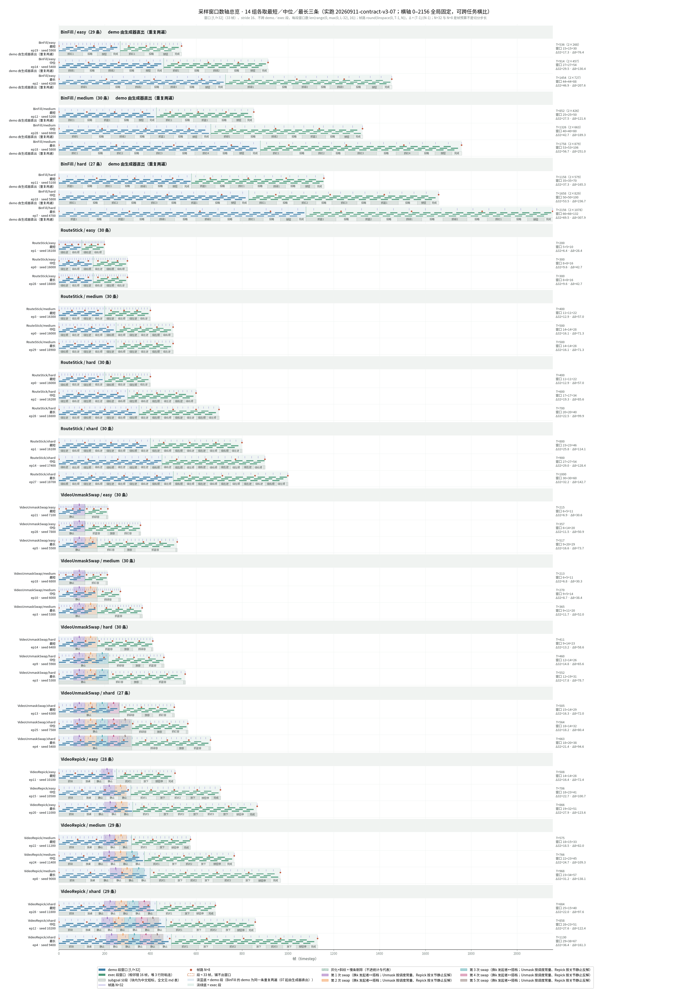

# 采样窗口数轴：14 组实跑轨迹上 motion 窗口、subgoal 分段与两条帧路怎么排布

> 数据：`20260911-contract-v3-07` 一次实跑（契约 v3 与 06 逐条相同，`OLD_GROUPS_EQUIVALENCE compared=1400 differences=0`），14 组 × ep0～29 = 420 条计划，双卡各 20 worker，单条墙钟上限 600 秒（pebble 单任务超时，超时条记 `failure_class="timeout"`），BinFill 三组的 h5 由生成器直出「同一条重复两遍」的 demo（前半 `is_video_demo=True`）。05（旧 11 组）与 06（3 个 xhard 组）作为历史对照不再合并进图表。JSON 里每条行记 `run_id`、`group_sources` 记每组来源运行。每条的总帧数 T 取 `episode_results.jsonl` 的 `timestep_count`，demo 段长度取 h5 里 `info/is_video_demo` 为 True 的前缀，subgoal 分段按 `info/is_subgoal_boundary` 切、标签取 `info/simple_subgoal`（`RobommeRecordWrapper.step` 写入，边界由 `current_task_index` 变化判定）。抽出来的每条 T／demo／分段落在本目录 [windows_timeline.json](windows_timeline.json)（入库，clone 后不必重开 h5）。
> 只画**成功**的条：跑失败（规划失败、进程池崩溃）或 h5 截断的条登记在 JSON 的 `failed_rows` / `skipped` 与第三节汇总表的「跳过／失败」列，不补跑、不补估。**慢条剔除**（2026-09-11 用户定「慢条『单段大于 400 帧』或『T 大于组中位 2 倍』这两个都加」）：成功条里任一命中 `单段 > 400 帧` 或 `T > 组中位 × 2`（组中位按剔除前算，一次性判定；BinFill 按后一遍原 T 判）的条从统计、代表与总览里移出，只在分组图里灰化＋斜纹画出，逐条列在第三节末尾「剔除的慢条」表供复核；**只剔统计，不删 h5**。
> 画法与上一会话的 artifact「采样窗口与 eval 成功率」逐字一致，本文档只落 md 与 PNG，不发布 artifact（用户要求）。PNG 放本目录 `figures/`，除总览图 `figures/windows_overview.png`（2026-09-12 用户要求入库）外已 gitignore 不入库，clone 后先跑出图命令再看其余链接。
>
> 三条命令（都只读）：
> - 抽轨迹：`uv run python scripts/injection-before-2d/window_timeline.py extract --rollout-run-id 20260911-contract-v3-07`（逗号分隔可传多个运行，后者覆盖前者的同 key 行）（约 3 分钟：每帧读三个标量，两个视频任务另读 `obs/joint_state` 与 demo 段的 `obs/front_rgb` 反解／校验 swap），成功打 `WINDOWS_EXTRACT=PASS groups=14 episodes=… skipped=… failed_rows=… unknown_labels=0 swap_episodes=… swap_fail=0 swap_warn=0 swap_pixel_adjusted=… excluded_slow=…`；
> - 出图：`uv run python scripts/injection-before-2d/plot_sampling_windows.py`，14 组各一张 `4_windows.png` + 一张总览，成功打 `WINDOWS_PLOT=PASS groups=14 files=15`；
> - 第三节自动表：`uv run python scripts/injection-before-2d/window_timeline.py tables --write`（`--check` 只比对），`check_doc_links.py` 一并核本文档的链接、张数与表是否漂移。

## 一、公式与读法

- **窗口**：`[f, f+32]`（33 帧），stride 16，**不跨 demo／exec 段**——demo 与 exec 各自从段起点铺，每段窗口数 `len(range(0, max(0, L-32), 16))`（`window_timeline.py::window_starts`）；一条 episode 的 motion token 数 = demo 窗口 + exec 窗口。段不足 33 帧铺不出窗口，图上画虚线空框，表里标「无 motion token」。
- **帧路**：`round(linspace(0, T-1, N))`，Δ = `(T-1)/(N-1)`；N=32 与 N=8 是帧预算（`512 // (16×1)` 与 `128 // (16×1)`），**不是**切分步长（`window_timeline.py::frame_path`，四舍五入用 `floor(x+0.5)` 与 JS `Math.round` 一致）。
- **demo 段**：RouteStick 是「先演示一遍再执行一遍」，demo 恰为前半（每段固定 50 帧，T = 100·L）；VideoUnmaskSwap 的 demo 只有一段 `static`（机械臂静止旁观容器互换）；VideoRepick 的 demo 是 `pick up the cube`、`drop the cube on the table`、若干 `static`。
- **BinFill 模拟 demo**（2026-09-11 用户要求「binfill任务改为加入模拟的demo 即为把一个任务重复两遍」，随后选定路线 B「在这里直接生成模拟demo的h5」）：BinFill 原本没有 demo（`BinFill.py` 的 task_list 全部 `demonstration=False`，`src/robomme` 未改）。07 起由生成入口在录像器 `close()` 之后直出：h5 的 `timestep_0..N-1` 是原轨迹复制（`is_video_demo=True`）、`timestep_N..2N-1` 是原轨迹，视频前一遍加红框（`generate_dataset_newseed.py::_binfill_demo_deliverable`，细节见 [../NEW_VALUE_INJECTION_PIPELINE.md](../NEW_VALUE_INJECTION_PIPELINE.md) 第二节第 5 条）。数轴脚本读到 `demo == T/2` 的 BinFill 条就原样使用（`demo_source="recorded"`）；只有旧 05 那种 `demo == 0` 的条才在统计层用 `window_timeline.py::simulate_binfill_demo` 复制一遍（`demo_source="simulated"`）。两种来源的 T 列都写成 `2×原 T`。
- **数轴演示**（RouteStick/easy，T=300、demo=150）：demo 段 `range(0, 118, 16)` → 0, 16, …, 112 共 8 个窗口，exec 段同样 8 个，motion token = 16；Δ32 = 299/31 = 9.6，Δ8 = 299/7 = 42.7。对拍锚点：artifact 里 RouteStick easy 最短（T=200、demo 100）为 5+5=10、Δ32=6.4、Δ8=28.4，本脚本对 T=200 的条得到同样三个数。
- **BinFill 演示**（若原 T=678、8 段）：模拟后 T'=1356、demo=678，两段各 `range(0, 646, 16)` = 41 个窗口，合计 82；Δ32 = 1355/31 = 43.7。

**一行怎么看**（从上到下）：紫细线 = N=32 帧路，红点 = N=8 帧路；中间三行细条 = 窗口（demo 蓝、exec 绿，相邻错 16 帧、堆三行免得粘连，同一行内起点差 48 > 33 能逐个数清）；底部交替灰块 = subgoal 分段，块够宽写中文短标（抓蓝1 = pick up the first blue cube、投箱 = put it into the bin、按钮 = press the button、绕左逆 = move to the nearest left target … counterclockwise、静止 = static、抓红容 = pick up the container that hides the red cube、放容 = put down the container、抓块 = pick up the cube、放桌 = drop the cube on the table、抓对1 = pick up the correct cube for the first time、放下 = put it down、按钮停 = press the button to finish、完成 = All tasks completed），不够宽退到首字，全文见第三节的「段序列」列；行底色淡蓝 = demo 段、淡绿 = exec 段；两个视频任务里贯穿整行的半透明竖带 = 每一次 swap（第 1／2／3 次紫／橙／青，顶部小字「换k 发起者↔搭档」，校验不过画成虚线空框）；右栏 `T · 窗口 d+e=n · Δ32 · Δ8`。

### swap 事件怎么标（2026-09-11 用户要求「videounmaskswap和videorepick的swap事件能标出来吗」）

h5 里没有任何字段记 swap 时刻：整个 demo 段 `info/simple_subgoal` 是同一个 `static`、`is_subgoal_boundary` 只在段首为真、`action/*` 是保持动作、`obs/eef_state` 在 demo 段逐维偏差恒 0。两个任务的来源不同：

- **VideoUnmaskSwap：调度常量，精确**。`VideoUnmaskSwap.py::_refresh_swap_schedule` 把第 k 次 swap 写死为 `[64 + 50(k−1), 64 + 50k]`（帧 0–31 容器被移走、32 落回、32–63 静置、64 起交换，swap 之间无间隔，`utils/statechange.py::swap_flat_two_lane` 做 smoothstep 插值、到 `end_step` 直接 `set_pose` 终位姿）；`n_swaps` 与发起者↔搭档取冻结规格 `specs/VideoUnmaskSwap/<难度>.json` 的 `objects.n_swaps`、`actions.swap_pairs`。demo 段长 = `6·ceil((64+50n)/6)` = 114／168／216（`solve_hold_obj` 每轮 `open_gripper` 走 6 步）。⚠ n=1 时结束帧 114 是 demo 后第一帧，竖带压出 demo 边界 1 帧，属实。校验：`obs/front_rgb` 帧间像素差在 `[40, demo−1]` 内第一次超阈值的帧必须是 64（方块被藏起、交换开始）；n ≥ 2 时最后一次超阈值的帧必须是 `64 + 50n`（最后一次 swap 落定的尖峰）。
- **VideoRepick：没有闭式公式，用关节静止法反解**（用户建议「用 solve_reset 并 hold(20) 的 joint angle 辅助判定」）。demo 的 task_list 是 `pick up the cube`、`drop the cube on the table`、一个热身 `static`（`solve_reset` + `hold(20)`）、`n_swaps` 个 swap-`static`（各 `hold(50)`，实际 54 帧）；`VideoRepick.py::step` 在 `specialflag == "swap"` 首次出现时闩锁 `start_step = elapsed_steps` 并 `_refresh_swap_schedule(start_step)`，之后每 50 帧一次首尾相接。起点 S = 抓取段 + 放下段 + 复位耗时 + 判静 20 帧，前三项是 planner 在该 seed 几何下实际规划出来的帧数，规格里没有。**S 也不等于 h5 的 static 段边界**：`utils/subgoal_evaluate_func.py::sequential_task_check` 有在线指针（`func()` 为真即推进，`current_task_specialflag` 随之刷新）与录制指针（只在两次 solve 之间 `evaluate(solve_complete_eval=True)` 时更新，h5 的 `is_subgoal_boundary` 用它）两套，热身段 `static_check(20)` 满足后在线指针先切到 swap-static 并闩锁 S，h5 段边界要等热身 solve 返回才切，实测 B1 − S = 12～17（B1 = 第一个 swap-static 段起始帧），且段 54 帧 vs 窗口 50 帧、每多一次 swap 再错 4 帧。反解：`static_check` 的静止判据是 `is_static`（7 个关节 `max|qvel| ≤ 0.2 rad/s`，不静止即重新计数），h5 每帧有 `obs/joint_state`，用相邻帧差分近似 qvel，阈值 0.2 × 0.05 s = 0.01 rad/帧（控制 20 Hz）；从热身段起找第一个 t 使 `t..t+19` 每帧 `max|Δq| ≤ 0.01`，`S = t + 20`（`window_timeline.py::static_start_from_deltas`）。演示（easy ep2，n=2，static 段 165–218／219–272／273–326）：复位运动 171～182 帧每帧位移 0.011～0.022 rad（计数一直被重置），183 帧起 ≤ 0.0086 并保持静止，S = 203，窗口 `[203,253]`、`[253,303]`，B1 − S = 16。交叉校验与并用：像素差只在机械臂已静止的 `[S−5, demo−1]` 内算（把复位运动算进去会淹掉真正的信号），VideoRepick 最后一次 swap 结束时没有跳变（smoothstep 收尾帧差只有两千级），但之后画面冻结、帧差严格为 0，所以取最后一个帧差 > 100 的帧 E，`S_pix = E − 50n`。05 实测 57 条：49 条 `S_pix == S_joint`，8 条差 1 帧（首个「静止」帧的关节位移 0.0097～0.0102 rad 正卡在 0.01 阈值边缘，有限差分与仿真器内部 qvel 在这里差一帧，两个方向都有），画面冻结没有歧义，所以差 ≤ 1 帧时以像素法为准、两个值都记进 JSON 与表；差 > 1 帧才判 FAIL（实测 0 条）。B1 − S 不在 [5, 30] 记 WARN（实测全部落在 12～17）。

第三节两个视频任务的表多一列「swap 起止帧」，VideoRepick 附「关节法 S、像素法 S、B1−S」；校验不过的行前置 ⚠。VideoUnmaskSwap 90 条校验全过（首变帧全是 64，n ≥ 2 的结束帧全等于 64+50n）。

## 二、图

- **总览**（对应 artifact 默认「全部」视图）：14 组各取最短／中位／最长三条（按 T 排序取首、`n//2`、末），42 行共用一根全局横轴，可跨任务横比：

- **每组全量**：该组全部成功条各一行、按 T 升序，横轴在同任务各档间固定（BinFill 取模拟后的 2T）：

| 组 | 图 4 采样窗口数轴 |
|---|---|
| BinFill/easy | [图 4](figures/BinFill/easy/4_windows.png) |
| BinFill/medium | [图 4](figures/BinFill/medium/4_windows.png) |
| BinFill/hard | [图 4](figures/BinFill/hard/4_windows.png) |
| RouteStick/easy | [图 4](figures/RouteStick/easy/4_windows.png) |
| RouteStick/medium | [图 4](figures/RouteStick/medium/4_windows.png) |
| RouteStick/hard | [图 4](figures/RouteStick/hard/4_windows.png) |
| RouteStick/xhard | [图 4](figures/RouteStick/xhard/4_windows.png) |
| VideoUnmaskSwap/easy | [图 4](figures/VideoUnmaskSwap/easy/4_windows.png) |
| VideoUnmaskSwap/medium | [图 4](figures/VideoUnmaskSwap/medium/4_windows.png) |
| VideoUnmaskSwap/hard | [图 4](figures/VideoUnmaskSwap/hard/4_windows.png) |
| VideoUnmaskSwap/xhard | [图 4](figures/VideoUnmaskSwap/xhard/4_windows.png) |
| VideoRepick/easy | [图 4](figures/VideoRepick/easy/4_windows.png) |
| VideoRepick/medium | [图 4](figures/VideoRepick/medium/4_windows.png) |
| VideoRepick/xhard | [图 4](figures/VideoRepick/xhard/4_windows.png) |

## 三、逐条数字

先 14 组汇总，再每组逐条：`ep | seed | T | demo | 段数 | 窗口 demo+exec=合计 | Δ32 | Δ8 | 段序列`，两个视频任务再加一列 `swap 起止帧（发起者↔搭档）`。段序列写「短标 帧数」，`‖` 标 demo→exec 的切换点。下面的表由 `window_timeline.py tables --write` 自动生成并写入两条标记之间，手改会被 `check_doc_links.py` 判 `window_tables=FAIL`。

<!-- AUTO:WINDOW_TABLES BEGIN -->
### 汇总（每组：条数、T、demo 长度、motion token 数）

| 组 | 条数 | T 最短 / 中位 / 最长 | demo 最短 / 中位 / 最长 | 窗口 最少 / 中位 / 最多 | 铺不出窗口 | 跳过／失败 | 慢条剔除 |
|---|---|---|---|---|---|---|---|
| BinFill/easy（demo 由生成器直出（重复两遍）） | 29 | 536 / 914 / 1454 | 268 / 457 / 727 | 30 / 54 / 88 | 0 | 1 | 0 |
| BinFill/medium（demo 由生成器直出（重复两遍）） | 30 | 852 / 1301 / 1758 | 426 / 650.5 / 879 | 50 / 78 / 106 | 0 | 0 | 0 |
| BinFill/hard（demo 由生成器直出（重复两遍）） | 27 | 1158 / 1658 / 2156 | 579 / 829 / 1078 | 70 / 100 / 132 | 0 | 3 | 0 |
| RouteStick/easy | 30 | 200 / 250 / 300 | 100 / 125 / 150 | 10 / 13 / 16 | 0 | 0 | 0 |
| RouteStick/medium | 30 | 400 / 450 / 500 | 200 / 225 / 250 | 22 / 25 / 28 | 0 | 0 | 0 |
| RouteStick/hard | 30 | 400 / 600 / 700 | 200 / 300 / 350 | 22 / 34 / 40 | 0 | 0 | 0 |
| RouteStick/xhard | 30 | 800 / 900 / 1000 | 400 / 450 / 500 | 46 / 54 / 60 | 0 | 0 | 0 |
| VideoUnmaskSwap/easy | 30 | 215 / 346 / 517 | 114 / 141 / 168 | 11 / 19 / 29 | 0 | 0 | 0 |
| VideoUnmaskSwap/medium | 30 | 213 / 269 / 365 | 114 / 141 / 168 | 11 / 14 / 20 | 0 | 0 | 0 |
| VideoUnmaskSwap/hard | 30 | 411 / 457.5 / 552 | 168 / 192 / 216 | 23 / 25.5 / 31 | 0 | 0 | 0 |
| VideoUnmaskSwap/xhard | 27 | 505 / 564 / 663 | 264 / 264 / 318 | 29 / 32 / 38 | 0 | 2 | 1 |
| VideoRepick/easy | 28 | 508 / 704 / 866 | 252 / 303.5 / 349 | 28 / 41 / 51 | 0 | 2 | 0 |
| VideoRepick/medium | 29 | 575 / 766 / 968 | 306 / 348 / 398 | 33 / 45 / 57 | 0 | 1 | 0 |
| VideoRepick/xhard | 29 | 684 / 858 / 1130 | 420 / 468 / 492 | 40 / 51 / 67 | 0 | 1 | 0 |

### BinFill / easy（29 条；demo 由生成器直出（重复两遍），T = 2×原 T）

| ep | seed | T | demo | 段数 | 窗口 demo+exec=合计 | Δ32 | Δ8 | 段序列（短标 帧数，‖ = demo→exec） |
|---|---|---|---|---|---|---|---|---|
| 0 | 4000 | 1356 = 2×678 | 678 | 16 | 41+41=82 | 43.7 | 193.6 | 抓蓝1 130 · 投箱 70 · 抓蓝2 156 · 投箱 51 · 抓蓝3 86 · 投箱 67 · 按钮 77 · 完成 41 ‖ 抓蓝1 130 · 投箱 70 · 抓蓝2 156 · 投箱 51 · 抓蓝3 86 · 投箱 67 · 按钮 77 · 完成 41 |
| 1 | 4100 | 724 = 2×362 | 362 | 8 | 21+21=42 | 23.3 | 103.3 | 抓红1 198 · 投箱 74 · 按钮 54 · 完成 36 ‖ 抓红1 198 · 投箱 74 · 按钮 54 · 完成 36 |
| 2 | 4200 | 1454 = 2×727 | 727 | 16 | 44+44=88 | 46.9 | 207.6 | 抓绿1 221 · 投箱 74 · 抓绿2 104 · 投箱 57 · 抓绿3 91 · 投箱 68 · 按钮 70 · 完成 42 ‖ 抓绿1 221 · 投箱 74 · 抓绿2 104 · 投箱 57 · 抓绿3 91 · 投箱 68 · 按钮 70 · 完成 42 |
| 3 | 4300 | 634 = 2×317 | 317 | 8 | 18+18=36 | 20.4 | 90.4 | 抓蓝1 185 · 投箱 54 · 按钮 44 · 完成 34 ‖ 抓蓝1 185 · 投箱 54 · 按钮 44 · 完成 34 |
| 4 | 4400 | 690 = 2×345 | 345 | 8 | 20+20=40 | 22.2 | 98.4 | 抓红1 187 · 投箱 62 · 按钮 56 · 完成 40 ‖ 抓红1 187 · 投箱 62 · 按钮 56 · 完成 40 |
| 5 | 4500 | 1360 = 2×680 | 680 | 16 | 41+41=82 | 43.8 | 194.1 | 抓红1 183 · 投箱 57 · 抓红2 98 · 投箱 80 · 抓红3 86 · 投箱 77 · 按钮 61 · 完成 38 ‖ 抓红1 183 · 投箱 57 · 抓红2 98 · 投箱 80 · 抓红3 86 · 投箱 77 · 按钮 61 · 完成 38 |
| 6 | 4600 | 912 = 2×456 | 456 | 12 | 27+27=54 | 29.4 | 130.1 | 抓蓝1 113 · 投箱 70 · 抓蓝2 96 · 投箱 73 · 按钮 63 · 完成 41 ‖ 抓蓝1 113 · 投箱 70 · 抓蓝2 96 · 投箱 73 · 按钮 63 · 完成 41 |
| 7 | 4700 | 896 = 2×448 | 448 | 12 | 26+26=52 | 28.9 | 127.9 | 抓绿1 119 · 投箱 75 · 抓绿2 84 · 投箱 72 · 按钮 63 · 完成 35 ‖ 抓绿1 119 · 投箱 75 · 抓绿2 84 · 投箱 72 · 按钮 63 · 完成 35 |
| 8 | 4800 | 940 = 2×470 | 470 | 12 | 28+28=56 | 30.3 | 134.1 | 抓绿1 116 · 投箱 70 · 抓绿2 113 · 投箱 83 · 按钮 54 · 完成 34 ‖ 抓绿1 116 · 投箱 70 · 抓绿2 113 · 投箱 83 · 按钮 54 · 完成 34 |
| 9 | 4900 | 1378 = 2×689 | 689 | 16 | 42+42=84 | 44.4 | 196.7 | 抓红1 114 · 投箱 81 · 抓红2 98 · 投箱 73 · 抓红3 107 · 投箱 86 · 按钮 91 · 完成 39 ‖ 抓红1 114 · 投箱 81 · 抓红2 98 · 投箱 73 · 抓红3 107 · 投箱 86 · 按钮 91 · 完成 39 |
| 11 | 5100 | 602 = 2×301 | 301 | 8 | 17+17=34 | 19.4 | 85.9 | 抓蓝1 110 · 投箱 80 · 按钮 73 · 完成 38 ‖ 抓蓝1 110 · 投箱 80 · 按钮 73 · 完成 38 |
| 12 | 5200 | 600 = 2×300 | 300 | 8 | 17+17=34 | 19.3 | 85.6 | 抓绿1 119 · 投箱 79 · 按钮 65 · 完成 37 ‖ 抓绿1 119 · 投箱 79 · 按钮 65 · 完成 37 |
| 13 | 5300 | 1068 = 2×534 | 534 | 12 | 32+32=64 | 34.4 | 152.4 | 抓绿1 151 · 投箱 70 · 抓绿2 111 · 投箱 68 · 按钮 97 · 完成 37 ‖ 抓绿1 151 · 投箱 70 · 抓绿2 111 · 投箱 68 · 按钮 97 · 完成 37 |
| 14 | 5400 | 914 = 2×457 | 457 | 12 | 27+27=54 | 29.5 | 130.4 | 抓绿1 110 · 投箱 71 · 抓绿2 99 · 投箱 78 · 按钮 65 · 完成 34 ‖ 抓绿1 110 · 投箱 71 · 抓绿2 99 · 投箱 78 · 按钮 65 · 完成 34 |
| 15 | 5500 | 1248 = 2×624 | 624 | 16 | 37+37=74 | 40.2 | 178.1 | 抓蓝1 123 · 投箱 73 · 抓蓝2 91 · 投箱 59 · 抓蓝3 114 · 投箱 65 · 按钮 63 · 完成 36 ‖ 抓蓝1 123 · 投箱 73 · 抓蓝2 91 · 投箱 59 · 抓蓝3 114 · 投箱 65 · 按钮 63 · 完成 36 |
| 16 | 5600 | 564 = 2×282 | 282 | 8 | 16+16=32 | 18.2 | 80.4 | 抓蓝1 104 · 投箱 72 · 按钮 67 · 完成 39 ‖ 抓蓝1 104 · 投箱 72 · 按钮 67 · 完成 39 |
| 17 | 5700 | 862 = 2×431 | 431 | 12 | 25+25=50 | 27.8 | 123.0 | 抓红1 116 · 投箱 62 · 抓红2 102 · 投箱 59 · 按钮 55 · 完成 37 ‖ 抓红1 116 · 投箱 62 · 抓红2 102 · 投箱 59 · 按钮 55 · 完成 37 |
| 18 | 5800 | 970 = 2×485 | 485 | 12 | 29+29=58 | 31.3 | 138.4 | 抓红1 111 · 投箱 66 · 抓红2 135 · 投箱 84 · 按钮 56 · 完成 33 ‖ 抓红1 111 · 投箱 66 · 抓红2 135 · 投箱 84 · 按钮 56 · 完成 33 |
| 19 | 5900 | 536 = 2×268 | 268 | 8 | 15+15=30 | 17.3 | 76.4 | 抓红1 104 · 投箱 64 · 按钮 61 · 完成 39 ‖ 抓红1 104 · 投箱 64 · 按钮 61 · 完成 39 |
| 20 | 6000 | 1180 = 2×590 | 590 | 16 | 35+35=70 | 38.0 | 168.4 | 抓绿1 113 · 投箱 59 · 抓绿2 107 · 投箱 62 · 抓绿3 110 · 投箱 56 · 按钮 48 · 完成 35 ‖ 抓绿1 113 · 投箱 59 · 抓绿2 107 · 投箱 62 · 抓绿3 110 · 投箱 56 · 按钮 48 · 完成 35 |
| 21 | 6100 | 608 = 2×304 | 304 | 8 | 17+17=34 | 19.6 | 86.7 | 抓蓝1 105 · 投箱 70 · 按钮 86 · 完成 43 ‖ 抓蓝1 105 · 投箱 70 · 按钮 86 · 完成 43 |
| 22 | 6200 | 1170 = 2×585 | 585 | 16 | 35+35=70 | 37.7 | 167.0 | 抓绿1 120 · 投箱 67 · 抓绿2 95 · 投箱 63 · 抓绿3 86 · 投箱 60 · 按钮 58 · 完成 36 ‖ 抓绿1 120 · 投箱 67 · 抓绿2 95 · 投箱 63 · 抓绿3 86 · 投箱 60 · 按钮 58 · 完成 36 |
| 23 | 6300 | 576 = 2×288 | 288 | 8 | 16+16=32 | 18.5 | 82.1 | 抓红1 114 · 投箱 76 · 按钮 63 · 完成 35 ‖ 抓红1 114 · 投箱 76 · 按钮 63 · 完成 35 |
| 24 | 6400 | 860 = 2×430 | 430 | 12 | 25+25=50 | 27.7 | 122.7 | 抓蓝1 107 · 投箱 64 · 抓蓝2 88 · 投箱 66 · 按钮 62 · 完成 43 ‖ 抓蓝1 107 · 投箱 64 · 抓蓝2 88 · 投箱 66 · 按钮 62 · 完成 43 |
| 25 | 6500 | 1304 = 2×652 | 652 | 16 | 39+39=78 | 42.0 | 186.1 | 抓红1 103 · 投箱 74 · 抓红2 79 · 投箱 64 · 抓红3 135 · 投箱 90 · 按钮 67 · 完成 40 ‖ 抓红1 103 · 投箱 74 · 抓红2 79 · 投箱 64 · 抓红3 135 · 投箱 90 · 按钮 67 · 完成 40 |
| 26 | 6600 | 972 = 2×486 | 486 | 12 | 29+29=58 | 31.3 | 138.7 | 抓蓝1 116 · 投箱 74 · 抓蓝2 118 · 投箱 82 · 按钮 61 · 完成 35 ‖ 抓蓝1 116 · 投箱 74 · 抓蓝2 118 · 投箱 82 · 按钮 61 · 完成 35 |
| 27 | 6700 | 546 = 2×273 | 273 | 8 | 16+16=32 | 17.6 | 77.9 | 抓绿1 104 · 投箱 66 · 按钮 63 · 完成 40 ‖ 抓绿1 104 · 投箱 66 · 按钮 63 · 完成 40 |
| 28 | 6800 | 1186 = 2×593 | 593 | 16 | 36+36=72 | 38.2 | 169.3 | 抓绿1 110 · 投箱 60 · 抓绿2 104 · 投箱 69 · 抓绿3 84 · 投箱 66 · 按钮 61 · 完成 39 ‖ 抓绿1 110 · 投箱 60 · 抓绿2 104 · 投箱 69 · 抓绿3 84 · 投箱 66 · 按钮 61 · 完成 39 |
| 29 | 6900 | 1256 = 2×628 | 628 | 16 | 38+38=76 | 40.5 | 179.3 | 抓蓝1 116 · 投箱 78 · 抓蓝2 105 · 投箱 65 · 抓蓝3 95 · 投箱 66 · 按钮 65 · 完成 38 ‖ 抓蓝1 116 · 投箱 78 · 抓蓝2 105 · 投箱 65 · 抓蓝3 95 · 投箱 66 · 按钮 65 · 完成 38 |

### BinFill / medium（30 条；demo 由生成器直出（重复两遍），T = 2×原 T）

| ep | seed | T | demo | 段数 | 窗口 demo+exec=合计 | Δ32 | Δ8 | 段序列（短标 帧数，‖ = demo→exec） |
|---|---|---|---|---|---|---|---|---|
| 0 | 4000 | 1050 = 2×525 | 525 | 12 | 31+31=62 | 33.8 | 149.9 | 抓绿1 167 · 投箱 65 · 抓绿2 94 · 投箱 62 · 按钮 86 · 完成 51 ‖ 抓绿1 167 · 投箱 65 · 抓绿2 94 · 投箱 62 · 按钮 86 · 完成 51 |
| 1 | 4100 | 1388 = 2×694 | 694 | 16 | 42+42=84 | 44.7 | 198.1 | 抓蓝1 138 · 投箱 74 · 抓蓝2 159 · 投箱 78 · 抓绿1 86 · 投箱 57 · 按钮 65 · 完成 37 ‖ 抓蓝1 138 · 投箱 74 · 抓蓝2 159 · 投箱 78 · 抓绿1 86 · 投箱 57 · 按钮 65 · 完成 37 |
| 2 | 4200 | 1632 = 2×816 | 816 | 20 | 49+49=98 | 52.6 | 233.0 | 抓蓝1 110 · 投箱 67 · 抓蓝2 114 · 投箱 73 · 抓蓝3 156 · 投箱 54 · 抓蓝4 102 · 投箱 59 · 按钮 48 · 完成 33 ‖ 抓蓝1 110 · 投箱 67 · 抓蓝2 114 · 投箱 73 · 抓蓝3 156 · 投箱 54 · 抓蓝4 102 · 投箱 59 · 按钮 48 · 完成 33 |
| 3 | 4300 | 1704 = 2×852 | 852 | 20 | 52+52=104 | 54.9 | 243.3 | 抓蓝1 107 · 投箱 61 · 抓蓝2 107 · 投箱 85 · 抓绿1 87 · 投箱 72 · 抓绿2 162 · 投箱 67 · 按钮 62 · 完成 42 ‖ 抓蓝1 107 · 投箱 61 · 抓蓝2 107 · 投箱 85 · 抓绿1 87 · 投箱 72 · 抓绿2 162 · 投箱 67 · 按钮 62 · 完成 42 |
| 4 | 4400 | 1058 = 2×529 | 529 | 12 | 32+32=64 | 34.1 | 151.0 | 抓红1 118 · 投箱 67 · 抓红2 195 · 投箱 60 · 按钮 52 · 完成 37 ‖ 抓红1 118 · 投箱 67 · 抓红2 195 · 投箱 60 · 按钮 52 · 完成 37 |
| 5 | 4500 | 1622 = 2×811 | 811 | 16 | 49+49=98 | 52.3 | 231.6 | 抓红1 235 · 投箱 92 · 抓红2 108 · 投箱 77 · 抓红3 104 · 投箱 84 · 按钮 77 · 完成 34 ‖ 抓红1 235 · 投箱 92 · 抓红2 108 · 投箱 77 · 抓红3 104 · 投箱 84 · 按钮 77 · 完成 34 |
| 6 | 4600 | 938 = 2×469 | 469 | 12 | 28+28=56 | 30.2 | 133.9 | 抓绿1 129 · 投箱 75 · 抓红1 107 · 投箱 65 · 按钮 59 · 完成 34 ‖ 抓绿1 129 · 投箱 75 · 抓红1 107 · 投箱 65 · 按钮 59 · 完成 34 |
| 7 | 4700 | 1382 = 2×691 | 691 | 16 | 42+42=84 | 44.5 | 197.3 | 抓绿1 113 · 投箱 77 · 抓红1 112 · 投箱 76 · 抓红2 111 · 投箱 81 · 按钮 81 · 完成 40 ‖ 抓绿1 113 · 投箱 77 · 抓红1 112 · 投箱 76 · 抓红2 111 · 投箱 81 · 按钮 81 · 完成 40 |
| 8 | 4800 | 1692 = 2×846 | 846 | 20 | 51+51=102 | 54.5 | 241.6 | 抓绿1 116 · 投箱 77 · 抓绿2 92 · 投箱 72 · 抓绿3 88 · 投箱 77 · 抓绿4 120 · 投箱 87 · 按钮 80 · 完成 37 ‖ 抓绿1 116 · 投箱 77 · 抓绿2 92 · 投箱 72 · 抓绿3 88 · 投箱 77 · 抓绿4 120 · 投箱 87 · 按钮 80 · 完成 37 |
| 9 | 4900 | 914 = 2×457 | 457 | 12 | 27+27=54 | 29.5 | 130.4 | 抓蓝1 120 · 投箱 75 · 抓红1 85 · 投箱 67 · 按钮 68 · 完成 42 ‖ 抓蓝1 120 · 投箱 75 · 抓红1 85 · 投箱 67 · 按钮 68 · 完成 42 |
| 10 | 5000 | 1276 = 2×638 | 638 | 16 | 38+38=76 | 41.1 | 182.1 | 抓绿1 119 · 投箱 69 · 抓绿2 104 · 投箱 69 · 抓蓝1 95 · 投箱 61 · 按钮 84 · 完成 37 ‖ 抓绿1 119 · 投箱 69 · 抓绿2 104 · 投箱 69 · 抓蓝1 95 · 投箱 61 · 按钮 84 · 完成 37 |
| 11 | 5100 | 1536 = 2×768 | 768 | 20 | 46+46=92 | 49.5 | 219.3 | 抓蓝1 116 · 投箱 62 · 抓蓝2 98 · 投箱 65 · 抓蓝3 98 · 投箱 68 · 抓蓝4 96 · 投箱 60 · 按钮 63 · 完成 42 ‖ 抓蓝1 116 · 投箱 62 · 抓蓝2 98 · 投箱 65 · 抓蓝3 98 · 投箱 68 · 抓蓝4 96 · 投箱 60 · 按钮 63 · 完成 42 |
| 12 | 5200 | 852 = 2×426 | 426 | 12 | 25+25=50 | 27.5 | 121.6 | 抓红1 110 · 投箱 51 · 抓蓝1 101 · 投箱 68 · 按钮 59 · 完成 37 ‖ 抓红1 110 · 投箱 51 · 抓蓝1 101 · 投箱 68 · 按钮 59 · 完成 37 |
| 13 | 5300 | 1584 = 2×792 | 792 | 20 | 48+48=96 | 51.1 | 226.1 | 抓红1 110 · 投箱 75 · 抓红2 103 · 投箱 85 · 抓红3 93 · 投箱 71 · 抓红4 84 · 投箱 76 · 按钮 60 · 完成 35 ‖ 抓红1 110 · 投箱 75 · 抓红2 103 · 投箱 85 · 抓红3 93 · 投箱 71 · 抓红4 84 · 投箱 76 · 按钮 60 · 完成 35 |
| 14 | 5400 | 1604 = 2×802 | 802 | 20 | 49+49=98 | 51.7 | 229.0 | 抓绿1 106 · 投箱 65 · 抓绿2 118 · 投箱 87 · 抓绿3 85 · 投箱 63 · 抓绿4 103 · 投箱 71 · 按钮 67 · 完成 37 ‖ 抓绿1 106 · 投箱 65 · 抓绿2 118 · 投箱 87 · 抓绿3 85 · 投箱 63 · 抓绿4 103 · 投箱 71 · 按钮 67 · 完成 37 |
| 15 | 5500 | 1156 = 2×578 | 578 | 16 | 35+35=70 | 37.3 | 165.0 | 抓绿1 119 · 投箱 65 · 抓红1 108 · 投箱 60 · 抓红2 87 · 投箱 50 · 按钮 50 · 完成 39 ‖ 抓绿1 119 · 投箱 65 · 抓红1 108 · 投箱 60 · 抓红2 87 · 投箱 50 · 按钮 50 · 完成 39 |
| 16 | 5600 | 1388 = 2×694 | 694 | 16 | 42+42=84 | 44.7 | 198.1 | 抓蓝1 102 · 投箱 78 · 抓蓝2 100 · 投箱 80 · 抓蓝3 132 · 投箱 101 · 按钮 66 · 完成 35 ‖ 抓蓝1 102 · 投箱 78 · 抓蓝2 100 · 投箱 80 · 抓蓝3 132 · 投箱 101 · 按钮 66 · 完成 35 |
| 17 | 5700 | 932 = 2×466 | 466 | 12 | 28+28=56 | 30.0 | 133.0 | 抓蓝1 113 · 投箱 66 · 抓绿1 120 · 投箱 72 · 按钮 58 · 完成 37 ‖ 抓蓝1 113 · 投箱 66 · 抓绿1 120 · 投箱 72 · 按钮 58 · 完成 37 |
| 18 | 5800 | 1758 = 2×879 | 879 | 20 | 53+53=106 | 56.7 | 251.0 | 抓红1 139 · 投箱 86 · 抓红2 85 · 投箱 60 · 抓红3 137 · 投箱 86 · 抓红4 97 · 投箱 72 · 按钮 74 · 完成 43 ‖ 抓红1 139 · 投箱 86 · 抓红2 85 · 投箱 60 · 抓红3 137 · 投箱 86 · 抓红4 97 · 投箱 72 · 按钮 74 · 完成 43 |
| 19 | 5900 | 1590 = 2×795 | 795 | 20 | 48+48=96 | 51.3 | 227.0 | 抓红1 121 · 投箱 77 · 抓红2 83 · 投箱 55 · 抓蓝1 98 · 投箱 59 · 抓蓝2 126 · 投箱 84 · 按钮 57 · 完成 35 ‖ 抓红1 121 · 投箱 77 · 抓红2 83 · 投箱 55 · 抓蓝1 98 · 投箱 59 · 抓蓝2 126 · 投箱 84 · 按钮 57 · 完成 35 |
| 20 | 6000 | 1260 = 2×630 | 630 | 16 | 38+38=76 | 40.6 | 179.9 | 抓绿1 116 · 投箱 67 · 抓绿2 108 · 投箱 65 · 抓绿3 91 · 投箱 61 · 按钮 80 · 完成 42 ‖ 抓绿1 116 · 投箱 67 · 抓绿2 108 · 投箱 65 · 抓绿3 91 · 投箱 61 · 按钮 80 · 完成 42 |
| 21 | 6100 | 1030 = 2×515 | 515 | 12 | 31+31=62 | 33.2 | 147.0 | 抓绿1 121 · 投箱 89 · 抓绿2 116 · 投箱 85 · 按钮 67 · 完成 37 ‖ 抓绿1 121 · 投箱 89 · 抓绿2 116 · 投箱 85 · 按钮 67 · 完成 37 |
| 22 | 6200 | 890 = 2×445 | 445 | 12 | 26+26=52 | 28.7 | 127.0 | 抓蓝1 114 · 投箱 65 · 抓蓝2 111 · 投箱 61 · 按钮 58 · 完成 36 ‖ 抓蓝1 114 · 投箱 65 · 抓蓝2 111 · 投箱 61 · 按钮 58 · 完成 36 |
| 23 | 6300 | 1092 = 2×546 | 546 | 12 | 33+33=66 | 35.2 | 155.9 | 抓红1 127 · 投箱 90 · 抓红2 122 · 投箱 88 · 按钮 76 · 完成 43 ‖ 抓红1 127 · 投箱 90 · 抓红2 122 · 投箱 88 · 按钮 76 · 完成 43 |
| 24 | 6400 | 934 = 2×467 | 467 | 12 | 28+28=56 | 30.1 | 133.3 | 抓绿1 104 · 投箱 64 · 抓绿2 129 · 投箱 79 · 按钮 51 · 完成 40 ‖ 抓绿1 104 · 投箱 64 · 抓绿2 129 · 投箱 79 · 按钮 51 · 完成 40 |
| 25 | 6500 | 1270 = 2×635 | 635 | 16 | 38+38=76 | 40.9 | 181.3 | 抓红1 105 · 投箱 59 · 抓蓝1 120 · 投箱 70 · 抓蓝2 115 · 投箱 70 · 按钮 54 · 完成 42 ‖ 抓红1 105 · 投箱 59 · 抓蓝1 120 · 投箱 70 · 抓蓝2 115 · 投箱 70 · 按钮 54 · 完成 42 |
| 26 | 6600 | 1548 = 2×774 | 774 | 20 | 47+47=94 | 49.9 | 221.0 | 抓蓝1 126 · 投箱 63 · 抓蓝2 89 · 投箱 64 · 抓蓝3 97 · 投箱 64 · 抓绿1 110 · 投箱 57 · 按钮 61 · 完成 43 ‖ 抓蓝1 126 · 投箱 63 · 抓蓝2 89 · 投箱 64 · 抓蓝3 97 · 投箱 64 · 抓绿1 110 · 投箱 57 · 按钮 61 · 完成 43 |
| 27 | 6700 | 1232 = 2×616 | 616 | 16 | 37+37=74 | 39.7 | 175.9 | 抓绿1 109 · 投箱 65 · 抓绿2 104 · 投箱 56 · 抓蓝1 117 · 投箱 75 · 按钮 55 · 完成 35 ‖ 抓绿1 109 · 投箱 65 · 抓绿2 104 · 投箱 56 · 抓蓝1 117 · 投箱 75 · 按钮 55 · 完成 35 |
| 28 | 6800 | 1326 = 2×663 | 663 | 16 | 40+40=80 | 42.7 | 189.3 | 抓绿1 143 · 投箱 85 · 抓绿2 102 · 投箱 69 · 抓蓝1 102 · 投箱 62 · 按钮 62 · 完成 38 ‖ 抓绿1 143 · 投箱 85 · 抓绿2 102 · 投箱 69 · 抓蓝1 102 · 投箱 62 · 按钮 62 · 完成 38 |
| 29 | 6900 | 1544 = 2×772 | 772 | 20 | 47+47=94 | 49.8 | 220.4 | 抓红1 105 · 投箱 67 · 抓红2 81 · 投箱 61 · 抓红3 106 · 投箱 75 · 抓绿1 96 · 投箱 79 · 按钮 66 · 完成 36 ‖ 抓红1 105 · 投箱 67 · 抓红2 81 · 投箱 61 · 抓红3 106 · 投箱 75 · 抓绿1 96 · 投箱 79 · 按钮 66 · 完成 36 |

### BinFill / hard（27 条；demo 由生成器直出（重复两遍），T = 2×原 T）

| ep | seed | T | demo | 段数 | 窗口 demo+exec=合计 | Δ32 | Δ8 | 段序列（短标 帧数，‖ = demo→exec） |
|---|---|---|---|---|---|---|---|---|
| 0 | 4000 | 1688 = 2×844 | 844 | 20 | 51+51=102 | 54.4 | 241.0 | 抓红1 104 · 投箱 70 · 抓红2 121 · 投箱 87 · 抓绿1 143 · 投箱 62 · 抓绿2 86 · 投箱 59 · 按钮 77 · 完成 35 ‖ 抓红1 104 · 投箱 70 · 抓红2 121 · 投箱 87 · 抓绿1 143 · 投箱 62 · 抓绿2 86 · 投箱 59 · 按钮 77 · 完成 35 |
| 1 | 4100 | 2078 = 2×1039 | 1039 | 24 | 63+63=126 | 67.0 | 296.7 | 抓蓝1 206 · 投箱 90 · 抓蓝2 83 · 投箱 61 · 抓绿1 85 · 投箱 69 · 抓红1 107 · 投箱 76 · 抓红2 83 · 投箱 68 · 按钮 69 · 完成 42 ‖ 抓蓝1 206 · 投箱 90 · 抓蓝2 83 · 投箱 61 · 抓绿1 85 · 投箱 69 · 抓红1 107 · 投箱 76 · 抓红2 83 · 投箱 68 · 按钮 69 · 完成 42 |
| 2 | 4200 | 1708 = 2×854 | 854 | 20 | 52+52=104 | 55.1 | 243.9 | 抓绿1 137 · 投箱 74 · 抓绿2 103 · 投箱 58 · 抓绿3 159 · 投箱 56 · 抓蓝1 106 · 投箱 61 · 按钮 63 · 完成 37 ‖ 抓绿1 137 · 投箱 74 · 抓绿2 103 · 投箱 58 · 抓绿3 159 · 投箱 56 · 抓蓝1 106 · 投箱 61 · 按钮 63 · 完成 37 |
| 3 | 4300 | 1360 = 2×680 | 680 | 16 | 41+41=82 | 43.8 | 194.1 | 抓红1 204 · 投箱 71 · 抓红2 100 · 投箱 55 · 抓蓝1 88 · 投箱 62 · 按钮 61 · 完成 39 ‖ 抓红1 204 · 投箱 71 · 抓红2 100 · 投箱 55 · 抓蓝1 88 · 投箱 62 · 按钮 61 · 完成 39 |
| 5 | 4500 | 1508 = 2×754 | 754 | 16 | 46+46=92 | 48.6 | 215.3 | 抓蓝1 235 · 投箱 76 · 抓蓝2 90 · 投箱 62 · 抓红1 118 · 投箱 70 · 按钮 65 · 完成 38 ‖ 抓蓝1 235 · 投箱 76 · 抓蓝2 90 · 投箱 62 · 抓红1 118 · 投箱 70 · 按钮 65 · 完成 38 |
| 6 | 4600 | 1260 = 2×630 | 630 | 16 | 38+38=76 | 40.6 | 179.9 | 抓蓝1 111 · 投箱 59 · 抓绿1 100 · 投箱 63 · 抓红1 120 · 投箱 72 · 按钮 67 · 完成 38 ‖ 抓蓝1 111 · 投箱 59 · 抓绿1 100 · 投箱 63 · 抓红1 120 · 投箱 72 · 按钮 67 · 完成 38 |
| 7 | 4700 | 2156 = 2×1078 | 1078 | 24 | 66+66=132 | 69.5 | 307.9 | 抓蓝1 131 · 投箱 91 · 抓蓝2 103 · 投箱 75 · 抓绿1 105 · 投箱 93 · 抓绿2 105 · 投箱 88 · 抓红1 101 · 投箱 75 · 按钮 73 · 完成 38 ‖ 抓蓝1 131 · 投箱 91 · 抓蓝2 103 · 投箱 75 · 抓绿1 105 · 投箱 93 · 抓绿2 105 · 投箱 88 · 抓红1 101 · 投箱 75 · 按钮 73 · 完成 38 |
| 8 | 4800 | 1952 = 2×976 | 976 | 24 | 59+59=118 | 62.9 | 278.7 | 抓红1 137 · 投箱 73 · 抓红2 100 · 投箱 63 · 抓绿1 119 · 投箱 75 · 抓绿2 94 · 投箱 65 · 抓蓝1 94 · 投箱 53 · 按钮 65 · 完成 38 ‖ 抓红1 137 · 投箱 73 · 抓红2 100 · 投箱 63 · 抓绿1 119 · 投箱 75 · 抓绿2 94 · 投箱 65 · 抓蓝1 94 · 投箱 53 · 按钮 65 · 完成 38 |
| 9 | 4900 | 1578 = 2×789 | 789 | 20 | 48+48=96 | 50.9 | 225.3 | 抓绿1 102 · 投箱 72 · 抓蓝1 112 · 投箱 78 · 抓蓝2 84 · 投箱 71 · 抓红1 96 · 投箱 70 · 按钮 66 · 完成 38 ‖ 抓绿1 102 · 投箱 72 · 抓蓝1 112 · 投箱 78 · 抓蓝2 84 · 投箱 71 · 抓红1 96 · 投箱 70 · 按钮 66 · 完成 38 |
| 10 | 5000 | 1960 = 2×980 | 980 | 24 | 60+60=120 | 63.2 | 279.9 | 抓绿1 125 · 投箱 76 · 抓红1 89 · 投箱 64 · 抓红2 84 · 投箱 60 · 抓红3 125 · 投箱 76 · 抓蓝1 115 · 投箱 73 · 按钮 54 · 完成 39 ‖ 抓绿1 125 · 投箱 76 · 抓红1 89 · 投箱 64 · 抓红2 84 · 投箱 60 · 抓红3 125 · 投箱 76 · 抓蓝1 115 · 投箱 73 · 按钮 54 · 完成 39 |
| 11 | 5100 | 1158 = 2×579 | 579 | 16 | 35+35=70 | 37.3 | 165.3 | 抓蓝1 103 · 投箱 65 · 抓红1 100 · 投箱 64 · 抓绿1 78 · 投箱 66 · 按钮 63 · 完成 40 ‖ 抓蓝1 103 · 投箱 65 · 抓红1 100 · 投箱 64 · 抓绿1 78 · 投箱 66 · 按钮 63 · 完成 40 |
| 12 | 5200 | 1722 = 2×861 | 861 | 20 | 52+52=104 | 55.5 | 245.9 | 抓绿1 106 · 投箱 70 · 抓绿2 109 · 投箱 92 · 抓绿3 99 · 投箱 64 · 抓蓝1 127 · 投箱 91 · 按钮 67 · 完成 36 ‖ 抓绿1 106 · 投箱 70 · 抓绿2 109 · 投箱 92 · 抓绿3 99 · 投箱 64 · 抓蓝1 127 · 投箱 91 · 按钮 67 · 完成 36 |
| 13 | 5300 | 1266 = 2×633 | 633 | 16 | 38+38=76 | 40.8 | 180.7 | 抓绿1 119 · 投箱 60 · 抓蓝1 84 · 投箱 62 · 抓蓝2 112 · 投箱 62 · 按钮 93 · 完成 41 ‖ 抓绿1 119 · 投箱 60 · 抓蓝1 84 · 投箱 62 · 抓蓝2 112 · 投箱 62 · 按钮 93 · 完成 41 |
| 14 | 5400 | 1714 = 2×857 | 857 | 20 | 52+52=104 | 55.3 | 244.7 | 抓红1 107 · 投箱 75 · 抓红2 97 · 投箱 82 · 抓绿1 113 · 投箱 89 · 抓绿2 109 · 投箱 80 · 按钮 70 · 完成 35 ‖ 抓红1 107 · 投箱 75 · 抓红2 97 · 投箱 82 · 抓绿1 113 · 投箱 89 · 抓绿2 109 · 投箱 80 · 按钮 70 · 完成 35 |
| 15 | 5500 | 2004 = 2×1002 | 1002 | 24 | 61+61=122 | 64.6 | 286.1 | 抓红1 135 · 投箱 69 · 抓红2 112 · 投箱 68 · 抓蓝1 88 · 投箱 71 · 抓蓝2 87 · 投箱 58 · 抓绿1 133 · 投箱 73 · 按钮 76 · 完成 32 ‖ 抓红1 135 · 投箱 69 · 抓红2 112 · 投箱 68 · 抓蓝1 88 · 投箱 71 · 抓蓝2 87 · 投箱 58 · 抓绿1 133 · 投箱 73 · 按钮 76 · 完成 32 |
| 16 | 5600 | 1338 = 2×669 | 669 | 16 | 40+40=80 | 43.1 | 191.0 | 抓蓝1 120 · 投箱 76 · 抓红1 102 · 投箱 79 · 抓红2 105 · 投箱 84 · 按钮 66 · 完成 37 ‖ 抓蓝1 120 · 投箱 76 · 抓红1 102 · 投箱 79 · 抓红2 105 · 投箱 84 · 按钮 66 · 完成 37 |
| 17 | 5700 | 1906 = 2×953 | 953 | 24 | 58+58=116 | 61.5 | 272.1 | 抓绿1 119 · 投箱 62 · 抓蓝1 128 · 投箱 74 · 抓蓝2 83 · 投箱 58 · 抓蓝3 102 · 投箱 52 · 抓红1 102 · 投箱 69 · 按钮 61 · 完成 43 ‖ 抓绿1 119 · 投箱 62 · 抓蓝1 128 · 投箱 74 · 抓蓝2 83 · 投箱 58 · 抓蓝3 102 · 投箱 52 · 抓红1 102 · 投箱 69 · 按钮 61 · 完成 43 |
| 18 | 5800 | 1658 = 2×829 | 829 | 20 | 50+50=100 | 53.5 | 236.7 | 抓红1 121 · 投箱 76 · 抓红2 96 · 投箱 69 · 抓红3 110 · 投箱 60 · 抓蓝1 120 · 投箱 83 · 按钮 56 · 完成 38 ‖ 抓红1 121 · 投箱 76 · 抓红2 96 · 投箱 69 · 抓红3 110 · 投箱 60 · 抓蓝1 120 · 投箱 83 · 按钮 56 · 完成 38 |
| 19 | 5900 | 1250 = 2×625 | 625 | 16 | 38+38=76 | 40.3 | 178.4 | 抓红1 128 · 投箱 74 · 抓绿1 101 · 投箱 65 · 抓蓝1 97 · 投箱 63 · 按钮 61 · 完成 36 ‖ 抓红1 128 · 投箱 74 · 抓绿1 101 · 投箱 65 · 抓蓝1 97 · 投箱 63 · 按钮 61 · 完成 36 |
| 20 | 6000 | 1956 = 2×978 | 978 | 24 | 60+60=120 | 63.1 | 279.3 | 抓蓝1 102 · 投箱 56 · 抓蓝2 108 · 投箱 71 · 抓红1 112 · 投箱 76 · 抓绿1 109 · 投箱 70 · 抓绿2 96 · 投箱 78 · 按钮 59 · 完成 41 ‖ 抓蓝1 102 · 投箱 56 · 抓蓝2 108 · 投箱 71 · 抓红1 112 · 投箱 76 · 抓绿1 109 · 投箱 70 · 抓绿2 96 · 投箱 78 · 按钮 59 · 完成 41 |
| 21 | 6100 | 1210 = 2×605 | 605 | 16 | 36+36=72 | 39.0 | 172.7 | 抓蓝1 104 · 投箱 64 · 抓蓝2 102 · 投箱 71 · 抓绿1 105 · 投箱 73 · 按钮 50 · 完成 36 ‖ 抓蓝1 104 · 投箱 64 · 抓蓝2 102 · 投箱 71 · 抓绿1 105 · 投箱 73 · 按钮 50 · 完成 36 |
| 22 | 6200 | 1644 = 2×822 | 822 | 20 | 50+50=100 | 53.0 | 234.7 | 抓绿1 117 · 投箱 72 · 抓绿2 98 · 投箱 58 · 抓红1 119 · 投箱 82 · 抓红2 90 · 投箱 71 · 按钮 69 · 完成 46 ‖ 抓绿1 117 · 投箱 72 · 抓绿2 98 · 投箱 58 · 抓红1 119 · 投箱 82 · 抓红2 90 · 投箱 71 · 按钮 69 · 完成 46 |
| 24 | 6400 | 1684 = 2×842 | 842 | 20 | 51+51=102 | 54.3 | 240.4 | 抓蓝1 104 · 投箱 71 · 抓蓝2 91 · 投箱 82 · 抓绿1 113 · 投箱 89 · 抓绿2 98 · 投箱 83 · 按钮 71 · 完成 40 ‖ 抓蓝1 104 · 投箱 71 · 抓蓝2 91 · 投箱 82 · 抓绿1 113 · 投箱 89 · 抓绿2 98 · 投箱 83 · 按钮 71 · 完成 40 |
| 25 | 6500 | 1262 = 2×631 | 631 | 16 | 38+38=76 | 40.7 | 180.1 | 抓绿1 109 · 投箱 54 · 抓红1 99 · 投箱 66 · 抓红2 121 · 投箱 73 · 按钮 71 · 完成 38 ‖ 抓绿1 109 · 投箱 54 · 抓红1 99 · 投箱 66 · 抓红2 121 · 投箱 73 · 按钮 71 · 完成 38 |
| 26 | 6600 | 1416 = 2×708 | 708 | 16 | 43+43=86 | 45.6 | 202.1 | 抓绿1 105 · 投箱 80 · 抓红1 86 · 投箱 76 · 抓蓝1 155 · 投箱 97 · 按钮 69 · 完成 40 ‖ 抓绿1 105 · 投箱 80 · 抓红1 86 · 投箱 76 · 抓蓝1 155 · 投箱 97 · 按钮 69 · 完成 40 |
| 27 | 6700 | 2072 = 2×1036 | 1036 | 24 | 63+63=126 | 66.8 | 295.9 | 抓红1 139 · 投箱 89 · 抓蓝1 96 · 投箱 76 · 抓蓝2 83 · 投箱 63 · 抓绿1 117 · 投箱 84 · 抓绿2 85 · 投箱 71 · 按钮 94 · 完成 39 ‖ 抓红1 139 · 投箱 89 · 抓蓝1 96 · 投箱 76 · 抓蓝2 83 · 投箱 63 · 抓绿1 117 · 投箱 84 · 抓绿2 85 · 投箱 71 · 按钮 94 · 完成 39 |
| 29 | 6900 | 1228 = 2×614 | 614 | 16 | 37+37=74 | 39.6 | 175.3 | 抓绿1 104 · 投箱 61 · 抓蓝1 122 · 投箱 74 · 抓红1 79 · 投箱 69 · 按钮 67 · 完成 38 ‖ 抓绿1 104 · 投箱 61 · 抓蓝1 122 · 投箱 74 · 抓红1 79 · 投箱 69 · 按钮 67 · 完成 38 |

### RouteStick / easy（30 条）

| ep | seed | T | demo | 段数 | 窗口 demo+exec=合计 | Δ32 | Δ8 | 段序列（短标 帧数，‖ = demo→exec） |
|---|---|---|---|---|---|---|---|---|
| 0 | 16000 | 300 | 150 | 7 | 8+8=16 | 9.6 | 42.7 | 绕左逆 50 · 绕右顺 50 · 绕右顺 50 ‖ 绕左逆 50 · 绕右顺 50 · 绕右顺 43 · 完成 7 |
| 1 | 16100 | 200 | 100 | 5 | 5+5=10 | 6.4 | 28.4 | 绕右逆 50 · 绕右顺 50 ‖ 绕右逆 50 · 绕右顺 43 · 完成 7 |
| 2 | 16200 | 200 | 100 | 5 | 5+5=10 | 6.4 | 28.4 | 绕左逆 50 · 绕右顺 50 ‖ 绕左逆 50 · 绕右顺 43 · 完成 7 |
| 3 | 16300 | 300 | 150 | 7 | 8+8=16 | 9.6 | 42.7 | 绕右逆 50 · 绕右逆 50 · 绕右顺 50 ‖ 绕右逆 50 · 绕右逆 50 · 绕右顺 43 · 完成 7 |
| 4 | 16400 | 300 | 150 | 7 | 8+8=16 | 9.6 | 42.7 | 绕左顺 50 · 绕左逆 50 · 绕左顺 50 ‖ 绕左顺 50 · 绕左逆 50 · 绕左顺 43 · 完成 7 |
| 5 | 16500 | 300 | 150 | 7 | 8+8=16 | 9.6 | 42.7 | 绕右逆 50 · 绕右逆 50 · 绕右顺 50 ‖ 绕右逆 50 · 绕右逆 50 · 绕右顺 43 · 完成 7 |
| 6 | 16600 | 200 | 100 | 5 | 5+5=10 | 6.4 | 28.4 | 绕左顺 50 · 绕左逆 50 ‖ 绕左顺 50 · 绕左逆 43 · 完成 7 |
| 7 | 16700 | 200 | 100 | 5 | 5+5=10 | 6.4 | 28.4 | 绕左逆 50 · 绕左顺 50 ‖ 绕左逆 50 · 绕左顺 43 · 完成 7 |
| 8 | 16800 | 200 | 100 | 5 | 5+5=10 | 6.4 | 28.4 | 绕右逆 50 · 绕左顺 50 ‖ 绕右逆 50 · 绕左顺 43 · 完成 7 |
| 9 | 16900 | 300 | 150 | 7 | 8+8=16 | 9.6 | 42.7 | 绕左逆 50 · 绕左顺 50 · 绕右顺 50 ‖ 绕左逆 50 · 绕左顺 50 · 绕右顺 43 · 完成 7 |
| 10 | 17000 | 200 | 100 | 5 | 5+5=10 | 6.4 | 28.4 | 绕左逆 50 · 绕右顺 50 ‖ 绕左逆 50 · 绕右顺 43 · 完成 7 |
| 11 | 17100 | 300 | 150 | 7 | 8+8=16 | 9.6 | 42.7 | 绕右逆 50 · 绕右顺 50 · 绕右逆 50 ‖ 绕右逆 50 · 绕右顺 50 · 绕右逆 43 · 完成 7 |
| 12 | 17200 | 200 | 100 | 5 | 5+5=10 | 6.4 | 28.4 | 绕左顺 50 · 绕左逆 50 ‖ 绕左顺 50 · 绕左逆 43 · 完成 7 |
| 13 | 17300 | 300 | 150 | 7 | 8+8=16 | 9.6 | 42.7 | 绕右顺 50 · 绕左逆 50 · 绕左顺 50 ‖ 绕右顺 50 · 绕左逆 50 · 绕左顺 43 · 完成 7 |
| 14 | 17400 | 300 | 150 | 7 | 8+8=16 | 9.6 | 42.7 | 绕右逆 50 · 绕左逆 50 · 绕左顺 50 ‖ 绕右逆 50 · 绕左逆 50 · 绕左顺 43 · 完成 7 |
| 15 | 17500 | 200 | 100 | 5 | 5+5=10 | 6.4 | 28.4 | 绕左顺 50 · 绕右逆 50 ‖ 绕左顺 50 · 绕右逆 43 · 完成 7 |
| 16 | 17600 | 300 | 150 | 7 | 8+8=16 | 9.6 | 42.7 | 绕左顺 50 · 绕左逆 50 · 绕右顺 50 ‖ 绕左顺 50 · 绕左逆 50 · 绕右顺 43 · 完成 7 |
| 17 | 17700 | 200 | 100 | 5 | 5+5=10 | 6.4 | 28.4 | 绕左逆 50 · 绕左逆 50 ‖ 绕左逆 50 · 绕左逆 43 · 完成 7 |
| 18 | 17800 | 300 | 150 | 7 | 8+8=16 | 9.6 | 42.7 | 绕右顺 50 · 绕右顺 50 · 绕右逆 50 ‖ 绕右顺 50 · 绕右顺 50 · 绕右逆 43 · 完成 7 |
| 19 | 17900 | 200 | 100 | 5 | 5+5=10 | 6.4 | 28.4 | 绕左顺 50 · 绕左逆 50 ‖ 绕左顺 50 · 绕左逆 43 · 完成 7 |
| 20 | 18000 | 200 | 100 | 5 | 5+5=10 | 6.4 | 28.4 | 绕右顺 50 · 绕右逆 50 ‖ 绕右顺 50 · 绕右逆 43 · 完成 7 |
| 21 | 18100 | 300 | 150 | 7 | 8+8=16 | 9.6 | 42.7 | 绕右逆 50 · 绕右顺 50 · 绕右逆 50 ‖ 绕右逆 50 · 绕右顺 50 · 绕右逆 43 · 完成 7 |
| 22 | 18200 | 200 | 100 | 5 | 5+5=10 | 6.4 | 28.4 | 绕左顺 50 · 绕左逆 50 ‖ 绕左顺 50 · 绕左逆 43 · 完成 7 |
| 23 | 18300 | 200 | 100 | 5 | 5+5=10 | 6.4 | 28.4 | 绕左顺 50 · 绕左逆 50 ‖ 绕左顺 50 · 绕左逆 43 · 完成 7 |
| 24 | 18400 | 300 | 150 | 7 | 8+8=16 | 9.6 | 42.7 | 绕右顺 50 · 绕左顺 50 · 绕左逆 50 ‖ 绕右顺 50 · 绕左顺 50 · 绕左逆 43 · 完成 7 |
| 25 | 18500 | 300 | 150 | 7 | 8+8=16 | 9.6 | 42.7 | 绕左顺 50 · 绕左逆 50 · 绕左逆 50 ‖ 绕左顺 50 · 绕左逆 50 · 绕左逆 43 · 完成 7 |
| 26 | 18600 | 200 | 100 | 5 | 5+5=10 | 6.4 | 28.4 | 绕右顺 50 · 绕右顺 50 ‖ 绕右顺 50 · 绕右顺 43 · 完成 7 |
| 27 | 18700 | 300 | 150 | 7 | 8+8=16 | 9.6 | 42.7 | 绕左逆 50 · 绕左逆 50 · 绕右顺 50 ‖ 绕左逆 50 · 绕左逆 50 · 绕右顺 43 · 完成 7 |
| 28 | 18800 | 300 | 150 | 7 | 8+8=16 | 9.6 | 42.7 | 绕右逆 50 · 绕左顺 50 · 绕左逆 50 ‖ 绕右逆 50 · 绕左顺 50 · 绕左逆 43 · 完成 7 |
| 29 | 18900 | 200 | 100 | 5 | 5+5=10 | 6.4 | 28.4 | 绕右顺 50 · 绕右逆 50 ‖ 绕右顺 50 · 绕右逆 43 · 完成 7 |

### RouteStick / medium（30 条）

| ep | seed | T | demo | 段数 | 窗口 demo+exec=合计 | Δ32 | Δ8 | 段序列（短标 帧数，‖ = demo→exec） |
|---|---|---|---|---|---|---|---|---|
| 0 | 16000 | 500 | 250 | 11 | 14+14=28 | 16.1 | 71.3 | 绕左顺 50 · 绕左逆 50 · 绕左逆 50 · 绕左顺 50 · 绕右顺 50 ‖ 绕左顺 50 · 绕左逆 50 · 绕左逆 50 · 绕左顺 50 · 绕右顺 43 · 完成 7 |
| 1 | 16100 | 500 | 250 | 11 | 14+14=28 | 16.1 | 71.3 | 绕右逆 50 · 绕右顺 50 · 绕右逆 50 · 绕右顺 50 · 绕左逆 50 ‖ 绕右逆 50 · 绕右顺 50 · 绕右逆 50 · 绕右顺 50 · 绕左逆 43 · 完成 7 |
| 2 | 16200 | 500 | 250 | 11 | 14+14=28 | 16.1 | 71.3 | 绕右逆 50 · 绕左顺 50 · 绕左顺 50 · 绕左逆 50 · 绕左顺 50 ‖ 绕右逆 50 · 绕左顺 50 · 绕左顺 50 · 绕左逆 50 · 绕左顺 43 · 完成 7 |
| 3 | 16300 | 400 | 200 | 9 | 11+11=22 | 12.9 | 57.0 | 绕左逆 50 · 绕左顺 50 · 绕左逆 50 · 绕右逆 50 ‖ 绕左逆 50 · 绕左顺 50 · 绕左逆 50 · 绕右逆 43 · 完成 7 |
| 4 | 16400 | 400 | 200 | 9 | 11+11=22 | 12.9 | 57.0 | 绕左顺 50 · 绕左顺 50 · 绕左逆 50 · 绕左顺 50 ‖ 绕左顺 50 · 绕左顺 50 · 绕左逆 50 · 绕左顺 43 · 完成 7 |
| 5 | 16500 | 400 | 200 | 9 | 11+11=22 | 12.9 | 57.0 | 绕右逆 50 · 绕右逆 50 · 绕左顺 50 · 绕左逆 50 ‖ 绕右逆 50 · 绕右逆 50 · 绕左顺 50 · 绕左逆 43 · 完成 7 |
| 6 | 16600 | 500 | 250 | 11 | 14+14=28 | 16.1 | 71.3 | 绕右顺 50 · 绕右逆 50 · 绕右顺 50 · 绕左逆 50 · 绕左顺 50 ‖ 绕右顺 50 · 绕右逆 50 · 绕右顺 50 · 绕左逆 50 · 绕左顺 43 · 完成 7 |
| 7 | 16700 | 400 | 200 | 9 | 11+11=22 | 12.9 | 57.0 | 绕右顺 50 · 绕右逆 50 · 绕右逆 50 · 绕右顺 50 ‖ 绕右顺 50 · 绕右逆 50 · 绕右逆 50 · 绕右顺 43 · 完成 7 |
| 8 | 16800 | 400 | 200 | 9 | 11+11=22 | 12.9 | 57.0 | 绕右逆 50 · 绕右顺 50 · 绕左逆 50 · 绕左顺 50 ‖ 绕右逆 50 · 绕右顺 50 · 绕左逆 50 · 绕左顺 43 · 完成 7 |
| 9 | 16900 | 500 | 250 | 11 | 14+14=28 | 16.1 | 71.3 | 绕右顺 50 · 绕右逆 50 · 绕右顺 50 · 绕左逆 50 · 绕左顺 50 ‖ 绕右顺 50 · 绕右逆 50 · 绕右顺 50 · 绕左逆 50 · 绕左顺 43 · 完成 7 |
| 10 | 17000 | 500 | 250 | 11 | 14+14=28 | 16.1 | 71.3 | 绕右逆 50 · 绕左逆 50 · 绕左顺 50 · 绕左逆 50 · 绕左顺 50 ‖ 绕右逆 50 · 绕左逆 50 · 绕左顺 50 · 绕左逆 50 · 绕左顺 43 · 完成 7 |
| 11 | 17100 | 500 | 250 | 11 | 14+14=28 | 16.1 | 71.3 | 绕右顺 50 · 绕右逆 50 · 绕右逆 50 · 绕左顺 50 · 绕左逆 50 ‖ 绕右顺 50 · 绕右逆 50 · 绕右逆 50 · 绕左顺 50 · 绕左逆 43 · 完成 7 |
| 12 | 17200 | 500 | 250 | 11 | 14+14=28 | 16.1 | 71.3 | 绕左顺 50 · 绕左逆 50 · 绕右顺 50 · 绕右逆 50 · 绕右顺 50 ‖ 绕左顺 50 · 绕左逆 50 · 绕右顺 50 · 绕右逆 50 · 绕右顺 43 · 完成 7 |
| 13 | 17300 | 500 | 250 | 11 | 14+14=28 | 16.1 | 71.3 | 绕左逆 50 · 绕左顺 50 · 绕右顺 50 · 绕右逆 50 · 绕右顺 50 ‖ 绕左逆 50 · 绕左顺 50 · 绕右顺 50 · 绕右逆 50 · 绕右顺 43 · 完成 7 |
| 14 | 17400 | 400 | 200 | 9 | 11+11=22 | 12.9 | 57.0 | 绕左逆 50 · 绕左顺 50 · 绕左逆 50 · 绕左顺 50 ‖ 绕左逆 50 · 绕左顺 50 · 绕左逆 50 · 绕左顺 43 · 完成 7 |
| 15 | 17500 | 400 | 200 | 9 | 11+11=22 | 12.9 | 57.0 | 绕右逆 50 · 绕右顺 50 · 绕右逆 50 · 绕右顺 50 ‖ 绕右逆 50 · 绕右顺 50 · 绕右逆 50 · 绕右顺 43 · 完成 7 |
| 16 | 17600 | 400 | 200 | 9 | 11+11=22 | 12.9 | 57.0 | 绕左逆 50 · 绕右顺 50 · 绕右逆 50 · 绕右逆 50 ‖ 绕左逆 50 · 绕右顺 50 · 绕右逆 50 · 绕右逆 43 · 完成 7 |
| 17 | 17700 | 400 | 200 | 9 | 11+11=22 | 12.9 | 57.0 | 绕右顺 50 · 绕左逆 50 · 绕左顺 50 · 绕左顺 50 ‖ 绕右顺 50 · 绕左逆 50 · 绕左顺 50 · 绕左顺 43 · 完成 7 |
| 18 | 17800 | 500 | 250 | 11 | 14+14=28 | 16.1 | 71.3 | 绕右逆 50 · 绕右逆 50 · 绕右顺 50 · 绕右逆 50 · 绕左顺 50 ‖ 绕右逆 50 · 绕右逆 50 · 绕右顺 50 · 绕右逆 50 · 绕左顺 43 · 完成 7 |
| 19 | 17900 | 400 | 200 | 9 | 11+11=22 | 12.9 | 57.0 | 绕左逆 50 · 绕左顺 50 · 绕左顺 50 · 绕左逆 50 ‖ 绕左逆 50 · 绕左顺 50 · 绕左顺 50 · 绕左逆 43 · 完成 7 |
| 20 | 18000 | 400 | 200 | 9 | 11+11=22 | 12.9 | 57.0 | 绕左逆 50 · 绕右顺 50 · 绕右逆 50 · 绕右顺 50 ‖ 绕左逆 50 · 绕右顺 50 · 绕右逆 50 · 绕右顺 43 · 完成 7 |
| 21 | 18100 | 500 | 250 | 11 | 14+14=28 | 16.1 | 71.3 | 绕左顺 50 · 绕左逆 50 · 绕左顺 50 · 绕左逆 50 · 绕右逆 50 ‖ 绕左顺 50 · 绕左逆 50 · 绕左顺 50 · 绕左逆 50 · 绕右逆 43 · 完成 7 |
| 22 | 18200 | 500 | 250 | 11 | 14+14=28 | 16.1 | 71.3 | 绕右顺 50 · 绕右逆 50 · 绕右顺 50 · 绕右顺 50 · 绕左逆 50 ‖ 绕右顺 50 · 绕右逆 50 · 绕右顺 50 · 绕右顺 50 · 绕左逆 43 · 完成 7 |
| 23 | 18300 | 400 | 200 | 9 | 11+11=22 | 12.9 | 57.0 | 绕右顺 50 · 绕左逆 50 · 绕左顺 50 · 绕左逆 50 ‖ 绕右顺 50 · 绕左逆 50 · 绕左顺 50 · 绕左逆 43 · 完成 7 |
| 24 | 18400 | 500 | 250 | 11 | 14+14=28 | 16.1 | 71.3 | 绕左逆 50 · 绕左顺 50 · 绕左逆 50 · 绕左顺 50 · 绕右顺 50 ‖ 绕左逆 50 · 绕左顺 50 · 绕左逆 50 · 绕左顺 50 · 绕右顺 43 · 完成 7 |
| 25 | 18500 | 400 | 200 | 9 | 11+11=22 | 12.9 | 57.0 | 绕右逆 50 · 绕右逆 50 · 绕右顺 50 · 绕右顺 50 ‖ 绕右逆 50 · 绕右逆 50 · 绕右顺 50 · 绕右顺 43 · 完成 7 |
| 26 | 18600 | 400 | 200 | 9 | 11+11=22 | 12.9 | 57.0 | 绕左逆 50 · 绕左顺 50 · 绕右逆 50 · 绕右逆 50 ‖ 绕左逆 50 · 绕左顺 50 · 绕右逆 50 · 绕右逆 43 · 完成 7 |
| 27 | 18700 | 400 | 200 | 9 | 11+11=22 | 12.9 | 57.0 | 绕左顺 50 · 绕左顺 50 · 绕右逆 50 · 绕右逆 50 ‖ 绕左顺 50 · 绕左顺 50 · 绕右逆 50 · 绕右逆 43 · 完成 7 |
| 28 | 18800 | 500 | 250 | 11 | 14+14=28 | 16.1 | 71.3 | 绕右顺 50 · 绕右逆 50 · 绕右顺 50 · 绕左顺 50 · 绕左逆 50 ‖ 绕右顺 50 · 绕右逆 50 · 绕右顺 50 · 绕左顺 50 · 绕左逆 43 · 完成 7 |
| 29 | 18900 | 500 | 250 | 11 | 14+14=28 | 16.1 | 71.3 | 绕右顺 50 · 绕左逆 50 · 绕左逆 50 · 绕左顺 50 · 绕左逆 50 ‖ 绕右顺 50 · 绕左逆 50 · 绕左逆 50 · 绕左顺 50 · 绕左逆 43 · 完成 7 |

### RouteStick / hard（30 条）

| ep | seed | T | demo | 段数 | 窗口 demo+exec=合计 | Δ32 | Δ8 | 段序列（短标 帧数，‖ = demo→exec） |
|---|---|---|---|---|---|---|---|---|
| 0 | 16000 | 400 | 200 | 9 | 11+11=22 | 12.9 | 57.0 | 绕右顺 50 · 绕左逆 50 · 绕左顺 50 · 绕左逆 50 ‖ 绕右顺 50 · 绕左逆 50 · 绕左顺 50 · 绕左逆 43 · 完成 7 |
| 1 | 16100 | 600 | 300 | 13 | 17+17=34 | 19.3 | 85.6 | 绕右逆 50 · 绕左顺 50 · 绕右顺 50 · 绕右逆 50 · 绕右顺 50 · 绕左逆 50 ‖ 绕右逆 50 · 绕左顺 50 · 绕右顺 50 · 绕右逆 50 · 绕右顺 50 · 绕左逆 43 · 完成 7 |
| 2 | 16200 | 600 | 300 | 13 | 17+17=34 | 19.3 | 85.6 | 绕左顺 50 · 绕右逆 50 · 绕左顺 50 · 绕左逆 50 · 绕右逆 50 · 绕右顺 50 ‖ 绕左顺 50 · 绕右逆 50 · 绕左顺 50 · 绕左逆 50 · 绕右逆 50 · 绕右顺 43 · 完成 7 |
| 3 | 16300 | 500 | 250 | 11 | 14+14=28 | 16.1 | 71.3 | 绕右逆 50 · 绕右顺 50 · 绕左顺 50 · 绕左逆 50 · 绕右顺 50 ‖ 绕右逆 50 · 绕右顺 50 · 绕左顺 50 · 绕左逆 50 · 绕右顺 43 · 完成 7 |
| 4 | 16400 | 500 | 250 | 11 | 14+14=28 | 16.1 | 71.3 | 绕右逆 50 · 绕左顺 50 · 绕左逆 50 · 绕右逆 50 · 绕右顺 50 ‖ 绕右逆 50 · 绕左顺 50 · 绕左逆 50 · 绕右逆 50 · 绕右顺 43 · 完成 7 |
| 5 | 16500 | 400 | 200 | 9 | 11+11=22 | 12.9 | 57.0 | 绕右顺 50 · 绕右逆 50 · 绕左顺 50 · 绕左逆 50 ‖ 绕右顺 50 · 绕右逆 50 · 绕左顺 50 · 绕左逆 43 · 完成 7 |
| 6 | 16600 | 700 | 350 | 15 | 20+20=40 | 22.5 | 99.9 | 绕左逆 50 · 绕左顺 50 · 绕左顺 50 · 绕左逆 50 · 绕右顺 50 · 绕左逆 50 · 绕右逆 50 ‖ 绕左逆 50 · 绕左顺 50 · 绕左顺 50 · 绕左逆 50 · 绕右顺 50 · 绕左逆 50 · 绕右逆 43 · 完成 7 |
| 7 | 16700 | 700 | 350 | 15 | 20+20=40 | 22.5 | 99.9 | 绕右顺 50 · 绕左顺 50 · 绕右逆 50 · 绕左顺 50 · 绕左逆 50 · 绕右逆 50 · 绕左顺 50 ‖ 绕右顺 50 · 绕左顺 50 · 绕右逆 50 · 绕左顺 50 · 绕左逆 50 · 绕右逆 50 · 绕左顺 43 · 完成 7 |
| 8 | 16800 | 600 | 300 | 13 | 17+17=34 | 19.3 | 85.6 | 绕左逆 50 · 绕右顺 50 · 绕右顺 50 · 绕右逆 50 · 绕左顺 50 · 绕左逆 50 ‖ 绕左逆 50 · 绕右顺 50 · 绕右顺 50 · 绕右逆 50 · 绕左顺 50 · 绕左逆 43 · 完成 7 |
| 9 | 16900 | 500 | 250 | 11 | 14+14=28 | 16.1 | 71.3 | 绕右逆 50 · 绕左顺 50 · 绕左顺 50 · 绕右逆 50 · 绕左顺 50 ‖ 绕右逆 50 · 绕左顺 50 · 绕左顺 50 · 绕右逆 50 · 绕左顺 43 · 完成 7 |
| 10 | 17000 | 700 | 350 | 15 | 20+20=40 | 22.5 | 99.9 | 绕左逆 50 · 绕右逆 50 · 绕左顺 50 · 绕左顺 50 · 绕右逆 50 · 绕右逆 50 · 绕左顺 50 ‖ 绕左逆 50 · 绕右逆 50 · 绕左顺 50 · 绕左顺 50 · 绕右逆 50 · 绕右逆 50 · 绕左顺 43 · 完成 7 |
| 11 | 17100 | 400 | 200 | 9 | 11+11=22 | 12.9 | 57.0 | 绕左逆 50 · 绕右顺 50 · 绕右逆 50 · 绕右顺 50 ‖ 绕左逆 50 · 绕右顺 50 · 绕右逆 50 · 绕右顺 43 · 完成 7 |
| 12 | 17200 | 400 | 200 | 9 | 11+11=22 | 12.9 | 57.0 | 绕左逆 50 · 绕右顺 50 · 绕右顺 50 · 绕右逆 50 ‖ 绕左逆 50 · 绕右顺 50 · 绕右顺 50 · 绕右逆 43 · 完成 7 |
| 13 | 17300 | 700 | 350 | 15 | 20+20=40 | 22.5 | 99.9 | 绕左逆 50 · 绕右顺 50 · 绕右顺 50 · 绕左逆 50 · 绕左顺 50 · 绕左逆 50 · 绕右顺 50 ‖ 绕左逆 50 · 绕右顺 50 · 绕右顺 50 · 绕左逆 50 · 绕左顺 50 · 绕左逆 50 · 绕右顺 43 · 完成 7 |
| 14 | 17400 | 400 | 200 | 9 | 11+11=22 | 12.9 | 57.0 | 绕右逆 50 · 绕左逆 50 · 绕右顺 50 · 绕右顺 50 ‖ 绕右逆 50 · 绕左逆 50 · 绕右顺 50 · 绕右顺 43 · 完成 7 |
| 15 | 17500 | 500 | 250 | 11 | 14+14=28 | 16.1 | 71.3 | 绕右逆 50 · 绕左顺 50 · 绕左逆 50 · 绕左顺 50 · 绕左逆 50 ‖ 绕右逆 50 · 绕左顺 50 · 绕左逆 50 · 绕左顺 50 · 绕左逆 43 · 完成 7 |
| 16 | 17600 | 600 | 300 | 13 | 17+17=34 | 19.3 | 85.6 | 绕右逆 50 · 绕右顺 50 · 绕右逆 50 · 绕左顺 50 · 绕左逆 50 · 绕左顺 50 ‖ 绕右逆 50 · 绕右顺 50 · 绕右逆 50 · 绕左顺 50 · 绕左逆 50 · 绕左顺 43 · 完成 7 |
| 17 | 17700 | 500 | 250 | 11 | 14+14=28 | 16.1 | 71.3 | 绕左逆 50 · 绕左顺 50 · 绕右顺 50 · 绕右逆 50 · 绕左逆 50 ‖ 绕左逆 50 · 绕左顺 50 · 绕右顺 50 · 绕右逆 50 · 绕左逆 43 · 完成 7 |
| 18 | 17800 | 700 | 350 | 15 | 20+20=40 | 22.5 | 99.9 | 绕右顺 50 · 绕右逆 50 · 绕左顺 50 · 绕左顺 50 · 绕右逆 50 · 绕右顺 50 · 绕右逆 50 ‖ 绕右顺 50 · 绕右逆 50 · 绕左顺 50 · 绕左顺 50 · 绕右逆 50 · 绕右顺 50 · 绕右逆 43 · 完成 7 |
| 19 | 17900 | 600 | 300 | 13 | 17+17=34 | 19.3 | 85.6 | 绕右顺 50 · 绕左逆 50 · 绕左逆 50 · 绕左顺 50 · 绕左顺 50 · 绕右逆 50 ‖ 绕右顺 50 · 绕左逆 50 · 绕左逆 50 · 绕左顺 50 · 绕左顺 50 · 绕右逆 43 · 完成 7 |
| 20 | 18000 | 400 | 200 | 9 | 11+11=22 | 12.9 | 57.0 | 绕左逆 50 · 绕右顺 50 · 绕右顺 50 · 绕右逆 50 ‖ 绕左逆 50 · 绕右顺 50 · 绕右顺 50 · 绕右逆 43 · 完成 7 |
| 21 | 18100 | 700 | 350 | 15 | 20+20=40 | 22.5 | 99.9 | 绕左顺 50 · 绕右逆 50 · 绕右顺 50 · 绕左逆 50 · 绕左顺 50 · 绕左逆 50 · 绕左逆 50 ‖ 绕左顺 50 · 绕右逆 50 · 绕右顺 50 · 绕左逆 50 · 绕左顺 50 · 绕左逆 50 · 绕左逆 43 · 完成 7 |
| 22 | 18200 | 400 | 200 | 9 | 11+11=22 | 12.9 | 57.0 | 绕右顺 50 · 绕右逆 50 · 绕右顺 50 · 绕右顺 50 ‖ 绕右顺 50 · 绕右逆 50 · 绕右顺 50 · 绕右顺 43 · 完成 7 |
| 23 | 18300 | 600 | 300 | 13 | 17+17=34 | 19.3 | 85.6 | 绕右逆 50 · 绕左顺 50 · 绕右逆 50 · 绕右逆 50 · 绕左顺 50 · 绕左顺 50 ‖ 绕右逆 50 · 绕左顺 50 · 绕右逆 50 · 绕右逆 50 · 绕左顺 50 · 绕左顺 43 · 完成 7 |
| 24 | 18400 | 500 | 250 | 11 | 14+14=28 | 16.1 | 71.3 | 绕左逆 50 · 绕右顺 50 · 绕右逆 50 · 绕右顺 50 · 绕左逆 50 ‖ 绕左逆 50 · 绕右顺 50 · 绕右逆 50 · 绕右顺 50 · 绕左逆 43 · 完成 7 |
| 25 | 18500 | 700 | 350 | 15 | 20+20=40 | 22.5 | 99.9 | 绕左逆 50 · 绕左顺 50 · 绕右逆 50 · 绕右顺 50 · 绕右顺 50 · 绕左逆 50 · 绕左顺 50 ‖ 绕左逆 50 · 绕左顺 50 · 绕右逆 50 · 绕右顺 50 · 绕右顺 50 · 绕左逆 50 · 绕左顺 43 · 完成 7 |
| 26 | 18600 | 500 | 250 | 11 | 14+14=28 | 16.1 | 71.3 | 绕右逆 50 · 绕右逆 50 · 绕左顺 50 · 绕左顺 50 · 绕左逆 50 ‖ 绕右逆 50 · 绕右逆 50 · 绕左顺 50 · 绕左顺 50 · 绕左逆 43 · 完成 7 |
| 27 | 18700 | 600 | 300 | 13 | 17+17=34 | 19.3 | 85.6 | 绕左逆 50 · 绕右顺 50 · 绕左逆 50 · 绕左顺 50 · 绕右逆 50 · 绕右顺 50 ‖ 绕左逆 50 · 绕右顺 50 · 绕左逆 50 · 绕左顺 50 · 绕右逆 50 · 绕右顺 43 · 完成 7 |
| 28 | 18800 | 700 | 350 | 15 | 20+20=40 | 22.5 | 99.9 | 绕左逆 50 · 绕左顺 50 · 绕右顺 50 · 绕右逆 50 · 绕左逆 50 · 绕左顺 50 · 绕左顺 50 ‖ 绕左逆 50 · 绕左顺 50 · 绕右顺 50 · 绕右逆 50 · 绕左逆 50 · 绕左顺 50 · 绕左顺 43 · 完成 7 |
| 29 | 18900 | 600 | 300 | 13 | 17+17=34 | 19.3 | 85.6 | 绕右逆 50 · 绕左逆 50 · 绕右顺 50 · 绕左顺 50 · 绕左逆 50 · 绕左逆 50 ‖ 绕右逆 50 · 绕左逆 50 · 绕右顺 50 · 绕左顺 50 · 绕左逆 50 · 绕左逆 43 · 完成 7 |

### RouteStick / xhard（30 条）

| ep | seed | T | demo | 段数 | 窗口 demo+exec=合计 | Δ32 | Δ8 | 段序列（短标 帧数，‖ = demo→exec） |
|---|---|---|---|---|---|---|---|---|
| 0 | 16000 | 1000 | 500 | 21 | 30+30=60 | 32.2 | 142.7 | 绕左逆 50 · 绕右顺 50 · 绕右顺 50 · 绕左逆 50 · 绕左顺 50 · 绕左逆 50 · 绕右顺 50 · 绕左逆 50 · 绕右逆 50 · 绕右顺 50 ‖ 绕左逆 50 · 绕右顺 50 · 绕右顺 50 · 绕左逆 50 · 绕左顺 50 · 绕左逆 50 · 绕右顺 50 · 绕左逆 50 · 绕右逆 50 · 绕右顺 43 · 完成 7 |
| 1 | 16100 | 800 | 400 | 17 | 23+23=46 | 25.8 | 114.1 | 绕左逆 50 · 绕右顺 50 · 绕左顺 50 · 绕右逆 50 · 绕左逆 50 · 绕左顺 50 · 绕右顺 50 · 绕左逆 50 ‖ 绕左逆 50 · 绕右顺 50 · 绕左顺 50 · 绕右逆 50 · 绕左逆 50 · 绕左顺 50 · 绕右顺 50 · 绕左逆 43 · 完成 7 |
| 2 | 16200 | 900 | 450 | 19 | 27+27=54 | 29.0 | 128.4 | 绕右逆 50 · 绕左顺 50 · 绕左逆 50 · 绕右顺 50 · 绕左顺 50 · 绕右逆 50 · 绕右逆 50 · 绕右顺 50 · 绕右顺 50 ‖ 绕右逆 50 · 绕左顺 50 · 绕左逆 50 · 绕右顺 50 · 绕左顺 50 · 绕右逆 50 · 绕右逆 50 · 绕右顺 50 · 绕右顺 43 · 完成 7 |
| 3 | 16300 | 800 | 400 | 17 | 23+23=46 | 25.8 | 114.1 | 绕右逆 50 · 绕左逆 50 · 绕左顺 50 · 绕左顺 50 · 绕右逆 50 · 绕右顺 50 · 绕左逆 50 · 绕左顺 50 ‖ 绕右逆 50 · 绕左逆 50 · 绕左顺 50 · 绕左顺 50 · 绕右逆 50 · 绕右顺 50 · 绕左逆 50 · 绕左顺 43 · 完成 7 |
| 4 | 16400 | 800 | 400 | 17 | 23+23=46 | 25.8 | 114.1 | 绕左逆 50 · 绕右逆 50 · 绕右顺 50 · 绕右逆 50 · 绕右顺 50 · 绕左顺 50 · 绕左逆 50 · 绕左顺 50 ‖ 绕左逆 50 · 绕右逆 50 · 绕右顺 50 · 绕右逆 50 · 绕右顺 50 · 绕左顺 50 · 绕左逆 50 · 绕左顺 43 · 完成 7 |
| 5 | 16500 | 1000 | 500 | 21 | 30+30=60 | 32.2 | 142.7 | 绕左逆 50 · 绕右顺 50 · 绕左逆 50 · 绕左逆 50 · 绕右顺 50 · 绕右逆 50 · 绕左顺 50 · 绕右顺 50 · 绕左逆 50 · 绕左逆 50 ‖ 绕左逆 50 · 绕右顺 50 · 绕左逆 50 · 绕左逆 50 · 绕右顺 50 · 绕右逆 50 · 绕左顺 50 · 绕右顺 50 · 绕左逆 50 · 绕左逆 43 · 完成 7 |
| 6 | 16600 | 1000 | 500 | 21 | 30+30=60 | 32.2 | 142.7 | 绕右顺 50 · 绕左顺 50 · 绕右逆 50 · 绕左逆 50 · 绕右顺 50 · 绕右顺 50 · 绕右逆 50 · 绕右逆 50 · 绕左顺 50 · 绕左逆 50 ‖ 绕右顺 50 · 绕左顺 50 · 绕右逆 50 · 绕左逆 50 · 绕右顺 50 · 绕右顺 50 · 绕右逆 50 · 绕右逆 50 · 绕左顺 50 · 绕左逆 43 · 完成 7 |
| 7 | 16700 | 900 | 450 | 19 | 27+27=54 | 29.0 | 128.4 | 绕左顺 50 · 绕左逆 50 · 绕右顺 50 · 绕左顺 50 · 绕左逆 50 · 绕右顺 50 · 绕左逆 50 · 绕右顺 50 · 绕右逆 50 ‖ 绕左顺 50 · 绕左逆 50 · 绕右顺 50 · 绕左顺 50 · 绕左逆 50 · 绕右顺 50 · 绕左逆 50 · 绕右顺 50 · 绕右逆 43 · 完成 7 |
| 8 | 16800 | 900 | 450 | 19 | 27+27=54 | 29.0 | 128.4 | 绕右逆 50 · 绕右顺 50 · 绕左顺 50 · 绕左逆 50 · 绕右逆 50 · 绕右顺 50 · 绕左逆 50 · 绕右顺 50 · 绕左逆 50 ‖ 绕右逆 50 · 绕右顺 50 · 绕左顺 50 · 绕左逆 50 · 绕右逆 50 · 绕右顺 50 · 绕左逆 50 · 绕右顺 50 · 绕左逆 43 · 完成 7 |
| 9 | 16900 | 800 | 400 | 17 | 23+23=46 | 25.8 | 114.1 | 绕右顺 50 · 绕左顺 50 · 绕右逆 50 · 绕右逆 50 · 绕左顺 50 · 绕右逆 50 · 绕左顺 50 · 绕左顺 50 ‖ 绕右顺 50 · 绕左顺 50 · 绕右逆 50 · 绕右逆 50 · 绕左顺 50 · 绕右逆 50 · 绕左顺 50 · 绕左顺 43 · 完成 7 |
| 10 | 17000 | 900 | 450 | 19 | 27+27=54 | 29.0 | 128.4 | 绕右逆 50 · 绕右顺 50 · 绕左逆 50 · 绕左顺 50 · 绕左逆 50 · 绕右顺 50 · 绕右逆 50 · 绕右顺 50 · 绕右逆 50 ‖ 绕右逆 50 · 绕右顺 50 · 绕左逆 50 · 绕左顺 50 · 绕左逆 50 · 绕右顺 50 · 绕右逆 50 · 绕右顺 50 · 绕右逆 43 · 完成 7 |
| 11 | 17100 | 800 | 400 | 17 | 23+23=46 | 25.8 | 114.1 | 绕左逆 50 · 绕左顺 50 · 绕左顺 50 · 绕左逆 50 · 绕右逆 50 · 绕左顺 50 · 绕右顺 50 · 绕右逆 50 ‖ 绕左逆 50 · 绕左顺 50 · 绕左顺 50 · 绕左逆 50 · 绕右逆 50 · 绕左顺 50 · 绕右顺 50 · 绕右逆 43 · 完成 7 |
| 12 | 17200 | 1000 | 500 | 21 | 30+30=60 | 32.2 | 142.7 | 绕右顺 50 · 绕右逆 50 · 绕右顺 50 · 绕左逆 50 · 绕左顺 50 · 绕左逆 50 · 绕右顺 50 · 绕右逆 50 · 绕右顺 50 · 绕右逆 50 ‖ 绕右顺 50 · 绕右逆 50 · 绕右顺 50 · 绕左逆 50 · 绕左顺 50 · 绕左逆 50 · 绕右顺 50 · 绕右逆 50 · 绕右顺 50 · 绕右逆 43 · 完成 7 |
| 13 | 17300 | 1000 | 500 | 21 | 30+30=60 | 32.2 | 142.7 | 绕右顺 50 · 绕左逆 50 · 绕右逆 50 · 绕右顺 50 · 绕右顺 50 · 绕右逆 50 · 绕左逆 50 · 绕左顺 50 · 绕左顺 50 · 绕左逆 50 ‖ 绕右顺 50 · 绕左逆 50 · 绕右逆 50 · 绕右顺 50 · 绕右顺 50 · 绕右逆 50 · 绕左逆 50 · 绕左顺 50 · 绕左顺 50 · 绕左逆 43 · 完成 7 |
| 14 | 17400 | 900 | 450 | 19 | 27+27=54 | 29.0 | 128.4 | 绕右逆 50 · 绕左顺 50 · 绕左顺 50 · 绕右逆 50 · 绕右顺 50 · 绕左逆 50 · 绕左顺 50 · 绕左逆 50 · 绕右顺 50 ‖ 绕右逆 50 · 绕左顺 50 · 绕左顺 50 · 绕右逆 50 · 绕右顺 50 · 绕左逆 50 · 绕左顺 50 · 绕左逆 50 · 绕右顺 43 · 完成 7 |
| 15 | 17500 | 1000 | 500 | 21 | 30+30=60 | 32.2 | 142.7 | 绕左逆 50 · 绕右顺 50 · 绕左逆 50 · 绕左顺 50 · 绕右逆 50 · 绕左顺 50 · 绕左逆 50 · 绕左顺 50 · 绕右逆 50 · 绕左逆 50 ‖ 绕左逆 50 · 绕右顺 50 · 绕左逆 50 · 绕左顺 50 · 绕右逆 50 · 绕左顺 50 · 绕左逆 50 · 绕左顺 50 · 绕右逆 50 · 绕左逆 43 · 完成 7 |
| 16 | 17600 | 900 | 450 | 19 | 27+27=54 | 29.0 | 128.4 | 绕右顺 50 · 绕右顺 50 · 绕左逆 50 · 绕右顺 50 · 绕左逆 50 · 绕左逆 50 · 绕左顺 50 · 绕右顺 50 · 绕右逆 50 ‖ 绕右顺 50 · 绕右顺 50 · 绕左逆 50 · 绕右顺 50 · 绕左逆 50 · 绕左逆 50 · 绕左顺 50 · 绕右顺 50 · 绕右逆 43 · 完成 7 |
| 17 | 17700 | 800 | 400 | 17 | 23+23=46 | 25.8 | 114.1 | 绕右逆 50 · 绕左顺 50 · 绕左顺 50 · 绕左逆 50 · 绕左顺 50 · 绕右逆 50 · 绕右逆 50 · 绕左顺 50 ‖ 绕右逆 50 · 绕左顺 50 · 绕左顺 50 · 绕左逆 50 · 绕左顺 50 · 绕右逆 50 · 绕右逆 50 · 绕左顺 43 · 完成 7 |
| 18 | 17800 | 900 | 450 | 19 | 27+27=54 | 29.0 | 128.4 | 绕右顺 50 · 绕右逆 50 · 绕右顺 50 · 绕左逆 50 · 绕左逆 50 · 绕左顺 50 · 绕左顺 50 · 绕右逆 50 · 绕左逆 50 ‖ 绕右顺 50 · 绕右逆 50 · 绕右顺 50 · 绕左逆 50 · 绕左逆 50 · 绕左顺 50 · 绕左顺 50 · 绕右逆 50 · 绕左逆 43 · 完成 7 |
| 19 | 17900 | 1000 | 500 | 21 | 30+30=60 | 32.2 | 142.7 | 绕右顺 50 · 绕左逆 50 · 绕右顺 50 · 绕右顺 50 · 绕左逆 50 · 绕左顺 50 · 绕左逆 50 · 绕右逆 50 · 绕右顺 50 · 绕右逆 50 ‖ 绕右顺 50 · 绕左逆 50 · 绕右顺 50 · 绕右顺 50 · 绕左逆 50 · 绕左顺 50 · 绕左逆 50 · 绕右逆 50 · 绕右顺 50 · 绕右逆 43 · 完成 7 |
| 20 | 18000 | 900 | 450 | 19 | 27+27=54 | 29.0 | 128.4 | 绕左顺 50 · 绕右逆 50 · 绕右顺 50 · 绕左逆 50 · 绕右顺 50 · 绕右逆 50 · 绕右顺 50 · 绕左顺 50 · 绕左逆 50 ‖ 绕左顺 50 · 绕右逆 50 · 绕右顺 50 · 绕左逆 50 · 绕右顺 50 · 绕右逆 50 · 绕右顺 50 · 绕左顺 50 · 绕左逆 43 · 完成 7 |
| 21 | 18100 | 800 | 400 | 17 | 23+23=46 | 25.8 | 114.1 | 绕左顺 50 · 绕左逆 50 · 绕右顺 50 · 绕左逆 50 · 绕右逆 50 · 绕右顺 50 · 绕左顺 50 · 绕右逆 50 ‖ 绕左顺 50 · 绕左逆 50 · 绕右顺 50 · 绕左逆 50 · 绕右逆 50 · 绕右顺 50 · 绕左顺 50 · 绕右逆 43 · 完成 7 |
| 22 | 18200 | 800 | 400 | 17 | 23+23=46 | 25.8 | 114.1 | 绕左顺 50 · 绕左逆 50 · 绕右逆 50 · 绕右顺 50 · 绕左顺 50 · 绕右逆 50 · 绕左逆 50 · 绕左顺 50 ‖ 绕左顺 50 · 绕左逆 50 · 绕右逆 50 · 绕右顺 50 · 绕左顺 50 · 绕右逆 50 · 绕左逆 50 · 绕左顺 43 · 完成 7 |
| 23 | 18300 | 800 | 400 | 17 | 23+23=46 | 25.8 | 114.1 | 绕左顺 50 · 绕左逆 50 · 绕左顺 50 · 绕右逆 50 · 绕左顺 50 · 绕右逆 50 · 绕右逆 50 · 绕右顺 50 ‖ 绕左顺 50 · 绕左逆 50 · 绕左顺 50 · 绕右逆 50 · 绕左顺 50 · 绕右逆 50 · 绕右逆 50 · 绕右顺 43 · 完成 7 |
| 24 | 18400 | 1000 | 500 | 21 | 30+30=60 | 32.2 | 142.7 | 绕右逆 50 · 绕右顺 50 · 绕左逆 50 · 绕左顺 50 · 绕右顺 50 · 绕左逆 50 · 绕右顺 50 · 绕右逆 50 · 绕右逆 50 · 绕右顺 50 ‖ 绕右逆 50 · 绕右顺 50 · 绕左逆 50 · 绕左顺 50 · 绕右顺 50 · 绕左逆 50 · 绕右顺 50 · 绕右逆 50 · 绕右逆 50 · 绕右顺 43 · 完成 7 |
| 25 | 18500 | 800 | 400 | 17 | 23+23=46 | 25.8 | 114.1 | 绕左逆 50 · 绕右顺 50 · 绕左顺 50 · 绕左逆 50 · 绕左顺 50 · 绕左逆 50 · 绕右逆 50 · 绕右顺 50 ‖ 绕左逆 50 · 绕右顺 50 · 绕左顺 50 · 绕左逆 50 · 绕左顺 50 · 绕左逆 50 · 绕右逆 50 · 绕右顺 43 · 完成 7 |
| 26 | 18600 | 900 | 450 | 19 | 27+27=54 | 29.0 | 128.4 | 绕右逆 50 · 绕左顺 50 · 绕左逆 50 · 绕左顺 50 · 绕右逆 50 · 绕右顺 50 · 绕右逆 50 · 绕右顺 50 · 绕左逆 50 ‖ 绕右逆 50 · 绕左顺 50 · 绕左逆 50 · 绕左顺 50 · 绕右逆 50 · 绕右顺 50 · 绕右逆 50 · 绕右顺 50 · 绕左逆 43 · 完成 7 |
| 27 | 18700 | 1000 | 500 | 21 | 30+30=60 | 32.2 | 142.7 | 绕右顺 50 · 绕左顺 50 · 绕左逆 50 · 绕右顺 50 · 绕左逆 50 · 绕左顺 50 · 绕左逆 50 · 绕右逆 50 · 绕右顺 50 · 绕左顺 50 ‖ 绕右顺 50 · 绕左顺 50 · 绕左逆 50 · 绕右顺 50 · 绕左逆 50 · 绕左顺 50 · 绕左逆 50 · 绕右逆 50 · 绕右顺 50 · 绕左顺 43 · 完成 7 |
| 28 | 18800 | 900 | 450 | 19 | 27+27=54 | 29.0 | 128.4 | 绕右逆 50 · 绕左逆 50 · 绕右顺 50 · 绕右逆 50 · 绕右顺 50 · 绕右逆 50 · 绕左顺 50 · 绕右逆 50 · 绕左顺 50 ‖ 绕右逆 50 · 绕左逆 50 · 绕右顺 50 · 绕右逆 50 · 绕右顺 50 · 绕右逆 50 · 绕左顺 50 · 绕右逆 50 · 绕左顺 43 · 完成 7 |
| 29 | 18900 | 800 | 400 | 17 | 23+23=46 | 25.8 | 114.1 | 绕右顺 50 · 绕右逆 50 · 绕左顺 50 · 绕左逆 50 · 绕左顺 50 · 绕右逆 50 · 绕左逆 50 · 绕右顺 50 ‖ 绕右顺 50 · 绕右逆 50 · 绕左顺 50 · 绕左逆 50 · 绕左顺 50 · 绕右逆 50 · 绕左逆 50 · 绕右顺 43 · 完成 7 |

### VideoUnmaskSwap / easy（30 条）

| ep | seed | T | demo | 段数 | 窗口 demo+exec=合计 | Δ32 | Δ8 | 段序列（短标 帧数，‖ = demo→exec） | swap 起止帧（发起者↔搭档） |
|---|---|---|---|---|---|---|---|---|---|
| 0 | 5000 | 335 | 168 | 3 | 9+9=18 | 10.8 | 47.7 | 静止 168 ‖ 抓红容 156 · 完成 11 | 1: 64–114 bin_0↔bin_2 · 2: 114–164 bin_1↔bin_0 |
| 1 | 5100 | 446 | 114 | 5 | 6+19=25 | 14.4 | 63.6 | 静止 114 ‖ 抓绿容 169 · 放容 48 · 抓红容 103 · 完成 12 | 1: 64–114 bin_2↔bin_1 |
| 2 | 5200 | 425 | 114 | 5 | 6+18=24 | 13.7 | 60.6 | 静止 114 ‖ 抓蓝容 157 · 放容 50 · 抓绿容 94 · 完成 10 | 1: 64–114 bin_1↔bin_2 |
| 3 | 5300 | 442 | 114 | 5 | 6+19=25 | 14.2 | 63.0 | 静止 114 ‖ 抓蓝容 103 · 放容 48 · 抓红容 166 · 完成 11 | 1: 64–114 bin_2↔bin_1 |
| 4 | 5400 | 304 | 114 | 3 | 6+10=16 | 9.8 | 43.3 | 静止 114 ‖ 抓绿容 179 · 完成 11 | 1: 64–114 bin_0↔bin_2 |
| 5 | 5500 | 517 | 168 | 5 | 9+20=29 | 16.6 | 73.7 | 静止 168 ‖ 抓红容 118 · 放容 47 · 抓蓝容 177 · 完成 7 | 1: 64–114 bin_1↔bin_2 · 2: 114–164 bin_0↔bin_1 |
| 6 | 5600 | 220 | 114 | 3 | 6+5=11 | 7.1 | 31.3 | 静止 114 ‖ 抓绿容 95 · 完成 11 | 1: 64–114 bin_2↔bin_1 |
| 7 | 5700 | 285 | 168 | 3 | 9+6=15 | 9.2 | 40.6 | 静止 168 ‖ 抓红容 109 · 完成 8 | 1: 64–114 bin_0↔bin_2 · 2: 114–164 bin_2↔bin_0 |
| 8 | 5800 | 430 | 168 | 5 | 9+15=24 | 13.8 | 61.3 | 静止 168 ‖ 抓蓝容 104 · 放容 50 · 抓绿容 96 · 完成 12 | 1: 64–114 bin_1↔bin_0 · 2: 114–164 bin_0↔bin_1 |
| 9 | 5900 | 286 | 168 | 3 | 9+6=15 | 9.2 | 40.7 | 静止 168 ‖ 抓绿容 107 · 完成 11 | 1: 64–114 bin_2↔bin_1 · 2: 114–164 bin_0↔bin_1 |
| 10 | 6000 | 231 | 114 | 3 | 6+6=12 | 7.4 | 32.9 | 静止 114 ‖ 抓红容 109 · 完成 8 | 1: 64–114 bin_1↔bin_0 |
| 11 | 6100 | 218 | 114 | 3 | 6+5=11 | 7.0 | 31.0 | 静止 114 ‖ 抓绿容 96 · 完成 8 | 1: 64–114 bin_0↔bin_2 |
| 12 | 6200 | 278 | 168 | 3 | 9+5=14 | 8.9 | 39.6 | 静止 168 ‖ 抓绿容 103 · 完成 7 | 1: 64–114 bin_0↔bin_1 · 2: 114–164 bin_2↔bin_0 |
| 13 | 6300 | 366 | 114 | 5 | 6+14=20 | 11.8 | 52.1 | 静止 114 ‖ 抓蓝容 98 · 放容 49 · 抓红容 98 · 完成 7 | 1: 64–114 bin_2↔bin_1 |
| 14 | 6400 | 408 | 168 | 5 | 9+13=22 | 13.1 | 58.1 | 静止 168 ‖ 抓蓝容 102 · 放容 50 · 抓红容 81 · 完成 7 | 1: 64–114 bin_0↔bin_2 · 2: 114–164 bin_1↔bin_0 |
| 15 | 6500 | 272 | 168 | 3 | 9+5=14 | 8.7 | 38.7 | 静止 168 ‖ 抓红容 97 · 完成 7 | 1: 64–114 bin_2↔bin_1 · 2: 114–164 bin_1↔bin_2 |
| 16 | 6600 | 362 | 114 | 5 | 6+14=20 | 11.6 | 51.6 | 静止 114 ‖ 抓红容 110 · 放容 47 · 抓蓝容 83 · 完成 8 | 1: 64–114 bin_1↔bin_2 |
| 17 | 6700 | 269 | 168 | 3 | 9+5=14 | 8.6 | 38.3 | 静止 168 ‖ 抓蓝容 94 · 完成 7 | 1: 64–114 bin_1↔bin_2 · 2: 114–164 bin_2↔bin_1 |
| 18 | 6800 | 364 | 114 | 5 | 6+14=20 | 11.7 | 51.9 | 静止 114 ‖ 抓红容 106 · 放容 48 · 抓蓝容 89 · 完成 7 | 1: 64–114 bin_0↔bin_1 |
| 19 | 6900 | 422 | 168 | 5 | 9+14=23 | 13.6 | 60.1 | 静止 168 ‖ 抓红容 99 · 放容 51 · 抓蓝容 97 · 完成 7 | 1: 64–114 bin_1↔bin_2 · 2: 114–164 bin_0↔bin_1 |
| 20 | 7000 | 368 | 114 | 5 | 6+14=20 | 11.8 | 52.4 | 静止 114 ‖ 抓绿容 103 · 放容 49 · 抓红容 91 · 完成 11 | 1: 64–114 bin_1↔bin_2 |
| 21 | 7100 | 215 | 114 | 3 | 6+5=11 | 6.9 | 30.6 | 静止 114 ‖ 抓绿容 94 · 完成 7 | 1: 64–114 bin_2↔bin_1 |
| 22 | 7200 | 279 | 168 | 3 | 9+5=14 | 9.0 | 39.7 | 静止 168 ‖ 抓蓝容 99 · 完成 12 | 1: 64–114 bin_0↔bin_2 · 2: 114–164 bin_1↔bin_0 |
| 23 | 7300 | 224 | 114 | 3 | 6+5=11 | 7.2 | 31.9 | 静止 114 ‖ 抓红容 102 · 完成 8 | 1: 64–114 bin_0↔bin_2 |
| 24 | 7400 | 272 | 168 | 3 | 9+5=14 | 8.7 | 38.7 | 静止 168 ‖ 抓绿容 95 · 完成 9 | 1: 64–114 bin_2↔bin_0 · 2: 114–164 bin_1↔bin_0 |
| 25 | 7500 | 419 | 168 | 5 | 9+14=23 | 13.5 | 59.7 | 静止 168 ‖ 抓蓝容 112 · 放容 47 · 抓红容 85 · 完成 7 | 1: 64–114 bin_0↔bin_2 · 2: 114–164 bin_1↔bin_0 |
| 26 | 7600 | 439 | 168 | 5 | 9+15=24 | 14.1 | 62.6 | 静止 168 ‖ 抓绿容 123 · 放容 50 · 抓蓝容 91 · 完成 7 | 1: 64–114 bin_1↔bin_2 · 2: 114–164 bin_0↔bin_1 |
| 27 | 7700 | 433 | 168 | 5 | 9+15=24 | 13.9 | 61.7 | 静止 168 ‖ 抓红容 114 · 放容 48 · 抓绿容 96 · 完成 7 | 1: 64–114 bin_1↔bin_2 · 2: 114–164 bin_2↔bin_1 |
| 28 | 7800 | 357 | 114 | 5 | 6+14=20 | 11.5 | 50.9 | 静止 114 ‖ 抓蓝容 100 · 放容 41 · 抓红容 95 · 完成 7 | 1: 64–114 bin_2↔bin_1 |
| 29 | 7900 | 215 | 114 | 3 | 6+5=11 | 6.9 | 30.6 | 静止 114 ‖ 抓蓝容 94 · 完成 7 | 1: 64–114 bin_1↔bin_2 |

### VideoUnmaskSwap / medium（30 条）

| ep | seed | T | demo | 段数 | 窗口 demo+exec=合计 | Δ32 | Δ8 | 段序列（短标 帧数，‖ = demo→exec） | swap 起止帧（发起者↔搭档） |
|---|---|---|---|---|---|---|---|---|---|
| 0 | 5000 | 285 | 114 | 3 | 6+9=15 | 9.2 | 40.6 | 静止 114 ‖ 抓绿容 164 · 完成 7 | 1: 64–114 bin_0↔bin_1 |
| 1 | 5100 | 287 | 114 | 3 | 6+9=15 | 9.2 | 40.9 | 静止 114 ‖ 抓绿容 161 · 完成 12 | 1: 64–114 bin_2↔bin_1 |
| 2 | 5200 | 334 | 168 | 3 | 9+9=18 | 10.7 | 47.6 | 静止 168 ‖ 抓蓝容 156 · 完成 10 | 1: 64–114 bin_0↔bin_3 · 2: 114–164 bin_2↔bin_1 |
| 3 | 5300 | 365 | 168 | 3 | 9+11=20 | 11.7 | 52.0 | 静止 168 ‖ 抓蓝容 186 · 完成 11 | 1: 64–114 bin_1↔bin_2 · 2: 114–164 bin_2↔bin_1 |
| 4 | 5400 | 354 | 168 | 3 | 9+10=19 | 11.4 | 50.4 | 静止 168 ‖ 抓红容 176 · 完成 10 | 1: 64–114 bin_2↔bin_1 · 2: 114–164 bin_1↔bin_2 |
| 5 | 5500 | 348 | 168 | 3 | 9+10=19 | 11.2 | 49.6 | 静止 168 ‖ 抓红容 173 · 完成 7 | 1: 64–114 bin_1↔bin_2 · 2: 114–164 bin_0↔bin_3 |
| 6 | 5600 | 223 | 114 | 3 | 6+5=11 | 7.2 | 31.7 | 静止 114 ‖ 抓绿容 99 · 完成 10 | 1: 64–114 bin_1↔bin_2 |
| 7 | 5700 | 222 | 114 | 3 | 6+5=11 | 7.1 | 31.6 | 静止 114 ‖ 抓红容 100 · 完成 8 | 1: 64–114 bin_0↔bin_3 |
| 8 | 5800 | 285 | 168 | 3 | 9+6=15 | 9.2 | 40.6 | 静止 168 ‖ 抓蓝容 109 · 完成 8 | 1: 64–114 bin_1↔bin_2 · 2: 114–164 bin_2↔bin_1 |
| 9 | 5900 | 233 | 114 | 3 | 6+6=12 | 7.5 | 33.1 | 静止 114 ‖ 抓绿容 106 · 完成 13 | 1: 64–114 bin_2↔bin_1 |
| 10 | 6000 | 270 | 168 | 3 | 9+5=14 | 8.7 | 38.4 | 静止 168 ‖ 抓绿容 93 · 完成 9 | 1: 64–114 bin_0↔bin_3 · 2: 114–164 bin_1↔bin_2 |
| 11 | 6100 | 216 | 114 | 3 | 6+5=11 | 6.9 | 30.7 | 静止 114 ‖ 抓绿容 95 · 完成 7 | 1: 64–114 bin_1↔bin_2 |
| 12 | 6200 | 222 | 114 | 3 | 6+5=11 | 7.1 | 31.6 | 静止 114 ‖ 抓红容 99 · 完成 9 | 1: 64–114 bin_0↔bin_3 |
| 13 | 6300 | 266 | 168 | 3 | 9+5=14 | 8.5 | 37.9 | 静止 168 ‖ 抓红容 90 · 完成 8 | 1: 64–114 bin_0↔bin_3 · 2: 114–164 bin_2↔bin_1 |
| 14 | 6400 | 215 | 114 | 3 | 6+5=11 | 6.9 | 30.6 | 静止 114 ‖ 抓红容 94 · 完成 7 | 1: 64–114 bin_2↔bin_1 |
| 15 | 6500 | 285 | 168 | 3 | 9+6=15 | 9.2 | 40.6 | 静止 168 ‖ 抓蓝容 109 · 完成 8 | 1: 64–114 bin_1↔bin_2 · 2: 114–164 bin_2↔bin_1 |
| 16 | 6600 | 277 | 168 | 3 | 9+5=14 | 8.9 | 39.4 | 静止 168 ‖ 抓蓝容 100 · 完成 9 | 1: 64–114 bin_2↔bin_1 · 2: 114–164 bin_1↔bin_2 |
| 17 | 6700 | 271 | 168 | 3 | 9+5=14 | 8.7 | 38.6 | 静止 168 ‖ 抓蓝容 93 · 完成 10 | 1: 64–114 bin_2↔bin_1 · 2: 114–164 bin_1↔bin_2 |
| 18 | 6800 | 213 | 114 | 3 | 6+5=11 | 6.8 | 30.3 | 静止 114 ‖ 抓红容 92 · 完成 7 | 1: 64–114 bin_1↔bin_2 |
| 19 | 6900 | 223 | 114 | 3 | 6+5=11 | 7.2 | 31.7 | 静止 114 ‖ 抓红容 97 · 完成 12 | 1: 64–114 bin_0↔bin_3 |
| 20 | 7000 | 221 | 114 | 3 | 6+5=11 | 7.1 | 31.4 | 静止 114 ‖ 抓绿容 98 · 完成 9 | 1: 64–114 bin_1↔bin_0 |
| 21 | 7100 | 281 | 168 | 3 | 9+6=15 | 9.0 | 40.0 | 静止 168 ‖ 抓红容 104 · 完成 9 | 1: 64–114 bin_0↔bin_3 · 2: 114–164 bin_1↔bin_2 |
| 22 | 7200 | 271 | 168 | 3 | 9+5=14 | 8.7 | 38.6 | 静止 168 ‖ 抓绿容 97 · 完成 6 | 1: 64–114 bin_0↔bin_3 · 2: 114–164 bin_2↔bin_1 |
| 23 | 7300 | 275 | 168 | 3 | 9+5=14 | 8.8 | 39.1 | 静止 168 ‖ 抓蓝容 96 · 完成 11 | 1: 64–114 bin_1↔bin_2 · 2: 114–164 bin_0↔bin_3 |
| 24 | 7400 | 268 | 168 | 3 | 9+5=14 | 8.6 | 38.1 | 静止 168 ‖ 抓蓝容 93 · 完成 7 | 1: 64–114 bin_2↔bin_1 · 2: 114–164 bin_0↔bin_2 |
| 25 | 7500 | 215 | 114 | 3 | 6+5=11 | 6.9 | 30.6 | 静止 114 ‖ 抓绿容 95 · 完成 6 | 1: 64–114 bin_0↔bin_3 |
| 26 | 7600 | 225 | 114 | 3 | 6+5=11 | 7.2 | 32.0 | 静止 114 ‖ 抓红容 104 · 完成 7 | 1: 64–114 bin_2↔bin_1 |
| 27 | 7700 | 229 | 114 | 3 | 6+6=12 | 7.4 | 32.6 | 静止 114 ‖ 抓绿容 107 · 完成 8 | 1: 64–114 bin_1↔bin_2 |
| 28 | 7800 | 280 | 168 | 3 | 9+5=14 | 9.0 | 39.9 | 静止 168 ‖ 抓绿容 100 · 完成 12 | 1: 64–114 bin_0↔bin_3 · 2: 114–164 bin_2↔bin_1 |
| 29 | 7900 | 219 | 114 | 3 | 6+5=11 | 7.0 | 31.1 | 静止 114 ‖ 抓蓝容 94 · 完成 11 | 1: 64–114 bin_0↔bin_3 |

### VideoUnmaskSwap / hard（30 条）

| ep | seed | T | demo | 段数 | 窗口 demo+exec=合计 | Δ32 | Δ8 | 段序列（短标 帧数，‖ = demo→exec） | swap 起止帧（发起者↔搭档） |
|---|---|---|---|---|---|---|---|---|---|
| 0 | 5000 | 542 | 216 | 5 | 12+19=31 | 17.5 | 77.3 | 静止 216 ‖ 抓红容 169 · 放容 47 · 抓绿容 99 · 完成 11 | 1: 64–114 bin_0↔bin_3 · 2: 114–164 bin_2↔bin_1 · 3: 164–214 bin_3↔bin_0 |
| 1 | 5100 | 507 | 168 | 5 | 9+20=29 | 16.3 | 72.3 | 静止 168 ‖ 抓绿容 176 · 放容 53 · 抓红容 99 · 完成 11 | 1: 64–114 bin_2↔bin_1 · 2: 114–164 bin_1↔bin_2 |
| 2 | 5200 | 538 | 216 | 5 | 12+19=31 | 17.3 | 76.7 | 静止 216 ‖ 抓蓝容 168 · 放容 48 · 抓绿容 97 · 完成 9 | 1: 64–114 bin_0↔bin_3 · 2: 114–164 bin_1↔bin_2 · 3: 164–214 bin_2↔bin_1 |
| 3 | 5300 | 552 | 216 | 5 | 12+19=31 | 17.8 | 78.7 | 静止 216 ‖ 抓红容 99 · 放容 48 · 抓蓝容 181 · 完成 8 | 1: 64–114 bin_1↔bin_0 · 2: 114–164 bin_0↔bin_1 · 3: 164–214 bin_2↔bin_1 |
| 4 | 5400 | 523 | 168 | 5 | 9+21=30 | 16.8 | 74.6 | 静止 168 ‖ 抓绿容 193 · 放容 48 · 抓蓝容 106 · 完成 8 | 1: 64–114 bin_1↔bin_2 · 2: 114–164 bin_2↔bin_1 |
| 5 | 5500 | 534 | 168 | 5 | 9+21=30 | 17.2 | 76.1 | 静止 168 ‖ 抓蓝容 123 · 放容 50 · 抓红容 185 · 完成 8 | 1: 64–114 bin_2↔bin_1 · 2: 114–164 bin_0↔bin_3 |
| 6 | 5600 | 421 | 168 | 5 | 9+14=23 | 13.5 | 60.0 | 静止 168 ‖ 抓红容 101 · 放容 51 · 抓绿容 95 · 完成 6 | 1: 64–114 bin_0↔bin_3 · 2: 114–164 bin_1↔bin_2 |
| 7 | 5700 | 491 | 216 | 5 | 12+16=28 | 15.8 | 70.0 | 静止 216 ‖ 抓蓝容 109 · 放容 51 · 抓红容 104 · 完成 11 | 1: 64–114 bin_2↔bin_1 · 2: 114–164 bin_1↔bin_2 · 3: 164–214 bin_0↔bin_3 |
| 8 | 5800 | 432 | 168 | 5 | 9+15=24 | 13.9 | 61.6 | 静止 168 ‖ 抓红容 116 · 放容 49 · 抓蓝容 92 · 完成 7 | 1: 64–114 bin_1↔bin_2 · 2: 114–164 bin_0↔bin_3 |
| 9 | 5900 | 460 | 216 | 5 | 12+14=26 | 14.8 | 65.6 | 静止 216 ‖ 抓绿容 107 · 放容 47 · 抓蓝容 79 · 完成 11 | 1: 64–114 bin_1↔bin_2 · 2: 114–164 bin_2↔bin_1 · 3: 164–214 bin_0↔bin_3 |
| 10 | 6000 | 437 | 168 | 5 | 9+15=24 | 14.1 | 62.3 | 静止 168 ‖ 抓绿容 113 · 放容 52 · 抓红容 94 · 完成 10 | 1: 64–114 bin_0↔bin_3 · 2: 114–164 bin_2↔bin_1 |
| 11 | 6100 | 417 | 168 | 5 | 9+14=23 | 13.4 | 59.4 | 静止 168 ‖ 抓绿容 107 · 放容 48 · 抓蓝容 87 · 完成 7 | 1: 64–114 bin_1↔bin_2 · 2: 114–164 bin_2↔bin_1 |
| 12 | 6200 | 507 | 216 | 5 | 12+17=29 | 16.3 | 72.3 | 静止 216 ‖ 抓绿容 119 · 放容 56 · 抓红容 107 · 完成 9 | 1: 64–114 bin_0↔bin_1 · 2: 114–164 bin_2↔bin_0 · 3: 164–214 bin_1↔bin_2 |
| 13 | 6300 | 435 | 168 | 5 | 9+15=24 | 14.0 | 62.0 | 静止 168 ‖ 抓蓝容 117 · 放容 47 · 抓绿容 96 · 完成 7 | 1: 64–114 bin_2↔bin_1 · 2: 114–164 bin_1↔bin_2 |
| 14 | 6400 | 411 | 168 | 5 | 9+14=23 | 13.2 | 58.6 | 静止 168 ‖ 抓蓝容 102 · 放容 53 · 抓绿容 81 · 完成 7 | 1: 64–114 bin_0↔bin_1 · 2: 114–164 bin_1↔bin_0 |
| 15 | 6500 | 469 | 216 | 5 | 12+14=26 | 15.1 | 66.9 | 静止 216 ‖ 抓红容 116 · 放容 47 · 抓蓝容 82 · 完成 8 | 1: 64–114 bin_1↔bin_0 · 2: 114–164 bin_0↔bin_1 · 3: 164–214 bin_2↔bin_1 |
| 16 | 6600 | 492 | 216 | 5 | 12+16=28 | 15.8 | 70.1 | 静止 216 ‖ 抓蓝容 109 · 放容 52 · 抓红容 104 · 完成 11 | 1: 64–114 bin_2↔bin_1 · 2: 114–164 bin_0↔bin_3 · 3: 164–214 bin_1↔bin_2 |
| 17 | 6700 | 419 | 168 | 5 | 9+14=23 | 13.5 | 59.7 | 静止 168 ‖ 抓红容 101 · 放容 47 · 抓绿容 96 · 完成 7 | 1: 64–114 bin_2↔bin_1 · 2: 114–164 bin_0↔bin_3 |
| 18 | 6800 | 485 | 216 | 5 | 12+15=27 | 15.6 | 69.1 | 静止 216 ‖ 抓红容 108 · 放容 51 · 抓蓝容 99 · 完成 11 | 1: 64–114 bin_1↔bin_0 · 2: 114–164 bin_0↔bin_1 · 3: 164–214 bin_3↔bin_0 |
| 19 | 6900 | 474 | 216 | 5 | 12+15=27 | 15.3 | 67.6 | 静止 216 ‖ 抓蓝容 99 · 放容 41 · 抓绿容 106 · 完成 12 | 1: 64–114 bin_1↔bin_2 · 2: 114–164 bin_2↔bin_1 · 3: 164–214 bin_0↔bin_3 |
| 20 | 7000 | 430 | 168 | 5 | 9+15=24 | 13.8 | 61.3 | 静止 168 ‖ 抓绿容 109 · 放容 52 · 抓红容 93 · 完成 8 | 1: 64–114 bin_2↔bin_1 · 2: 114–164 bin_0↔bin_2 |
| 21 | 7100 | 492 | 216 | 5 | 12+16=28 | 15.8 | 70.1 | 静止 216 ‖ 抓绿容 124 · 放容 50 · 抓蓝容 94 · 完成 8 | 1: 64–114 bin_2↔bin_3 · 2: 114–164 bin_1↔bin_3 · 3: 164–214 bin_3↔bin_1 |
| 22 | 7200 | 440 | 168 | 5 | 9+15=24 | 14.2 | 62.7 | 静止 168 ‖ 抓绿容 112 · 放容 41 · 抓蓝容 111 · 完成 8 | 1: 64–114 bin_0↔bin_3 · 2: 114–164 bin_1↔bin_2 |
| 23 | 7300 | 415 | 168 | 5 | 9+14=23 | 13.4 | 59.1 | 静止 168 ‖ 抓绿容 106 · 放容 48 · 抓红容 86 · 完成 7 | 1: 64–114 bin_0↔bin_1 · 2: 114–164 bin_2↔bin_0 |
| 24 | 7400 | 455 | 216 | 5 | 12+13=25 | 14.6 | 64.9 | 静止 216 ‖ 抓红容 99 · 放容 41 · 抓绿容 92 · 完成 7 | 1: 64–114 bin_1↔bin_0 · 2: 114–164 bin_2↔bin_0 · 3: 164–214 bin_0↔bin_2 |
| 25 | 7500 | 479 | 216 | 5 | 12+15=27 | 15.4 | 68.3 | 静止 216 ‖ 抓蓝容 110 · 放容 51 · 抓红容 94 · 完成 8 | 1: 64–114 bin_1↔bin_2 · 2: 114–164 bin_0↔bin_3 · 3: 164–214 bin_2↔bin_1 |
| 26 | 7600 | 420 | 168 | 5 | 9+14=23 | 13.5 | 59.9 | 静止 168 ‖ 抓红容 99 · 放容 51 · 抓蓝容 94 · 完成 8 | 1: 64–114 bin_0↔bin_3 · 2: 114–164 bin_2↔bin_1 |
| 27 | 7700 | 452 | 216 | 5 | 12+13=25 | 14.5 | 64.4 | 静止 216 ‖ 抓红容 104 · 放容 41 · 抓绿容 82 · 完成 9 | 1: 64–114 bin_0↔bin_1 · 2: 114–164 bin_1↔bin_0 · 3: 164–214 bin_3↔bin_0 |
| 28 | 7800 | 452 | 216 | 5 | 12+13=25 | 14.5 | 64.4 | 静止 216 ‖ 抓蓝容 100 · 放容 41 · 抓绿容 84 · 完成 11 | 1: 64–114 bin_0↔bin_3 · 2: 114–164 bin_1↔bin_2 · 3: 164–214 bin_2↔bin_1 |
| 29 | 7900 | 424 | 168 | 5 | 9+14=23 | 13.6 | 60.4 | 静止 168 ‖ 抓蓝容 104 · 放容 49 · 抓绿容 96 · 完成 7 | 1: 64–114 bin_2↔bin_1 · 2: 114–164 bin_0↔bin_3 |

### VideoUnmaskSwap / xhard（27 条；剔除 1 条）

| ep | seed | T | demo | 段数 | 窗口 demo+exec=合计 | Δ32 | Δ8 | 段序列（短标 帧数，‖ = demo→exec） | swap 起止帧（发起者↔搭档） |
|---|---|---|---|---|---|---|---|---|---|
| 0 | 5000 | 646 | 318 | 5 | 18+19=37 | 20.8 | 92.1 | 静止 318 ‖ 抓红容 159 · 放容 48 · 抓绿容 109 · 完成 12 | 1: 64–114 bin_1↔bin_2 · 2: 114–164 bin_0↔bin_3 · 3: 164–214 bin_2↔bin_1 · 4: 214–264 bin_1↔bin_2 · 5: 264–314 bin_0↔bin_3 |
| 1 | 5100 | 573 | 264 | 5 | 15+18=33 | 18.5 | 81.7 | 静止 264 ‖ 抓红容 162 · 放容 52 · 抓蓝容 85 · 完成 10 | 1: 64–114 bin_0↔bin_3 · 2: 114–164 bin_2↔bin_1 · 3: 164–214 bin_1↔bin_2 · 4: 214–264 bin_0↔bin_3 |
| 2 | 5200 | 579 | 264 | 5 | 15+18=33 | 18.6 | 82.6 | 静止 264 ‖ 抓蓝容 163 · 放容 48 · 抓红容 95 · 完成 9 | 1: 64–114 bin_0↔bin_3 · 2: 114–164 bin_1↔bin_2 · 3: 164–214 bin_3↔bin_0 · 4: 214–264 bin_0↔bin_3 |
| 3 | 5300 | 659 | 318 | 5 | 18+20=38 | 21.2 | 94.0 | 静止 318 ‖ 抓蓝容 110 · 放容 47 · 抓绿容 176 · 完成 8 | 1: 64–114 bin_2↔bin_1 · 2: 114–164 bin_1↔bin_2 · 3: 164–214 bin_0↔bin_3 · 4: 214–264 bin_2↔bin_1 · 5: 264–314 bin_1↔bin_2 |
| 4 | 5400 | 663 | 318 | 5 | 18+20=38 | 21.4 | 94.6 | 静止 318 ‖ 抓绿容 197 · 放容 41 · 抓蓝容 99 · 完成 8 | 1: 64–114 bin_2↔bin_1 · 2: 114–164 bin_0↔bin_3 · 3: 164–214 bin_3↔bin_0 · 4: 214–264 bin_2↔bin_1 · 5: 264–314 bin_0↔bin_3 |
| 6 | 5600 | 520 | 264 | 5 | 15+14=29 | 16.7 | 74.1 | 静止 264 ‖ 抓红容 102 · 放容 48 · 抓绿容 95 · 完成 11 | 1: 64–114 bin_1↔bin_0 · 2: 114–164 bin_0↔bin_1 · 3: 164–214 bin_2↔bin_3 · 4: 214–264 bin_1↔bin_0 |
| 8 | 5800 | 521 | 264 | 5 | 15+15=30 | 16.8 | 74.3 | 静止 264 ‖ 抓红容 118 · 放容 48 · 抓蓝容 81 · 完成 10 | 1: 64–114 bin_0↔bin_1 · 2: 114–164 bin_1↔bin_0 · 3: 164–214 bin_3↔bin_2 · 4: 214–264 bin_0↔bin_1 |
| 9 | 5900 | 577 | 318 | 5 | 18+15=33 | 18.6 | 82.3 | 静止 318 ‖ 抓绿容 100 · 放容 41 · 抓蓝容 109 · 完成 9 | 1: 64–114 bin_1↔bin_2 · 2: 114–164 bin_0↔bin_3 · 3: 164–214 bin_2↔bin_1 · 4: 214–264 bin_1↔bin_2 · 5: 264–314 bin_0↔bin_3 |
| 10 | 6000 | 530 | 264 | 5 | 15+15=30 | 17.1 | 75.6 | 静止 264 ‖ 抓蓝容 109 · 放容 47 · 抓绿容 102 · 完成 8 | 1: 64–114 bin_2↔bin_3 · 2: 114–164 bin_1↔bin_3 · 3: 164–214 bin_0↔bin_2 · 4: 214–264 bin_2↔bin_0 |
| 11 | 6100 | 517 | 264 | 5 | 15+14=29 | 16.6 | 73.7 | 静止 264 ‖ 抓红容 100 · 放容 50 · 抓蓝容 94 · 完成 9 | 1: 64–114 bin_0↔bin_3 · 2: 114–164 bin_2↔bin_1 · 3: 164–214 bin_1↔bin_2 · 4: 214–264 bin_0↔bin_3 |
| 12 | 6200 | 567 | 318 | 5 | 18+14=32 | 18.3 | 80.9 | 静止 318 ‖ 抓蓝容 102 · 放容 47 · 抓红容 93 · 完成 7 | 1: 64–114 bin_0↔bin_3 · 2: 114–164 bin_2↔bin_1 · 3: 164–214 bin_1↔bin_2 · 4: 214–264 bin_0↔bin_3 · 5: 264–314 bin_2↔bin_1 |
| 13 | 6300 | 505 | 264 | 5 | 15+14=29 | 16.3 | 72.0 | 静止 264 ‖ 抓绿容 99 · 放容 47 · 抓红容 87 · 完成 8 | 1: 64–114 bin_2↔bin_3 · 2: 114–164 bin_0↔bin_1 · 3: 164–214 bin_1↔bin_0 · 4: 214–264 bin_2↔bin_0 |
| 14 | 6400 | 551 | 264 | 5 | 15+16=31 | 17.7 | 78.6 | 静止 264 ‖ 抓绿容 122 · 放容 54 · 抓红容 102 · 完成 9 | 1: 64–114 bin_0↔bin_3 · 2: 114–164 bin_1↔bin_2 · 3: 164–214 bin_3↔bin_0 · 4: 214–264 bin_0↔bin_3 |
| 15 | 6500 | 562 | 318 | 5 | 18+14=32 | 18.1 | 80.1 | 静止 318 ‖ 抓蓝容 99 · 放容 41 · 抓红容 97 · 完成 7 | 1: 64–114 bin_1↔bin_2 · 2: 114–164 bin_2↔bin_1 · 3: 164–214 bin_0↔bin_1 · 4: 214–264 bin_1↔bin_0 · 5: 264–314 bin_2↔bin_1 |
| 16 | 6600 | 582 | 318 | 5 | 18+15=33 | 18.7 | 83.0 | 静止 318 ‖ 抓红容 108 · 放容 41 · 抓绿容 107 · 完成 8 | 1: 64–114 bin_1↔bin_2 · 2: 114–164 bin_2↔bin_1 · 3: 164–214 bin_3↔bin_0 · 4: 214–264 bin_1↔bin_2 · 5: 264–314 bin_2↔bin_1 |
| 17 | 6700 | 580 | 318 | 5 | 18+15=33 | 18.7 | 82.7 | 静止 318 ‖ 抓绿容 110 · 放容 47 · 抓蓝容 98 · 完成 7 | 1: 64–114 bin_2↔bin_1 · 2: 114–164 bin_0↔bin_3 · 3: 164–214 bin_1↔bin_2 · 4: 214–264 bin_2↔bin_1 · 5: 264–314 bin_0↔bin_1 |
| 18 | 6800 | 525 | 264 | 5 | 15+15=30 | 16.9 | 74.9 | 静止 264 ‖ 抓红容 109 · 放容 52 · 抓绿容 91 · 完成 9 | 1: 64–114 bin_0↔bin_1 · 2: 114–164 bin_2↔bin_0 · 3: 164–214 bin_3↔bin_1 · 4: 214–264 bin_0↔bin_2 |
| 19 | 6900 | 582 | 318 | 5 | 18+15=33 | 18.7 | 83.0 | 静止 318 ‖ 抓绿容 109 · 放容 47 · 抓蓝容 97 · 完成 11 | 1: 64–114 bin_1↔bin_2 · 2: 114–164 bin_0↔bin_3 · 3: 164–214 bin_2↔bin_1 · 4: 214–264 bin_1↔bin_2 · 5: 264–314 bin_0↔bin_3 |
| 20 | 7000 | 534 | 264 | 5 | 15+15=30 | 17.2 | 76.1 | 静止 264 ‖ 抓绿容 101 · 放容 48 · 抓红容 108 · 完成 13 | 1: 64–114 bin_1↔bin_2 · 2: 114–164 bin_2↔bin_1 · 3: 164–214 bin_0↔bin_3 · 4: 214–264 bin_1↔bin_2 |
| 21 | 7100 | 524 | 264 | 5 | 15+15=30 | 16.9 | 74.7 | 静止 264 ‖ 抓蓝容 105 · 放容 47 · 抓绿容 100 · 完成 8 | 1: 64–114 bin_2↔bin_3 · 2: 114–164 bin_1↔bin_3 · 3: 164–214 bin_0↔bin_2 · 4: 214–264 bin_2↔bin_0 |
| 22 | 7200 | 520 | 264 | 5 | 15+14=29 | 16.7 | 74.1 | 静止 264 ‖ 抓红容 109 · 放容 41 · 抓蓝容 98 · 完成 8 | 1: 64–114 bin_2↔bin_1 · 2: 114–164 bin_0↔bin_3 · 3: 164–214 bin_1↔bin_2 · 4: 214–264 bin_2↔bin_1 |
| 23 | 7300 | 535 | 264 | 5 | 15+15=30 | 17.2 | 76.3 | 静止 264 ‖ 抓红容 103 · 放容 47 · 抓蓝容 108 · 完成 13 | 1: 64–114 bin_0↔bin_3 · 2: 114–164 bin_1↔bin_3 · 3: 164–214 bin_2↔bin_0 · 4: 214–264 bin_0↔bin_2 |
| 24 | 7400 | 537 | 264 | 5 | 15+16=31 | 17.3 | 76.6 | 静止 264 ‖ 抓红容 112 · 放容 51 · 抓绿容 103 · 完成 7 | 1: 64–114 bin_1↔bin_0 · 2: 114–164 bin_0↔bin_1 · 3: 164–214 bin_2↔bin_3 · 4: 214–264 bin_1↔bin_0 |
| 25 | 7500 | 564 | 318 | 5 | 18+14=32 | 18.2 | 80.4 | 静止 318 ‖ 抓绿容 98 · 放容 48 · 抓红容 92 · 完成 8 | 1: 64–114 bin_0↔bin_3 · 2: 114–164 bin_1↔bin_2 · 3: 164–214 bin_2↔bin_1 · 4: 214–264 bin_0↔bin_3 · 5: 264–314 bin_1↔bin_2 |
| 27 | 7700 | 588 | 318 | 5 | 18+15=33 | 18.9 | 83.9 | 静止 318 ‖ 抓蓝容 121 · 放容 50 · 抓红容 91 · 完成 8 | 1: 64–114 bin_1↔bin_0 · 2: 114–164 bin_2↔bin_0 · 3: 164–214 bin_0↔bin_2 · 4: 214–264 bin_1↔bin_3 · 5: 264–314 bin_2↔bin_0 |
| 28 | 7800 | 586 | 318 | 5 | 18+15=33 | 18.9 | 83.6 | 静止 318 ‖ 抓蓝容 105 · 放容 47 · 抓绿容 108 · 完成 8 | 1: 64–114 bin_2↔bin_1 · 2: 114–164 bin_1↔bin_2 · 3: 164–214 bin_3↔bin_0 · 4: 214–264 bin_2↔bin_1 · 5: 264–314 bin_1↔bin_2 |
| 29 | 7900 | 607 | 318 | 5 | 18+17=35 | 19.5 | 86.6 | 静止 318 ‖ 抓蓝容 122 · 放容 50 · 抓红容 106 · 完成 11 | 1: 64–114 bin_2↔bin_3 · 2: 114–164 bin_1↔bin_3 · 3: 164–214 bin_0↔bin_2 · 4: 214–264 bin_2↔bin_0 · 5: 264–314 bin_1↔bin_2 |

### VideoRepick / easy（28 条）

| ep | seed | T | demo | 段数 | 窗口 demo+exec=合计 | Δ32 | Δ8 | 段序列（短标 帧数，‖ = demo→exec） | swap 起止帧（发起者↔搭档） |
|---|---|---|---|---|---|---|---|---|---|
| 1 | 9100 | 740 | 299 | 10 | 17+26=43 | 23.8 | 105.6 | 抓块 119 · 放桌 60 · 静止 66 · 静止 54 ‖ 抓对1 103 · 放下 50 · 抓对2 135 · 放下 50 · 按钮停 68 · 完成 35 | 1: 230–280 bin_1↔bin_2（关节法 S=230 = 像素法，B1−S=15） |
| 2 | 9200 | 776 | 327 | 11 | 19+27=46 | 25.0 | 110.7 | 抓块 115 · 放桌 50 · 静止 54 · 静止 54 · 静止 54 ‖ 抓对1 167 · 放下 61 · 抓对2 70 · 放下 61 · 按钮停 51 · 完成 39 | 1: 203–253 bin_2↔bin_0 · 2: 253–303 bin_0↔bin_2（关节法 S=203 = 像素法，B1−S=16） |
| 3 | 9300 | 860 | 268 | 12 | 15+35=50 | 27.7 | 122.7 | 抓块 108 · 放桌 45 · 静止 61 · 静止 54 ‖ 抓对1 104 · 放下 50 · 抓对2 167 · 放下 50 · 抓对3 70 · 放下 50 · 按钮停 65 · 完成 36 | 1: 198–248 bin_0↔bin_2（关节法 S=198 = 像素法，B1−S=16） |
| 4 | 9400 | 672 | 318 | 9 | 18+21=39 | 21.6 | 95.9 | 抓块 109 · 放桌 51 · 静止 50 · 静止 54 · 静止 54 ‖ 抓对1 190 · 放下 62 · 按钮停 64 · 完成 38 | 1: 197–247 bin_1↔bin_0 · 2: 247–297 bin_0↔bin_1（关节法 S=197 = 像素法，B1−S=13） |
| 5 | 9500 | 698 | 320 | 9 | 18+22=40 | 22.5 | 99.6 | 抓块 111 · 放桌 44 · 静止 57 · 静止 54 · 静止 54 ‖ 抓对1 195 · 放下 56 · 按钮停 85 · 完成 42 | 1: 195–245 bin_2↔bin_1 · 2: 245–295 bin_1↔bin_2（关节法 S=195 = 像素法，B1−S=17） |
| 6 | 9600 | 527 | 260 | 8 | 15+15=30 | 17.0 | 75.1 | 抓块 104 · 放桌 54 · 静止 48 · 静止 54 ‖ 抓对1 114 · 放下 55 · 按钮停 58 · 完成 40 | 1: 193–243 bin_0↔bin_1（关节法 S=193 = 像素法，B1−S=13） |
| 7 | 9700 | 816 | 316 | 13 | 18+30=48 | 26.3 | 116.4 | 抓块 111 · 放桌 46 · 静止 51 · 静止 54 · 静止 54 ‖ 抓对1 104 · 放下 52 · 抓对2 70 · 放下 50 · 抓对3 69 · 放下 51 · 按钮停 61 · 完成 43 | 1: 195–245 bin_0↔bin_1 · 2: 245–295 bin_2↔bin_1（关节法 S=195 = 像素法，B1−S=13） |
| 8 | 9800 | 782 | 260 | 12 | 15+31=46 | 25.2 | 111.6 | 抓块 107 · 放桌 46 · 静止 53 · 静止 54 ‖ 抓对1 110 · 放下 58 · 抓对2 70 · 放下 52 · 抓对3 70 · 放下 52 · 按钮停 64 · 完成 46 | 1: 193–243 bin_1↔bin_2（关节法 S=194、像素法 S=193，取像素法，B1−S=13） |
| 9 | 9900 | 785 | 263 | 12 | 15+31=46 | 25.3 | 112.0 | 抓块 108 · 放桌 56 · 静止 45 · 静止 54 ‖ 抓对1 116 · 放下 56 · 抓对2 68 · 放下 51 · 抓对3 68 · 放下 51 · 按钮停 76 · 完成 36 | 1: 197–247 bin_2↔bin_1（关节法 S=197 = 像素法，B1−S=12） |
| 10 | 10000 | 527 | 255 | 8 | 14+15=29 | 17.0 | 75.1 | 抓块 103 · 放桌 51 · 静止 47 · 静止 54 ‖ 抓对1 116 · 放下 58 · 按钮停 59 · 完成 39 | 1: 188–238 bin_0↔bin_2（关节法 S=188 = 像素法，B1−S=13） |
| 11 | 10100 | 508 | 252 | 8 | 14+14=28 | 16.4 | 72.4 | 抓块 101 · 放桌 54 · 静止 43 · 静止 54 ‖ 抓对1 104 · 放下 50 · 按钮停 64 · 完成 38 | 1: 185–235 bin_2↔bin_0（关节法 S=186、像素法 S=185，取像素法，B1−S=13） |
| 12 | 10200 | 798 | 267 | 12 | 15+32=47 | 25.7 | 113.9 | 抓块 106 · 放桌 51 · 静止 56 · 静止 54 ‖ 抓对1 113 · 放下 56 · 抓对2 75 · 放下 56 · 抓对3 74 · 放下 56 · 按钮停 61 · 完成 40 | 1: 197–247 bin_1↔bin_0（关节法 S=197 = 像素法，B1−S=16） |
| 13 | 10300 | 659 | 258 | 10 | 15+24=39 | 21.2 | 94.0 | 抓块 109 · 放桌 44 · 静止 51 · 静止 54 ‖ 抓对1 115 · 放下 61 · 抓对2 69 · 放下 61 · 按钮停 60 · 完成 35 | 1: 192–242 bin_1↔bin_2（关节法 S=192 = 像素法，B1−S=12） |
| 14 | 10400 | 755 | 349 | 11 | 20+24=44 | 24.3 | 107.7 | 抓块 123 · 放桌 45 · 静止 73 · 静止 54 · 静止 54 ‖ 抓对1 116 · 放下 55 · 抓对2 80 · 放下 55 · 按钮停 64 · 完成 36 | 1: 225–275 bin_0↔bin_2 · 2: 275–325 bin_1↔bin_0（关节法 S=225 = 像素法，B1−S=16） |
| 15 | 10500 | 706 | 314 | 11 | 18+23=41 | 22.7 | 100.7 | 抓块 104 · 放桌 55 · 静止 47 · 静止 54 · 静止 54 ‖ 抓对1 112 · 放下 56 · 抓对2 75 · 放下 56 · 按钮停 54 · 完成 39 | 1: 194–244 bin_0↔bin_2 · 2: 244–294 bin_1↔bin_0（关节法 S=194 = 像素法，B1−S=12） |
| 16 | 10600 | 597 | 333 | 9 | 19+15=34 | 19.2 | 85.1 | 抓块 118 · 放桌 50 · 静止 57 · 静止 54 · 静止 54 ‖ 抓对1 115 · 放下 55 · 按钮停 54 · 完成 40 | 1: 210–260 bin_1↔bin_2 · 2: 260–310 bin_2↔bin_1（关节法 S=210 = 像素法，B1−S=15） |
| 17 | 10700 | 797 | 308 | 13 | 18+29=47 | 25.7 | 113.7 | 抓块 103 · 放桌 52 · 静止 45 · 静止 54 · 静止 54 ‖ 抓对1 103 · 放下 52 · 抓对2 70 · 放下 50 · 抓对3 69 · 放下 51 · 按钮停 55 · 完成 39 | 1: 187–237 bin_2↔bin_1 · 2: 237–287 bin_1↔bin_2（关节法 S=187 = 像素法，B1−S=13） |
| 18 | 10800 | 670 | 267 | 10 | 15+24=39 | 21.6 | 95.6 | 抓块 108 · 放桌 45 · 静止 60 · 静止 54 ‖ 抓对1 112 · 放下 62 · 抓对2 69 · 放下 62 · 按钮停 59 · 完成 39 | 1: 199–249 bin_0↔bin_2（关节法 S=199 = 像素法，B1−S=14） |
| 19 | 10900 | 599 | 328 | 9 | 19+15=34 | 19.3 | 85.4 | 抓块 116 · 放桌 50 · 静止 54 · 静止 54 · 静止 54 ‖ 抓对1 111 · 放下 54 · 按钮停 71 · 完成 35 | 1: 207–257 bin_0↔bin_2 · 2: 257–307 bin_1↔bin_0（关节法 S=207 = 像素法，B1−S=13） |
| 20 | 11000 | 866 | 323 | 13 | 19+32=51 | 27.9 | 123.6 | 抓块 110 · 放桌 45 · 静止 60 · 静止 54 · 静止 54 ‖ 抓对1 115 · 放下 61 · 抓对2 69 · 放下 61 · 抓对3 69 · 放下 62 · 按钮停 64 · 完成 42 | 1: 199–249 bin_0↔bin_1 · 2: 249–299 bin_2↔bin_0（关节法 S=199 = 像素法，B1−S=16） |
| 21 | 11100 | 748 | 345 | 11 | 20+24=44 | 24.1 | 106.7 | 抓块 114 · 放桌 59 · 静止 64 · 静止 54 · 静止 54 ‖ 抓对1 110 · 放下 52 · 抓对2 75 · 放下 51 · 按钮停 77 · 完成 38 | 1: 220–270 bin_1↔bin_2 · 2: 270–320 bin_0↔bin_1（关节法 S=220 = 像素法，B1−S=17） |
| 22 | 11200 | 781 | 254 | 12 | 14+31=45 | 25.2 | 111.4 | 抓块 103 · 放桌 45 · 静止 52 · 静止 54 ‖ 抓对1 114 · 放下 56 · 抓对2 80 · 放下 56 · 抓对3 80 · 放下 56 · 按钮停 50 · 完成 35 | 1: 187–237 bin_2↔bin_1（关节法 S=187 = 像素法，B1−S=13） |
| 23 | 11300 | 538 | 284 | 8 | 16+14=30 | 17.3 | 76.7 | 抓块 112 · 放桌 61 · 静止 57 · 静止 54 ‖ 抓对1 102 · 放下 50 · 按钮停 63 · 完成 39 | 1: 217–267 bin_1↔bin_2（关节法 S=217 = 像素法，B1−S=13） |
| 24 | 11400 | 702 | 308 | 11 | 18+23=41 | 22.6 | 100.1 | 抓块 103 · 放桌 51 · 静止 46 · 静止 54 · 静止 54 ‖ 抓对1 107 · 放下 63 · 抓对2 69 · 放下 52 · 按钮停 63 · 完成 40 | 1: 187–237 bin_2↔bin_1 · 2: 237–287 bin_0↔bin_1（关节法 S=187 = 像素法，B1−S=13） |
| 25 | 11500 | 602 | 327 | 9 | 19+16=35 | 19.4 | 85.9 | 抓块 115 · 放桌 50 · 静止 54 · 静止 54 · 静止 54 ‖ 抓对1 117 · 放下 58 · 按钮停 65 · 完成 35 | 1: 203–253 bin_2↔bin_1 · 2: 253–303 bin_1↔bin_2（关节法 S=203 = 像素法，B1−S=16） |
| 27 | 11700 | 531 | 262 | 8 | 15+15=30 | 17.1 | 75.7 | 抓块 112 · 放桌 44 · 静止 52 · 静止 54 ‖ 抓对1 106 · 放下 50 · 按钮停 70 · 完成 43 | 1: 196–246 bin_0↔bin_2（关节法 S=195、像素法 S=196，取像素法，B1−S=12） |
| 28 | 11800 | 709 | 330 | 11 | 19+22=41 | 22.8 | 101.1 | 抓块 115 · 放桌 45 · 静止 62 · 静止 54 · 静止 54 ‖ 抓对1 112 · 放下 56 · 抓对2 74 · 放下 56 · 按钮停 46 · 完成 35 | 1: 207–257 bin_0↔bin_2 · 2: 257–307 bin_1↔bin_0（关节法 S=207 = 像素法，B1−S=15） |
| 29 | 11900 | 517 | 258 | 8 | 15+15=30 | 16.6 | 73.7 | 抓块 107 · 放桌 46 · 静止 51 · 静止 54 ‖ 抓对1 114 · 放下 57 · 按钮停 53 · 完成 35 | 1: 190–240 bin_2↔bin_0（关节法 S=190 = 像素法，B1−S=14） |

### VideoRepick / medium（29 条）

| ep | seed | T | demo | 段数 | 窗口 demo+exec=合计 | Δ32 | Δ8 | 段序列（短标 帧数，‖ = demo→exec） | swap 起止帧（发起者↔搭档） |
|---|---|---|---|---|---|---|---|---|---|
| 0 | 9000 | 968 | 398 | 14 | 23+34=57 | 31.2 | 138.1 | 抓块 117 · 放桌 61 · 静止 58 · 静止 54 · 静止 54 · 静止 54 ‖ 抓对1 107 · 放下 50 · 抓对2 68 · 放下 50 · 抓对3 128 · 放下 50 · 按钮停 72 · 完成 45 | 1: 223–273 bin_1↔bin_2 · 2: 273–323 bin_0↔bin_2 · 3: 323–373 bin_2↔bin_0（关节法 S=223 = 像素法，B1−S=13） |
| 1 | 9100 | 777 | 323 | 11 | 19+27=46 | 25.0 | 110.9 | 抓块 114 · 放桌 50 · 静止 51 · 静止 54 · 静止 54 ‖ 抓对1 107 · 放下 52 · 抓对2 141 · 放下 51 · 按钮停 68 · 完成 35 | 1: 203–253 bin_0↔bin_1 · 2: 253–303 bin_2↔bin_0（关节法 S=203 = 像素法，B1−S=12） |
| 2 | 9200 | 924 | 380 | 14 | 22+32=54 | 29.8 | 131.9 | 抓块 114 · 放桌 50 · 静止 54 · 静止 54 · 静止 54 · 静止 54 ‖ 抓对1 161 · 放下 50 · 抓对2 70 · 放下 50 · 抓对3 69 · 放下 50 · 按钮停 59 · 完成 35 | 1: 205–255 bin_1↔bin_2 · 2: 255–305 bin_0↔bin_1 · 3: 305–355 bin_2↔bin_0（关节法 S=205 = 像素法，B1−S=13） |
| 3 | 9300 | 795 | 316 | 11 | 18+28=46 | 25.6 | 113.4 | 抓块 110 · 放桌 51 · 静止 47 · 静止 54 · 静止 54 ‖ 抓对1 111 · 放下 57 · 抓对2 159 · 放下 52 · 按钮停 62 · 完成 38 | 1: 195–245 bin_2↔bin_0 · 2: 245–295 bin_0↔bin_2（关节法 S=195 = 像素法，B1−S=13） |
| 4 | 9400 | 656 | 314 | 9 | 18+20=38 | 21.1 | 93.6 | 抓块 108 · 放桌 45 · 静止 53 · 静止 54 · 静止 54 ‖ 抓对1 191 · 放下 50 · 按钮停 65 · 完成 36 | 1: 194–244 bin_0↔bin_2 · 2: 244–294 bin_2↔bin_0（关节法 S=193、像素法 S=194，取像素法，B1−S=12） |
| 5 | 9500 | 814 | 330 | 11 | 19+29=48 | 26.2 | 116.1 | 抓块 117 · 放桌 45 · 静止 60 · 静止 54 · 静止 54 ‖ 抓对1 206 · 放下 55 · 抓对2 78 · 放下 55 · 按钮停 50 · 完成 40 | 1: 209–259 bin_1↔bin_2 · 2: 259–309 bin_0↔bin_1（关节法 S=209 = 像素法，B1−S=13） |
| 6 | 9600 | 633 | 366 | 10 | 21+15=36 | 20.4 | 90.3 | 抓块 107 · 放桌 46 · 静止 51 · 静止 54 · 静止 54 · 静止 54 ‖ 抓对1 106 · 放下 50 · 按钮停 73 · 完成 38 | 1: 192–242 bin_0↔bin_2 · 2: 242–292 bin_2↔bin_0 · 3: 292–342 bin_1↔bin_2（关节法 S=191、像素法 S=192，取像素法，B1−S=12） |
| 7 | 9700 | 886 | 364 | 14 | 21+31=52 | 28.5 | 126.4 | 抓块 105 · 放桌 54 · 静止 43 · 静止 54 · 静止 54 · 静止 54 ‖ 抓对1 108 · 放下 52 · 抓对2 74 · 放下 51 · 抓对3 74 · 放下 51 · 按钮停 72 · 完成 40 | 1: 190–240 bin_2↔bin_0 · 2: 240–290 bin_1↔bin_0 · 3: 290–340 bin_0↔bin_1（关节法 S=189、像素法 S=190，取像素法，B1−S=12） |
| 8 | 9800 | 640 | 370 | 10 | 22+15=37 | 20.6 | 91.3 | 抓块 109 · 放桌 50 · 静止 49 · 静止 54 · 静止 54 · 静止 54 ‖ 抓对1 106 · 放下 52 · 按钮停 73 · 完成 39 | 1: 195–245 bin_2↔bin_1 · 2: 245–295 bin_0↔bin_1 · 3: 295–345 bin_1↔bin_0（关节法 S=195 = 像素法，B1−S=13） |
| 9 | 9900 | 698 | 322 | 11 | 19+22=41 | 22.5 | 99.6 | 抓块 108 · 放桌 56 · 静止 50 · 静止 54 · 静止 54 ‖ 抓对1 107 · 放下 50 · 抓对2 72 · 放下 50 · 按钮停 62 · 完成 35 | 1: 199–249 bin_2↔bin_1 · 2: 249–299 bin_1↔bin_2（关节法 S=199 = 像素法，B1−S=15） |
| 10 | 10000 | 692 | 311 | 11 | 18+22=40 | 22.3 | 98.7 | 抓块 105 · 放桌 46 · 静止 52 · 静止 54 · 静止 54 ‖ 抓对1 104 · 放下 50 · 抓对2 76 · 放下 50 · 按钮停 64 · 完成 37 | 1: 190–240 bin_1↔bin_2 · 2: 240–290 bin_2↔bin_1（关节法 S=190 = 像素法，B1−S=13） |
| 11 | 10100 | 850 | 326 | 13 | 19+31=50 | 27.4 | 121.3 | 抓块 116 · 放桌 50 · 静止 52 · 静止 54 · 静止 54 ‖ 抓对1 111 · 放下 51 · 抓对2 74 · 放下 51 · 抓对3 76 · 放下 51 · 按钮停 68 · 完成 42 | 1: 205–255 bin_2↔bin_0 · 2: 255–305 bin_1↔bin_0（关节法 S=206、像素法 S=205，取像素法，B1−S=13） |
| 12 | 10200 | 677 | 390 | 10 | 23+16=39 | 21.8 | 96.6 | 抓块 112 · 放桌 46 · 静止 70 · 静止 54 · 静止 54 · 静止 54 ‖ 抓对1 112 · 放下 51 · 按钮停 83 · 完成 41 | 1: 215–265 bin_1↔bin_2 · 2: 265–315 bin_2↔bin_1 · 3: 315–365 bin_0↔bin_2（关节法 S=215 = 像素法，B1−S=13） |
| 13 | 10300 | 606 | 320 | 9 | 18+16=34 | 19.5 | 86.4 | 抓块 108 · 放桌 44 · 静止 60 · 静止 54 · 静止 54 ‖ 抓对1 115 · 放下 61 · 按钮停 70 · 完成 40 | 1: 199–249 bin_0↔bin_2 · 2: 249–299 bin_1↔bin_0（关节法 S=199 = 像素法，B1−S=13） |
| 14 | 10400 | 888 | 369 | 14 | 22+31=53 | 28.6 | 126.7 | 抓块 110 · 放桌 44 · 静止 53 · 静止 54 · 静止 54 · 静止 54 ‖ 抓对1 110 · 放下 61 · 抓对2 70 · 放下 52 · 抓对3 69 · 放下 51 · 按钮停 67 · 完成 39 | 1: 195–245 bin_1↔bin_2 · 2: 245–295 bin_0↔bin_1 · 3: 295–345 bin_2↔bin_0（关节法 S=194、像素法 S=195，取像素法，B1−S=12） |
| 15 | 10500 | 896 | 382 | 14 | 22+31=53 | 28.9 | 127.9 | 抓块 114 · 放桌 50 · 静止 56 · 静止 54 · 静止 54 · 静止 54 ‖ 抓对1 108 · 放下 50 · 抓对2 68 · 放下 51 · 抓对3 68 · 放下 51 · 按钮停 77 · 完成 41 | 1: 205–255 bin_0↔bin_2 · 2: 255–305 bin_1↔bin_0 · 3: 305–355 bin_2↔bin_1（关节法 S=205 = 像素法，B1−S=15） |
| 16 | 10600 | 582 | 306 | 9 | 18+16=34 | 18.7 | 83.0 | 抓块 101 · 放桌 54 · 静止 43 · 静止 54 · 静止 54 ‖ 抓对1 111 · 放下 52 · 按钮停 73 · 完成 40 | 1: 186–236 bin_2↔bin_1 · 2: 236–286 bin_0↔bin_1（关节法 S=186 = 像素法，B1−S=12） |
| 17 | 10700 | 779 | 379 | 12 | 22+23=45 | 25.1 | 111.1 | 抓块 113 · 放桌 50 · 静止 54 · 静止 54 · 静止 54 · 静止 54 ‖ 抓对1 114 · 放下 55 · 抓对2 78 · 放下 55 · 按钮停 60 · 完成 38 | 1: 204–254 bin_0↔bin_2 · 2: 254–304 bin_2↔bin_0 · 3: 304–354 bin_1↔bin_2（关节法 S=204 = 像素法，B1−S=13） |
| 18 | 10800 | 833 | 316 | 13 | 18+31=49 | 26.8 | 118.9 | 抓块 109 · 放桌 46 · 静止 53 · 静止 54 · 静止 54 ‖ 抓对1 107 · 放下 50 · 抓对2 73 · 放下 50 · 抓对3 72 · 放下 50 · 按钮停 73 · 完成 42 | 1: 194–244 bin_1↔bin_2 · 2: 244–294 bin_0↔bin_1（关节法 S=194 = 像素法，B1−S=14） |
| 19 | 10900 | 745 | 372 | 12 | 22+22=44 | 24.0 | 106.3 | 抓块 111 · 放桌 50 · 静止 49 · 静止 54 · 静止 54 · 静止 54 ‖ 抓对1 106 · 放下 50 · 抓对2 68 · 放下 50 · 按钮停 65 · 完成 34 | 1: 198–248 bin_2↔bin_1 · 2: 248–298 bin_1↔bin_2 · 3: 298–348 bin_0↔bin_2（关节法 S=198 = 像素法，B1−S=12） |
| 20 | 11000 | 717 | 343 | 11 | 20+22=42 | 23.1 | 102.3 | 抓块 114 · 放桌 58 · 静止 63 · 静止 54 · 静止 54 ‖ 抓对1 108 · 放下 50 · 抓对2 70 · 放下 50 · 按钮停 61 · 完成 35 | 1: 218–268 bin_1↔bin_0 · 2: 268–318 bin_2↔bin_1（关节法 S=218 = 像素法，B1−S=17） |
| 21 | 11100 | 646 | 373 | 10 | 22+16=38 | 20.8 | 92.1 | 抓块 107 · 放桌 44 · 静止 60 · 静止 54 · 静止 54 · 静止 54 ‖ 抓对1 117 · 放下 55 · 按钮停 59 · 完成 42 | 1: 195–245 bin_0↔bin_2 · 2: 245–295 bin_1↔bin_0 · 3: 295–345 bin_2↔bin_1（关节法 S=195 = 像素法，B1−S=16） |
| 22 | 11200 | 575 | 317 | 9 | 18+15=33 | 18.5 | 82.0 | 抓块 112 · 放桌 44 · 静止 53 · 静止 54 · 静止 54 ‖ 抓对1 110 · 放下 50 · 按钮停 62 · 完成 36 | 1: 196–246 bin_1↔bin_2 · 2: 246–296 bin_0↔bin_1（关节法 S=196 = 像素法，B1−S=13） |
| 23 | 11300 | 642 | 369 | 10 | 22+16=38 | 20.7 | 91.6 | 抓块 106 · 放桌 51 · 静止 50 · 静止 54 · 静止 54 · 静止 54 ‖ 抓对1 106 · 放下 51 · 按钮停 75 · 完成 41 | 1: 192–242 bin_2↔bin_0 · 2: 242–292 bin_1↔bin_0 · 3: 292–342 bin_0↔bin_1（关节法 S=192 = 像素法，B1−S=15） |
| 24 | 11400 | 766 | 373 | 12 | 22+23=45 | 24.7 | 109.3 | 抓块 102 · 放桌 55 · 静止 54 · 静止 54 · 静止 54 · 静止 54 ‖ 抓对1 106 · 放下 52 · 抓对2 75 · 放下 51 · 按钮停 69 · 完成 40 | 1: 194–244 bin_0↔bin_2 · 2: 244–294 bin_1↔bin_0 · 3: 294–344 bin_2↔bin_1（关节法 S=194 = 像素法，B1−S=17） |
| 25 | 11500 | 843 | 322 | 13 | 19+31=50 | 27.2 | 120.3 | 抓块 114 · 放桌 50 · 静止 50 · 静止 54 · 静止 54 ‖ 抓对1 116 · 放下 58 · 抓对2 70 · 放下 59 · 抓对3 70 · 放下 60 · 按钮停 53 · 完成 35 | 1: 201–251 bin_2↔bin_0 · 2: 251–301 bin_0↔bin_2（关节法 S=201 = 像素法，B1−S=13） |
| 27 | 11700 | 920 | 348 | 13 | 20+34=54 | 29.6 | 131.3 | 抓块 123 · 放桌 54 · 静止 63 · 静止 54 · 静止 54 ‖ 抓对1 120 · 放下 59 · 抓对2 77 · 放下 64 · 抓对3 75 · 放下 61 · 按钮停 74 · 完成 42 | 1: 225–275 bin_0↔bin_2 · 2: 275–325 bin_2↔bin_0（关节法 S=225 = 像素法，B1−S=15） |
| 28 | 11800 | 725 | 333 | 11 | 19+23=42 | 23.4 | 103.4 | 抓块 119 · 放桌 50 · 静止 56 · 静止 54 · 静止 54 ‖ 抓对1 106 · 放下 52 · 抓对2 78 · 放下 52 · 按钮停 65 · 完成 39 | 1: 208–258 bin_2↔bin_0 · 2: 258–308 bin_1↔bin_2（关节法 S=208 = 像素法，B1−S=17） |
| 29 | 11900 | 908 | 374 | 14 | 22+32=54 | 29.3 | 129.6 | 抓块 106 · 放桌 51 · 静止 55 · 静止 54 · 静止 54 · 静止 54 ‖ 抓对1 107 · 放下 53 · 抓对2 78 · 放下 52 · 抓对3 78 · 放下 52 · 按钮停 73 · 完成 41 | 1: 198–248 bin_0↔bin_2 · 2: 248–298 bin_1↔bin_0 · 3: 298–348 bin_2↔bin_1（关节法 S=198 = 像素法，B1−S=14） |

### VideoRepick / xhard（29 条）

| ep | seed | T | demo | 段数 | 窗口 demo+exec=合计 | Δ32 | Δ8 | 段序列（短标 帧数，‖ = demo→exec） | swap 起止帧（发起者↔搭档） |
|---|---|---|---|---|---|---|---|---|---|
| 0 | 9000 | 740 | 425 | 11 | 25+18=43 | 23.8 | 105.6 | 抓块 104 · 放桌 51 · 静止 54 · 静止 54 · 静止 54 · 静止 54 · 静止 54 ‖ 抓对1 161 · 放下 51 · 按钮停 64 · 完成 39 | 1: 192–242 bin_1↔bin_2 · 2: 242–292 bin_2↔bin_1 · 3: 292–342 bin_0↔bin_1 · 4: 342–392 bin_1↔bin_0（关节法 S=192 = 像素法，B1−S=17） |
| 1 | 9100 | 865 | 421 | 13 | 25+26=51 | 27.9 | 123.4 | 抓块 106 · 放桌 52 · 静止 47 · 静止 54 · 静止 54 · 静止 54 · 静止 54 ‖ 抓对1 104 · 放下 50 · 抓对2 138 · 放下 50 · 按钮停 67 · 完成 35 | 1: 192–242 bin_0↔bin_2 · 2: 242–292 bin_1↔bin_0 · 3: 292–342 bin_2↔bin_1 · 4: 342–392 bin_0↔bin_2（关节法 S=192 = 像素法，B1−S=13） |
| 2 | 9200 | 1043 | 481 | 16 | 29+34=63 | 33.6 | 148.9 | 抓块 110 · 放桌 51 · 静止 50 · 静止 54 · 静止 54 · 静止 54 · 静止 54 · 静止 54 ‖ 抓对1 164 · 放下 50 · 抓对2 69 · 放下 50 · 抓对3 68 · 放下 50 · 按钮停 70 · 完成 41 | 1: 195–245 bin_2↔bin_0 · 2: 245–295 bin_1↔bin_0 · 3: 295–345 bin_0↔bin_1 · 4: 345–395 bin_2↔bin_0 · 5: 395–445 bin_1↔bin_2（关节法 S=195 = 像素法，B1−S=16） |
| 3 | 9300 | 772 | 427 | 11 | 25+20=45 | 24.9 | 110.1 | 抓块 105 · 放桌 54 · 静止 52 · 静止 54 · 静止 54 · 静止 54 · 静止 54 ‖ 抓对1 192 · 放下 50 · 按钮停 68 · 完成 35 | 1: 198–248 bin_1↔bin_0 · 2: 248–298 bin_2↔bin_1 · 3: 298–348 bin_0↔bin_2 · 4: 348–398 bin_1↔bin_0（关节法 S=199、像素法 S=198，取像素法，B1−S=13） |
| 4 | 9400 | 1130 | 491 | 16 | 29+38=67 | 36.4 | 161.3 | 抓块 111 · 放桌 45 · 静止 65 · 静止 54 · 静止 54 · 静止 54 · 静止 54 · 静止 54 ‖ 抓对1 119 · 放下 65 · 抓对2 168 · 放下 61 · 抓对3 73 · 放下 59 · 按钮停 57 · 完成 37 | 1: 205–255 bin_1↔bin_2 · 2: 255–305 bin_0↔bin_2 · 3: 305–355 bin_2↔bin_0 · 4: 355–405 bin_1↔bin_2 · 5: 405–455 bin_0↔bin_1（关节法 S=205 = 像素法，B1−S=16） |
| 6 | 9600 | 985 | 492 | 16 | 29+29=58 | 31.7 | 140.6 | 抓块 113 · 放桌 54 · 静止 55 · 静止 54 · 静止 54 · 静止 54 · 静止 54 · 静止 54 ‖ 抓对1 106 · 放下 50 · 抓对2 70 · 放下 50 · 抓对3 70 · 放下 50 · 按钮停 57 · 完成 40 | 1: 209–259 bin_0↔bin_2 · 2: 259–309 bin_2↔bin_0 · 3: 309–359 bin_1↔bin_2 · 4: 359–409 bin_0↔bin_1 · 5: 409–459 bin_2↔bin_0（关节法 S=209 = 像素法，B1−S=13） |
| 7 | 9700 | 813 | 434 | 13 | 26+22=48 | 26.2 | 116.0 | 抓块 113 · 放桌 50 · 静止 55 · 静止 54 · 静止 54 · 静止 54 · 静止 54 ‖ 抓对1 104 · 放下 50 · 抓对2 68 · 放下 50 · 按钮停 70 · 完成 37 | 1: 205–255 bin_0↔bin_1 · 2: 255–305 bin_1↔bin_0 · 3: 305–355 bin_2↔bin_1 · 4: 355–405 bin_0↔bin_2（关节法 S=205 = 像素法，B1−S=13） |
| 8 | 9800 | 742 | 481 | 12 | 29+15=44 | 23.9 | 105.9 | 抓块 109 · 放桌 52 · 静止 50 · 静止 54 · 静止 54 · 静止 54 · 静止 54 · 静止 54 ‖ 抓对1 118 · 放下 56 · 按钮停 49 · 完成 38 | 1: 195–245 bin_2↔bin_0 · 2: 245–295 bin_0↔bin_2 · 3: 295–345 bin_1↔bin_2 · 4: 345–395 bin_2↔bin_1 · 5: 395–445 bin_0↔bin_2（关节法 S=195 = 像素法，B1−S=16） |
| 9 | 9900 | 1009 | 479 | 16 | 28+32=60 | 32.5 | 144.0 | 抓块 107 · 放桌 44 · 静止 58 · 静止 54 · 静止 54 · 静止 54 · 静止 54 · 静止 54 ‖ 抓对1 107 · 放下 52 · 抓对2 78 · 放下 52 · 抓对3 78 · 放下 52 · 按钮停 70 · 完成 41 | 1: 195–245 bin_0↔bin_2 · 2: 245–295 bin_1↔bin_0 · 3: 295–345 bin_2↔bin_1 · 4: 345–395 bin_0↔bin_2 · 5: 395–445 bin_1↔bin_0（关节法 S=195 = 像素法，B1−S=14） |
| 10 | 10000 | 984 | 479 | 16 | 28+30=58 | 31.7 | 140.4 | 抓块 101 · 放桌 54 · 静止 54 · 静止 54 · 静止 54 · 静止 54 · 静止 54 · 静止 54 ‖ 抓对1 106 · 放下 50 · 抓对2 70 · 放下 50 · 抓对3 70 · 放下 50 · 按钮停 69 · 完成 40 | 1: 196–246 bin_1↔bin_2 · 2: 246–296 bin_0↔bin_1 · 3: 296–346 bin_2↔bin_0 · 4: 346–396 bin_1↔bin_2 · 5: 396–446 bin_0↔bin_1（关节法 S=196 = 像素法，B1−S=13） |
| 11 | 10100 | 748 | 477 | 12 | 28+15=43 | 24.1 | 106.7 | 抓块 104 · 放桌 54 · 静止 49 · 静止 54 · 静止 54 · 静止 54 · 静止 54 · 静止 54 ‖ 抓对1 114 · 放下 56 · 按钮停 63 · 完成 38 | 1: 190–240 bin_0↔bin_1 · 2: 240–290 bin_1↔bin_0 · 3: 290–340 bin_2↔bin_1 · 4: 340–390 bin_0↔bin_2 · 5: 390–440 bin_1↔bin_0（关节法 S=191、像素法 S=190，取像素法，B1−S=17） |
| 12 | 10200 | 858 | 468 | 14 | 28+23=51 | 27.6 | 122.4 | 抓块 101 · 放桌 54 · 静止 43 · 静止 54 · 静止 54 · 静止 54 · 静止 54 · 静止 54 ‖ 抓对1 114 · 放下 59 · 抓对2 69 · 放下 59 · 按钮停 51 · 完成 38 | 1: 186–236 bin_2↔bin_0 · 2: 236–286 bin_1↔bin_0 · 3: 286–336 bin_0↔bin_1 · 4: 336–386 bin_2↔bin_0 · 5: 386–436 bin_1↔bin_2（关节法 S=186 = 像素法，B1−S=12） |
| 13 | 10300 | 958 | 432 | 15 | 25+31=56 | 30.9 | 136.7 | 抓块 110 · 放桌 45 · 静止 61 · 静止 54 · 静止 54 · 静止 54 · 静止 54 ‖ 抓对1 111 · 放下 62 · 抓对2 69 · 放下 61 · 抓对3 68 · 放下 61 · 按钮停 59 · 完成 35 | 1: 203–253 bin_1↔bin_2 · 2: 253–303 bin_0↔bin_1 · 3: 303–353 bin_2↔bin_0 · 4: 353–403 bin_1↔bin_2（关节法 S=203 = 像素法，B1−S=13） |
| 14 | 10400 | 896 | 484 | 14 | 29+24=53 | 28.9 | 127.9 | 抓块 108 · 放桌 50 · 静止 56 · 静止 54 · 静止 54 · 静止 54 · 静止 54 · 静止 54 ‖ 抓对1 108 · 放下 56 · 抓对2 68 · 放下 51 · 按钮停 81 · 完成 48 | 1: 197–247 bin_0↔bin_2 · 2: 247–297 bin_2↔bin_0 · 3: 297–347 bin_1↔bin_2 · 4: 347–397 bin_0↔bin_1 · 5: 397–447 bin_2↔bin_0（关节法 S=197 = 像素法，B1−S=17） |
| 15 | 10500 | 722 | 437 | 11 | 26+16=42 | 23.3 | 103.0 | 抓块 115 · 放桌 50 · 静止 56 · 静止 54 · 静止 54 · 静止 54 · 静止 54 ‖ 抓对1 114 · 放下 55 · 按钮停 78 · 完成 38 | 1: 204–254 bin_2↔bin_0 · 2: 254–304 bin_1↔bin_2 · 3: 304–354 bin_0↔bin_1 · 4: 354–404 bin_2↔bin_0（关节法 S=204 = 像素法，B1−S=17） |
| 16 | 10600 | 732 | 469 | 12 | 28+15=43 | 23.6 | 104.4 | 抓块 104 · 放桌 46 · 静止 49 · 静止 54 · 静止 54 · 静止 54 · 静止 54 · 静止 54 ‖ 抓对1 113 · 放下 55 · 按钮停 54 · 完成 41 | 1: 187–237 bin_2↔bin_0 · 2: 237–287 bin_1↔bin_0 · 3: 287–337 bin_0↔bin_1 · 4: 337–387 bin_2↔bin_0 · 5: 387–437 bin_1↔bin_2（关节法 S=187 = 像素法，B1−S=12） |
| 17 | 10700 | 838 | 420 | 13 | 25+25=50 | 27.0 | 119.6 | 抓块 103 · 放桌 55 · 静止 46 · 静止 54 · 静止 54 · 静止 54 · 静止 54 ‖ 抓对1 115 · 放下 56 · 抓对2 75 · 放下 56 · 按钮停 73 · 完成 43 | 1: 191–241 bin_1↔bin_2 · 2: 241–291 bin_2↔bin_1 · 3: 291–341 bin_0↔bin_2 · 4: 341–391 bin_1↔bin_0（关节法 S=192、像素法 S=191，取像素法，B1−S=13） |
| 18 | 10800 | 857 | 442 | 13 | 26+24=50 | 27.6 | 122.3 | 抓块 116 · 放桌 50 · 静止 60 · 静止 54 · 静止 54 · 静止 54 · 静止 54 ‖ 抓对1 115 · 放下 58 · 抓对2 81 · 放下 57 · 按钮停 68 · 完成 36 | 1: 208–258 bin_0↔bin_2 · 2: 258–308 bin_1↔bin_0 · 3: 308–358 bin_2↔bin_1 · 4: 358–408 bin_0↔bin_2（关节法 S=208 = 像素法，B1−S=18） |
| 19 | 10900 | 958 | 420 | 15 | 25+32=57 | 30.9 | 136.7 | 抓块 105 · 放桌 51 · 静止 48 · 静止 54 · 静止 54 · 静止 54 · 静止 54 ‖ 抓对1 112 · 放下 63 · 抓对2 68 · 放下 61 · 抓对3 68 · 放下 62 · 按钮停 67 · 完成 37 | 1: 191–241 bin_2↔bin_1 · 2: 241–291 bin_0↔bin_1 · 3: 291–341 bin_1↔bin_0 · 4: 341–391 bin_2↔bin_1（关节法 S=191 = 像素法，B1−S=13） |
| 20 | 11000 | 743 | 475 | 12 | 28+15=43 | 23.9 | 106.0 | 抓块 103 · 放桌 55 · 静止 47 · 静止 54 · 静止 54 · 静止 54 · 静止 54 · 静止 54 ‖ 抓对1 103 · 放下 50 · 按钮停 72 · 完成 43 | 1: 193–243 bin_1↔bin_2 · 2: 243–293 bin_0↔bin_1 · 3: 293–343 bin_2↔bin_0 · 4: 343–393 bin_1↔bin_2 · 5: 393–443 bin_0↔bin_1（关节法 S=193 = 像素法，B1−S=12） |
| 21 | 11100 | 744 | 476 | 12 | 28+15=43 | 24.0 | 106.1 | 抓块 107 · 放桌 44 · 静止 55 · 静止 54 · 静止 54 · 静止 54 · 静止 54 · 静止 54 ‖ 抓对1 109 · 放下 51 · 按钮停 68 · 完成 40 | 1: 193–243 bin_0↔bin_2 · 2: 243–293 bin_2↔bin_0 · 3: 293–343 bin_1↔bin_0 · 4: 343–393 bin_0↔bin_1 · 5: 393–443 bin_2↔bin_0（关节法 S=193 = 像素法，B1−S=13） |
| 22 | 11200 | 700 | 426 | 11 | 25+16=41 | 22.5 | 99.9 | 抓块 107 · 放桌 51 · 静止 52 · 静止 54 · 静止 54 · 静止 54 · 静止 54 ‖ 抓对1 115 · 放下 57 · 按钮停 63 · 完成 39 | 1: 197–247 bin_1↔bin_2 · 2: 247–297 bin_0↔bin_1 · 3: 297–347 bin_2↔bin_0 · 4: 347–397 bin_1↔bin_2（关节法 S=197 = 像素法，B1−S=13） |
| 23 | 11300 | 865 | 482 | 14 | 29+22=51 | 27.9 | 123.4 | 抓块 111 · 放桌 50 · 静止 51 · 静止 54 · 静止 54 · 静止 54 · 静止 54 · 静止 54 ‖ 抓对1 105 · 放下 50 · 抓对2 76 · 放下 51 · 按钮停 65 · 完成 36 | 1: 199–249 bin_1↔bin_0 · 2: 249–299 bin_0↔bin_1 · 3: 299–349 bin_2↔bin_1 · 4: 349–399 bin_1↔bin_2 · 5: 399–449 bin_0↔bin_1（关节法 S=199 = 像素法，B1−S=13） |
| 24 | 11400 | 982 | 468 | 16 | 28+31=59 | 31.6 | 140.1 | 抓块 102 · 放桌 53 · 静止 43 · 静止 54 · 静止 54 · 静止 54 · 静止 54 · 静止 54 ‖ 抓对1 112 · 放下 50 · 抓对2 71 · 放下 50 · 抓对3 72 · 放下 50 · 按钮停 73 · 完成 36 | 1: 185–235 bin_2↔bin_0 · 2: 235–285 bin_0↔bin_2 · 3: 285–335 bin_1↔bin_2 · 4: 335–385 bin_2↔bin_1 · 5: 385–435 bin_0↔bin_2（关节法 S=186、像素法 S=185，取像素法，B1−S=13） |
| 25 | 11500 | 897 | 490 | 14 | 29+24=53 | 28.9 | 128.0 | 抓块 112 · 放桌 45 · 静止 63 · 静止 54 · 静止 54 · 静止 54 · 静止 54 · 静止 54 ‖ 抓对1 113 · 放下 55 · 抓对2 66 · 放下 56 · 按钮停 76 · 完成 41 | 1: 206–256 bin_2↔bin_0 · 2: 256–306 bin_1↔bin_2 · 3: 306–356 bin_0↔bin_1 · 4: 356–406 bin_2↔bin_0 · 5: 406–456 bin_1↔bin_2（关节法 S=206 = 像素法，B1−S=14） |
| 26 | 11600 | 721 | 447 | 11 | 26+16=42 | 23.2 | 102.9 | 抓块 118 · 放桌 51 · 静止 62 · 静止 54 · 静止 54 · 静止 54 · 静止 54 ‖ 抓对1 112 · 放下 61 · 按钮停 63 · 完成 38 | 1: 213–263 bin_0↔bin_2 · 2: 263–313 bin_2↔bin_0 · 3: 313–363 bin_1↔bin_2 · 4: 363–413 bin_0↔bin_1（关节法 S=213 = 像素法，B1−S=18） |
| 27 | 11700 | 952 | 453 | 15 | 27+30=57 | 30.7 | 135.9 | 抓块 118 · 放桌 60 · 静止 59 · 静止 54 · 静止 54 · 静止 54 · 静止 54 ‖ 抓对1 105 · 放下 50 · 抓对2 70 · 放下 50 · 抓对3 70 · 放下 50 · 按钮停 66 · 完成 38 | 1: 224–274 bin_0↔bin_2 · 2: 274–324 bin_1↔bin_0 · 3: 324–374 bin_2↔bin_1 · 4: 374–424 bin_0↔bin_2（关节法 S=224 = 像素法，B1−S=13） |
| 28 | 11800 | 684 | 427 | 11 | 25+15=40 | 22.0 | 97.6 | 抓块 113 · 放桌 46 · 静止 52 · 静止 54 · 静止 54 · 静止 54 · 静止 54 ‖ 抓对1 108 · 放下 52 · 按钮停 59 · 完成 38 | 1: 198–248 bin_1↔bin_2 · 2: 248–298 bin_2↔bin_1 · 3: 298–348 bin_0↔bin_2 · 4: 348–398 bin_1↔bin_0（关节法 S=198 = 像素法，B1−S=13） |
| 29 | 11900 | 861 | 457 | 13 | 27+24=51 | 27.7 | 122.9 | 抓块 124 · 放桌 55 · 静止 62 · 静止 54 · 静止 54 · 静止 54 · 静止 54 ‖ 抓对1 116 · 放下 62 · 抓对2 70 · 放下 52 · 按钮停 64 · 完成 40 | 1: 228–278 bin_1↔bin_2 · 2: 278–328 bin_2↔bin_1 · 3: 328–378 bin_0↔bin_2 · 4: 378–428 bin_1↔bin_0（关节法 S=228 = 像素法，B1−S=13） |

### 剔除的慢条（供复核；规则：单段 > 400 帧 或 T > 组中位 × 2，中位按剔除前算；BinFill 按后一遍原 T）

| 组 | ep | seed | T | 组中位 T | 最长段（标签 帧数） | 命中原因 | h5 |
|---|---|---|---|---|---|---|---|
| VideoUnmaskSwap/xhard | 5 | 5500 | 1312 | 565.5 | 抓红容 828 | 单段 828 帧 > 400；T=1312 > 2×组中位 565.5 | /data/hongzefu/robomme_benchmark_MotionJEPANewTask/artifacts/injection/20260911-contract-v3-07/feasibility/P01x20/VideoUnmaskSwap/xhard/hdf5_files/VideoUnmaskSwap_ep5_seed5500.h5 |
<!-- AUTO:WINDOW_TABLES END -->
