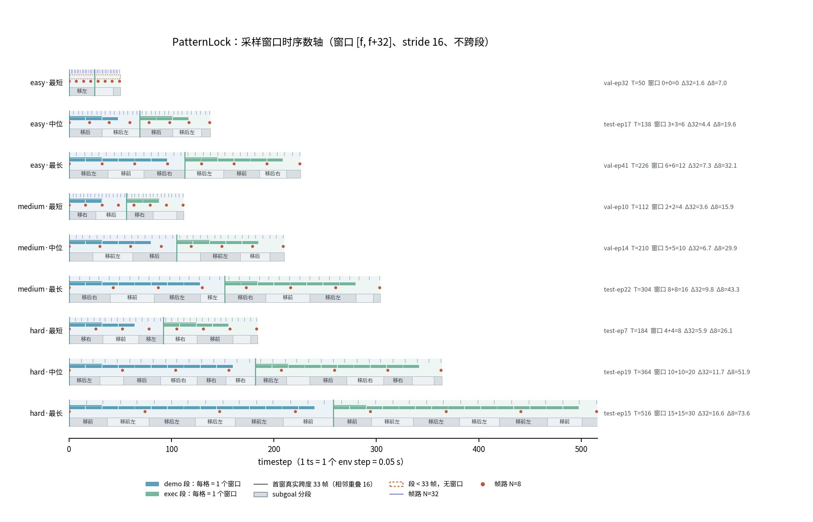
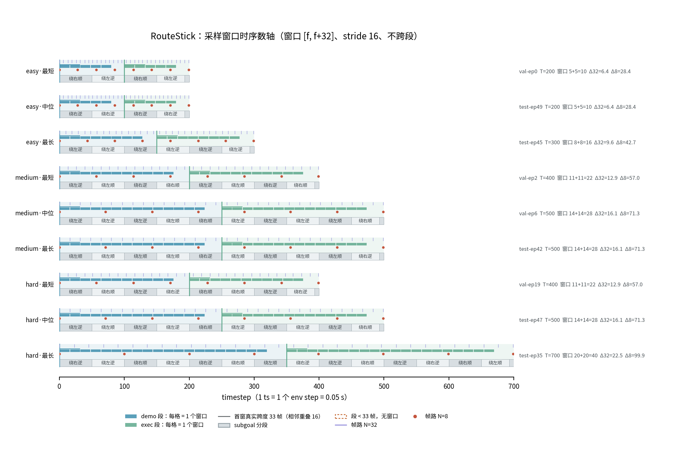
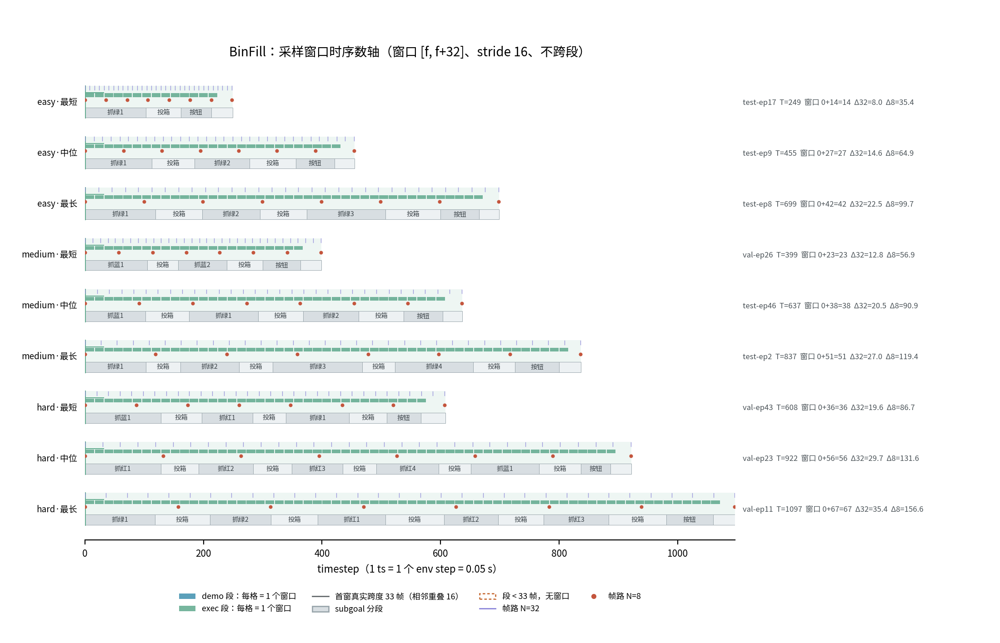
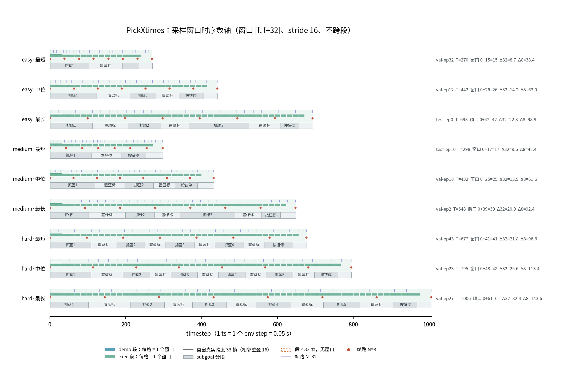
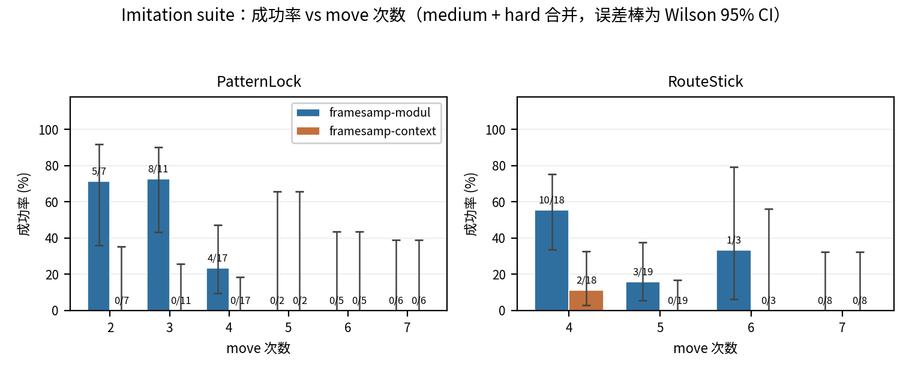
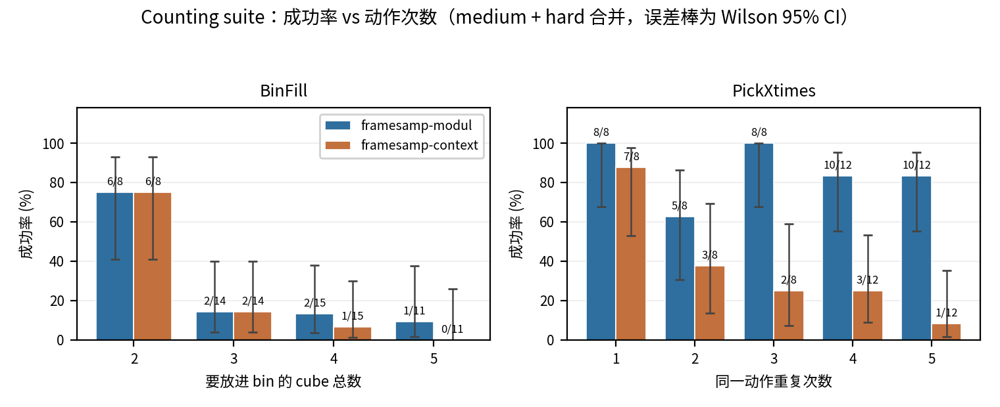
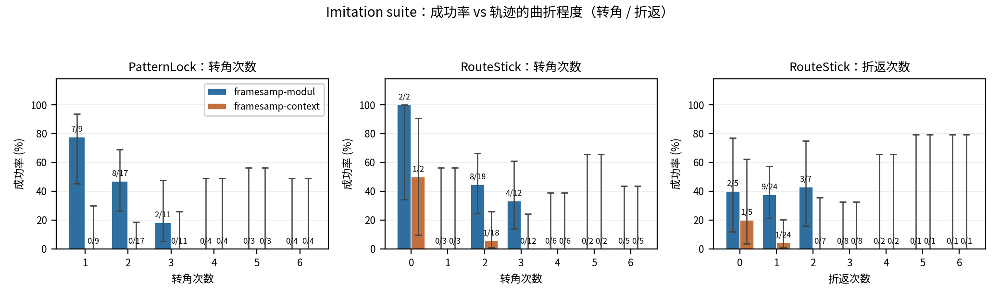
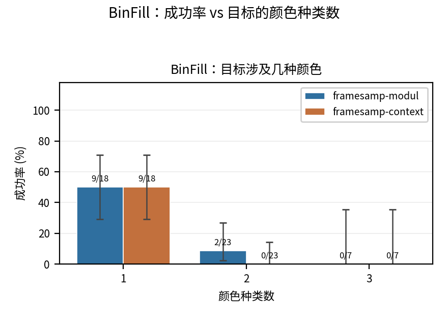

# PatternLock / RouteStick 的 test+val 源逐 episode 动作参数

四个任务各 100 条（test 50 + val 50 合并），共 400 个 episode。每个 episode 给出：做了几次动作、每次动作的起终点坐标、每次动作占多少 timestep。明细见同目录的四份任务报告。

## 口径

- **seed / 难度**：一律读 `src/robomme/env_metadata/{test,val}/record_dataset_{Task}_metadata.json`，不用公式反推（存在 attempt 尾号例外，如 PatternLock-val ep37 = 1153701）。
- **move 次数与坐标**：不需要跑仿真。两个 env 的场景随机段只用一个 `torch.Generator(seed)`，消费顺序确定，离线重跑一遍随机数即可还原（`derive_episode_params.py`）。
- **坐标**：SAPIEN 世界坐标，单位米，机器人 base 在 `(-0.615, 0, 0)`。表里是按钮本身的位置（PatternLock z=0.01；RouteStick 偶数下标 z=0.01）；规划实际下发的终点高度统一抬到 z=0.07。
- **时长**：1 timestep = 1 个 env step = 0.05 s（控制频率 20 Hz），与数据集的采样频率一致。录像 fps=30 与 timestep 不等长，报告里不用视频帧。
- **演示段 / 执行段**：同一组 move 在数据里出现两遍——前一遍 `is_video_demo=True` 是给模型看的示范，后一遍才是真正 rollout。下面的时长统计只算执行段。每条 episode 末尾还有一个几到十几 timestep 的收尾段，不算 move。

## 按难度分组

难度是决定 move 次数的唯一配置项（env 的 `configs[difficulty]`），所以统计一律按难度分开看。四个任务的难度分布相同：easy 52 / medium 24 / hard 24（每 split easy 26 / medium 12 / hard 12，难度循环 `211`，按 `episode % 4`）。

### easy

PatternLock：3×3 格点，路径长度约束 `[2, 4]` → move 1~3 次。RouteStick：`steps ∈ [2, 3]`，不允许原地折返。

| 任务 | 条数 | move 次数（min~max） | move 次数均值 | 单次 move 时长（min~max） | 单次 move 时长均值 |
| --- | --- | --- | --- | --- | --- |
| [PatternLock](PatternLock.md) | 52 | 1~3 | 2.06 | 15~40 ts | 28.1 ts |
| [RouteStick](RouteStick.md) | 52 | 2~3 | 2.48 | 43~50 ts | 47.2 ts |

### medium

PatternLock：4×4 格点，路径长度约束 `[3, 5]` → move 2~4 次。RouteStick：`steps ∈ [4, 5]`，不允许原地折返。

| 任务 | 条数 | move 次数（min~max） | move 次数均值 | 单次 move 时长（min~max） | 单次 move 时长均值 |
| --- | --- | --- | --- | --- | --- |
| [PatternLock](PatternLock.md) | 24 | 2~4 | 3.12 | 14~47 ts | 30.7 ts |
| [RouteStick](RouteStick.md) | 24 | 4~5 | 4.50 | 43~50 ts | 48.4 ts |

### hard

PatternLock：5×5 格点，路径长度约束 `[4, 8]` → move 3~7 次。RouteStick：`steps ∈ [4, 7]`，**允许原地折返**（`backtrack=True`）。

| 任务 | 条数 | move 次数（min~max） | move 次数均值 | 单次 move 时长（min~max） | 单次 move 时长均值 |
| --- | --- | --- | --- | --- | --- |
| [PatternLock](PatternLock.md) | 24 | 3~7 | 5.08 | 15~52 ts | 32.7 ts |
| [RouteStick](RouteStick.md) | 24 | 4~7 | 5.54 | 43~50 ts | 48.7 ts |

## Counting suite（BinFill / PickXtimes）

这两个任务的结构与上面两个不同：**没有视频演示段**，动作是 pick / place 成对再加一次 press button，
「动作次数」= BinFill 要放进 bin 的 cube 总数 / PickXtimes 同一动作的重复次数，直接写在 `setup/task_goal` 里。核心段数 = 2 × 动作次数 + 1（每条都验过）。

### easy

BinFill：场上 1 种颜色、spawn 4~6 个 cube，要放进 bin 的 `put_in_numbers ∈ [1, 3]`。PickXtimes：场上 1 种颜色，重复次数 ∈ [1, 3]。

| 任务 | 条数 | 动作次数（min~max） | 动作次数均值 | pick up 时长 | put / place 时长 | press 时长 |
| --- | --- | --- | --- | --- | --- | --- |
| [BinFill](BinFill.md) | 52 | 1~3 | 1.90 | 116.2（78~210） | 69.9（52~93） | 64.0（42~80） |
| [PickXtimes](PickXtimes.md) | 52 | 1~3 | 1.98 | 100.7（69~200） | 75.3（53~107） | 61.7（43~75） |

### medium

BinFill：2 种颜色、spawn 8~10 个，目标涉及 1~2 种颜色、总数 ∈ [2, 4]。PickXtimes：**重复次数区间与 easy 相同（[1, 3]）**，难点在于场上有 3 种颜色的 cube 作干扰。

| 任务 | 条数 | 动作次数（min~max） | 动作次数均值 | pick up 时长 | put / place 时长 | press 时长 |
| --- | --- | --- | --- | --- | --- | --- |
| [BinFill](BinFill.md) | 24 | 2~4 | 3.00 | 108.7（76~195） | 68.1（52~92） | 65.3（48~87） |
| [PickXtimes](PickXtimes.md) | 24 | 1~3 | 2.00 | 95.6（69~163） | 75.5（53~110） | 63.4（49~77） |

### hard

BinFill：3 种颜色、spawn 10~12 个，目标涉及 2~3 种颜色、总数 ∈ [3, 5]。PickXtimes：3 种颜色，重复次数 ∈ [4, 5]。

| 任务 | 条数 | 动作次数（min~max） | 动作次数均值 | pick up 时长 | put / place 时长 | press 时长 |
| --- | --- | --- | --- | --- | --- | --- |
| [BinFill](BinFill.md) | 24 | 3~5 | 4.21 | 109.0（77~182） | 72.1（49~99） | 68.2（50~126） |
| [PickXtimes](PickXtimes.md) | 24 | 4~5 | 4.50 | 85.9（68~197） | 67.5（52~111） | 61.8（42~75） |

表里是**均值（min~max）**，单位 timestep。每次动作产生一对 pick + place，每条 episode 末尾另有一段 press。

## 采样窗口与帧路

口径与 policy 侧的 motion store / frame sampling 对齐：

- **motion 窗口**：窗口 `[f, f+32]`（33 帧），**stride = 16**，且**不跨段** —— demo 与 exec 两段各自从自己的段起点铺网格。每段窗口数 `len(range(0, max(0, L - 32), 16))`；一条 episode 的 motion token 数 = demo 窗口数 + exec 窗口数。
- **帧路**：`linspace(0, t, N)`（`t = T - 1`），相邻采样帧间隔 **Δ = t / (N - 1)**。帧预算 N 取 32（`512 // (16 × 1)`）与 8（`128 // (16 × 1)`）。注意 32 / 8 是**帧预算**，16 才是窗口 stride，三者不是同一个东西。

> 这套公式已用 policy 侧 16 个任务的中位集逐条验证：窗口数（demo+exec）与 Δ 全部一致，16/16。

### 四个任务总表

每任务 100 条（test 50 + val 50）。

| 任务 | 条数 | 整条长度 min~中位~max | demo 窗口 | exec 窗口 | motion token（min~max，中位） | Δ(N=32) | Δ(N=8) |
| --- | --- | --- | --- | --- | --- | --- | --- |
| PatternLock | 100 | 50~187~516 | 0~15 | 0~15 | 0~30，中位 8 | 1.6~16.6 | 7.0~73.6 |
| RouteStick | 100 | 200~300~700 | 5~20 | 5~20 | 10~40，中位 16 | 6.4~22.5 | 28.4~99.9 |
| BinFill | 100 | 249~609~1097 | 0~0 | 14~67 | 14~67，中位 37 | 8.0~35.4 | 35.4~156.6 |
| PickXtimes | 100 | 270~519~1006 | 0~0 | 15~61 | 15~61，中位 30 | 8.7~32.4 | 38.4~143.6 |

### 时序数轴：窗口、subgoal 与帧路叠在一根轴上

每张图 9 行 = 3 难度 × {最短, 中位, 最长}（按整条长度 T 取），同一任务内共用横轴。一行从下到上四层：**subgoal 分段**（灰色交替块，块内是压缩后的中文标签，图上标不下时省略）、**帧路 N=8**（红点）、**motion 窗口**（demo 蓝 / exec 绿，**每格 = 1 个窗口**，格宽即 stride 16；窗口真实跨度 33 帧、相邻重叠一半，用首窗上方的细线示意）、**帧路 N=32**（紫色细竖线）。段短于 33 帧铺不出窗口，画成橙色虚线空框。右侧标 T、`demo窗+exec窗`、两个 Δ。

> 同一份内容的**交互版**（难度档切换、悬停看 subgoal 原文、横轴跨档固定）：[采样窗口数轴](https://claude.ai/code/artifact/093a467c-d567-466b-b57e-e4fdee2bcac0)

### 产不出 motion token 的 episode

窗口长 33 帧，段短于 33 帧铺不出窗口，这些 episode 的 motion token 为 0：

| 任务 | 来源 | seed | 难度 | T | demo 段长 | exec 段长 |
| --- | --- | --- | --- | --- | --- | --- |
| PatternLock | test-ep25 | 652500 | easy | 50 | 25 | 25 |
| PatternLock | test-ep29 | 652900 | easy | 64 | 32 | 32 |
| PatternLock | val-ep25 | 1152500 | easy | 64 | 32 | 32 |
| PatternLock | val-ep28 | 1152800 | easy | 64 | 32 | 32 |
| PatternLock | val-ep32 | 1153200 | easy | 50 | 25 | 25 |

### demo 段占了 Imitation 的一半

PatternLock / RouteStick 的每条 episode 有 demo 与 exec 两段（`is_video_demo`），窗口不跨段：

| 任务 | 演示段合计 | 执行段合计 | 演示占比 | demo 窗口合计 | exec 窗口合计 |
| --- | --- | --- | --- | --- | --- |
| PatternLock | 10244 | 10244 | 50.0% | 487 | 487 |
| RouteStick | 18500 | 18500 | 50.0% | 1010 | 1010 |

BinFill / PickXtimes 无 demo 段，整条都是 exec。

## 时长来源

| 任务 | 数据来源 |
| --- | --- |
| PatternLock | val 来自原版 h5 `/data/hongzefu/data-0306/record_dataset_PatternLock.h5`；test 本机无官方 h5，由本轮按 test metadata 死 seed 实跑生成 |
| RouteStick | val 来自原版 h5 `/data/hongzefu/data-0306/record_dataset_RouteStick.h5`；test 本机无官方 h5，由本轮按 test metadata 死 seed 实跑生成 |
| BinFill | val 来自原版 h5 `/data/hongzefu/data-0306/record_dataset_BinFill.h5`；test 本机无官方 h5，由本轮按 test metadata 死 seed 实跑生成 |
| PickXtimes | val 来自原版 h5 `/data/hongzefu/data-0306/record_dataset_PickXtimes.h5`；test 本机无官方 h5，由本轮按 test metadata 死 seed 实跑生成 |

## 校验

1. **复算 vs h5 逐条对拍**（`cross_check.py`）：比对 seed、难度、move 次数（= h5 执行段数）、move 语义串（= h5 段名串），并检查 h5 内部演示段与执行段是否同一组 move。**四个源 200 条全部一致**（val 见 `outputs/cross_check.json`，test 见 `outputs/cross_check_test.json`）。语义串是从复算坐标算出来的方向，所以这一项同时验证了坐标。
2. **test seed 一致性**（`check_test_seeds.py`）：本轮实跑 100 条全部 attempt=0 一次通过，seed 与 test metadata **逐条相等，0 条不一致**，即拿到的时长就是原版 seed 下的时长（`outputs/test_seed_check.json`）。
3. **口径自洽（Imitation）**：RouteStick 满足「整条时长 = move 段数 × 50」；两个 env 的 move 段数都是偶数（演示段与执行段成对）。
4. **goal 解析自洽（Counting）**：`核心段数 == 2 × 动作次数 + 1`，**四个源 200 条全中**；另外 val 侧用 h5 的 `setup/task_goal` 校验过从 eval `video` 字段解析的 goal，48/48 相同。
5. **Counting 的 test seed 锁死**：BinFill / PickXtimes 的 test metadata 里有 9 条 seed 尾号非 0，由 `run_test_fixed_seed.py` 逐条锁死 seed、`max_attempts=1` 实跑。100 条全部成功，seed 与 metadata 逐条相等、0 条不一致。

## eval 成功率

- **数据来源**（只读）：`/data/hongzefu/robomme_policy_learning_MotionJEPA/docs/training-doc/` 下的
  `eval-{medium,hard}-patternlock-routestick/records/{context,modul}/` 与
  `eval-binfill-pickxtimes/records/{hard,medium}/{context,modul}/`（后者难度档在 records 下面一层）。
- **两个变体**：`perceptual-framesamp-modul` 与 `perceptual-framesamp-context`，同一批 ckpt 79999、同 seed 42。
- **覆盖范围**：每个 `(task, split)` 的 50 条 metadata 是 easy 26 / medium 12 / hard 12，eval 跑 medium 全 12 条 + hard 全 12 条，**easy 未跑**。每任务 test 24 + val 24 = 48 集，四任务合计 384 条。
- **分组参数**：PatternLock / RouteStick 由 seed 离线复算；BinFill / PickXtimes 解析 task_goal。
- **误差棒**：Wilson 95% 置信区间。0 成功的格子画成一根从 0 起的竖线（点估计 0，上界不为 0）。

### 分难度

每格 24 集（test 12 + val 12），suite 合计每格 48 集。

| suite | 任务 | 难度 | framesamp-modul | framesamp-context |
| --- | --- | --- | --- | --- |
| Imitation | PatternLock | medium | 13/24（54.2%） | 0/24（0.0%） |
| Imitation | PatternLock | hard | 4/24（16.7%） | 0/24（0.0%） |
| Imitation | RouteStick | medium | 10/24（41.7%） | 2/24（8.3%） |
| Imitation | RouteStick | hard | 4/24（16.7%） | 0/24（0.0%） |
| **Imitation 合计** | | **medium** | **23/48（47.9%）** | **2/48（4.2%）** |
| **Imitation 合计** | | **hard** | **8/48（16.7%）** | **0/48（0.0%）** |
| Counting | BinFill | medium | 10/24（41.7%） | 9/24（37.5%） |
| Counting | BinFill | hard | 1/24（4.2%） | 0/24（0.0%） |
| Counting | PickXtimes | medium | 21/24（87.5%） | 12/24（50.0%） |
| Counting | PickXtimes | hard | 20/24（83.3%） | 4/24（16.7%） |
| **Counting 合计** | | **medium** | **31/48（64.6%）** | **21/48（43.8%）** |
| **Counting 合计** | | **hard** | **21/48（43.8%）** | **4/48（8.3%）** |

### 成功率 vs 动作次数

Imitation 的 x 轴是 move 次数；Counting 的 x 轴是 BinFill 要放进 bin 的 cube 总数 / PickXtimes 同一动作的重复次数。medium 与 hard 合并。

### 成功率 vs 轨迹曲折程度（Imitation）

转角次数 = 相邻两步方向不同的次数；折返次数 = 路径中走到 j 又退回 i 的次数（PatternLock 路径由 DFS 生成、不重复节点，折返恒为 0）。

### 成功率 vs 目标颜色种类数（BinFill）

颜色种类数 = 该 episode 的目标里涉及几种颜色的 cube（1 / 2 / 3）。

> 图与数字由 `plot_eval_success.py` 生成，改动 eval 结果后重跑即可。
