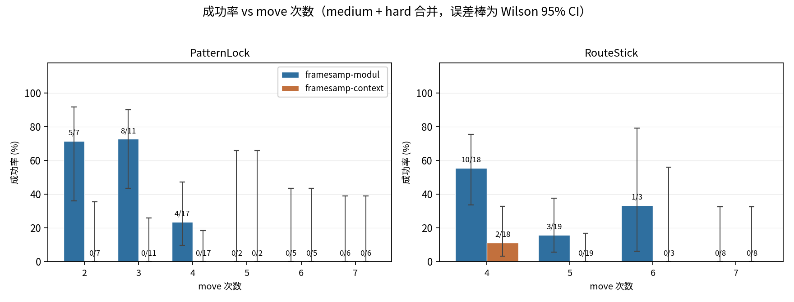
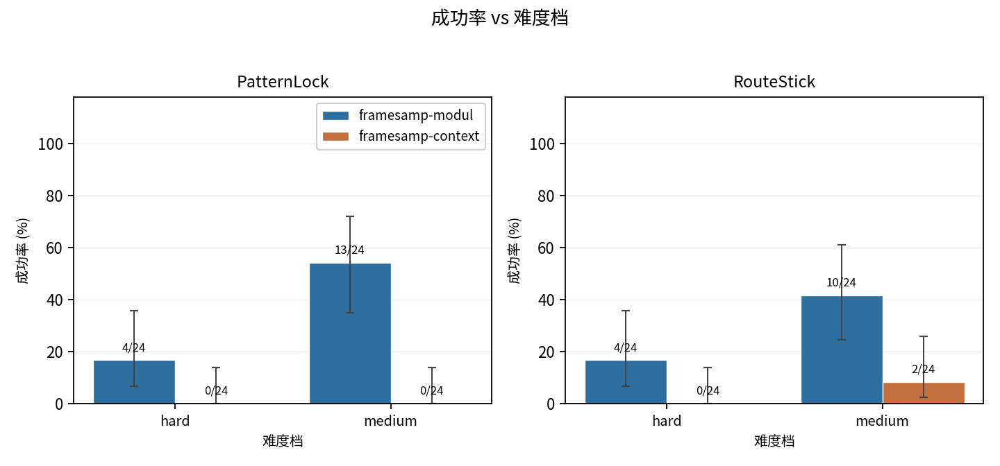
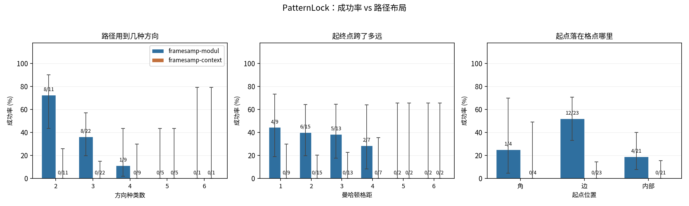
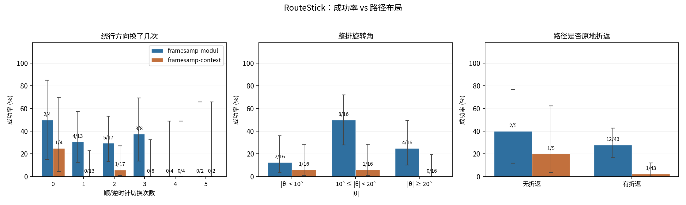
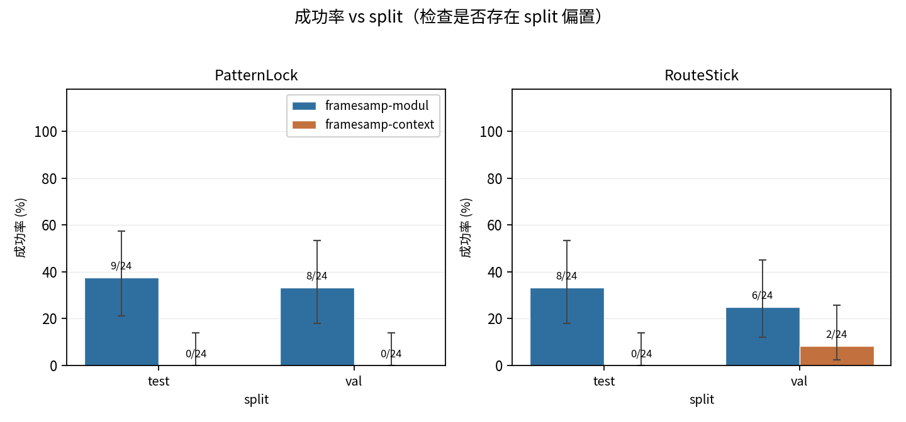

## 这些参数怎么影响策略成功率

把 policy 侧两轮 eval 的逐集结果按上面复算出的动作参数分组，就能看出成功率随哪些参数塌陷。

- **数据来源**：`/data/hongzefu/robomme_policy_learning_MotionJEPA/docs/training-doc/eval-{medium,hard}-patternlock-routestick/records/{context,modul}/per_episode.json`（只读）。
- **两个变体**：framesample 的官方两档 —— `perceptual-framesamp-modul`（上游脚本默认）与 `perceptual-framesamp-context`（本基准原先锁死的那个）。
- **范围**：medium 与 hard 两档 × 两变体 × 48 集 = 192 条，join 键是 `(task, split, episode)`，并逐条断言 seed 与本目录复算表相同。easy 档尚未评测。
- **误差棒**：Wilson 95% 置信区间。每格只有个位数到十几条样本，0 成功的格子画出来是一根从 0 起的竖线（点估计 0，上界不为 0），不是缺数据。

### 总体

| 变体 | PatternLock | RouteStick | 合计 |
| --- | --- | --- | --- |
| framesamp-modul | 17/48（35.4%） | 14/48（29.2%） | 31/96（32.3%） |
| framesamp-context | 0/48（0.0%） | 2/48（4.2%） | 2/96（2.1%） |

### 成功率 vs move 次数

这是最陡的一条趋势，两个任务都随 move 次数上行而塌陷（不是严格单调：PatternLock 的 2 次与 3 次基本持平，RouteStick 的 6 次那格只有 3 条样本、置信区间几乎覆盖满量程）：

- PatternLock（modul）：2~3 次 move 13/18（72%），4 次掉到 4/17（24%），**5 次及以上 0/13（0%）**。
- RouteStick（modul）：4 次 10/18（56%），5 次 3/19（16%），6 次 1/3（33%）（样本仅 3 条，不足以判读），7 次 0/8（0%）。

换句话说，两个策略的能力边界都卡在「一条轨迹里要连续做对几步」上——而 move 次数正是 env 按难度直接配出来的（见上面的按难度分组），所以难度档之间的差距本质上就是这条曲线的不同区段。

### 成功率 vs 难度档

modul 在 medium 上 23/48（47.9%），到 hard 掉成 8/48（16.7%）；context 两档分别是 2/48（4.2%） 与 0/48（0.0%）。

### PatternLock：路径布局

- **方向种类数**（这条路径用到几种不同的移动方向）比 move 次数更能区分难易：只用 2 种方向时成功率最高，用到 4 种以上基本归零。它和 move 次数不完全重合——同样 4 步，走「一直向右」和「右、前右、左、前左」的难度不一样。
- **起终点跨度**（曼哈顿格距）影响温和，跨 1~3 格差别不大，跨 5 格以上没有成功样本。
- **起点位置**：起点在格边上时成功率明显高于落在格点内部——内部起点四周八向都通，更容易在第一步就走错方向。注意这一项与格点尺寸耦合（3×3 几乎没有内部点），
  样本上主要反映的是 medium/hard 的差异。

### RouteStick：路径布局

- **绕行方向切换次数**：切换 0~3 次时成功率相当（30%~50%），切到 4 次以上全灭——同样是「连续做对几步」的表现。
- **整排旋转角 |θ|**：中间档（10°~20°）反而最高，两端都低，且各档只有 16 条样本、置信区间大幅重叠，**不足以支持「旋转角影响成功率」的结论**。
- **是否原地折返**：有无折返差别不大（折返只在 hard 档允许）。

### split 对照

test 与 val 的成功率接近，没有明显的 split 偏置——两个 split 的参数分布本来就同源（同一套难度循环、只是 seed 域不同），这张图是用来确认这一点的。

> 图与数字由 `plot_eval_success.py` 生成，改动 eval 结果后重跑即可。
